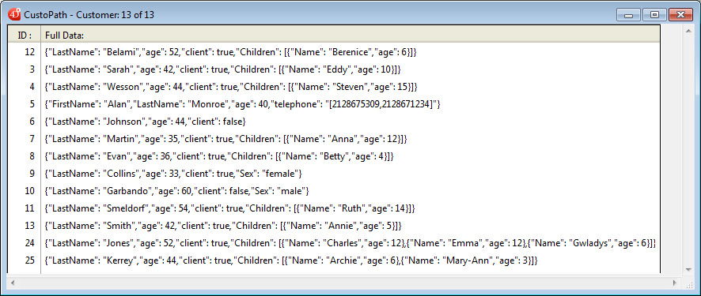

<!--REF #_command_.Average.Syntax-->**Average** ( *series* {; *rutaAtributo*} ) : Real<!-- END REF-->
<!--REF #_command_.Average.Params-->
| Parámetro | Tipo |  | Descripción |
| --- | --- | --- | --- |
| series | Field, Array | &#8594;  | Datos para los cuales se devuelve el promedio |
| rutaAtributo | Text | &#8594;  | Ruta del atributo del cual calcular el promedio |
| Resultado | Real | &#8592; | Media aritmética (promedio) de series |

<!-- END REF-->

#### Descripción 

<!--REF #_command_.Average.Summary-->**Average** devuelve la media aritmética (promedio) de *series*.<!-- END REF--> Si *series* es un campo indexado, el índice se utiliza para calcular el promedio. 

Puede pasar en *series* un array (de una o dos dimensiones). En este caso, el array debe ser de tipo Entero, Entero largo o Real.

Este comando acepta un parámetro opcional de tipo texto *rutaAtributo*, que puede utilizar si *series* es un campo de tipo Objeto. Le permite definir la ruta del atributo a calcular. Utilice la notación estándar para definir las rutas de los atributos anidados, por ejemplo "company.address.number". Recuerde que los nombres de los atributos de objetos tienen en cuanta las mayúsculas y minúsculas.  
Sólo los valores numéricos de los atributos se utilizan para el calculo. Si hay valores en la ruta del atributo que no son de tipo numérico, se omiten.

Si el comando se ejecuta correctamente, la variable sistema OK toma el valor 1\. Si se interrumpe (por ejemplo si el usuario hace clic en el botón **Detener** del termómetro de progreso) la variable OK toma el valor 0.

#### Ejemplo 1 

El siguiente ejemplo define la variable *vPromedio* que está en el área de ruptura B0 de un formulario de salida. La línea de código es el método de objeto para *vPromedio*. El método de objeto no se ejecuta hasta el nivel de ruptura 0:

```4d
 vPromedio:=Average([Empleados] Salario)
```

El siguiente método se llama para imprimir los registros en la selección y activar el proceso de ruptura:

```4d
 ALL RECORDS([Empleados])
 ORDER BY([Empleados];[Empleados]Apellido;>)
 BREAK LEVEL(1)
 ACCUMULATE([Empleados]Salario)
 FORM SET OUTPUT([Empleados];"Imprimir formulario")
 PRINT SELECTION([Empleados])
```

**Nota:** el parámetro del comando [BREAK LEVEL](break-level.md) debe ser igual al número de rupturas en su informe. Para mayor información sobre rupturas, consulte *Impresión*. 

#### Ejemplo 2 

Este ejemplo permite obtener la media de los 15 primeras notas de la selección:

```4d
 ARRAY REAL($ArrGrades;0)
 QUERY([Exams];[Exams]Exam_Date=!01/07/11!)
 ORDER BY([Exams];[Exams]Exam_Grade;<)
 SELECTION TO ARRAY([Exams]Exam_Grade;$ArrGrades)
 ARRAY REAL($ArrGrades;15)
 vAverage:=Average($ArrGrades)
```

#### Ejemplo 3 

Su tabla \[Customer\] contiene un campo objeto "full\_Data" con los siguientes datos:



Puede hacer los siguientes cálculos:

```4d
 var $vAvg : Real
 ALL RECORDS([Customer])
 $vAvg:=Average([Customer]full_Data;"age")
  //$vAvg is 44,46
 
 var $vTot : Integer
 $vTot:=Sum([Customer]full_Data;"Children[].age")
  //$vTot is 105
```

#### Ver también 

[ACCUMULATE](accumulate.md)  
[BREAK LEVEL](break-level.md)  
[Max](max.md)  
[Min](min.md)  
[ORDER BY](order-by.md)  
[PRINT SELECTION](print-selection.md)  
[Subtotal](subtotal.md)  
[Sum](sum.md)  

#### Propiedades

|  |  |
| --- | --- |
| Número de comando | 2 |
| Hilo seguro | &check; |
| Modifica variables | OK |


