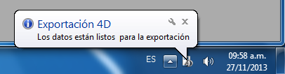

<!--REF #_command_.DISPLAY NOTIFICATION.Syntax-->**DISPLAY NOTIFICATION** ( *titulo* ; *texto* {; *duracion*} )<!-- END REF-->
<!--REF #_command_.DISPLAY NOTIFICATION.Params-->
| Parámetro | Tipo |  | Descripción |
| --- | --- | --- | --- |
| titulo | Text | &#8594;  | Título de la notificación |
| texto | Text | &#8594;  | Texto de la notificación |
| duracion | Integer | &#8594;  | Duración de la visualización en segundos |

<!-- END REF-->

#### Descripción 

<!--REF #_command_.DISPLAY NOTIFICATION.Summary-->El comando DISPLAY NOTIFICATION muestra un mensaje de notificación al usuario:

Este tipo de mensaje generalmente es utilizado por el sistema o por las aplicaciones para informar al usuario sobre un evento externo (desconexión de red, disponibilidad de una actualización, etc.).<!-- END REF-->

* Bajo Windows, el mensaje aparece en el área de notificación de la barra de tareas:  

* Bajo OS X (versión 10.8 mínimo), el mensaje aparece en una pequeña ventana que en la esquina superior derecha de la pantalla.  
  
Note que conforme a las especificaciones de Apple, la notificación sólo se muestra cuando la aplicación no está en el primer plano. Sin embargo, el mensaje aún aparece en la lista del "notification center".

En *titulo* y *texto*, pase el título y el texto del mensaje a mostrar (en el ejemplo anterior, el título es “Exportación 4D”). Puede introducir hasta 255 caracteres. 

Bajo Windows, se muestra la ventana del mensaje si no se detecta actividad en la máquina, o hasta que el usuario haga clic en la casilla de cerrar. El parámetro opcional *duracion*, modifica la duración de visualización por defecto. Note que la visualización de las notificaciones depende de las configuración del sistema.

#### Ejemplo 

```4d
 DISPLAY NOTIFICATION("4D Export";"The data is ready to export.")
```

#### Ver también 

[ALERT](alert.md)  

#### Propiedades

|  |  |
| --- | --- |
| Número de comando | 910 |
| Hilo seguro | &cross; |


