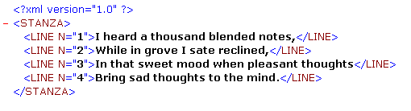

<!--REF #_command_.DOM REMOVE XML ATTRIBUTE.Syntax-->**DOM REMOVE XML ATTRIBUTE** ( *refElement* ; *nomAtrib* )<!-- END REF-->
<!--REF #_command_.DOM REMOVE XML ATTRIBUTE.Params-->
| Parámetro | Tipo |  | Descripción |
| --- | --- | --- | --- |
| refElement | Text | &#8594;  | Referencia del elemento XML |
| nomAtrib | Text | &#8594;  | Atributo a borrar |

<!-- END REF-->

#### Descripción 

<!--REF #_command_.DOM REMOVE XML ATTRIBUTE.Summary-->El comando DOM REMOVE XML ATTRIBUTE remueve, si existe, el atributo designado por *nomAtrib* del elemento XML cuya referencia se pasa en el parámetro *refElement*.<!-- END REF--> 

Si atributo se suprime correctamente, la variable sistema *OK* toma el valor 1\. Si no existe ningún atributo llamado *nomAtrib* en *refElement*, se devuelve un error y la variable sistema *OK* toma el valor 0\. 

#### Ejemplo 

Dada la siguiente estructura:



El siguiente código permite remover el primer atributo "N=1": 

```4d
 var myBlobVar : Blob
 var $xml_Parent_Ref;$xml_Child_Ref : Text
 var $LineNum : Integer
 
 $xml_Parent_Ref:=DOM Parse XML variable(myBlobVar)
 $xml_Child_Ref:=DOM Get first child XML element($xml_Parent_Ref)
 DOM REMOVE XML ATTRIBUTE($xml_Child_Ref;"N")
```

#### Ver también 

[DOM GET XML ATTRIBUTE BY INDEX](dom-get-xml-attribute-by-index.md)  
[DOM GET XML ATTRIBUTE BY NAME](dom-get-xml-attribute-by-name.md)  
[DOM REMOVE XML ELEMENT](dom-remove-xml-element.md)  
[DOM SET XML ATTRIBUTE](dom-set-xml-attribute.md)  

#### Propiedades

|  |  |
| --- | --- |
| Número de comando | 1084 |
| Hilo seguro | &check; |
| Modifica variables | OK |


