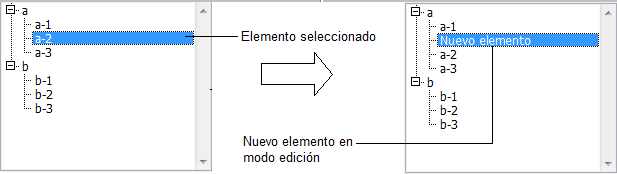

<!--REF #_command_.EDIT ITEM.Syntax-->**EDIT ITEM** ( {* ;} *objeto* {; *elemento*} )<!-- END REF-->
<!--REF #_command_.EDIT ITEM.Params-->
| Parámetro | Tipo |  | Descripción |
| --- | --- | --- | --- |
| * | Operador | &#8594;  | Si se especifica, objeto es un nombre de objeto (cadena) Si se omite, objeto es una tabla o variable |
| objeto | any | &#8594;  | Nombre del objeto (si se especifica *) o Tabla o variable (si se omite *) |
| elemento | Integer | &#8594;  | Número de elemento |

<!-- END REF-->

#### Descripción 

<!--REF #_command_.EDIT ITEM.Summary-->El comando **EDIT ITEM** le permite editar el elemento actual o el elemento de número *elemento* del array o la lista designada por el parámetro *objeto*.<!-- END REF-->  
Esto significa que el elemento seleccionado puede modificarse; la entrada de un caracter reemplazará totalmente el contenido del elemento.

Si pasa el parámetro opcional *\**, indica que el parámetro *objeto* es un nombre de objeto (en este caso, pase una cadena en *objeto*). Si no pasa el parámetro, indica que el parámetro *objeto* es una tabla o una variable. En este caso, no pasa una cadena sino una referencia de una tabla o variable.

Este comando aplica a los siguientes objetos editables:

* Listas jerárquicas
* Columnas list box
* Subformularios (en este caso, sólo un nombre de objeto, el subformulario, puede pasarse en *objeto*)
* Formularios listados mostrados utilizando los comandos [DISPLAY SELECTION](display-selection.md) o [MODIFY SELECTION](modify-selection.md).

Si el comando se utiliza con un objeto editable que no está en la lista, actúa de la misma forma que el comando [GOTO OBJECT](goto-object.md). El comando no hace nada si la lista o el array están vacíos o son invisibles. Igualmente, si la lista o el array no son editables, el comando sólo selecciona el elemento especificado sin cambiar a modo edición. En el caso de los list boxes, si la columna no permite la entrada de texto (entrada por casillas de selección o por listas deplegables únicamente), el elemento especificado toma el foco.

El parámetro opcional *elemento* le permite designar la posición del elemento (lista jerárquica) o el número de línea (list box, formularios listados y subformulario en modo “selección múltiple”) para cambiar a modo de edición. Si no pasa este parámetro, el comando se aplica al elemento actual de *objeto*. Si no hay elemento actual, el primer elemento de *objeto* cambia a modo edición.

**Notas:**

* En subformularios y formularios listados, el comando pasa a modo edición el primer campo de la línea especificada, en el orden de entrada.
* En listboxes mostrados en modo jerárquico, si el elemento objetivo pertenece a un nivel jerárquico colapsado, este nivel (como también los posibles niveles padres) se desplegarán automáticamente para que la línea sea visible.

#### Ejemplo 1 

Este comando puede ser particularmente útil cuando crea un nuevo elemento en una lista jerárquica. Cuando se llama el comando, el último elemento añadido o insertado en la lista se convierte automáticamente en editable, sin que el usuario tenga que efectuar alguna acción especifica.   
  
El siguiente código puede ser el método de un botón que le permite insertar un nuevo elemento en una lista existente. El texto por defecto “Nuevo\_elemento” está listo automáticamente para ser cambiado:

```4d
 vlUniqueRef:=vlUniqueRef+1
 INSERT LIST ITEM(hList;*;"Nuevo_elemento";vlUniqueRef)
 EDIT ITEM(*;"MiLista")
```



#### Ejemplo 2 

Dadas dos columnas de un list box donde los nombres de las variables asociadas son respectivamente “Array1” y “Array2”. El siguiente ejemplo inserta un nuevo elemento en dos arrays y pasa el nuevo elemento de Array2 a modo edición: 

```4d
 $vlRowNum:=Size of array(Array1)+1
 LISTBOX INSERT ROWS(*;"MyListBox";$vlRowNum)
 Array1{$vlRowNum}:="Nuevo valor 1"
 Array2{$vlRowNum}:="Nuevo valor 2"
 EDIT ITEM(Array2;$vlRowNum)
```


#### Ver también 

[GOTO OBJECT](goto-object.md)  
[INSERT IN LIST](insert-in-list.md)  
[SET LIST ITEM](set-list-item.md)  

#### Propiedades

|  |  |
| --- | --- |
| Número de comando | 870 |
| Hilo seguro | &cross; |


