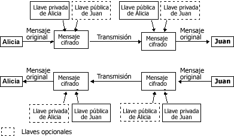

<!--REF #_command_.ENCRYPT BLOB.Syntax-->**ENCRYPT BLOB** ( *aCifrar* ; *enviarLlavePriv* {; *recepLlavePub*} )<!-- END REF-->
<!--REF #_command_.ENCRYPT BLOB.Params-->
| Parámetro | Tipo |  | Descripción |
| --- | --- | --- | --- |
| aCifrar | Blob | &#8596;  | Datos a cifrar |
| ||| Datos cifrados |
| enviarLlavePriv | Blob | &#8594;  | Llave privada del emisor |
| recepLlavePub | Blob | &#8594;  | Llave pública del receptor |

<!-- END REF-->

#### Descripción 

<!--REF #_command_.ENCRYPT BLOB.Summary-->El comando ENCRYPT BLOB cifra el contenido del BLOB *aCifrar* con la ayuda de la llave privada del emisor *enviarLlavePriv*, así como también opcionalmente la llave pública del receptor *recepLlavePub*.<!-- END REF--> Estas llaves deben ser generadas por el comando [GENERATE ENCRYPTION KEYPAIR](generate-encryption-keypair.md) (en el tema “Protocolo de seguridad”). 

**Nota:** este comando utiliza el algoritmo y las funcionalidades de cifrado del protocolo TLS. Para utilizar este comando, asegúrese de que los componentes necesarios para el funcionamiento del protocolo TLS estén instalados correctamente en su equipo, incluso si no quiere utilizar TLS para conexiones con el servidor Web 4D. Para información detallada sobre este protocolo, consulte la sección [WEB SERVICE SET PARAMETER](web-service-set-parameter.md).

* Si una llave se utiliza para el cifrado (la llave privada del emisor), sólo las personas que tengan la llave pública podrán leer la información. Este sistema garantiza que el emisor haya cifrado la información.
* El uso simultáneo de la llave privada del emisor y la llave pública del receptor garantiza que sólo un receptor podrá leer la información.

El BLOB que contiene las llaves tiene un formato interno PKCS. Este formato estándar, multiplataforma, permite intercambiar o manipular las llaves simplemente haciendo copiar-pegar en un email o archivo de texto.

Una vez ejecutado el comando, el BLOB *aCifrar* contiene los datos cifrados que serán descifrados sólo con el comando [DECRYPT BLOB](decrypt-blob.md), con la llave pública del emisor pasada como parámetro. 

Además, si la llave pública opcional ha sido utilizada para cifrar la información, la llave privada del receptor también será necesaria para descifrar. 

**Principio de cifrado con llaves públicas y privadas para el intercambio de mensajes entre dos personas, “Alicia” y “Juan”:** 



**Nota:** el algoritmo de cifrado contiene una función de verificación de integridad (checksum), con el fin de evitar toda modificación del contenido del BLOB (intencional o no). Por lo tanto, un BLOB cifrado no debe modificarse de lo contrario no podría descifrarse. 

##### Optimización de comandos de cifrado 

El cifrado de los datos disminuye la velocidad de ejecución de sus aplicaciones, especialmente si se utiliza un par de llaves. Sin embargo, puede considerar los siguientes consejos de optimización: 

* Dependiendo de la memoria disponible, el comando se ejecutará en modo “sincrónico” o “asincrónico”.  
El modo asincrónico es más rápido, ya que no bloquea los otros procesos. Este modo se utiliza automáticamente si la memoria disponible es por lo menos dos veces del tamaño de los datos a cifrar.

De lo contrario, por razones de seguridad se utiliza el modo sincrónico. Este modo es menos rápido ya que bloquea los otros procesos. 

* En el caso de BLOBs grandes, puede cifrar sólo una pequeña parte “estratégica” del BLOB con el fin de reducir el tamaño de los datos a procesar como también el tiempo de ejecución.

#### Ejemplo 

* **Utilización de una sola llave**

Una empresa quiere garantizar la confidencialidad de los datos almacenados en una base 4D. La empresa debe enviar esta información con regularidad a sus filiales a través de archivos, vía Internet.

1) La empresa genera un par de llaves con el comando [GENERATE ENCRYPTION KEYPAIR](generate-encryption-keypair.md "GENERATE ENCRYPTION KEYPAIR"):

```4d
  //Método GENERAR_LLAVES_TXT
 var $BLlavePublica;$BLlavePrivada : Blob
 GENERATE ENCRYPTION KEYPAIR($BLlavePrivada;$BLlavePublica)
 BLOB TO DOCUMENT("LlavePublica.txt";$BLlavePublica)
 BLOB TO DOCUMENT("LlavePrivada.txt";$BLlavePrivada)
```

2) La empresa conserva la llave privada, y envía a cada filial una copia del documento que contiene la llave pública. Para máxima seguridad, la llave debe copiarse en un disco y ser enviada físicamente a las subsidiarias.

3) Luego la empresa copia la información confidencial, (almacenada por ejemplo en el campo tipo texto) en BLOBs y los cifra con la llave privada:

```4d
  //Método CIFRAR_INFO
 var $vbCifrado;$vbLlavePrivada : Blob
 var $vtCifrado : Text
 
 $vtCifrado:=[Privado]Info
 VARIABLE TO BLOB($vtCifrado;$vbCifrado)
 DOCUMENT TO BLOB("LlavePrivada.txt";$vbLlavePrivada)
 If(OK=1)
    ENCRYPT BLOB($vbCifrado;$vbLlavePrivada)
    BLOB TO DOCUMENT("Update.txt";$vbCifrado)
 End if
```

4) Los archivos actualizados pueden enviarse a las filiales (a través de un canal no seguro como Internet). Si una tercera persona intercepta el archivo cifrado, no podrá descifrarlo sin la llave pública.

5) Cada filial puede descifrar el documento con la llave pública:

```4d
  //Método DESCIFRAR_INFO
 var $vbCifrado;$vbLlavePublica : Blob
 var $vtDescifrado : Text
 var $vtDocRef : Time
 
 ALERT("Por favor seleccione un documento cifrado.")
 $vtDocRef:=Open document("") //Seleccione Update.txt
 If(OK=1)
    CLOSE DOCUMENT($vtDocRef)
    DOCUMENT TO BLOB(Document;$vbCifrado)
  //Su llave privada es cargada
    DOCUMENT TO BLOB("LlavePublica.txt";$vbLlavePublica)
    If(OK=1)
       DECRYPT BLOB($vbCifrado;$vbLlavePublica)
       BLOB TO VARIABLE($vbCifrado;$vtDescifrado)
       CREATE RECORD([Privado])
       [Privado]Info:=$vtDescifrado
       SAVE RECORD([Privado])
    End if
 End if
```

* **Utilización de llaves pares**
Una empresa quiere utilizar el Internet para intercambiar información. Cada filial recibe información privada y también envía información a la oficina principal. Por lo tanto hay dos requerimientos:  
\- Sólo el destinatario debe poder leer el mensaje,  
\- El destinatario debe tener prueba de que el mensaje fue enviado por el emisor. 

1) La oficina principal y cada filial genera sus propios pares de llaves (con el método GENERAR\_LLAVES\_TXT).

2) La llave privada se mantiene en secreto para ambas partes. Cada filial envía su llave pública a la oficina principal, quien a su vez envía su llave pública. Esta transferencia de llaves no necesariamente tiene que ser efectuada por un canal protegido ya que la llave pública no es suficiente para descifrar el mensaje.

3) Para cifrar la información a enviar, la filial o la oficina principal ejecuta el método CIFRAR\_INFO\_2 el cual utiliza la llave privada del emisor y la llave pública del destinatario para cifrar la información:

```4d
  //Método CIFRAR_INFO_2
 var $vbCifrado;$vbLlavePrivada;$vbLlavePublica : Blob
 var $vtCifrado : Text
 var $vtDocRef : Time
 
 $vtEncrypt:=[Privado]Info
 VARIABLE TO BLOB($vtCifrado;$vbCifrado)
  // Su propia llave privada se carga...
 DOCUMENT TO BLOB("LlavePrivada.txt";$vbLlavePrivada)
 If(OK=1)
  // ...y la llave pública del destinatario
    ALERT("Por favor seleccione la llave pública del destinatario.")
    $vhDocRef:=Open document("") //Llave pública a cargar
    If(OK=1)
       CLOSE DOCUMENT($vtDocRef)
       DOCUMENT TO BLOB(Document;$vbLlavePublica)
  //Cifrado del BLOB con dos llaves como parámetros
       ENCRYPT BLOB($vbCifrado;$vbLlavePrivada;$vbLlavePublica)
       BLOB TO DOCUMENT("Update.txt";$vbCifrado)
    End if
 End if
```

4) El archivo cifrado puede entonces ser enviado al destinatario vía Internet. Si una tercera persona lo intercepta, no podrá descifrar el mensaje, incluso si tiene las llaves públicas porque no tendrá la llave privada del destinatario.

5) Cada destinatario puede descifrar el documento utilizando su propia llave privada y la llave pública del emisor:

```4d
  //Método CIFRAR_INFO_2
 var $vbCifrado;$vbLlavePrivada;$vbLlavePublica : Blob
 var $vtCifrado : Text
 var $vtDocRef : Time
 
 ALERT("Por favor seleccione la llave pública del destinatario.")
 $vhDocRef:=Open document("") //Llave pública a cargar
 If(OK=1)
    CLOSE DOCUMENT($vhDocRef)
    DOCUMENT TO BLOB(Document;$vbCifrado)
  //Se carga su propia llave privada
    DOCUMENT TO BLOB("LlavePrivada.txt";$vbLlavePrivada)
    If(OK=1)
  // ...y la llave pública del emisor
       ALERT("Por favor seleccione la llave pública del emisor.")
       $vhDocRef:=Open document("") //Llave pública a cargar
       If(OK=1)
          CLOSE DOCUMENT($vhDocRef)
          DOCUMENT TO BLOB(Document;$vbLlavePublica)
  //Descifrar el BLOB con dos llaves como parámetros
          DECRYPT BLOB($vbCifrado;$vbLlavePublica;$vbLlavePrivada)
          BLOB TO VARIABLE($vbCifrado;$vtDescifrado)
          CREATE RECORD([Privado])
          [Privado]Info:=$vtDescifrado
          SAVE RECORD([Privado])
       End if
    End if
 End if
```

#### Ver también 

  
[DECRYPT BLOB](decrypt-blob.md)  
[Encrypt data BLOB](encrypt-data-blob.md)  
[GENERATE ENCRYPTION KEYPAIR](generate-encryption-keypair.md)  

#### Propiedades

|  |  |
| --- | --- |
| Número de comando | 689 |
| Hilo seguro | &check; |


