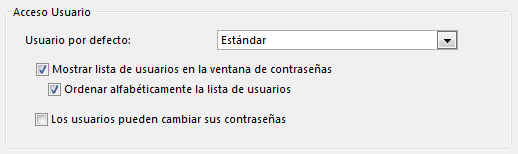

<!--REF #_command_.Get default user.Syntax-->**Get default user**  : Integer<!-- END REF-->
<!--REF #_command_.Get default user.Params-->
| Parámetro | Tipo |  | Descripción |
| --- | --- | --- | --- |
| Resultado | Integer | &#8592; | Número de referencia único del usuario |

<!-- END REF-->

#### Descripción 

<!--REF #_command_.Get default user.Summary-->El comando Get default user devuelve el número de referencia único del usuario designado como “Usuario por defecto” en la caja de diálogo de Preferencias de la base:

Si ningún usuario por defecto está definido, el comando devuelve 0.<!-- END REF-->

#### Propiedades

|  |  |
| --- | --- |
| Número de comando | 826 |
| Hilo seguro | &cross; |

