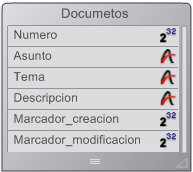

<!--REF #_command_.GET DOCUMENT PROPERTIES.Syntax-->**GET DOCUMENT PROPERTIES** ( *doc* ; *bloqueado* ; *invisible* ; creado el ; creado a las ; modificado el ; modificado a las )<!-- END REF-->
<!--REF #_command_.GET DOCUMENT PROPERTIES.Params-->
| Parámetro | Tipo |  | Descripción |
| --- | --- | --- | --- |
| doc | Text | &#8594;  | Nombre del documento |
| bloqueado | Boolean | &#8592; | Bloqueado (True) o no bloqueado (False) |
| invisible | Boolean | &#8592; | Invisible (True) o visible (False) |
| creado el | Fecha | &#8592; | Fecha de creación |
| creado a las | Hora | &#8592; | Hora de creación |
| modificado el | Fecha | &#8592; | Fecha de la última modificación |
| modificado a las | Hora | &#8592; | Hora de la última modificación |

<!-- END REF-->

#### Descripción 

<!--REF #_command_.GET DOCUMENT PROPERTIES.Summary-->El comando GET DOCUMENT PROPERTIES devuelve información sobre el documento cuyo nombre o ruta se pasa en *documento*.<!-- END REF--> 

Después de la llamada:

* *bloqueado* devuelve True si el documento está bloqueado. Un documento bloqueado no puede modificarse.
* *invisible* devuelve True si el documento está oculto.
* *creado el* y *creado a las* devuelven la fecha y hora de creación del documento.
* *modificado el* y *modificado a las* devuelven la fecha y hora de la última modificación del documento.

#### Ejemplo 

Usted ha creado una base de documentación y quiere exportar todos los registros creados en la base a un documento en disco. Como la base se actualiza regularmente, usted quiere escribir un algoritmo de exportación que cree o recree cada documento en el disco si el documento no existe o si el registro correspondiente ha sido modificado después de que el documento fue grabado por última vez. Por lo tanto, usted debe comparar la fecha y la hora de la modificación del documento (si la hay) con su registro correspondiente. Para ilustrar este ejemplo, utilizamos la siguiente tabla:



En lugar de guardar una fecha y una hora en cada registro, puede guardar un “marcador” que exprese el número de segundos transcurridos entre una fecha anterior arbitraria (en este ejemplo utilizamos el 1 de enero de 1995 a las 00:00:00) y la fecha y la hora en la que se guardó el registro.

En nuestro ejemplo, el campo *\[Documentos\]Marcador\_creacion* contiene el marcador de creación del registro y el campo *\[Documentos\]Marcador\_modificacion* contiene el marcador de la última modificación del registro.

El método de proyecto TimeStamp calcula el marcador de tiempo para una fecha y horas específicas o para la fecha y hora actual si no se pasan parámetros:

```4d
  // Método de proyecto TimeStamp
  // TimeStamp { ( date ; Time ) } -> Entero largo
  // TimeStamp { ( date ; Time ) } -> Número de segundos desde el 1 de enero de 1995
 
 var $1;$vdDate : Date
 var $2;$vhTime : Time
 var $0 : Integer
 
 If(Count parameters=0)
    $vdDate:=Current date
    $vhTime:=Current time
 Else
    $vdDate:=$1
    $vhTime:=$2
 End if
 $0:=(($vdDate-!01/01/95!)*86400)+$vhTime
```

**Nota:** utilizando este método, puede codificar todas las fechas y las horas desde *01/01/95* a las *00:00:00* a *01/19/2063* a las *03:14:07* lo que cubre el intervalo de enteros largos de *0* a *2^31* menos uno.

Por el contrario, los métodos de proyecto Time stamp to date y Time stamp to time permiten extraer la fecha y la hora almacenadas en un marcador:

```4d
  // Método de proyecto Time stamp to date
  // Time stamp to date ( Long ) -> Date
  // Time stamp to date ( Time stamp ) -> Extracted date
 
 var $0 : Date
 var $1 : Integer
 
 $0:=!01/01/95!+($1\86400)
 
  // Método de proyecto Time stamp to time
  // Time stamp to time ( Entero largo) -> Fecha
  // Time stamp to time ( Time stamp ) -> Fecha extraída
 
 var $0 : Time
 var $1 : Integer
 
 $0:=Time(Time string(†00:00:00†+($1%86400)))
```

Para asegurar que los marcadores de los registros se actualicen correctamente, sin importar la manera en que son creados o modificados, debemos aplicar esta regla utilizando el trigger de la tabla *\[Documentos\]*:

```4d
  // Trigger de la tabla [Documentos]
 Case of
    :(Trigger event=Save New Record Event)
       [Documents]Creation Stamp:=Time stamp
       [Documents]Modification Stamp:=Time stamp
    :(Trigger event=Save Existing Record Event)
       [Documents]Modification Stamp:=Time stamp
 End case
```

Una vez implementado en la base, tenemos todo lo que necesitamos para escribir el método de proyecto CREATE DOCUMENTATION. Utilizamos GET DOCUMENT PROPERTIES y [SET DOCUMENT PROPERTIES](set-document-properties.md) para administrar la fecha y hora de creación y modificación de los documentos.

```4d
  // Método de proyecto CREATE DOCUMENTATION
 
 C_STRING(255;$vsRuta;$vsDocRutaNombre;$vsDocNombre)
 var $vlDoc : Integer
 var $vbOnWindows;$vbDoIt;$vbBloqueados;$vbInvisible : Boolean
 var $vhDocRef;$vhCreadoalas;$vhModificadoalas : Time
 var $vdCreadoen;$vdModificadoen : Date
 
 If(Application type=4D Remote Mode)
  // Si se está corriendo 4D Client, guarda los documentos
  // localmente en el equipo Cliente donde se encuentra 4D Client
    $vsRuta:=Long name to path name(Application file)
 Else
  // De lo contrario, guardamos los documentos donde se ubica el archivo de datos
    $vsRuta:=Long name to path name(Data file)
 End if
  // Guardar los documentos en un directorio que llamamos arbitrariamente "Documentación"
 $vsRuta:=$vsRuta+"Documentación"+Char(Directory symbol)
  // Si este directorio no existe, lo crea
 If(Test path name($vsRuta)#Is a folder)
    CREATE FOLDER($vsRuta)
 End if
  // Establecer la lista de documentos existentes
  // porque tenemos que borrar los obsoletos, en otras palabras
  // los documentos cuyos registros correspondientes han sido borrados.
 ARRAY STRING(255;$asDocumento;0)
 DOCUMENT LIST($vsRuta;$asDocumento)
  // Selección de todos los registros de la tabla [Documentos]
 ALL RECORDS([Documentos])
  // Para cada registro
 $vlNbRegistros:=Records in selection([Documentos])
 $vlNbDocs:=0
 $vbOnWindows:=On Windows
 For($vlDoc;1;$vlNbRegistros)
  // Suponemos que tendremos que recrear el documento en disco
    $vbDoIt:=True
  // Calculo del nombre y ruta de acceso del documento
    $vsDocNombre:="DOC"+String([Documentos]Numero;"00000")
    $vsDocRutaNombre:=$vsRuta+$vsDocNombre
  // ¿Ya existe este documento?
    If(Test path name($vsDocRutaNombre+".HTM")=Is a document)
  // Si es así, eliminamos el documento de la lista de documentos
  // que pueden ser eliminados
       $vlElem:=Find in array($asDocumento;$vsDocNombre+".HTM")
       If($vlElem>0)
          DELETE FROM ARRAY($asDocumento;$vlElem)
       End if
  // ¿Se guardó el documento desúes de la última vez que se modificó el registro?
       GET DOCUMENT PROPERTIES($vsDocRutaNombre+".HTM";$vbBloq;$vbInvisible;$vdCreadoEn;$vhCreatedAt;
       $vdModificadoen;$vhModificadoalas)
       If(marcadorTiempos($vdModificadoen;$vhModificadoalas)>=[Documentos]Marcador_modificacion)
  // Si es así, no necesitamos crear nuevamente el documento
          $vbDoIt:=False
       End if
    Else
  // El documento no existe, colocar estas dos variables en cero de manera que
  // sepamos que tenemos que computarlos antes de fijar las propiedades finales
  // del documento
       $vdModificadoen:=!00/00/00!
       $vhModificadoalas:=†00:00:00†
    End if
  //¿Necesitamos crear nuevamente el documento?
    If($vbDoIt)
  // Si es así, incrementar el número de documentos actualizados
       $vlNbDocs:=$vlNbDocs+1
  // Eliminar el documento si ya existe
       DELETE DOCUMENT($vsDocRutaNombre+".HTM")
  // Y lo crea nuevamente
       If($vbOnWindows)
          $vhDocRef:=Create document($vsDocRutaNombre;"HTM")
       Else
          $vhDocRef:=Create document($vsDocRutaNombre+".HTM")
       End if
       If(OK=1)
  // Escriba acá los contenidos del documento
          CLOSE DOCUMENT($vhDocRef)
          If($vdModificadoen=!00/00/00!)
  // El documento no existía, definir los valores correctos para la fecha y hora de modificación
             $vdModificadoen:=Current date
             $vhModificadoalas:=Current time
          End if
  // Cambiar las propiedades del documento de manera que su fecha y hora de creación
  // sean iguales a la del registro correspondiente
          SET DOCUMENT PROPERTIES($vsDocRutaNombre+".HTM";$vbBloq;$vbInvisible;
          Marcador fecha([Documentos]Marcador_creacion);
          Marcador hora([Documentos]Marcador_creacion);
          $vdModificadoen;$vhModificadoalas)
       End if
    End if
  // Sólo para saber que está pasando
    SET WINDOW TITLE("Proceso del documento "+String($vlDoc)+" of "+String($vlNbRegistros))
    NEXT RECORD([Documentos])
 End for
  // Eliminación de documentos obsoletos, en otras palabras
  // aquellos que están en el array $asDocumento
 For($vlDoc;1;Size of array($asDocumento))
    DELETE DOCUMENT($vsRuta+$asDocumento{$vlDoc})
    SET WINDOW TITLE("Eliminación de documento obsoleto: "+Char(34)+$asDocumento{$vlDoc}+Char(34))
 End for
  // Listo
 ALERT("Número de documentos procesados: "+String($vlNbRegistros)+Char(13)+"Número de documentos actualizados: "
 +String($vlNbDocs)+Char(13)+"Número de documentos borrados: "+String(Size of array($asDocumento)))
```

#### Ver también 

[SET DOCUMENT PROPERTIES](set-document-properties.md)  

#### Propiedades

|  |  |
| --- | --- |
| Número de comando | 477 |
| Hilo seguro | &check; |
| Modifica variables | error |


