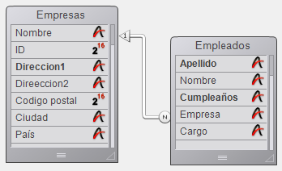
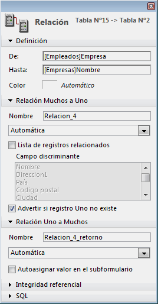

<!--REF #_command_.GET FIELD RELATION.Syntax-->**GET FIELD RELATION** ( *campoN* ; *uno* ; *muchos* {; *} )<!-- END REF-->
<!--REF #_command_.GET FIELD RELATION.Params-->
| Parámetro | Tipo |  | Descripción |
| --- | --- | --- | --- |
| campoN | Field | &#8594;  | Campo de inicio de una relación |
| uno | Integer | &#8592; | Estado de la relación Muchos a Uno |
| muchos | Integer | &#8592; | Estado de la relación Uno a Muchos |
| * | Operador | &#8594;  | • Si se pasa: uno y muchos devuelven el estado actual de la relación (valores 2 o 3 únicamente) • Si se omite (por defecto): uno y muchos puede devolver el valor 1 si la relación no ha sido modificada por programación |

<!-- END REF-->

#### Descripción 

<!--REF #_command_.GET FIELD RELATION.Summary-->El comando GET FIELD RELATION permite conocer el estado automático/manual de la relación comenzando desde el *campoN* para el proceso actual.<!-- END REF--> Todas las relaciones pueden ser consultadas, incluyendo las relaciones automáticas en la ventana de Estructura.

* Pase en *campoN*, el nombre del campo de la tabla N desde donde comienza la relación cuyo estado quiere conocer. Si ninguna relación se origina desde el campo *campoN*, los parámetros *uno* y *muchos* devuelven 0, se genera un error y la variable sistema OK toma el valor 0 (ver a continuación).
* Después de la ejecución del comando, la variable *uno* contiene un valor indicando si la relación Muchos a Uno especificada está definida como automática:  
 0 = no hay relación desde *campoN*. Se genera el error de sintaxis No. 16 (“El campo no tiene relación”) y la variable sistema OK toma el valor 0.  
 1 = el estado automático/manual de la relación Muchos a Uno especificado está definido por la opción **Relación Muchos a Uno automática** en las propiedades de la relación en el entorno Diseño (no ha sido modificado por programación).  
2 = la relación Muchos a Uno es manual para el proceso.  
 3 = la relación Muchos a Uno es automática para el proceso.
* Después de la ejecución del comando, el parámetro *muchos* contiene un valor indicando si la relación Uno a Muchos especificada está definida como automática:  
0 = no hay relación desde *campoN*. Se genera el error de sintaxis No. 16 (“El campo no tiene relación”) y la variable sistema OK toma el valor 0\.  
1 = el estado automático/manual de la relación Uno a Muchos especificada está definido por la opción **Relación Uno a Muchos automática** en las propiedades de la relación en el entorno Diseño (no ha sido modificado por programación).  
2 = la relación Uno a Muchos es manual para el proceso.  
3 = la relación Uno a Muchos es automática para el proceso.

Puede comparar los valores recibidos en los parámetros *uno* y *muchos* con las constantes del tema “”: 

| Constante               | Tipo         | Valor |
| ----------------------- | ------------ | ----- |
| Automatic               | Entero largo | 3     |
| Manual                  | Entero largo | 2     |
| No relation             | Entero largo | 0     |
| Structure configuration | Entero largo | 1     |

* El parámetro opcional *\** permite “forzar” la lectura del estado actual de la relación, incluso si no ha sido modificado por programación. En otras palabras, cuando pasa el parámetro opcional \*, sólo pueden devolverse los valores 2 ó 3 en los parámetros *uno* y *muchos*.

#### Ejemplo 

Dada la siguiente estructura:



Las propiedades de la relación que une el campo \[Empleados\]Empresa con el campo\[Empresas\]Nombre son las siguientes:



El siguiente código ilustra las diferentes posibilidades ofrecidas por los comandos GET FIELD RELATION, [GET AUTOMATIC RELATIONS](get-automatic-relations.md) y [SET FIELD RELATION](set-field-relation.md), [SET AUTOMATIC RELATIONS](set-automatic-relations.md) así como sus efectos:

```4d
 GET AUTOMATIC RELATIONS(one;many) //devuelve False, False
 GET FIELD RELATION([Empleados]Empresa;one;many) //devuelve 1,1
 GET FIELD RELATION([Empleados]Empresa;one;many;*) //devuelve 3,2
 
 SET FIELD RELATION([Empleados]Empresa;2;0) //cambia la relación Muchos a uno a manual
 
 GET FIELD RELATION([Empleados]Empresa;one;many) //devuelve 2,1
 GET FIELD RELATION([Empleados]Empresa;one;many;*) //devuelve 2, 2
 
 SET FIELD RELATION([Empleados]Empresa;1;0) //restablece los parámetros definidos en el entorno Diseño para la relación Muchos a Uno
 
 GET FIELD RELATION([Empleados]Empresa;one;many) //devuelve 1,1
 GET FIELD RELATION([Empleados]Empresa;one;many;*) //devuelve 3,2
 
 SET AUTOMATIC RELATIONS(True;True) //cambia todas las relaciones de todas las tablas a automática
 
 GET AUTOMATIC RELATIONS(one;many) //devuelve True, True
 GET FIELD RELATION([Employees]Company;one;many) //devuelve 1,1
 GET FIELD RELATION([Employees]Company;one;many;*) //devuelve 3,3
```

#### Ver también 

[GET AUTOMATIC RELATIONS](get-automatic-relations.md)  
[GET RELATION PROPERTIES](get-relation-properties.md)  
[SET AUTOMATIC RELATIONS](set-automatic-relations.md)  
[SET FIELD RELATION](set-field-relation.md)  

#### Propiedades

|  |  |
| --- | --- |
| Número de comando | 920 |
| Hilo seguro | &check; |


