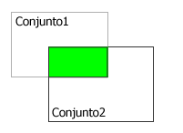

<!--REF #_command_.INTERSECTION.Syntax-->**INTERSECTION** ( *conjunto1* ; *conjunto2* ; *resultado* )<!-- END REF-->
<!--REF #_command_.INTERSECTION.Params-->
| Parámetro | Tipo |  | Descripción |
| --- | --- | --- | --- |
| conjunto1 | Text | &#8594;  | Primer conjunto |
| conjunto2 | Text | &#8594;  | Segundo conjunto |
| resultado | Text | &#8594;  | Conjunto resultante |

<!-- END REF-->

#### Descripción 

<!--REF #_command_.INTERSECTION.Summary-->INTERSECTION compara *conjunto1* y *conjunto2* y selecciona únicamente los registros que están en ambos conjuntos.<!-- END REF--> La siguiente tabla lista todos los resultados posibles de una operación de intersección de conjuntos.

| **Conjunto1** | **Conjunto2** | **Conjunto resultante** |
| ------------- | ------------- | ----------------------- |
| Sí            | No            | No                      |
| Sí            | Sí            | Sí                      |
| No            | Sí            | No                      |
| No            | No            | No                      |

El resultado gráfico de una operación de intersección se muestra a continuación. El área de color el el conjunto resultante.



El conjunto *resultado* se crea por INTERSECTION. El conjunto *resultado* reemplaza todo conjunto que exista con el mismo nombre, incluyendo *conjunto1* y *conjunto2*. Los conjuntos *conjunto1* y *conjunto2* deben ser de la misma tabla. El conjunto *resultado* pertenece a la misma tabla que *conjunto1* y *conjunto2*. Si el mismo registro actual se define en *conjunto1* y *conjunto2*, permanece memorizado en *resultado*. De lo contrario, *resultado* no tiene un registro actual. 

**4D Server:** en modo cliente/Servidor, los conjuntos interprocesos y procesos se conservan en el equipo servidor, mientras que los conjuntos locales se mantiene en los equipos cliente. INTERSECTION requiere que los tres conjuntos estén en el mismo equipo. Por lo tanto, todos los conjuntos deben ser locales o ninguno de ellos debe ser local. Para mayor información consulte la sección *4D Server, conjuntos y selecciones temporales* en el manual de referencia de 4D Server.

#### Ejemplo 

El siguiente ejemplo busca los clientes que son atendidos por dos representantes de ventas, Juan y Ariel. Cada representante de ventas tiene un conjunto con sus clientes. Los clientes que se encuentran en ambos conjuntos son los que están en contacto con Juan y Ariel:

```4d
 INTERSECTION("Juan";"Ariel";"Ambos") // Coloque los clientes de ambos conjuntos en Ambos
 USE SET("Ambos") // Utilización del conjunto
 CLEAR SET("Ambos") // Borrado de este conjunto pero se guardan los otros
 DISPLAY SELECTION([Clientes]) // Muestra los clientes en contacto con los dos representantes de ventas
```

#### Ver también 

[DIFFERENCE](difference.md)  
[UNION](union.md)  

#### Propiedades

|  |  |
| --- | --- |
| Número de comando | 121 |
| Hilo seguro | &check; |


