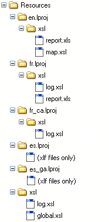

<!--REF #_command_.Localized document path.Syntax-->**Localized document path** ( *rutaRelativa* ) : Text<!-- END REF-->
<!--REF #_command_.Localized document path.Params-->
| Parámetro | Tipo |  | Descripción |
| --- | --- | --- | --- |
| rutaRelativa | Text | &#8594;  | Ruta de acceso relativa del documento del cual obtener la versión localizada |
| Resultado | Text | &#8592; | Ruta de acceso absoluta del documento localizado |

<!-- END REF-->

#### Descripción 

<!--REF #_command_.Localized document path.Summary-->El comando Localized document path devuelve la ruta completa (absoluta) de un documento designado por *rutaRelativa* y ubicado en la carpeta xxx.<!-- END REF-->lproj.  
  
Este comando debe usarse dentro de una arquitectura de aplicación multi-lenguaje basada en la presencia de una carpeta **Resources** y de las subcarpetas xxx.lproj (xxx representa un idioma). Con esta arquitectura, 4D soporta automáticamente archivos localizados de tipo XLIFF así como las imágenes, pero es posible que deba usar el mismo mecanismo para otros tipos de archivos.   
  
Pase en *rutaRelativa* la ruta de acceso relativa del documento a buscar. La ruta especificada debe ser relativa al primer nivel de la carpeta "xxx.lproj" de la base de datos. El comando devolverá una ruta de acceso completa utilizando la carpeta "xxx.lproj" correspondiente al idioma actual de la base de datos.   
  
**Nota**: el idioma actual es definido automáticamente por 4D en función del contenido de la carpeta Resources (vea el comando [Get database localization](get-database-localization.md "Get database localization")), o vía el comando [SET DATABASE LOCALIZATION](set-database-localization.md "SET DATABASE LOCALIZATION").  
  
Puede expresar el contenido del parámetro rutaRelativa utilizando una sintaxis POSIX o sistema. Por ejemplo:  
  
* xsl/log.xsl (sintaxis POSIX: utilizable bajo Mac OS o Windows)
* xsllog.xsl (Windows únicamente)
* xsl:log.xsl (Mac OS únicamente)
La ruta de acceso absoluta devuelta por el comando siempre se expresa en la sintaxis del sistema.   
  
**4D Serve**r: en modo remoto, el comando devuelve la ruta de la carpeta Resources en la máquina cliente si el comando se llama desde un proceso cliente.   
  
4D busca el archivo respetando una secuencia que permite tratar todos los casos de aplicaciones en varios idiomas. En cada paso, 4D comprueba la presencia de rutaRelativa en la carpeta correspondiente al idioma y devuelve la ruta completa cuando tiene éxito. Si *rutaRelativa* no se encuentra o si la carpeta no existe, 4D pasa al siguiente paso. Aquí están las carpetas para cada una de las diferentes etapas de búsqueda:  
  
*Lenguaje actual (por ejemplo: fr-ca)* 
 *Lenguaje actual sin región (por ejemplo: fr)* 
 *Lenguaje cargado por defecto al inicio (por ejemplo: en-ga)* 
 *Lenguaje cargado por defecto al inicio sin región (es por ejemplo: es)* 
 *Primera carpeta .lproj encontrada (por ejemplo: en.lproj)* 
 *Primer nivel de la carpeta Resources*  
  
Si *rutaRelativa* no se encuentra en ninguna de estas ubicaciones, el comando devuelve una cadena vacía.

#### Ejemplo 

Para transformar un archivo XML en HTML, queremos utilizar un archivo de transformación "log.xsl". Este archivo difiere dependiendo del idioma actual. Usted quiere conocer la ruta del archivo "log.xsl" a utilizar.   
Estos son los contenidos de la carpeta Resources:



Para utilizar un archivo .xsl adaptado al lenguaje actual, sólo debe pasar:

```4d
 $myxsl:=Localized document path("xsl/log.xsl")
```

Si el lenguaje actual es, por ejemplo, francés canadiense (fr-ca), el comando devuelve:

* bajo Windows: C:users……… resources \_ca.lprojxsllog.xsl
* bajo Mac OS: "HardDisk:users:…:…:…:resources:fr\_ca.lproj:xsl:log.xsl"

#### Ver también 

[Get database localization](get-database-localization.md)  

#### Propiedades

|  |  |
| --- | --- |
| Número de comando | 1105 |
| Hilo seguro | &check; |


