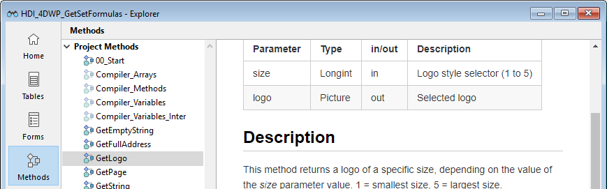

<!--REF #_command_.METHOD GET COMMENTS.Syntax-->**METHOD GET COMMENTS** ( *ruta* ; *comentarios* {; *} )<!-- END REF-->
<!--REF #_command_.METHOD GET COMMENTS.Params-->
| Parámetro | Tipo |  | Descripción |
| --- | --- | --- | --- |
| ruta | Text, Text array | &#8594;  | Texto o array texto que contiene una o varias rutas de método |
| comentarios | Text, Text array | &#8592; | Comentarios de los métodos designados |
| * | Operador | &#8594;  | Si se pasa = el comando se aplica a la base local cuando se ejecuta desde un componente (parámetro ignorado fuera de este contexto) |

<!-- END REF-->

#### Descripción 

<!--REF #_command_.METHOD GET COMMENTS.Summary-->El comando **METHOD GET COMMENTS** devuelve en el parámetro *comentarios*, la documentación de los métodos designados por el parámetro *ruta*.<!-- END REF-->

La documentación modificada por este comando se muestra en el explorador de 4D (no debe confundirse con líneas de comentarios en el código que son recuperadas utilizando [METHOD GET CODE](method-get-code.md)). 

Contiene:

* texto markdown en bases proyecto,
* texto con estilo en bases binarias.



Esta documentación se puede generar para métodos de tipo triggers, métodos proyecto, métodos formulario, métodos base y clases.

**Nota**: los formularios y los métodos formulario comparten la misma documentación.

Puede utilizar dos tipos de sintaxis, basadas en arrays texto o en variables texto:  

```4d
 var tVpath : Text // variables texto
 var tVcomments : Text
 METHOD GET COMMENTS(tVpath;tVcomments) // comentarios de un solo método
```
  
  
```4d
 ARRAY TEXT(arrPaths;0) // arrays texto
 ARRAY TEXT(arrComments;0)
 METHOD GET COMMENTS(arrPaths;arrComments) // comentarios de varios métodos
```
  
  
No se pueden combinar las dos sintaxis. 

Si el comando se ejecuta desde un componente, se aplica por defecto a los métodos del componente. Si pasa el parámetro *\**, accede a los métodos de la base local.

#### Ver también 

[METHOD SET COMMENTS](method-set-comments.md)  

#### Propiedades

|  |  |
| --- | --- |
| Número de comando | 1189 |
| Hilo seguro | &cross; |


