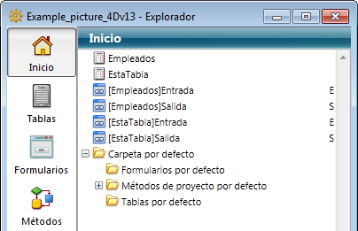

<!--REF #_command_.METHOD GET FOLDERS.Syntax-->**METHOD GET FOLDERS** ( *arrNoms* {; *filtro*}{; *} )<!-- END REF-->
<!--REF #_command_.METHOD GET FOLDERS.Params-->
| Parámetro | Tipo |  | Descripción |
| --- | --- | --- | --- |
| arrNoms | Text array | &#8592; | Array de nombres de carpetas de la página de inicio |
| filtro | Text | &#8594;  | Filtro de nombres |
| * | Operador | &#8594;  | Si se pasa = el comando se aplica a la base local cuando se ejecuta desde un componente (parámetro ignorado fuera de este contexto) |

<!-- END REF-->

#### Descripción 

<!--REF #_command_.METHOD GET FOLDERS.Summary-->El comando **METHOD GET FOLDERS** devuelve en el array *arrNoms*, los nombres de las carpetas creadas en la página Inicio del Explorador de 4D<!-- END REF-->:  
  
  
Como los nombres de las carpetas deben ser únicos, la jerarquía no se devuelve en este array.   
  
Puede limitar la lista de carpetas pasando una cadena de comparación en el parámetro *filtro*, en este caso, sólo se devuelven las carpetas cuyos nombres coincidan con el filtro. Puede utilizar el carácter @ para definir los filtros de tipo "comienza por", "termina en" o "contiene". Si pasa una cadena vacía, el parámetro *filtro* se ignora.   
  
Si se ejecuta este comando desde un componente, devuelve por defecto las rutas de los métodos del componente. Si pasa el parámetro *\**, el array contendrá las rutas de los métodos de la base local.

#### Ver también 

[METHOD GET PATHS](method-get-paths.md)  

#### Propiedades

|  |  |
| --- | --- |
| Número de comando | 1206 |
| Hilo seguro | &cross; |

