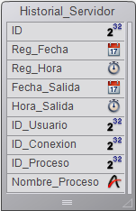
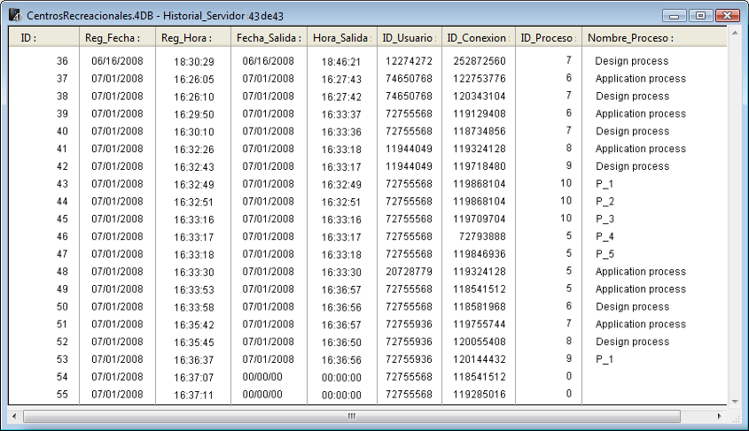

<!--REF #_command_.Metodo base On Server Open Connection.Syntax-->$1, $2, $3 -> Método base On Server Open Connection -> $0<!-- END REF-->
<!--REF #_command_.Metodo base On Server Open Connection.Params-->
| Parámetro | Tipo |  | Descripción |
| --- | --- | --- | --- |
| $1 | Entero largo | &#8592; | Número de usuario utilizado internamente por 4D Server para identificar los usuarios |
| $2 | Entero largo | &#8592; | Número de conexión utilizado internamente por 4D Server para identificar una conexión |
| $3 | Entero largo | &#8592; | Obsoleto: devuelve siempre 0 (pero debe declararse) |
| $0 | Entero largo | &#8592; | 0 o se omite = conexión aceptada; otro valor = conexión rechazada |

<!-- END REF-->

#### ¿Cuándo se llama el método base On Server Open Connection? 

<!--REF #_command_.Metodo base On Server Open Connection.Summary-->El **Método base On Server Open Connection** se llama una vez en el equipo servidor cada vez que un equipo 4D remoto inicia un proceso de conexión.<!-- END REF--> El **Método base On Server Open Connection** NO se invoca por otro entorno 4D diferente de 4D Server.

El **Método base On Server Open Connection** se llama cada vez que:

* un 4D remoto se conecta (inicio del proceso principal)
* un 4D remoto abre el entorno Diseño (inicio del proceso de Diseño)
* un 4D remoto inicia un proceso global, (cuyo nombre o comienza por "$") lo cual necesita de la creación de un proceso cooperativo en el servidor **(\*)**. Este proceso puede crearse utilizando el comando [New process](new-process.md), un comando de menú o la caja de diálogo "Ejecutar un método".

En cada caso con un 4D remoto, se inician tres procesos. Uno en la máquina cliente y otros dos en el equipo servidor. En la máquina cliente, el proceso ejecuta el código y envía las peticiones a 4D Server. En el equipo servidor, el **proceso 4D Client** mantiene el entorno de la base de datos del proceso cliente (las selecciones actuales y el bloqueo de registros para el proceso usuario) y responde a las peticiones enviadas por el proceso ejecutado en la máquina cliente. El **proceso base 4D Client** está a cargo de controlar el proceso 4D Client correspondiente.

**(\*)** A partir de 4D v13, por razones de optimización los procesos servidores (proceso apropiativo para los accesos al motor de la base y proceso cooperativo para el acceso al lenguaje) sólo se crean durante la ejecución del código del lado del cliente. Por ejemplo, estos son los detalles de una secuencia de código 4D que se ejecuta en un nuevo proceso cliente:  

```4d
  // el proceso global comienza sin un nuevo proceso en el servidor, como un proceso local.
 CREATE RECORD([Table_1])
 [Table_1])field1_1:="Hello world"
 SAVE RECORD([Table_1]) // creación aquí del proceso apropiativo en el servidor
 $serverTime:=Current time(*) // creación aquí del proceso cooperativo en el servidor
  // llamada de On Server Open Connection
```

**Importante**: las conexiones web y las conexiones SQL no provocan la ejecución del **Método base On Server Open Connection**. Cuando un navegador web se conecta a 4D Server, se llaman el *Método de base On Web Authentication* (si lo hay) y/o la [Método base On Web Connection](metodo-base-on-web-connection.md).   
Cuando 4D Server recibe una petición SQL, se llama el [Método base On SQL Authentication](metodo-base-on-sql-authentication.md)(si existe). Para mayor información, consulte la descripción de este método base en el manual de Lenguaje 4D.

**Importante**: cuando se inicia un procedimiento almacenado, el **Método base On Server Open Connection** NO se llama. Los *Procedimientos almacenados* son procesos servidor y no procesos 4D Client. Ellos ejecutan el código en el equipo servidor, pero no responden a las peticiones intercambiadas por 4D client (u otros clientes) y 4D Server.

#### ¿Cómo se llama al método base On Server Open Connection? 

El Método base On Server Open Connection se ejecuta en el equipo servidor en el proceso 4D Client que provocó la llamada del método. 

Por ejemplo, si un 4D remoto se conecta a una base 4D Server interpretada, se inicia el proceso usuario, el proceso de diseño y el proceso de registro del cliente (por defecto). El Método base On Server Open Connection se ejecuta tres veces seguidas. La primera vez dentro del proceso principal, la segunda vez en el proceso de inscripción del cliente y la tercera vez en el proceso de diseño. Si los tres procesos son respectivamente el sexto, séptimo y octavo proceso a iniciar en el equipo servidor, y si llama [Current process](current-process.md) desde el Método base On Server Open Connection, la primera vez [Current process](current-process.md) devuelve 6, la segunda vez 7 y la tercera 8.

Note que el Método base On Server Open Connection se ejecuta en el equipo servidor, al interior del proceso 4D Client en el servidor, independiente del proceso ejecutado en el cliente. Adicionalmente, en el momento en que se invoca el método, el proceso 4D Client no se ha nombrado aún ([Process info](../commands/process-info.md) no devolverá en este momento el nombre del proceso 4D Client).

El Método base On Server Open Connection no tiene acceso a la tabla de las variables proceso del proceso ejecutado en el client. Esta tabla reside en el equipo client, no en el equipo servidor. 

Cuando el Método base On Server Open Connection accede a una variable proceso, trabaja con una tabla de variables proceso particular, creada dinámicamente por el proceso 4D Client. 

4D Server pasa tres parámetros de tipo Entero largo al Método base On Server Open Connection y espera un resultado Entero largo. El método debe por lo tanto ser declarado explícitamente con tres parámetros Entero largo así como también con un resultado de función Entero largo:

```4d
 var $0;$1;$2;$3 : Integer
```

Si no devuelve un valor en *$0*, por consiguiente deja la variable indefinida o inicializada en cero, 4D Server estima que el método base acepta la conexión. Si no acepta la conexión, devuelve un valor no nulo en *$0*.

Esta tabla detalla la información ofrecida por los tres parámetros pasados en el método base:

| **Parámetro** | **Descripción**                                                                       |
| ------------- | ------------------------------------------------------------------------------------- |
| $1            | Número de usuario utilizado internamente por 4D Server para identificar los usuarios  |
| $2            | Número de conexión utilizado internamente por 4D Server para identificar una conexión |
| $3            | Obsoleto: siempre devuelve 0 pero debe declararse                                     |

Estos números de referencia no son utilizables directamente como fuentes de información a pasar, por ejemplo, como parámetros a un comando 4D. Sin embargo, ofrecen una manera única de identificar un proceso 4D Client entre el Método base On Server Open Connection y el [Método base On Server Close Connection](metodo-base-on-server-close-connection.md). La combinación de estos valores es única en cualquier momento de una sesión 4D Server. Al guardar esta información en una tabla o en un array interproceso, los dos métodos base pueden intercambiar información. En el ejemplo al final de esta sección, los dos métodos base utilizan esta información para almacenar la fecha y hora de inicio y fin de una conexión en el mismo registro de una tabla.

#### Ejemplo 1 

El siguiente ejemplo muestra cómo mantener un historial de las conexiones a la base de datos utilizando el Método base On Server Open Connection y utilizando el [Método base On Server Close Connection](metodo-base-on-server-close-connection.md). La tabla *\[Server Log\]* (mostrada a continuación) se utiliza para hacer seguimiento a los procesos de conexión: 



La información almacenada en esta tabla es administrada por el Método base On Server Open Connection y el [Método base On Server Close Connection](metodo-base-on-server-close-connection.md) listado a continuación:

```4d
  // Método base On Server Open Connection
 
 var $0;$1;$2;$3 : Integer
  // Crear un registro [Server Log]
 CREATE RECORD([Server Log])
 [Server Log]Log ID:=Sequence number([Server Log])
  // Guardar el historial Fecha y Hora
 [Server Log]Log Date:=Current date
 [Server Log]Log Time:=Current time
  // Guarda la información de conexión
 [Server Log]User ID:=$1
 [Server Log]Connection ID:=$2
 SAVE RECORD([Server Log])
  // No devuelve error de manera que la conexión puede continuar
 $0:=0
 
  // Método base On Server Close Connection
 var $1;$2;$3 : Integer
  // Recuperar el registro [Server Log]
 QUERY([Server Log];[Server Log]User ID=$1;*)
 QUERY([Server Log];&;[Server Log]Connection ID=$2;*)
 QUERY([Server Log];&;[Server Log]Process ID=0)
  // Guardar fecha y hora de desconexión
 [Server Log]Exit Date:=Current date
 [Server Log]Exit Time:=Current time
  // Guardar información proceso
 [Server Log]Process ID:=Current process
 PROCESS PROPERTIES([Server Log]Process ID;$vsProcName;$vlProcState;$vlProcTime)
 [Server Log]Process Name:=$vsProcName
 SAVE RECORD([Server Log])
```

Estas son algunas entradas en \[Server Log\] mostrando varias conexiones remotas:



#### Ejemplo 2 

El siguiente ejemplo evita una nueva conexión entre las 2 y 4 A.M. 

```4d
  // Método base On Server Open Connection
 var $0;$1;$2;$3 : Integer
 
 If((?02:00:00?<=Current time)&(Current time
```
