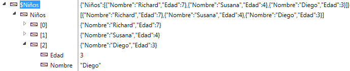

<!--REF #_command_.OB SET ARRAY.Syntax-->**OB SET ARRAY** ( *objeto* ; *propiedad* ; *array* )<!-- END REF-->
<!--REF #_command_.OB SET ARRAY.Params-->
| Parámetro | Tipo |  | Descripción |
| --- | --- | --- | --- |
| objeto | Object, Object | &#8594;  | Objeto estructurado |
| propiedad | Text | &#8594;  | Nombre de la propiedad a definir |
| array | Array, Variable | &#8594;  | Array a almacenar en propiedad |

<!-- END REF-->

#### Descripción 

<!--REF #_command_.OB SET ARRAY.Summary-->El comando **OB SET ARRAY** define el *array* a asociarse a la *propiedad* en el objeto definido por el parámetro *objeto*.<!-- END REF-->debe haber sido definido con el comando *C\_OBJECT* o designar un campo objeto 4D.  
  
En el parámetro *propiedad*, pase la etiqueta de la propiedad a crear o modificar. Si la propiedad ya existe en *objeto*, su valor se actualiza. Si no existe, se crea.  
Tenga en cuenta que el parámetro *propiedad* tiene en cuenta las mayúsculas y minúsculas.  
  
En el parámetro *array*, pase el array que se debe pasar como valor de la propiedad. Se soportan varios tipos de array: real, entero largo, texto, booleano, objeto, puntero o imagen. Los arrays imagen se soportan a partir de 4D v16 R4.  
  
**Notas:** 

* Las variables simples son soportadas en el parámetro *array*, en cuyo caso se crea un array de valor único y se asocia a la *propiedad*.
* No es posible utilizar arrays de dos dimensiones.

#### Ejemplo 1 

Utilizando un array texto:

```4d
 var $Children : Object
 ARRAY TEXT($arrChildren;3)
 $arrChildren{1}:="Richard"
 $arrChildren{2}:="Susan"
 $arrChildren{3}:="James"
 
 OB SET ARRAY($Children;"Children";$arrChildren)
  // Valor de $Children = {"Children":["Richard","Susan","James"]}
```

#### Ejemplo 2 

Adición de un elemento de un array:

```4d
 ARRAY TEXT($arrText;2)
 $arrText{1}:="Smith"
 $arrText{2}:="White"
 var $Employees : Object
 OB SET ARRAY($Employees;"Employees";$arrText)
 APPEND TO ARRAY($arrText;"Brown") // Añadir el array 4D
  // $Employees = {"Employees":["Smith","White"]}
 
 OB SET ARRAY($Employees;"Employees";$arrText)
  // $Employees = {"Employees":["Smith","White","Brown"]}
```

#### Ejemplo 3 

Utilizando una array texto con selección de un elemento:

```4d
  // $Employees = {"Employees":["Smith","White","Brown"]}
 OB SET ARRAY($Employees ;"Manager";$arrText{1})
  // $Employees = {"Employees":["Smith","White","Brown"],"Manager":["Smith"]}
```

#### Ejemplo 4 

Uso de un array objeto:

```4d
 var $Children;$ref_richard;$ref_susan;$ref_james : Object
 ARRAY OBJECT($arrChildren;0)
 OB SET($ref_richard;"nom";"Richard";"age";7)
 APPEND TO ARRAY($arrChildren;$ref_richard)
 OB SET($ref_susan;"name";"Susan";"age";4)
 APPEND TO ARRAY($arrChildren;$ref_susan)
 OB SET($ref_james;"name";"James";"age";3)
 
 APPEND TO ARRAY($arrChildren;$ref_james)
 
  // $arrChildren {1} = {"name":"Richard","age":7}
  // $arrChildren {2} = {"name":"Susan","age":4}
  // $arrChildren {3} = {"name":"James","age":3}
 
 OB SET ARRAY($Children;"Children";$arrChildren)
 
  // $Children = {"Children":[{"name":"Richard","age":7},{"name":"Susan",
  // "age":4},{"name":"James","age":3}]}
```

Así es como el objeto aparece en el depurador:



#### Ejemplo 5 

```4d
 ARRAY TEXT($arrGirls;3)
 $arrGirls{1}:="Emma"
 $arrGirls{2}:="Susan"
 $arrGirls{3}:="Jamie"
 OB SET ARRAY([People]Children;"Girls";$arrGirls)
```


#### Ejemplo 6 

Utilizando un array imagen:

```4d
 ARRAY PICTURE($arrPhotos;3)
 READ PICTURE FILE("pict1.jpg";$arrPhotos{1})
 READ PICTURE FILE("pict2.jpg";$arrPhotos{2})
 READ PICTURE FILE("pict3.jpg";$arrPhotos{3})
 
 OB SET ARRAY([Cities]Places;"Photoset";$arrPhotos)
```

#### Ver también 

*Conversiones de tipo entre las colecciones y los arrays 4D*  
[OB GET ARRAY](ob-get-array.md)  
[OB SET](ob-set.md)  

#### Propiedades

|  |  |
| --- | --- |
| Número de comando | 1227 |
| Hilo seguro | &check; |


