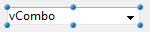
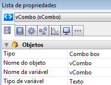

<!--REF #_command_.OBJECT Get data source.Syntax-->**OBJECT Get data source** ( {* ;} *objeto* ) : Pointer<!-- END REF-->
<!--REF #_command_.OBJECT Get data source.Params-->
| Parámetro | Tipo |  | Descripción |
| --- | --- | --- | --- |
| * | Operador | &#8594;  | Si se especifica, objeto es un nombre de objeto (cadena)<br/>Si se omite, objeto es un campo o una variable |
| objeto | any | &#8594;  | Nombre de objeto (si se especifica *) o <br/>Campo o variable (si se omite *) |
| Resultado | Pointer | &#8592; | Puntero a la fuente de datos actual del objeto |

<!-- END REF-->

#### Descripción 

<!--REF #_command_.OBJECT Get data source.Summary-->El comando **OBJECT Get data source** devuelve la fuente de datos actual de los objetos designados por los parámetros *objeto* y *\** .<!-- END REF-->  
  
Puede definir la fuente de datos para un objeto en modo Diseño utilizando la Lista de propiedades, o utilizando el comando [OBJECT SET DATA SOURCE](object-set-data-source.md).  
  
Pasando el parámetro opcional *\** indica que el parámetro *objeto* es un nombre de objeto (cadena). Si no pasa este parámetro, indica que el parámetro *objeto* es un campo o una variable. En este caso, se pasa una referencia de campo o variable en lugar de una cadena (campo o variable objeto únicamente).

#### Ejemplo 

Dado un objeto combo box definido en un formulario:



Ejecuta el siguiente código:

```4d
 $vPtr :=OBJECT Get data source(*;"vCombo")
  // $vPtr contiene -> vCombo
```

  

#### Ver también 

[OBJECT SET DATA SOURCE](object-set-data-source.md)  

#### Propiedades

|  |  |
| --- | --- |
| Número de comando | 1265 |
| Hilo seguro | &cross; |


