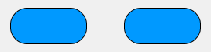
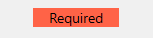
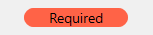

<!--REF #_command_.OBJECT SET CORNER RADIUS.Syntax-->**OBJECT SET CORNER RADIUS** ( {* ;} *objeto* ; *radio* )<!-- END REF-->
<!--REF #_command_.OBJECT SET CORNER RADIUS.Params-->
| Parámetro | Tipo |  | Descripción |
| --- | --- | --- | --- |
| * | Operador | &#8594;  | Si se especifica, objeto es un nombre de objeto (cadena)<br/>Si se omite, objeto es una variable o un campo |
| objeto | any | &#8594;  | Nombre de objeto (si se especifica *) o Campo o variable (si se omite *) |
| radio | Integer | &#8594;  | Nuevo radio de esquinas redondeadas (en píxeles) |

<!-- END REF-->

#### Descripción 

<!--REF #_command_.OBJECT SET CORNER RADIUS.Summary-->El comando **OBJECT SET CORNER RADIUS** modifica el *radio* de las esquinas de los objetos pasados en el parámetro *objeto*.<!-- END REF--> El nuevo radio sólo se define para el proceso y no se guarda en el formulario. 

Puede utilizar este comando con los siguientes objetos de formulario:

* rectángulos
* entradas (sólo proyectos 4D)

Al pasar el parámetro opcional *\** indica que el parámetro *objeto* es un nombre de objeto (cadena). Si no pasa este parámetro, indica que el parámetro *objeto* es un campo o una variable. En este caso, se pasa una referencia de campo o variable en lugar de una cadena (campo o variable objeto únicamente). 

En el parámetro *radio*, pase un nuevo valor del radio en píxeles a aplicar en las esquinas del objeto.

**Nota**: con los objetos de entrada y área de texto, la propiedad de radio de esquina sólo está disponible con los estilos de línea de borde "ninguno", "sólido" o "punteado".

También puede modificar este valor a nivel de formulario utilizando la *propiedad Radio de esquina* (ver también *Radio de la esquina (rectángulos)*).

#### Ejemplo 1 

Usted tiene los siguientes rectángulos en su formulario, llamados respectivamente "Rect1" y "Rect2":


Puede ejecutar el siguiente código para cambiar su radio:

```4d
 OBJECT SET CORNER RADIUS(*;"Rect@";20)
```



#### Ejemplo 2 

Tiene la siguiente área de texto en su formulario, llamada "required-label":



Si ejecuta el siguiente código:

```4d
 OBJECT SET CORNER RADIUS(*;"required-label";10)
```



Tenga en cuenta que para las áreas de texto (así como las entradas), a diferencia de los rectángulos, la redondez de la esquina se dibuja fuera del área inicial del objeto.

#### Ver también 

[OBJECT Get corner radius](object-get-corner-radius.md)  

#### Propiedades

|  |  |
| --- | --- |
| Número de comando | 1323 |
| Hilo seguro | &cross; |


