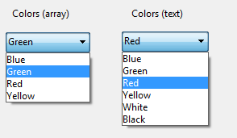

<!--REF #_command_.OBJECT SET LIST BY REFERENCE.Syntax-->**OBJECT SET LIST BY REFERENCE** ( {* ;} *objeto* {; *tipoLista*}; *lista* )<!-- END REF-->
<!--REF #_command_.OBJECT SET LIST BY REFERENCE.Params-->
| Parámetro | Tipo |  | Descripción |
| --- | --- | --- | --- |
| * | Operador | &#8594;  | Si se especifica, objeto es un nombre de objeto (cadena)<br/>Si se omite, objeto es un campo o variable |
| objeto | any | &#8594;  | Nombre de objeto (si se especifica *) o<br/>Campo o variable (si se omite *) |
| tipoLista | Integer | &#8594;  | Tipo de lista: Lista de valores, Lista de obligatorios o Lista de excluidos |
| lista | Integer | &#8594;  | Número de referencia de lista |

<!-- END REF-->

#### Descripción 

<!--REF #_command_.OBJECT SET LIST BY REFERENCE.Summary-->El comando **OBJECT SET LIST BY REFERENCE** define o remplaza la lista asociada con el objeto u objetos definidos por los parámetros *objeto* y *\**, con la lista jerárquica definida en el parámetro *lista*.<!-- END REF-->

Si pasa el parámetro opcional *\** indica que el parámetro *objeto* es un nombre de objeto (cadena). Si no pasa este parámetro, indica que el parámetro objeto es un campo o una variable. En este caso, se pasa una referencia de campo o variable en lugar de una cadena (campo o variable objeto únicamente).  
  
Por defecto, si se omite el parámetro *tipoLista*, el comando define una lista de selección fuente (selección de valores) para el objeto. Puede designar cualquier tipo de lista en el parámetro *tipoLista*. Para ello, sólo tiene que pasar una de las siguientes constantes del tema "*Propiedades de los objetos*":

| Constante     | Tipo         | Valor | Comentario                                                                                         |
| ------------- | ------------ | ----- | -------------------------------------------------------------------------------------------------- |
| Choice list   | Entero largo | 0     | Lista simple de selección de valores (opción "Lista" en la Lista de Propiedades) (por defecto)     |
| Excluded list | Entero largo | 2     | Lista de valores no aceptados para la entrada (Opción "Exclusiones" en la lista de propiedades)    |
| Required list | Entero largo | 1     | Lista sólo los valores aceptados para la entrada (Opción "Obligatoria" en la Lista de Propiedades) |

En *lista*, pase el número de referencia de la lista jerárquica que desea asociar al objeto. Esta lista debe haber sido generada utilizando el comando [Copy list](copy-list.md), [Load list](load-list.md) o [New list](new-list.md).

Para finalizar la asociación de una *lista* con un *objeto*, sólo pase 0 en el parámetro *lista* para el tipo de lista concerniente. Eliminar una asociación de lista, no elimina la referencia de lista en memoria. Recuerde llamar el comando [CLEAR LIST](clear-list.md) cuando ya no necesite la lista.

La lista de valores existente se sustituye en función de cómo se asocie la lista al objeto formulario:

* utilizando una lista de elección: se sustituye la propia lista.
* utilizando un array: la lista se copia en elementos de array.
* utilizando un objeto (*no soportado en bases de datos binarias*): la lista se copia como elementos de la colección en la propiedad *values* del objeto.

Este comando es especialmente interesante en el contexto de un pop-up o combo box asociado a una variable o un campo. En este caso, la asociación es dinámica y cualquier cambio en la lista se copia en el formulario. Cuando el objeto está asociado a un array o a un objeto, la lista se copia en el array o el objeto y cualquier cambio en la lista no están disponible de forma automática (ver el ejemplo 5).

#### Ejemplo 1 

Asociar una lista de opciones simples (tipo de lista predeterminado) a un campo de texto:

```4d
 vCountriesList:=New list
 APPEND TO LIST(vCountriesList;"Spain";1)
 APPEND TO LIST(vCountriesList;"Portugal";2)
 APPEND TO LIST(vCountriesList;"Greece";3)
 OBJECT SET LIST BY REFERENCE([Contact]Country;vCountriesList)
```

#### Ejemplo 2 

Asociar la lista "vColor" como una lista de selección simple con el pop-up/lista desplegable "DoorColor":

```4d
 vColor:=New list
 APPEND TO LIST(vColor;"Blue";1)
 APPEND TO LIST(vColor;"Green";2)
 APPEND TO LIST(vColor;"Red";3)
 APPEND TO LIST(vColor;"Yellow";4)
 OBJECT SET LIST BY REFERENCE(*;"DoorColor";Choice list;vColor)
```

#### Ejemplo 3 

Ahora desea asociar la lista "vColor" con un combo box denominado "WallColor". Como este combo box es editable, usted quiere asegurarse de que ciertos colores, como "negro", "morado", etc, no se puedan utilizar. Estos colores se colocan en la lista "vReject":

```4d
 OBJECT SET LIST BY REFERENCE(*;"WallColor";Choice list;vColor)
 vReject:=New list
 APPEND TO LIST(vReject;"Black";1)
 APPEND TO LIST(vReject;"Gray";2)
 APPEND TO LIST(vReject;"Purple";3)
 OBJECT SET LIST BY REFERENCE(*;"WallColor";Excluded list;vReject)
```

#### Ejemplo 4 

Usted desea eliminar las asociaciones de listas:

```4d
 OBJECT SET LIST BY REFERENCE(*;"WallColor";Choice list;0)
 OBJECT SET LIST BY REFERENCE(*;"WallColor";Required list;0)
 OBJECT SET LIST BY REFERENCE(*;"WallColor";Excluded list;0)
```

#### Ejemplo 5 

Este ejemplo ilustra la diferencia en la forma en que funciona el comando cuando se aplica a un menú pop-up asociado a un array texto o a una variable texto. Hay dos menús pop-up en un formulario:


El contenido de estos menús emergentes se define utilizando la lista *<>vColor* (que contiene los valores de colores). Se ejecuta el siguiente código cuando se carga el formulario:

```4d
 ARRAY TEXT(arr1;0) //arr1 pop up
 var text1 : Text //text1 pop up
 OBJECT SET LIST BY REFERENCE(*;"arr1";<>vColor)
 OBJECT SET LIST BY REFERENCE(*;"text1";<>vColor)
```

Durante la ejecución, ambos menús proponen los mismos valores::

  
(*Montaje que muestra el contenido de los menús de forma simultánea*)

Luego ejecute el siguiente código, por ejemplo, por medio de un botón:

```4d
 APPEND TO LIST(<>vColor;"White";5)
 APPEND TO LIST(<>vColor;"Black";6)
```

Sólo el menú asociado al campo texto se actualiza (por medio de la referencia dinámica):  
  
  
  
Con el fin de actualizar la lista asociada al pop-up gestionado por array, es necesario llamar de nuevo al comando **OBJECT SET LIST BY REFERENCE** para copiar el contenido de la lista.

#### Ver también 

[OBJECT Get list reference](object-get-list-reference.md)  
[OBJECT SET LIST BY NAME](object-set-list-by-name.md)  

#### Propiedades

|  |  |
| --- | --- |
| Número de comando | 1266 |
| Hilo seguro | &cross; |


