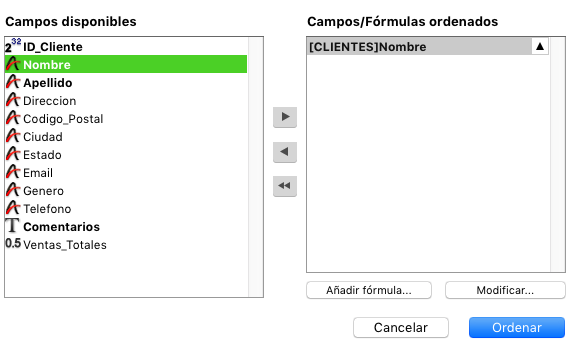
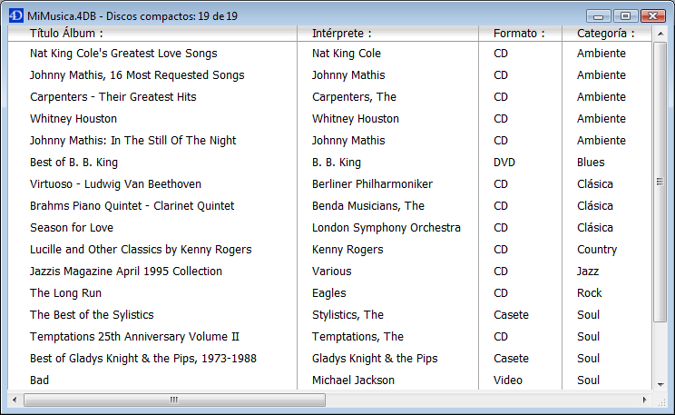

<!--REF #_command_.ORDER BY.Syntax-->**ORDER BY** ( {*tabla* ;}{ *unCampo* }{; > o < }{; *unCampo2* ; > o <2 ; ... ; *unCampoN* ; > o <N}{; *} )<!-- END REF-->
<!--REF #_command_.ORDER BY.Params-->
| Parámetro | Tipo |  | Descripción |
| --- | --- | --- | --- |
| tabla | Table | &#8594;  | Tabla para la cual ordenar los registros seleccionados o Tabla por defecto si se omite |
| unField | Field | &#8594;  | Campo en el cual efectuar la ordenación para cada nivel |
| > o < | Operador | &#8594;  | Sentido de la ordenación para cada nivel: > para orden ascendente o < para orden descendente |
| * | Operador | &#8594;  | Continua la bandera de ordenación |

<!-- END REF-->

#### Descripción 

<!--REF #_command_.ORDER BY.Summary-->ORDER BY ordena (reordena) los registros de la selección actual de *tabla* para el proceso actual.<!-- END REF--> Una vez efectuada la ordenación, el primer registro de la nueva selección actual se convierte en el registro actual.

Si omite el parámetro *tabla*, el comando se aplica a la tabla por defecto, si se ha definido una tabla por defecto. Si no 4D utiliza la tabla del primer campo pasado como parámetro. Si no pasa un parámetro y si no se ha definido una tabla por defecto, se devuelve un error.

Si no especifica el parámetro *campo*, ni los parámetros *\> o <* o, ORDER BY muestra la caja de diálogo Ordenar de 4D para *tabla*. Esta es la caja de diálogo del editor:



Para mayor información sobre la utilización de este editor, consulte el Manual de diseño de 4D. 

Si especifica los parámetros *unCampo* y *\> o <*, la caja de diálogo estándar de Ordenar no se muestra y la ordenación se define por programación. Puede ordenar la selección en un nivel o en varios niveles. Para cada nivel de clasificación, se especifica un campo en *unCampo* y el orden de clasificación en *\> o <*. Si pasa el símbolo "mayor que" (>), el orden es ascendente. Si pasa el símbolo "menor que" (<), el orden es descendente.  
  
Si omite el parámetro de ordenación *\> o <*, el orden es ascendente por defecto.

Si sólo se especifica un campo (ordenación de un nivel) y se indexa, se utiliza el índice para el orden. Si el campo no está indexado o si hay más de un campo, el orden se ejecuta secuencialmente (excepto en el caso de índices compuestos). El campo puede pertenecer a la tabla de la selección que está siendo reordenada o a una tabla 1 relacionada con *tabla* por una relación automática. En este caso, el orden es siempre secuencial.  
Si los campos ordenados están incluidos en un índice compuesto, **ORDER BY** utiliza el índice para el orden.

Para ordenaciones múltiples (ordenar en varios campos), puede llamar**ORDER BY** tantas veces como sea necesario y especificar el parámetro opcional *\**, excepto para la última llamada **ORDER BY**, que inicia la operación de ordenación real. Esta funcionalidad es útil para la gestión de ordenaciones multicriterios en interfaces de usuario personalizadas.  
**Atención**: con esta sintaxis, sólo puede pasar un nivel de ordenación (campo) por línea de instrucción.

No importa cómo se haya definido una ordenación, si la operación de ordenación real va a tomar algún tiempo para realizarse, 4D muestra automáticamente un mensaje que contiene un termómetro de progreso. Estos mensajes se pueden activar y desactivar utilizando los comandos [MESSAGES ON](messages-on.md) y [MESSAGES OFF](messages-off.md). Si se muestra el termómetro de progreso, el usuario puede hacer clic en el botón Detener para interrumpir la ordenación.

Si la ordenación se realiza correctamente, la variable OK toma el valor *1*. Si el usuario hace clic en Cancelar, ORDER BY termina sin efectuar la ordenación, y la variable OK toma el valor *0* (cero).

##### 

**Nota:** este comando no soporta campos de tipo Objeto.

#### Ejemplo 1 

El siguiente ejemplo muestra la caja de diálogo Ordenar para la tabla \[Productos\]:

```4d
 ORDER BY([Productos])
```

#### Ejemplo 2 

El siguiente ejemplo muestra la caja de diálogo Ordenar para la tabla por defecto (si ha sido definida): 

```4d
 ORDER BY
```

#### Ejemplo 3 

El ejemplo siguiente ordena la selección actual de \[Productos\] por nombre en orden ascendente:

```4d
 ORDER BY([Productos];[Productos]Nombre;>)
```

#### Ejemplo 4 

El siguiente ejemplo ordena la selección actual de \[Productos\] por nombre en orden descendente:

```4d
 ORDER BY([Productos];[Productos]Nombre;<)
```

#### Ejemplo 5 

La línea siguiente ordena la selección de \[Productos\] por tipo y precio en orden ascendente para ambos niveles:

```4d
 ORDER BY([Productos];[Productos]Tipo;>;[Productos]Precio;>)
```

#### Ejemplo 6 

El siguiente ejemplo ordena la selección actual de \[Productos\] por tipo y precio en orden descendente para ambos niveles:

```4d
 ORDER BY([Productos];[Productos]Tipo;<;[Productos]Precio;<)
```

#### Ejemplo 7 

El siguiente ejemplo ordena la selección actual de \[Productos\] por tipo en orden ascendente y por precio en orden descendente:

```4d
 ORDER BY([Productos];[Productos]Tipo;>;[Productos]Precio;<)
```

#### Ejemplo 8 

El siguiente ejemplo ordena la selección actual de \[Products\] por tipo en orden descendente y por precio en orden ascendente:

```4d
 ORDER BY([Products];[Products]Type;<;[Products]Price;>)
```

#### Ejemplo 9 

El siguiente ejemplo efectúa una ordenación indexada si el campo \[Productos\]Nombre está indexado: 

```4d
 ORDER BY([Productos];[Productos]Nombre;>)
```

#### Ejemplo 10 

El siguiente ejemplo ordena la selección actual de \[Products\] por nombre en orden ascendente:  

```4d
 ORDER BY([Products];[Products]Name
```

#### Ejemplo 11 

El siguiente ejemplo efectúa una ordenación secuencial, sin importar si los campos están indexados: 

```4d
 ORDER BY([Productos];[Productos]Tipo;>;[Productos]Precio;>)
```

#### Ejemplo 12 

La siguiente línea realiza una ordenación secuencial utilizando un campo relacionado:

```4d
 SET FIELD RELATION([Employee]Company_ID;Automatic;Do not modify)
 ORDER BY([Employee];[Company]LastName)
 SET FIELD RELATION([Employee]Company_ID;Structure configuration;Do not modify)
```

#### Ejemplo 13 

El siguiente ejemplo realiza una ordenación indexada en dos niveles si un índice compuesto \[Contacts\]LastName + \[Contacts\]FirstName cse ha especificado en la base:

```4d
 ORDER BY([Contacts];[Contacts]LastName;>;[Contacts]FirstName;>)
```

#### Ejemplo 14 

En un formulario de salida mostrado en modo Aplicación, usted le permite a los usuarios ordenar una columna en orden creciente simplemente haciendo clic en el encabezado de la columna. Si el usuario mantiene presionada la tecla **Mayús** mientras hace clic en otros encabezados de columnas, la ordenación se lleva a cabo en varios niveles: 



Cada encabezado de columna contiene un botón resaltado asociado con el siguiente método de objeto:

```4d
 MULTILEVEL(->[CDs]Title) //Botón del encabezado de la columna título
```

Cada botón llama al método de proyecto MULTINIVEL con un puntero al campo de la columna correspondiente. El método proyecto MULTINIVEL es el siguiente:

```4d
  // Método proyecto MULTINIVEL
  // MULTILEVEL (Pointer)
  // MULTILEVEL (->[Table]Field)
 
 var $1)   //Nivel de ordenación (campo : Pointer
 var $lLevelNb : Integer
 
  //Construcción de criterios
 If(Not(Shift down)) //Ordenación simple (un nivel)
    ARRAY POINTER(aPtrSortField;1)
    aPtrSortField{1}:=$1
 Else
    $lLevelNb:=Find in array(aPtrSortField;$1) //¿Ya está ordenado este campo?
    If($lLevelNb<0) //Si no
       INSERT IN ARRAY(aPtrSortField;Size of array(aPtrSortField)+1;1)
       aPtrSortField{Size of array(aPtrSortField)}:=$1
    End if
 End if
  //Ejecución de la ordenación
 $lLevelNb:=Size of array(aPtrSortField)
 If($lLevelNb>0) //Hay por lo menos un nivel de ordenación
    For($i;1;$lLevelNb)
       ORDER BY([CDs];(aPtrSortField{$i})->;>;*) //Construir la ordenación
    End for
    ORDER BY([CDs]) //No * termina la definición de la ordenación y comienza la operación de ordenación actual.
 End if
```

  

#### Ver también 

[ORDER BY FORMULA](order-by-formula.md)  

#### Propiedades

|  |  |
| --- | --- |
| Número de comando | 49 |
| Hilo seguro | &check; |
| Modifica variables | OK |
| Modifica el registro actual ||


