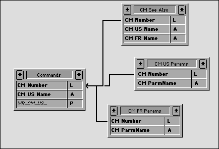

<!--REF #_command_.RECEIVE RECORD.Syntax-->**RECEIVE RECORD** {( *tabla* )}<!-- END REF-->
<!--REF #_command_.RECEIVE RECORD.Params-->
| Parámetro | Tipo |  | Descripción |
| --- | --- | --- | --- |
| tabla | Table | &#8594;  | Tabla en la cual recibir el registro o Tabla por defecto, si se omite |

<!-- END REF-->

#### Descripción 

<!--REF #_command_.RECEIVE RECORD.Summary-->RECEIVE RECORD recibe un registro en *tabla* del puerto serial o de un documento abierto por el comando [SET CHANNEL](set-channel.md "SET CHANNEL").<!-- END REF--> El registro debe haber sido envíado con [SEND RECORD](send-record.md "SEND RECORD"). Cuando ejecuta RECEIVE RECORD, se crea automáticamente un nuevo registro en *tabla*. Si el registro se recibe correctamente, entonces debe utilizar [SAVE RECORD](save-record.md "SAVE RECORD") para guardar el nuevo registro.

Se recibe el registro completo. Esto significa que también se reciben todos los subregistros, imágenes y BLOBs almacenados en el registro.

**Importante:** cuando los registros se envía y reciben utilizando [SEND RECORD](send-record.md "SEND RECORD") y RECEIVE RECORD, la estructura de la tabla fuente y la estructura de la tabla de destino deben ser compatibles. Si no lo son, 4D convertirá los valores de acuerdo a las definiciones de las tablas cuando se ejecute RECEIVE RECORD.

**Notas:**

1. Si recibe un registro de un documento utilizando este comando, el documento debe haber sido abierto utilizando el comando [SET CHANNEL](set-channel.md "SET CHANNEL"). No puede utilizar RECEIVE RECORD con un documento abierto con [Open document](open-document.md "Open document"), [Append document](append-document.md "Append document") o [Create document](create-document.md "Create document").
2. Durante la ejecución de RECEIVE RECORD, el usuario puede interrumpir la recepción presionando Ctrl-Alt-Mayús (Windows) o Comando-Opción-Mayús (Macintosh). Esta interrupción genera un error -9994 que puede interceptar con el método instalado por el comando [ON ERR CALL](on-err-call.md "ON ERR CALL"). Generalmente, sólo debe manejar la interrupción de una recepción durante una comunicación sobre puerto serial.

#### Ejemplo 

El uso combinado de [SEND VARIABLE](send-variable.md "SEND VARIABLE"), [SEND RECORD](send-record.md "SEND RECORD"), [RECEIVE VARIABLE](receive-variable.md "RECEIVE VARIABLE") y RECEIVE RECORD es ideal para archivar datos o intercambiar datos entre bases monopuesto idénticas utilizada en diferentes lugares. Puede intercambiar datos entre bases 4D utilizando los comandos de importación/exportación como [EXPORT TEXT](export-text.md "EXPORT TEXT") y [IMPORT TEXT](import-text.md "IMPORT TEXT"). Sin embargo, si sus datos contienen imágenes o tablas relacionadas, utilizar [SEND RECORD](send-record.md "SEND RECORD") y RECEIVE RECORD es mucho más conveniente.

Por ejemplo, la documentación que está leyendo ha sido creada utilizando 4D y 4D Write. Como varios escritores en diferentes lugares del mundo estaban trabajando en este proyecto, necesitábamos una forma simple de intercambiar datos entre las diferentes bases de datos. Esta es una vista simplificada de la estructura de la base:



La tabla *\[Commands\]* contiene la descripción de cada comando o sección. Las tablas *\[CM US Params\]* y *\[CM FR Params\]* contienen respectivamente los parámetros de cada comandos en Inglés y Francés. La tabla *\[CM See also\]* contiene los comandos indicados como referencias para cada comando o sección. El intercambio de la documentación entre las bases consiste en enviar los registros de *\[Commands\]* así como sus registros relacionados. Para hacerlo, utilizamos [SEND RECORD](send-record.md "SEND RECORD") y RECEIVE RECORD. Adicionalmente, utilizamos [SEND VARIABLE](send-variable.md "SEND VARIABLE") y [RECEIVE VARIABLE](receive-variable.md "RECEIVE VARIABLE") para marcar los documentos de importación/exportación con etiquetas.

Este es el método de proyecto (simplificado) para exportar la documentación:

```4d
  // Método de proyecto CM_EXPORT_SEL
  // Este método funciona con la selección actual de la tabla [Commands]
 
 SET CHANNEL(12;"") // Permitimos al usuario crear y abrir un documento channel
 If(OK=1)
  // Marcamos el documento con un variable que indique su contenido
  // Nota: la variable de proceso BUILD_LANG indica si los datos US (Inglés) o FR (Francés) son enviados
    $vsTag:="4DV6COMMAND"+BUILD_LANG
    SEND VARIABLE($vsTag)
  // Enviar una variable indicando cuántos [Commands] son enviados
    $vlNbCmd:=Records in selection([Commands])
    SEND VARIABLE($vlNbCmd)
    FIRST RECORD([Commands])
  // Para cada comando
    For($vlCmd;1;$vlNbCmd)
  // Enviar el registro [Commands]
       SEND RECORD([Comands])
  // Selección de todos los registros seleccionados
       RELATE MANY([Commands])
  // Dependiendo del lenguaje, enviar una variable indicando
  // el número de parámetros que sigue
       Case of
          :(BUILD_LANG="US")
             $vlNbParm:=Records in selection([CM US Params])
          :(BUILD_LANG="FR")
             $vlNbParm:=Records in selection([CM FR Params])
       End case
       SEND VARIABLE($vlNbParm)
  // Enviar los registros de los parámetros (si hay)
       For($vlParm;1;$vlNbParm)
          Case of
             :(BUILD_LANG="US")
                SEND RECORD([CM US Params])
                NEXT RECORD([CM US Params])
             :(BUILD_LANG="FR")
                SEND RECORD([CM FR Params])
                NEXT RECORD([CM FR Params])
          End case
       End for
  // Enviar una variable indicando cuántos “See Also” siguen
       $vlNbSee:=Records in selection([CM See Also])
       SEND VARIABLE($vlNbSee)
  // Enviar los registros [See Also] (si hay)
       For($vlSee;1;$vlNbSee)
          SEND RECORD([CM See Also])
          NEXT RECORD([CM See Also])
       End for
  // Ir al siguiente registro [Commands] y continuar la exportación
       NEXT RECORD([Commands])
    End for
    SET CHANNEL(11) // Cerrar el documento
 End if
```

Este es el método de proyecto (simplificado) de importación de la documentación:

```4d
  // Método de proyecto CM_IMPORT_SEL
 
 SET CHANNEL(10;"") // Permitimos al usuario abrir un documento existente
 If(OK=1) // Si un documento estaba abierto
    RECEIVE VARIABLE($vsTag) // Tratamos de recibir la variable marcada esperada
    If($vsTag="4DV6COMMAND@") // ¿Recibimos la etiqueta correcta?
       $CurLang:=Substring($vsTag;Length($vsTag)-1) // Extraemos el lenguaje de la etiqueta
       If(($CurLang="US")&NBSP;|&NBSP;($CurLang="FR")) // ¿Recibimos un lenguaje válido
          RECEIVE VARIABLE($vlNbCmd) // ¿Cuántos comandos hay en este documento?
          If($vlNbCmd>0) // Si hay al menos uno
             For($vlCmd;1;$vlNbCmd) // Para cada registro [Commands] archivado
  // Recepción del registro
                RECEIVE RECORD([Commands])
  // Llamar una subrutina que guarde el nuevo registro o copie sus valores
  // en un registro existente
                CM_IMP_CMD($CurLang)
  // Recibir el número de parámetros (si hay)
                RECEIVE VARIABLE($vlNbParm)
                If($vlNbParm>=0)
  // Llamar una subrutina que llama RECEIVE RECORD luego guarda los nuevos registros
  // o los copia en registros existentes
                   CM_IMP_PARM($vlNbParm;$CurLang)
                End if
  // Recepción dle número de “See Also” (si hay)
                RECEIVE VARIABLE($vlNbSee)
                If($vlNbSee>0)
  // Llamar una subrutina que llame RECEIVE RECORD luego guarde los nuevos registros
  // o los copies en registros existentes
                   CM_IMP_SEEA($vlNbSee;$CurLang)
                End if
             End for
          Else
             ALERT("El número de comandos en este documento de exportación es inválido.")
          End if
       Else
          ALERT("El lenguaje de este documento de exportación es desconocido.")
       End if
    Else
       ALERT("Este documento NO es un documento de exportación de comandos.")
    End if
    SET CHANNEL(11) // Cerrar documento
 End if
```

Note que no probamos la variable OK mientras recibimos los datos ni tratamos de interceptar los eventuales errores. Sin embargo, como almacenamos variables en el documento que describe el documento en sí mismo, si estas variables, una vez recibidas, tienen sentido, la probabilidad de error es muy baja. Si por ejemplo un usuario abre mal un documento, la primera prueba detiene la operación de inmediato.

#### Variables y conjuntos del sistema 

La variable sistema OK toma el valor 1 si se recibe el registro. De lo contrario, toma el valor 0.

#### Ver también 

[RECEIVE VARIABLE](receive-variable.md)  
[SEND RECORD](send-record.md)  
[SEND VARIABLE](send-variable.md)  

#### Propiedades

|  |  |
| --- | --- |
| Número de comando | 79 |
| Hilo seguro | &check; |
| Modifica variables | OK, error |


