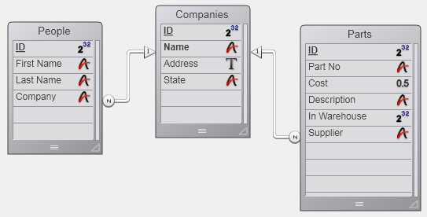

<!--REF #_command_.RELATE MANY.Syntax-->**RELATE MANY** ( tabla1 | campo1 )<!-- END REF-->
<!--REF #_command_.RELATE MANY.Params-->
| Parámetro | Tipo |  | Descripción |
| --- | --- | --- | --- |
| tabla1 &#124; campo1 | Tabla, Campo | &#8594;  | Tabla para la cual establecer todas las relaciones de Uno a Muchos o campo Uno |

<!-- END REF-->

#### Descripción 

<!--REF #_command_.RELATE MANY.Summary-->RELATE MANY tiene dos sintaxis.<!-- END REF--> 

La primera sintaxis, RELATE MANY(tabla1), establece todas las relaciones Uno a Muchos para *tabla1*. Cambia la selección actual para cada tabla que tiene una relación Uno a Muchos con *tabla1*. Las selecciones actuales en las tablas Muchos dependen del valor actual de cada campo relacionado en la tabla Uno. Cada vez que este comando se ejecuta, las selecciones actuales de las tablas Muchos son modificadas.

La segunda sintaxis, RELATE MANY(campo1), establece la relación Uno a Muchos para *campo1*. Modifica la selección actual para cada tabla que tenga una relación con *campo1*. Esto significa que los registros relacionados se vuelven la selección actual de la tabla Muchos.

**Nota:** si la selección actual de la tabla Uno está vacía en el momento de la ejecución de RELATE MANY, el comando no hace nada.

### 

**Nota:** este comando no soporta campos de tipo Objeto.

#### Ejemplo 

En el siguiente ejemplo, tres tablas están relacionadas con relaciones automáticas. Las dos tablas \[Personas\] y \[Partes\] tienen una relación Muchos a Uno con la tabla \[Empresas\].



Este es el formulario para la tabla \[Empresas\] que mostrará los registros relacionados de las tablas \[Personas\] y \[Partes\].


Cuando se muestran los formularios para Personas y Partes, los registros relacionados para las tablas \[Personas\] y \[Partes\] se cargan y se vuelven las selecciones actuales de estas tablas. 

Por otra parte, los registros relacionados no se cargan si un registro de la tabla \[Empresas\] es seleccionado por programación. En este caso, debe utilizar el comando RELATE MANY.

**Notas:**  
• Cuando el comando RELATE MANY se aplica a una selección vacía, el comando no se ejecuta y la selección para la tabla Muchos no cambia.  
• Para que el comando funcione, los campos llave foránea (campos Muchos) deben estar indexados. 

Por ejemplo, el siguiente método efectúa un bucle por cada registro de la tabla \[Empresas\]. Para cada empresa, aparece una caja de alerta. La caja de alerta muestra el número de personas en la empresa (el número de registros relacionados en la tabla \[Personas\]), y el número de partes que suministran (el número de registros en la tabla \[Partes\] que están relacionados). En el ejemplo, el argumento para el comando [ALERT](alert.md) se imprime en varias líneas por claridad. 

Note que es necesario el comando RELATE MANY, aunque las relaciones sean automáticas.

```4d
 ALL RECORDS([Empresas]) // Seleccionar todos los registros en la tabla
 ORDER BY([Empresas];[Empresas]Nombre) // Ordenar los registros en orden alfabético
 For($i;1;Records in table([Empresas])) // Bucle una vez por cada registro
    RELATE MANY([Empresas]Nombre) // Seleccionar los registros relacionados
    ALERT("Company: "+[Empresas]Nombre+Char(13)+"Personas en la empresa: "
    +String(Records in selection([Personas]))+Char(13)+
    "Número de partes que suministran: "+String(Records in selection([Partes])))
    NEXT RECORD([Empresas]) // Ir al siguiente registro
 End for
```

#### Ver también 

[OLD RELATED MANY](old-related-many.md)  
[RELATE ONE](relate-one.md)  

#### Propiedades

|  |  |
| --- | --- |
| Número de comando | 262 |
| Hilo seguro | &check; |
| Modifica la selección actual ||


