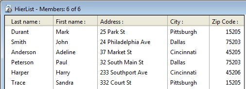

<!--REF #_command_.Selection to JSON.Syntax-->**Selection to JSON** ( *laTabla* {; *elCampo*}{; *elCampo2* ; ... ; *elCampoN*}{; *template*})  : Text<!-- END REF-->
<!--REF #_command_.Selection to JSON.Params-->
| Parámetro | Tipo |  | Descripción |
| --- | --- | --- | --- |
| laTable | Table | &#8594;  | Tabla a serializar |
| elField | Field | &#8594;  | Campo(s) cuyo(s) contenidos deben ser serializados |
| template | Object | &#8594;  | Objeto para la selección de etiquetas y de campos |
| Resultado | Text | &#8592; | Cadena que contiene el array JSON serializado |

<!-- END REF-->

#### Descripción 

<!--REF #_command_.Selection to JSON.Summary-->El comando **Selection to JSON** devuelve una cadena que contiene un array JSON con tantos elementos como registros hay en la selección actual de *laTabla*.<!-- END REF--> Cada elemento del array es un objeto JSON que contiene las etiquetas y los valores de los campos de la selección.

Si sólo pasa el parámetro *laTabla*, el comando incluye en el array JSON, los valores de todos los campos de la tabla que se pueden expresar en JSON. Los campos tipo BLOB e imagen se ignoran.  
  
Si no desea incluir todos los campos de *laTabla*, puede utilizar el parámetro *elCampo* o el parámetro *plantilla*:

* *unCampo*: pase uno o más campos en este parámetro. Sólo los valores de los campos definidos se incluyen en el array JSON.
* *plantilla*: pase un objeto 4D que contenga uno o más pares *nombre/valor* donde el *nombre* puede ser todo nombre de atributo valido y el valor contiene un puntero a un campo a incluir. Esta sintaxis le permite personalizar las etiquetas de campos en el array JSON.

Este comando soporta campos de tipo Objeto: los datos de estos campos se convierte automáticamente en formato JSON (los valores de atributo imagense convierten como cadenas "(objeto Imagen)". Tenga en cuenta que la siguiente instrucción 4D será interpretado como "producir JSON a partir de todos los valores de *campoObjeto* en la selección actual de la tabla":  

```4d
 Selection to JSON([aTable];objectField)
```

**Nota:** después de un llamado a **Selection to JSON**, la selección actual no se modifica, pero el registro actual no se carga y podría haber cambiado (el último registro de la selección actual es entonces el registro actual). Después del comando **Selection to JSON**, utilice los comandos [LOAD RECORD](load-record.md) en combinación con [GOTO SELECTED RECORD](goto-selected-record.md) (si es necesario) utilice los valores de los campos en el registro actual.

#### Ejemplo 1 

Quiere crear una cadena JSON que represente esta selección:



1) Desea incluir los valores de todos los campos de la tabla \[Members\]:   

```4d
 $jsonString :=Selection to JSON([Members])
  // $jsonString =[{"LastName":"Durant","FirstName":"Mark","Address":
  //"25 Park St","Zip code":"15205","City":"Pittsburgh"},{"LastName":
  //"Smith","FirstName":"John","Address":"24 Philadelphia Ave","Zip code":
  //"75203","City":"Dallas"},{"LastName":"Anderson","FirstName"
  //:"Adeline","Address":"37 Market St","Zip code":"45205","City":"Cincinnati"},...]
```

2) Desea reducir la selección y sólo incluir dos campos en la cadena JSON utilizando la sintaxis basada en los campos:  

```4d
 QUERY([Members];[Members]LastName="A@")
 $jsonString :=Selection to JSON([Members];[Members]LastName;[Members]City)
  // $jsonString = [{"LastName":"Anderson","City":"Cincinnati"},{"LastName":"Albert","City":"Houston"}]
```

3) Sólo desea incluir un campo en la cadena JSON y utilizar una etiqueta diferente.  
Puede utilizar la sintaxis *template*:  

```4d
 var $template : Object
 OB SET($template;"Member";->[Members]LastName) //etiqueta personalizada y un campo sencillo
 ALL RECORDS([Members])
 $jsonString :=Selection to JSON([Members];$template)
  // $jsonString = [{"Member":"Durant"},{"Member":"Smith"},{"Member":"Anderson"},
  // {"Member":"Albert"},{"Member":"Leonard"},{"Member":"Pradel"}]
```

#### Ejemplo 2 

Puede utilizar la sintaxis *template* para exportar campos de tablas diferentes:

```4d
 var $template : Object
 var $jsonString : Text
 OB SET($template;"Last name";->[Emp]LastName)
 OB SET($template;"First name";->[Emp]FirstName)
 OB SET($template;"Company";->[Company]LastName) //etiqueta personalizada de lo contrario conflicto con el campo [Emp]LastName
 ALL RECORDS([Emp])
 SET FIELD RELATION([Emp]UUID_Company;Automatic;Do not modify)
 $jsonString:=Selection to JSON([Emp];$template)
 SET FIELD RELATION([Emp]UUID_Company;Structure configuration;Do not modify)
```

#### Ver también 

[JSON TO SELECTION](json-to-selection.md)  

#### Propiedades

|  |  |
| --- | --- |
| Número de comando | 1234 |
| Hilo seguro | &check; |


