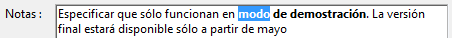
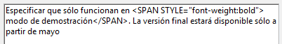
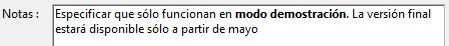
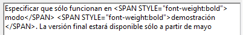

<!--REF #_command_.ST SET TEXT.Syntax-->**ST SET TEXT** ( {* ;} *objeto* ; *nuevTexto* {; *inicioSel* {; *finSel*}} )<!-- END REF-->
<!--REF #_command_.ST SET TEXT.Params-->
| Parámetro | Tipo |  | Descripción |
| --- | --- | --- | --- |
| * | Operador | &#8594;  | Si se especifica, objeto es un nombre de objeto (cadena) Si se omite, objeto es una variable o un campo |
| objeto | any | &#8594;  | Nombre del objeto (si se especifica *) o Variable o campo Texto (si se omite *) |
| nuevText | Text | &#8594;  | Texto a insertar |
| inicioSel | Integer | &#8594;  | Inicio de la selección |
| finSel | Integer | &#8594;  | Fin de la selección |

<!-- END REF-->

#### Descripción 

<!--REF #_command_.ST SET TEXT.Summary-->El comando ST SET TEXT inserta el texto pasado en el parámetro *nuevText* en el campo o variable de texto con estilo designado por el parámetro *objeto*.<!-- END REF--> Este comando sólo se aplica al texto sin formato del parámetro de *objeto*, sin modificar las etiquetas de estilo que contiene. Se puede utilizar para modificar por programación, texto con estilo en la pantalla. 

##### 

Si pasa el parámetro opcional *\**, indica que el parámetro *objeto* es un nombre de objeto (una cadena). Durante la ejecución, si el objeto tiene el foco, el comando sólo se aplica al objeto que se está editando y no a su fuente de datos (campo o variable). Los cambios sólo se transfieren a la fuente (y a cualquier otro objeto con esta misma fuente) cuando el objeto que se está editando se valida, ya sea por perder el foco o con la tecla **Intro**. Si el objeto no tiene el foco, el comando se aplica directamente a la fuente de datos y los cambios son inmediatamente trasladados a otros objetos con la misma fuente.  
Si se omite el parámetro *\**, indica que el parámetro *objeto* es un campo o una variable y se pasa una referencia de campo o variable en lugar de una cadena. El comando se aplica directamente al campo o a la variable y los cambios son transferidos inmediatamente a todos los objetos que utilizan esta fuente, incluyendo el objeto con el foco.

##### 

En *nuevText*, pase el texto a insertar. El comando ST SET TEXT está diseñado para trabajar con texto enriquecido (multiestilo) con etiquetas de tipo <span>. En todos los demás casos (particularmente, cuando trabaja con texto plano que contiene los caracteres <, > o &), debe utilizar el comando [ST SET PLAIN TEXT](st-set-plain-text.md). Si pasa texto plano con los caracteres <, > o & al comando ST SET TEXT, el comando no hace nada. Este principio de funcionamiento es necesario porque si inserta directamente una cadena como "a<b" dentro de un texto enriquecido, no distorsionará el análisis interno de las etiquetas <span>. En este caso, el carácter "<" debe ser previamente codificado como "&lt;", lo cual se puede hacer utilizando el comando [ST SET PLAIN TEXT](st-set-plain-text.md) (ver también el ejemplo de este comando).

Los parámetros opcionales *inicioSel* y *finSel* permiten designar una selección de texto en el objeto. Los valores *inicioSel* y *finSel* ofrecen una selección de texto sin formato, sin tener en cuenta ningún tipo de etiquetas de estilo en el texto. La acción del comando varía según los parámetros opcionales *inicioSel* y *finSel*:

* Si omite *inicioSel* y *finSel*, ST SET TEXT reemplaza todo el texto de *objeto* por *nuevText*,
* Si pasa únicamente *inicioSel* o si los valores de *inicioSel* y *finSel* son iguales, ST SET TEXT inserta el texto *nuevText* en *objeto* a partir de *inicioSel*,
* Si pasa ambos *inicioSel* y *finSel*, ST SET TEXT remplaza el texto sin formato definido para estos límites con el texto *nuevText*.
* Puede pasar 0 en *finSel* para designar automáticamente el último carácter del texto (pase 1 en *inicioSel* para designar el primer caracter del texto).

4D ofrece constantes predefinidas de manera que pueda designar automáticamente los límites de selección en los parámetros *inicioSel* y *finSel*. Estas constantes se encuentran en el tema "*Texto multiestilo*":

| Constante          | Tipo         | Valor  | Comentario                                                                   |
| ------------------ | ------------ | ------ | ---------------------------------------------------------------------------- |
| ST End highlight   | Entero largo | \-1001 | Designa el último carácter de la selección actual de texto en el objeto (\*) |
| ST End text        | Entero largo | 0      | Designa el último carácter del texto contenido en el objeto                  |
| ST Start highlight | Entero largo | \-1000 | Designa el primer carácter de la selección actual de texto en el objeto (\*) |
| ST Start text      | Entero largo | 1      | Designa el primer carácter del texto contenido en el objeto                  |

(\*) Debe pasar un nombre de objeto en *objeto* para poder utilizar esta constante. Si pasa una referencia a un campo o variable, el comando se aplica a todo el texto del objeto.

**Nota:** si *inicioSel* es superior a *finSel*, el texto no se modifica y la variable OK toma el valor 0 (excepto cuando *finSel* vale 0, ver arriba). 

#### Variables y conjuntos del sistema 

Después de ejecutar este comando, la variable OK toma el valor 1 si no se presenta ningún error; de lo contrario, toma el valor 0\. Este es el caso particularmente cuando las etiquetas de estilo no se evalúan correctamente (etiquetas incorrectas o faltantes).   

En caso de error, no cambia la variable. Cuando ocurre un error en una variable cuando se está evaluando el texto, 4D transforma el texto en texto plano; como resultado, los caracteres <, > y & se convierten en entidades HTML.

#### Ejemplo 1 

Si quiere reemplazar el texto con estilo seleccionado por el usuario con el contenido de una variable.

Este es el texto seleccionado:



El contenido almacendo en el campo es el siguiente:



Después de la ejecución de este código:

```4d
 vtempo:="Demonstración"
 GET HIGHLIGHT([Productos]Notas;vInicio;vFin)
 ST SET TEXT([Products]Notes;vtemp;vStart;vEnd)
```

El campo y su contenido son los siguientes:

 

#### Ejemplo 2 

Consulte el ejemplo del comando [ST SET PLAIN TEXT](st-set-plain-text.md). 

#### Ver también 

[ST Get plain text](st-get-plain-text.md)  
[ST Get text](st-get-text.md)  
[ST SET PLAIN TEXT](st-set-plain-text.md)  

#### Propiedades

|  |  |
| --- | --- |
| Número de comando | 1115 |
| Hilo seguro | &cross; |
| Modifica variables | OK |


