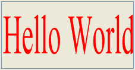

<!--REF #_command_.SVG EXPORT TO PICTURE.Syntax-->**SVG EXPORT TO PICTURE** ( *elementRef* ; *varImag* {; *tipoExport*} )<!-- END REF-->
<!--REF #_command_.SVG EXPORT TO PICTURE.Params-->
| Parámetro | Tipo |  | Descripción |
| --- | --- | --- | --- |
| elementRef | Text | &#8594;  | Referencia del elemento XML raíz |
| varImag | Picture | &#8594;  | Variable imagen a recibir del árbol XML (imagen SVG) |
| tipoExport | Integer | &#8594;  | 0 = No guardar la fuente de datos, 1 = Copiar la fuente de datos, 2 (por defecto) = Fuente de datos propia |

<!-- END REF-->

#### Descripción 

<!--REF #_command_.SVG EXPORT TO PICTURE.Summary-->El comando **SVG EXPORT TO PICTURE** permite guardar en la variable o campo imagen indicado por el parámetro *VarImag* una imagen en formato SVG contenida en un árbol XML.<!-- END REF-->para mayor información sobre el formato SVG, consulte la sección *Presentación de los comandos XML utilitarios* .

Pase en *refElement* la referencia del elemento XML raíz que contiene la imagen SVG.

Pase en *varImag* el nombre de la variable imagen o del campo imagen 4D que contendrá la imagen SVG. La imagen se exporta en su formato nativo (descripción XML) y es redibujada vía el motor de renderización SVG en el momento de la visualización.

El parámetro opcional *tipoExport* permite definir la manera cómo la fuente de datos XML debe ser manejada por el comando. Puede pasar una de las siguientes constantes, que se encuentran en el tema “*XML*”, en este parámetro:

| Constante            | Tipo         | Valor | Comentario                                                                                                                                                                                                                                                                    |
| -------------------- | ------------ | ----- | ----------------------------------------------------------------------------------------------------------------------------------------------------------------------------------------------------------------------------------------------------------------------------- |
| Copy XML data source | Entero largo | 1     | 4D conserva una copia del árbol DOM con la imagen, lo cual significa que la imagen puede guardarse en un campo imagen de la base y luego mostrarse o exportarse en cualquier momento. Este es el modo predeterminado para exportar cuando se omite el parámetro *exportType*. |
| Get XML data source  | Entero largo | 0     | 4D sólo lee la fuente de datos XML; no se conserva con la imagen. Esto acelera notablemente la ejecución del comando; sin embargo, como el árbol DOM no se conserva, no es posible guardar o exportar la imagen.                                                              |
| Own XML data source  | Entero largo | 2     | 4D exporta el árbol DOM con la imagen. La imagen puede almacenarse o exportarse y la ejecución del comando es rápida. Sin embargo, la referencia XML *elementRef* ya no puede ser utilizada por otros comandos 4D.                                                            |

#### Ejemplo 

El siguiente ejemplo puede utilizarse para mostrar “Hello World” en una imagen 4D:

```4d
 var vpict : Picture
 $svg:=DOM Create XML Ref("svg";"http://www.w3.org/2000/svg")
 $ref:=DOM Create XML element($svg;"text";"font-size";26;"fill";"red")
 DOM SET XML ATTRIBUTE($ref;"y";"1em")
 DOM SET XML ELEMENT VALUE($ref;"Hello World")
 SVG EXPORT TO PICTURE($svg;vpict;Copy XML data source)
 DOM CLOSE XML($svg)
```



#### Ver también 

[DOM EXPORT TO FILE](dom-export-to-file.md)  
[DOM EXPORT TO VAR](dom-export-to-var.md)  

#### Propiedades

|  |  |
| --- | --- |
| Número de comando | 1017 |
| Hilo seguro | &check; |


