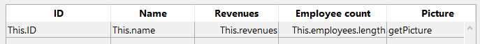

<!--REF #_command_.This.Syntax-->**This** : Object<!-- END REF-->

<!--REF #_command_.This.Params-->

| Parámetros | Tipo   |   | Descripción              |
| ---------- | ------ | - | ------------------------ |
| Resultado  | Object | ← | Elemento u objeto actual |

<!-- END REF-->

#### Descripción

The `This` command <!--REF #_command_.This.Summary-->returns a reference to the currently processed object.<!-- END REF-->

En la mayoría de los casos, el valor de `This` está determinado por cómo se llama una función. No se puede definir por asignación durante la ejecución, y puede ser diferente cada vez que se llame a la función.

This command can be used in different contexts, described below. Within these contexts, you will access object/collection element properties or entity attributes through **This.<*propertyPath*\>**. For example, *This.name* or *This.employer.lastName* are valid pathes to object, element or entity properties.

In any other context, the command returns **Null**.

#### Función de clase

Cuando se utiliza una [función constructora de clase](#class-constructor) (con la función [`new()`](API/ClassClass.md#new)), su `This` está vinculado al nuevo objeto que se está construyendo.

```4d
//Class: ob

Class Constructor  

 // Create properties on This as
 // desired by assigning to them

 This.a:=42
```

```4d
// en un método 4D  
$o:=cs.ob.new()
$val:=$o.a //42
```

> Al llamar a la superclase del constructor en un constructor utilizando la palabra clave [Super](#super), tenga en cuenta que `This` no debe ser llamado antes del constructor de la superclase, de lo contrario se genera un error. Ver [este ejemplo](super.md#example-1).

En todos los casos, `This` se refiere al objeto sobre el que se ha llamado el método, como si el método fuera una función del objeto.

```4d
//Clase: ob

Function f() : Integer
 return This.a+This.b
```

Entonces puede escribir en un método proyecto:

```4d
$o:=cs.ob.new()
$o.a:=5
$o.b:=3
$val:=$o.f() //8

```

En este ejemplo, el objeto asignado a la variable $o no tiene su propia propiedad *f*, la hereda de su clase. Como *f* es llamado como un método de $o, su `This` se refiere a $o.

#### Objeto fórmula

En el contexto de la ejecución de un objeto fórmula creado por los comandos [Formula](formula.md) o [Formula from string](formula-from-string.md), `This` devuelve una referencia al objeto actualmente procesado por la fórmula.

For example, you want to use a project method as a formula encapsulated in an object:

```4d
 var $person : Object := New object
 $person.firstName:="John"
 $person.lastName:="Smith"
 $person.greeting:=Formula(Greeting)
 $g:=$person.greeting("hello") // devuelve "hola John Smith"
 $g:=$person.greeting("hi") // devuelve "hi John Smith"
```

With the *Greeting* project method:

```4d
 #DECLARE($greeting : Text) : Text
 return $greeting+" "+This.firstName+" "+This.lastName
```

#### List box

En el contexto de un list box asociado a una colección o una selección de entidades, durante los eventos [`On Display Detail`](../Events/onDisplayDetail.md) o [`On Data Change`](../Events/onDataChange.md), `This` devuelve una referencia al elemento de colección o entidad a la que accede el list box para mostrar la línea actual.

:::note

If you use a collection of scalar values in a list box, 4D creates an object for each element with a single **value** property. Thus, the element value is returned by the **This.value** non-assignable expression.

:::

#### Ejemplo 1

A collection of objects, each with this structure:

```json
{  
"ID": 1234
"name": "Xavier",  
"revenues": 47300,  
"employees": [  
             "Allan",  
             "Bob", 
             "Charlie"  
            ] 
},{  
"ID": 2563
"name": "Carla",  
"revenues": 55000,  
"isFemale": true
"employees": [  
             "Igor",  
             "Jane"  
            ] 
},...
 
```

En el list box, cada columna se refiere a una de las propiedades del objeto, ya sea directamente (This.name), indirectamente (This.employees.length), o a través de una expresión (*getPicture*) en la que se puede usar directamente. The list box looks like:



The *GetPicture* project method is automatically executed during the **On display detail** event:

```4d
  //GetPicture Method
 #DECLARE -> $genderPict : Picture
 If(This.isFemale)
    $genderPict:=Form.genericFemaleImage
 Else
    $genderPict:=Form.genericMaleImage
 End if
```

Once the form is executed, you can see the result:


#### Ejemplo 2

You want to display entities from the following structure in a list box:


You build a list box of the "Collection or entity selection" type with the following definition:


Note que:

- *This.ID*, *This.Title* and *This.Date* directly refers to the corresponding attributes in the ds.Event dataclass.
- *This.meetings* es un atributo relacionado (basado en el nombre de una relación de Uno a Muchos) que devuelve una selección de entidad de la base de datos ds.Meeting.
- **Form.eventList** is the entity selection that is attached to the list box. The initialization code can be put in the on load form event:

```4d
 Case of  
    :(Form event code=On Load)  
       Form.eventList:=ds.Event.all() //devuelve una selección de entidad con todas las entidades  
 End case  
```

Once the form is executed, the list box is automatically filled with the entity selection:


#### Ver también

[Self](../commands-legacy/self.md)\
[Super](super.md)

#### Propiedades

|                |                                                                     |
| -------------- | ------------------------------------------------------------------- |
| Command number | 1470                                                                |
| Thread safe    | &amp;amp;amp;amp;amp;amp;amp;amp;amp;amp;check; |
