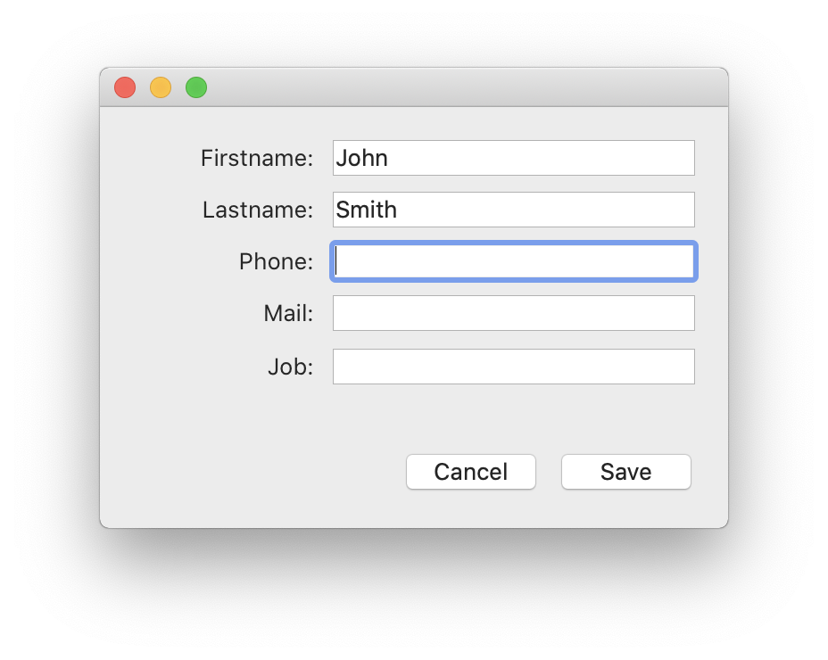
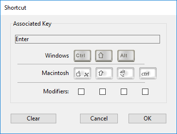

La página Interfaz sirve para establecer varias opciones relacionadas con la interfaz del proyecto.

## General

Esta área le permite configurar varias opciones relativas a la visualización.

### Fuente a utilizar con el comando MESSAGE

Haga clic en **Seleccionar...** para definir la fuente y el tamaño de los caracteres utilizados por el comando `MESSAGE`.

La fuente y el tamaño de la fuente por defecto dependen de la plataforma de ejecución de 4D.

> Esta propiedad también afecta las siguientes partes de 4D: <li>ciertas áreas de vista previa del Explorador</li><li>la regla del editor de formularios</li>

### Mostrar ventanas

Otras opciones permiten configurar la visualización de varias ventanas del modo Aplicación.

- **Pantalla de inicio**: cuando esta opción no está seleccionada, la [pantalla de inicio de la barra de menú actual](Menus/bars.md#splash-screen) no aparece en modo Aplicación. Cuando oculte esta ventana, le corresponderá gestionar la visualización de todas sus ventanas por programación, por ejemplo en el método base `On Startup`.

- **Escritura de caché**: cuando esta opción está marcada, 4D muestra una ventana en la parte inferior izquierda de la pantalla mientras se vacían los datos de la caché. Dado que esta operación bloquea momentáneamente las acciones del usuario, la visualización de esta ventana le permite saber que la descarga está en curso.

:::note

Puede definir la [frecuencia de escritura de la caché](database.md#memory-page) en **Propiedades** > **Base de datos** > **Memoria**.

:::

- **Progreso de la impresión**: permite, durante la impresión, activar o desactivar la visualización de la caja de diálogo de progreso de la impresión.

- **Usar modo SDI en Windows**: cuando esta opción está marcada, 4D habilita automáticamente el [modo SDI (Single-Document Interface)](../Menus/sdi.md) en su aplicación cuando se ejecuta en un [contexto soportado](../Menus/sdi.md#sdi-mode-availability). Al seleccionar esta opción, en Windows el menú **Ejecutar** de la barra de menú de 4D le permite seleccionar el modo en el que desea probar la aplicación:

  

:::note

Esta opción puede seleccionarse en macOS, pero se ignorará cuando la aplicación se ejecute en esta plataforma.

:::

### Apariencia

Este menú permite seleccionar la paleta de colores que se utilizará en la aplicación principal. Una paleta de colores define un conjunto global de colores de interfaz para los textos, los fondos, las ventanas, etc., utilizados en sus formularios.

> Esta opción sólo funciona en macOS. En Windows, se utiliza siempre el esquema "Light".

Los siguientes esquemas están disponibles:

- **Claro**: la aplicación usará el Tema Claro Predeterminado
  
- **Oscuro**: la aplicación usará el Tema Oscuro Predeterminado
  
- **Heredado** (por defecto): la aplicación heredará el nivel de prioridad superior (es decir, las preferencias del usuario del sistema operativo)

> Los temas por defecto pueden ser manejados utilizando CSS. Para más información, consulte la sección [Media Queries](../FormEditor/createStylesheet.md#media-queries).

El esquema de aplicación principal se aplicará a los formularios por defecto. Sin embargo, se puede remplazar:

- por el comando [SET APPLICATION COLOR SCHEME](https://doc.4d.com/4dv19R/help/command/en/page1762.html) a nivel de la sesión de trabajo;
- utilizando la propiedad de formulario [Color Scheme](../FormEditor/propertiesForm.html#color-scheme) en cada nivel de formulario (nivel de prioridad más alto). **Nota:** cuando se imprimen, los formularios utilizan siempre la paleta "Light".

## Atajos

El área de Atajos directos sirve para ver y modificar los atajos por defecto para tres operaciones básicas del formulario 4D en sus aplicaciones de escritorio. Estos atajos son idénticos para ambas plataformas. Los iconos de las teclas indican las teclas correspondientes a Windows y a macOS.

Los accesos directos por defecto son los siguientes:

- Aceptación de formulario de entrada: **Entrada**
- Anulación de entrada: **Esc**
- Añadir al subformulario: **Ctrl+Mayús+/** (Windows) o **Comando+Mayús+/** (macOS)

Para cambiar el acceso directo de una operación, haga clic en el botón **Editar** correspondiente. Aparece la siguiente caja de diálogo:

Para cambiar el acceso directo, escriba la nueva combinación de teclas en su teclado y haga clic en **OK**. Si prefiere no tener un acceso directo para una operación, haga clic en **Borrar**.
