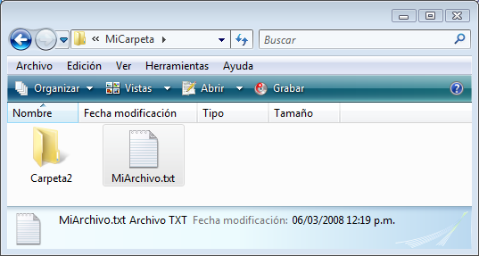
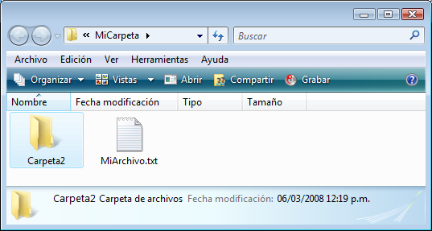
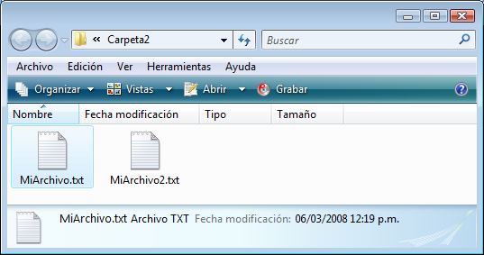

<!--REF #_command_.SHOW ON DISK.Syntax-->**SHOW ON DISK** ( *nombreRuta* {; *} )<!-- END REF-->
<!--REF #_command_.SHOW ON DISK.Params-->
| Parámetro | Tipo |  | Descripción |
| --- | --- | --- | --- |
| nombreRuta | Text | &#8594;  | Ruta de acceso del elemento a mostrar |
| * | Operador | &#8594;  | Si el elemento es una carpeta, mostrar su contenido |

<!-- END REF-->

#### Descripción 

<!--REF #_command_.SHOW ON DISK.Summary-->El comando SHOW ON DISK muestra en una ventana estándar del sistema operativo el archivo o la carpeta en la cual la ruta de acceso se pasa en el parámetro *nombreRuta.<!-- END REF-->*  
  
En una interfaz de usuario, este comando permite designar la ubicación de un archivo o carpeta especifico.

Por defecto, si *nombreRuta* designa una carpeta, el comando muestra el nivel de la carpeta misma. Si pasa el parámetro opcional *\**, el comando abre la carpeta y muestra su contenido en la ventana. Si *nombreRuta* designa un archivo, se ignora el parámetro *\**. 

#### Ejemplo 

Los siguientes ejemplos ilustran el funcionamiento del comando:

```4d
 SHOW ON DISK("c:\\MiCarpeta\\MiArchivo.txt") // Muestra el archivo designado
```



```4d
 SHOW ON DISK("c:\\MiCarpeta\\Carpeta2") // Muestra la carpeta designada
```



```4d
 SHOW ON DISK("c:\\MiCarpeta\\Carpeta2";*) // Muestra los contenidos de la carpeta designada
```



#### Variables y conjuntos del sistema 

La variable sistema OK toma el valor 1 si el comando se ejecuta correctamente, de lo contrario toma el valor 0\. 


#### Propiedades

|  |  |
| --- | --- |
| Número de comando | 922 |
| Hilo seguro | &check; |
| Modifica variables | OK, error |


