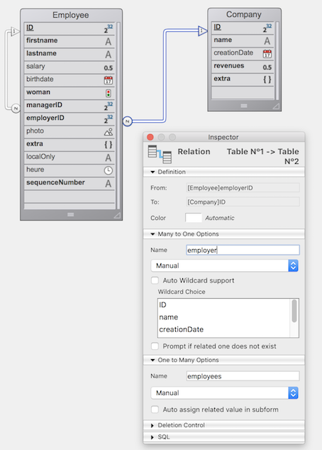

Una [DataClass](ORDA/dsMapping.md#dataclass) ofrece una interfaz de objeto a una tabla de la base de datos. Todas las clases de datos de una aplicación 4D están disponibles como una propiedad del `ds` [datastore](ORDA/dsMapping.md#datastore).

### Resumen

|                                                                                                                                                                                                          |
| -------------------------------------------------------------------------------------------------------------------------------------------------------------------------------------------------------- |
| [<!-- INCLUDE DataClassClass.attributeName.Syntax -->](#attributename)&nbsp;&nbsp;&nbsp;&nbsp;<!-- INCLUDE DataClassClass.attributeName.Summary --> |
| [<!-- INCLUDE #DataClassClass.all().Syntax -->](#all)&nbsp;&nbsp;&nbsp;&nbsp;<!-- INCLUDE #DataClassClass.all().Summary -->|
| [<!-- INCLUDE #DataClassClass.clearRemoteCache().Syntax -->](#clearremotecache)&nbsp;&nbsp;&nbsp;&nbsp;<!-- INCLUDE #DataClassClass.clearRemoteCache().Summary -->|
| [<!-- INCLUDE #DataClassClass.fromCollection().Syntax -->](#fromcollection)&nbsp;&nbsp;&nbsp;&nbsp;<!-- INCLUDE #DataClassClass.fromCollection().Summary --> |
| [<!-- INCLUDE #DataClassClass.get().Syntax -->](#get)&nbsp;&nbsp;&nbsp;&nbsp;<!-- INCLUDE #DataClassClass.get().Summary --> |
| [<!-- INCLUDE #DataClassClass.getCount().Syntax -->](#getcount)&nbsp;&nbsp;&nbsp;&nbsp;<!-- INCLUDE #DataClassClass.getCount().Summary --> |
| [<!-- INCLUDE #DataClassClass.getDataStore().Syntax -->](#getdatastore)&nbsp;&nbsp;&nbsp;&nbsp;<!-- INCLUDE #DataClassClass.getDataStore().Summary --> |
| [<!-- INCLUDE #DataClassClass.getInfo().Syntax -->](#getinfo)&nbsp;&nbsp;&nbsp;&nbsp;<!-- INCLUDE #DataClassClass.getInfo().Summary --> |
| [<!-- INCLUDE #DataClassClass.getRemoteCache().Syntax -->](#getremotecache)&nbsp;&nbsp;&nbsp;&nbsp;<!-- INCLUDE #DataClassClass.getRemoteCache().Summary --> |
| [<!-- INCLUDE #DataClassClass.new().Syntax -->](#new)&nbsp;&nbsp;&nbsp;&nbsp;<!-- INCLUDE #DataClassClass.new().Summary --> |
| [<!-- INCLUDE #DataClassClass.newSelection().Syntax -->](#newselection)&nbsp;&nbsp;&nbsp;&nbsp;<!-- INCLUDE #DataClassClass.newSelection().Summary --> |
| [<!-- INCLUDE #DataClassClass.query().Syntax -->](#query)&nbsp;&nbsp;&nbsp;&nbsp;<!-- INCLUDE #DataClassClass.query().Summary --> |
| [<!-- INCLUDE #DataClassClass.setRemoteCacheSettings().Syntax -->](#setremotecachesettings)&nbsp;&nbsp;&nbsp;&nbsp;<!-- INCLUDE #DataClassClass.setRemoteCacheSettings().Summary --> |

<!-- REF DataClassClass.attributeName.Desc -->
## .*attributeName*

<details><summary>Histórico</summary>

| Lanzamiento | Modificaciones               |
| ----------- | ---------------------------- |
| 19 R3       | Añadido el atributo .exposed |
| 17          | Añadidos                     |

</details>

<!-- REF DataClassClass.attributeName.Syntax -->***.attributeName***: objeto<!-- END REF -->

#### Descripción

Los atributos de las clases de datos son <!-- REF DataClassClass.attributeName.Summary -->objetos que están disponibles directamente como propiedades<!-- END REF --> de estas clases.

Los objetos devueltos tienen propiedades que puede leer para obtener información sobre los atributos de su clase de datos.
> Los objetos del atributo Dataclass pueden ser modificados, pero la estructura subyacente de la base de datos no será alterada.


#### Objeto devuelto

Los objetos de atributo devueltos contienen las siguientes propiedades:

| Propiedad        | Tipo    | Descripción                                                                                                                                                                                                                                                                                                                                                                          |
| ---------------- | ------- | ------------------------------------------------------------------------------------------------------------------------------------------------------------------------------------------------------------------------------------------------------------------------------------------------------------------------------------------------------------------------------------ |
| autoFilled       | Boolean | True si el valor del atributo es rellenado automáticamente por 4D. Corresponde a las siguientes propiedades de campo 4D: "Autoincremento" para campos de tipo numérico y "Auto UUID" para campos UUID (alfa). No se devuelve si `.kind` = "relatedEntity" o "relatedEntities".                                                                                                       |
| exposed          | Boolean | True si el atributo está expuesto en REST                                                                                                                                                                                                                                                                                                                                            |
| fieldNumber      | integer | Número de campo 4D interno del atributo. No se devuelve si `.kind` = "relatedEntity" o "relatedEntities".                                                                                                                                                                                                                                                                            |
| fieldType        | Integer | Tipo de campo de base de datos 4D del atributo. Depende del atributo `kind`. Valores posibles: <li>si `.kind` = "storage": tipo de campo 4D correspondiente, ver [`Value type`](https://doc.4d.com/4dv20/help/command/en/page1509.html)</li><li>si `.kind` = "relatedEntity": 38 (`is object`)</li><li>si `.kind` = "relatedEntities": 42 (`is collection`)</li><li>si `.kind` = "calculated" o "alias" = igual que arriba, dependiendo del valor resultante (tipo de campo, relatedEntity o relatedEntities)</li>                                                                                                                                                                                   |
| indexed          | Boolean | True si hay un índice B-tree o Cluster B-tree en el atributo. No se devuelve si `.kind` = "relatedEntity" o "relatedEntities".                                                                                                                                                                                                                                                       |
| inverseName      | Text    | Nombre del atributo que se encuentra al otro lado de la relación. Se devuelve sólo cuando `.kind` = "relatedEntity" o "relatedEntities".                                                                                                                                                                                                                                             |
| keywordIndexed   | Boolean | True si existe un índice de palabras clave en el atributo. No se devuelve si `.kind` = "relatedEntity" o "relatedEntities".                                                                                                                                                                                                                                                          |
| kind             | Text    | Categoría del atributo. Valores posibles:<li>"storage": atributo de almacenamiento (o escalar), es decir, atributo que almacena un valor, no una referencia a otro atributo</li><li>"calculated": atributo calculado, es decir, definido a través de una [función `get`](../ORDA/ordaClasses.md#function-get-attributename)</li><li>"alias": atributo creado a partir de [otro atributo](../ORDA/ordaClasses.md#alias-attributes-1)</li><li>"relatedEntity": N -> 1 atributo de relación (referencia a una entidad)</li><li>"relatedEnties": 1 -> N atributo de relación (referencia a una selección de entidades)</li>                                                                                                                                                                                                               |
| mandatory        | Boolean | True si se rechaza la entrada de valores null para el atributo. No se devuelve si `.kind` = "relatedEntity" o "relatedEntities". Nota: esta propiedad corresponde a la propiedad de campo "Rechazar entrada de valor NULL" a nivel de base de datos 4D. No tiene relación con la propiedad "Obligatorio" existente, que es una opción de control de entrada de datos para una tabla. |
| name             | Text    | Nombre del atributo como cadena                                                                                                                                                                                                                                                                                                                                                      |
| path             | Text    | Ruta de [un atributo alias](../ORDA/ordaClasses.md#alias-attributes-1) basado en una relación                                                                                                                                                                                                                                                                                        |
| readOnly         | Boolean | True si el atributo es de sólo lectura. Por ejemplo, los atributos calculados sin función [`set`](../ORDA/ordaClasses.md#function-set-attributename) son solo lectura.                                                                                                                                                                                                               |
| relatedDataClass | Text    | Nombre del dataclass relacionado con el atributo. Se devuelve sólo cuando `.kind` = "relatedEntity" o "relatedEntities".                                                                                                                                                                                                                                                             |
| type             | Text    | Tipo de valor conceptual del atributo, útil para la programación genérica. Depende del atributo `kind`. Valores posibles: <li>si `.kind` = "storage": "blob", "bool", "date", "image", "number", "object", o "string". "number" se devuelve para todo tipo numérico, incluida la duración; "string" se devuelve para los tipos de atributo uuid, alpha y text; los atributos "blob" son [objetos blob](../Concepts/dt_blob.md#blob-type).</li><li>si `.kind` = "relatedEntity": nombre de la dataClass relacionada</li><li>si `.kind` = "relatedEntities": nombre de la dataClass relacionada + sufijo "Selection"</li><li>si `.kind` = "calculated" o "alias": igual que arriba, dependiendo del resultado</li>                                                                                                                                                    |
| unique           | Boolean | True si el valor del atributo debe ser único. No se devuelve si `.kind` = "relatedEntity" o "relatedEntities".                                                                                                                                                                                                                                                                       |

:::tip

Para programación genérica, utilice `Bool(attributeName.property)`, `Num(attributeName.property)` o `String(attributeName.property)` (dependiendo del tipo de propiedad) para obtener un valor válido aunque no se devuelva la propiedad.

:::

#### Ejemplo 1

```4d
$salary:=ds.Employee.salary //devuelve el atributo salary en la clase de datos Employee
$compCity:=ds.Company["city"] //devuelve el atributo city en la clase de datos Company
```

#### Ejemplo 2

Considerando la siguiente estructura de la base:



```4d
var $firstnameAtt;$employerAtt;$employeesAtt : Object

 $firstnameAtt:=ds.Employee.firstname
  //{name:firstname,kind:storage,fieldType:0,type:string,fieldNumber:2,indexed:true,
  //keyWordIndexed:false,autoFilled:false,mandatory:false,unique:false}

 $employerAtt:=ds.Employee.employer
  //{name:employer,kind:relatedEntity,relatedDataClass:Company,
  //fieldType:38,type:Company,inverseName:employees}
  //38=Is object

 $employeesAtt:=ds.Company.employees
  //{name:employees,kind:relatedEntities,relatedDataClass:Employee,
  //fieldType:42,type:EmployeeSelection,inverseName:employer}
  //42=Is collection
```

#### Ejemplo 3

Considerando las propiedades de tabla siguientes:


```4d
 var $sequenceNumberAtt : Object
 $sequenceNumberAtt=ds.Employee.sequenceNumber
  //{name:sequenceNumber,kind:storage,fieldType:0,type:string,fieldNumber:13,
  //indexed:true,keyWordIndexed:false,autoFilled:true,mandatory:false,unique:true}
```

<!-- END REF -->

<!-- REF DataClassClass.all().Desc -->
## .all()

<details><summary>Histórico</summary>

| Lanzamiento | Modificaciones                   |
| ----------- | -------------------------------- |
| 17 R5       | Soporte del parámetro *settings* |
| 17          | Añadidos                         |

</details>

<!-- REF #DataClassClass.all().Syntax -->**.all** ( { *settings* : Object } ) : 4D.EntitySelection<!-- END REF -->


<!-- REF #DataClassClass.all().Params -->
| Parámetros | Tipo               |    | Descripción                                                                                         |
| ---------- | ------------------ |:--:| --------------------------------------------------------------------------------------------------- |
| settings   | Object             | -> | Opciones de construcción: context                                                                   |
| Result     | 4D.EntitySelection | <- | Referencias sobre todas las entidades relacionadas con la clase de datos|<!-- END REF -->

|

#### Descripción

La función `.all()` <!-- REF #DataClassClass.all().Summary -->consulta el almacén de datos para encontrar todas las entidades relacionadas con la clase de datos y las devuelve como una selección de entidades<!-- END REF -->.

Las entidades se devuelven en el orden por defecto, que es inicialmente el orden en que fueron creadas. Tenga en cuenta, sin embargo, que si se han eliminado entidades y se han añadido otras nuevas, el orden por defecto ya no refleja el orden de creación.

Si no se encuentra la entidad correspondiente, se devuelve una selección de entidades vacía.

Se aplica carga diferida.

**settings**

En el parámetro opcional *settings* se puede pasar un objeto que contenga opciones adicionales. Se soporta la siguiente propiedad:

| Propiedad | Tipo | Descripción                                                                                                                                                                                                                                                                                                                                  |
| --------- | ---- | -------------------------------------------------------------------------------------------------------------------------------------------------------------------------------------------------------------------------------------------------------------------------------------------------------------------------------------------- |
| context   | Text | Etiqueta para el contexto de optimización aplicado a la selección de entidades. Este contexto será utilizado por el código que maneja la selección de entidades para que pueda beneficiarse de la optimización. Esta funcionalidad está [diseñada para el procesamiento cliente/servidor ORDA](ORDA/entities.md#client-server-optimization). |

> Para conocer el número total de entidades de una clase de datos, se recomienda utilizar la función [`getCount()`](#getcount) más optimizada que la expresión `ds.myClass.all().length`.

#### Ejemplo

```4d
 var $allEmp : cs.EmployeeSelection
 $allEmp:=ds.Employee.all()
```

<!-- REF #DataClassClass.clearRemoteCache().Desc -->
## .clearRemoteCache()

<details><summary>Histórico</summary>

| Lanzamiento | Modificaciones |
| ----------- | -------------- |
| 19 R5       | Añadidos       |

</details>

<!-- REF #DataClassClass.clearRemoteCache().Syntax -->**.clearRemoteCache()**<!-- END REF -->


<!-- REF #DataStoreClass.clearRemoteCache().Params -->
| Parámetros | Tipo |  | Descripción                                             |
| ---------- | ---- |::| ------------------------------------------------------- |
|            |      |  | No requiere ningún parámetro|<!-- END REF -->

|

#### Descripción

La función `.clearRemoteCache()` <!-- REF #DataClassClass.clearRemoteCache().Summary -->vacía la caché ORDA de una clase de datos<!-- END REF -->.

> Esta función no restablece los valores de `timeout` y `maxEntries`.

#### Ejemplo

```4d
var $ds : 4D.DataStoreImplementation
var $persons : cs.PersonsSelection
var $p : cs.PersonsEntity
var $cache : Object
var $info : Collection
var $text : Text

$ds:=Open datastore(New object("hostname"; "www.myserver.com"); "myDS")

$persons:=$ds.Persons.all()
$text:=""
For each ($p; $persons)
    $text:=$p.firstname+" lives in "+$p.address.city+" / "
End for each

$cache:=$ds.Persons.getRemoteCache()

$ds.Persons.clearRemoteCache()
// Caché de la dataclass Persons  = {timeout:30;maxEntries:30000;stamp:255;entries:[]}
```

<!-- END REF -->

<!-- REF DataClassClass.fromCollection().Desc -->
## .fromCollection()

<details><summary>Histórico</summary>

| Lanzamiento | Modificaciones                   |
| ----------- | -------------------------------- |
| 17 R5       | Soporte del parámetro *settings* |
| 17          | Añadidos                         |

</details>

<!-- REF #DataClassClass.fromCollection().Syntax -->**.fromCollection**( *objectCol* : Collection { ; *settings* : Object } ) : 4D.EntitySelection<!-- END REF -->


<!-- REF #DataClassClass.fromCollection().Params -->
| Parámetros | Tipo               |    | Descripción                                                                   |
| ---------- | ------------------ |:--:| ----------------------------------------------------------------------------- |
| objectCol  | Collection         | -> | Colección de objetos a mapear con entidades                                   |
| settings   | Object             | -> | Opciones de construcción: context                                             |
| Result     | 4D.EntitySelection | <- | Selección de entidades llenadas desde la colección|<!-- END REF -->

|

#### Descripción

La función `.fromCollection()` <!-- REF #DataClassClass.fromCollection().Summary -->actualiza o crea entidades en la clase de datos según la colección de objetos *objectCol* y devuelve la selección de entidades correspondiente<!-- END REF -->.

En el parámetro *objectCol*, pasa una colección de objetos para crear nuevas entidades o actualizar las existentes de la clase de datos. Los nombres de las propiedades deben ser los mismos que los de los atributos de la clase de datos. Si un nombre de propiedad no existe en la clase de datos, se ignora. Si un valor de atributo no está definido en la colección, su valor es null.

El mapeo entre los objetos de la colección y las entidades se realiza sobre los **nombres de atributos** y **tipos coincidentes**. Si la propiedad de un objeto tiene el mismo nombre que el atributo de una entidad pero sus tipos no coinciden, el atributo de la entidad no se llena.

**Crear o actualizar modos**

Para cada objeto de *objectCol*:

* Si el objeto contiene una propiedad booleana "\__NEW" establecida en false (o no contiene una propiedad booleana "\__NEW"), la entidad se actualiza o se crea con los valores correspondientes de las propiedades del objeto. No se realiza ninguna comprobación con respecto a la llave primaria:
  * Si la llave primaria se da y existe, la entidad se actualiza. En este caso, la llave primaria puede darse tal cual o con una propiedad "\_\_KEY" (llenada con el valor de la llave primaria).
  * If the primary key is given (as is) and does not exist, the entity is created
  * Si no se da la llave primaria, se crea la entidad y se asigna el valor de la llave primaria con respecto a las reglas estándar de la base de datos.
* Si el objeto contiene una propiedad booleana "\_\_NEW" establecida como **true**, la entidad se crea con los valores correspondientes de los atributos del objeto. Se realiza una verificación con respecto a la llave primaria:
  * Si se da la llave primaria (tal cual) y existe, se envía un error
  * If the primary key is given (as is) and does not exist, the entity is created
  * Si no se da la primaria, se crea la entidad y se asigna el valor de la llave primaria con respecto a las reglas estándar de la base de datos.
> The nested objects featuring related entities must contain a "\_\_KEY" property (filled with the primary key value of the related entity) or the primary key attribute of the related entity itself. The use of a \_\_KEY property allows independence from the primary key attribute name.

**Related entities**

Los objetos de *objectCol* pueden contener uno o más objetos anidados que presentan una o más entidades relacionadas, lo que puede ser útil para crear o actualizar enlaces entre entidades.

Los objetos anidados que presentan entidades relacionadas deben contener una propiedad "\_\_KEY" (llenada con el valor de la llave primaria de la entidad relacionada) o el atributo de llave primaria de la propia entidad relacionada. El uso de una propiedad \_\_KEY permite la independencia del nombre del atributo de la llave primaria.
> El contenido de las entidades relacionadas no puede ser creado / actualizado a través de este mecanismo.

**Stamp**

Si se da un atributo \_\_STAMP, se realiza una comprobación con el sello en el almacén de datos y se puede devolver un error ("El sello dado no coincide con el actual para el registro# XX de la tabla XXXX"). Para más información, consulte [Entity locking](ORDA/entities.md#entity-locking).

**settings**

En el parámetro opcional *settings* se puede pasar un objeto que contenga opciones adicionales. Se soporta la siguiente propiedad:

| Propiedad | Tipo | Descripción                                                                                                                                                                                                                                                                                                                                  |
| --------- | ---- | -------------------------------------------------------------------------------------------------------------------------------------------------------------------------------------------------------------------------------------------------------------------------------------------------------------------------------------------- |
| context   | Text | Etiqueta para el contexto de optimización aplicado a la selección de entidades. Este contexto será utilizado por el código que maneja la selección de entidades para que pueda beneficiarse de la optimización. Esta funcionalidad está [diseñada para el procesamiento cliente/servidor ORDA](ORDA/entities.md#client-server-optimization). |

#### Ejemplo 1

Queremos actualizar una entidad existente. La propiedad \_\_NEW no se da, la llave primaria del empleado se da y existe:

```4d
 var $empsCollection : Collection
 var $emp : Object
 var $employees : cs.EmployeeSelection

 $empsCollection:=New collection
 $emp:=New object
 $emp.ID:=668 //Existing PK in Employee table
 $emp.firstName:="Arthur"
 $emp.lastName:="Martin"
 $emp.employer:=New object("ID";121) //PK existente en la dataClass relacionada Company
  // Para este empleado, podemos cambiar la Empresa utilizando otro PK existente en la clase de datos relacionada Company
 $empsCollection.push($emp)
 $employees:=ds.Employee.fromCollection($empsCollection)
```

#### Ejemplo 2

Queremos actualizar una entidad existente. La propiedad \_\_NEW no se da, la llave primaria del empleado está con el atributo \_\_KEY y existe:

```4d
 var $empsCollection : Collection
 var $emp : Object
 var $employees : cs.EmployeeSelection

 $empsCollection:=New collection
 $emp:=New object
 $emp.__KEY:=1720 //PK existente en la tabla Employee
 $emp.firstName:="John"
 $emp.lastName:="Boorman"
 $emp.employer:=New object("ID";121) // PK existente en la dataClass relacionada Company
  // Para este empleado, podemos cambiar la Empresa utilizando otro PK existente en la dataClass relacionada Company
 $empsCollection.push($emp)
 $employees:=ds.Employee.fromCollection($empsCollection)
```

#### Ejemplo 3

Queremos crear simplemente una nueva entidad a partir de una colección:

```4d
 var $empsCollection : Collection
 var $emp : Object
 var $employees : cs.EmployeeSelection

 $empsCollection:=New collection
 $emp:=New object
 $emp.firstName:="Victor"
 $emp.lastName:="Hugo"
 $empsCollection.push($emp)
 $employees:=ds.Employee.fromCollection($empsCollection)
```

#### Ejemplo 4

Queremos crear una entidad. La propiedad \_\_NEW es True, la llave primaria del empleado no se da:

```4d
 var $empsCollection : Collection
 var $emp : Object
 var $employees : cs.EmployeeSelection

 $empsCollection:=New collection
 $emp:=New object
 $emp.firstName:="Mary"
 $emp.lastName:="Smith"
 $emp.employer:=New object("__KEY";121) //PK existente en la dataClass Company
 $emp.__NEW:=True
 $empsCollection.push($emp)
 $employees:=ds.Employee.fromCollection($empsCollection)


```

#### Ejemplo 5

Queremos crear una entidad. La propiedad \_\_NEW se omite, la llave primaria del empleado se da y no existe:

```4d
 var $empsCollection : Collection
 var $emp : Object
 var $employees : cs.EmployeeSelection

 $empsCollection:=New collection
 $emp:=New object
 $emp.ID:=10000 //Llave primaria inexistente
 $emp.firstName:="Françoise"
 $emp.lastName:="Sagan"
 $empsCollection.push($emp)
 $employees:=ds.Employee.fromCollection($empsCollection)
```

#### Ejemplo 6

En este ejemplo, la primera entidad se creará y guardará pero la segunda fallará ya que ambas utilizan la misma llave primaria:

```4d
 var $empsCollection : Collection
 var $emp; $emp2 : Object
 var $employees : cs.EmployeeSelection

 $empsCollection:=New collection
 $emp:=New object
 $emp.ID:=10001 // Llave primaria inexistente
 $emp.firstName:="Simone"
 $emp.lastName:="Martin"
 $emp.__NEW:=True
 $empsCollection.push($emp)

 $emp2:=New object
 $emp2.ID:=10001 // La misma llave primaria, ya existente
 $emp2.firstName:="Marc"
 $emp2.lastName:="Smith"
 $emp2.__NEW:=True
 $empsCollection.push($emp2)
 $employees:=ds.Employee.fromCollection($empsCollection)
  //se crea la primera entidad
  //error de llave duplicada para la segunda entidad
```

#### Ver también

[**.toCollection()**](EntitySelectionClass.md#tocollection)

<!-- END REF -->

<!-- REF DataClassClass.get().Desc -->
## .get()

<details><summary>Histórico</summary>

| Lanzamiento | Modificaciones |
| ----------- | -------------- |
| 17          | Añadidos       |

</details>

<!-- REF #DataClassClass.get().Syntax -->**.get**( *primaryKey* : Integer { ; *settings* : Object } ) : 4D.Entity<br/>**.get**( *primaryKey* : Text { ; *settings* : Object } ) : 4D.Entity<!-- END REF -->


<!-- REF #DataClassClass.get().Params -->
| Parámetros | Tipo            |    | Descripción                                                                     |
| ---------- | --------------- |:--:| ------------------------------------------------------------------------------- |
| primaryKey | Integer OR Text | -> | Valor de la llave primaria de la entidad a recuperar                            |
| settings   | Object          | -> | Opciones de construcción: context                                               |
| Result     | 4D.Entity       | <- | Entidad que coincide con la llave primaria designada|<!-- END REF -->

|

#### Descripción

La función `.get()` <!-- REF #DataClassClass.get().Summary -->consulta la clase de datos a recuperar la entidad que coincide con el parámetro *primaryKey*<!-- END REF -->.

En *primaryKey*, pase el valor de la llave primaria de la entidad a recuperar. El tipo de valor debe coincidir con el tipo de la llave primaria definida en el almacén de datos (Entero o Texto). También puede asegurarse de que el valor de la llave primaria se devuelva siempre como Texto utilizando la función [`.getKey()`](EntityClass.md#getkey) con el parámetro `dk key as string`.

Si no se encuentra ninguna entidad con*primaryKey*, se devuelve una entidad **Null**.

Se aplica la carga diferida, lo que significa que los datos relacionados se cargan desde el disco sólo cuando son necesarios.

**settings**

En el parámetro opcional *settings* se puede pasar un objeto que contenga opciones adicionales. Se soporta la siguiente propiedad:

| Propiedad | Tipo | Descripción                                                                                                                                                                                                                                                                                                                        |
| --------- | ---- | ---------------------------------------------------------------------------------------------------------------------------------------------------------------------------------------------------------------------------------------------------------------------------------------------------------------------------------- |
| context   | Text | Etiqueta para el contexto de optimización automática aplicado a la entidad. Este contexto será utilizado por el código siguiente que carga la entidad para que pueda beneficiarse de la optimización. Esta funcionalidad está [diseñada para el procesamiento cliente/servidor ORDA](ORDA/entities.md#client-server-optimization). |

:::info

Cuando se llama a la función `.get()` **sin** parámetro de *configuración*, se envía directamente al servidor una petición de valores de atributos (no se utiliza la [caché ORDA](../ORDA/entities.md#orda-cache)). Por otro lado, cuando se llama a la función `.get()` **con** un `contexto` pasado en el parámetro *settings*, los valores de los atributos se recuperan de la caché ORDA correspondiente al contexto. En este caso, puede ser aconsejable llamar a [`reload()`](EntityClass.md#reload) para asegurarse de recuperar los datos más recientes del servidor.

:::


#### Ejemplo 1

```4d
 var $entity : cs.EmployeeEntity  
 var $entity2 : cs.InvoiceEntity
 $entity:=ds.Employee.get(167) // devuelve la entidad cuyo valor de llave primaria es 167
 $entity2:=ds.Invoice.get("DGGX20030") // devuelve la entidad cuyo valor de llave primaria es "DGGX20030"
```

#### Ejemplo 2

Este ejemplo ilustra el uso de la propiedad *context*:

```4d
 var $e1; $e2; $e3; $e4 : cs.EmployeeEntity
 var $settings; $settings2 : Object

 $settings:=New object("context";"detail")
 $settings2:=New object("context";"summary")

 $e1:=ds.Employee.get(1;$settings)
 completeAllData($e1) // En el método completeAllData, se lanza una optimización y se asocia al contexto "detail"

 $e2:=ds.Employee.get(2;$settings)
 completeAllData($e2) // En el método completeAllData, se aplica la optimización asociada al contexto "detail"

 $e3:=ds.Employee.get(3;$settings2)
 completeSummary($e3) //En el método completeSummary, se lanza una optimización y se asocia al contexto "summary"

 $e4:=ds.Employee.get(4;$settings2)
 completeSummary($e4) //En el método completeSummary se aplica la optimización asociada al contexto "summary"
```

<!-- END REF -->

<!-- REF DataClassClass.getCount.Desc -->
## .getCount()

<details><summary>Histórico</summary>

| Lanzamiento | Modificaciones |
| ----------- | -------------- |
| 19 R5       | Añadidos       |

</details>

<!-- REF #DataClassClass.getCount().Syntax -->**.getCount()**: Integer <!-- END REF -->


<!-- REF #DataClassClass.getCount().Params -->
| Parámetros | Tipo    |    | Descripción                                                    |
| ---------- | ------- | -- | -------------------------------------------------------------- |
| resultado  | Integer | <- | Número de entidades en la dataclass|<!-- END REF -->

|

#### Descripción

La función `.getCount()` <!-- REF #DataClassClass.getCount().Summary --> devuelve el número de entidades de una clase de datos<!-- END REF -->.

Si se utiliza esta función dentro de una transacción, se tendrán en cuenta las entidades creadas durante la misma.

#### Ejemplo

```4d
var $ds : 4D.DataStoreImplementation
var $number : Integer

$ds:=Open datastore(New object("hostname"; "www.myserver.com"); "myDS")

$number:=$ds.Persons.getCount()
```

<!-- END REF -->

<!-- REF DataClassClass.getDataStore().Desc -->
## .getDataStore()

<details><summary>Histórico</summary>

| Lanzamiento | Modificaciones |
| ----------- | -------------- |
| 17 R5       | Añadidos       |

</details>

<!-- REF #DataClassClass.getDataStore().Syntax -->**.getDataStore()**: cs.DataStore<!-- END REF -->


<!-- REF #DataClassClass.getDataStore().Params -->
| Parámetros | Tipo         |    | Descripción                                          |
| ---------- | ------------ |:--:| ---------------------------------------------------- |
| Result     | cs.DataStore | <- | Datastore de la dataclass|<!-- END REF -->

|

#### Descripción

La función `.getDataStore()` <!-- REF #DataClassClass.getDataStore().Summary -->devuelve el almacén de datos para la clase de datos especificada<!-- END REF -->.

El almacén de datos puede ser:

* el almacén de datos principal, devuelto por el comando `ds`.
* un almacén de datos remoto, abierto con el comando `Open datastore`.

#### Ejemplo

El método de proyecto ***SearchDuplicate*** busca valores duplicados en cualquier clase de datos.

```4d
 var $pet : cs.CatsEntity
 $pet:=ds.Cats.all().first() //obtener una entidad
 SearchDuplicate($pet;"Dogs")
```

```4d
  // método SearchDuplicate 
  // SearchDuplicate(entity_to_search;dataclass_name)

 #DECLARE ($pet : Object ; $dataClassName : Text)
 var $dataStore; $duplicates : Object  

 $dataStore:=$pet.getDataClass().getDataStore()
 $duplicates:=$dataStore[$dataClassName].query("name=:1";$pet.name)
```

<!-- END REF -->

<!-- REF DataClassClass.getInfo().Desc -->
## .getInfo()

<details><summary>Histórico</summary>

| Lanzamiento | Modificaciones                     |
| ----------- | ---------------------------------- |
| 19 R3       | Se ha añadido la propiedad exposed |
| 17 R5       | Añadidos                           |

</details>

<!-- REF #DataClassClass.getInfo().Syntax -->**.getInfo()** : Object <!-- END REF -->


<!-- REF #DataClassClass.getInfo().Params -->
| Parámetros | Tipo   |    | Descripción                                                    |
| ---------- | ------ | -- | -------------------------------------------------------------- |
| Result     | Object | <- | Información sobre la clase de datos|<!-- END REF -->

|

#### Descripción

La función `.getInfo()` <!-- REF #DataClassClass.getInfo().Summary -->devuelve un objeto que ofrece información sobre la clase de datos<!-- END REF -->. Esta función es útil para configurar el código genérico.

**Objeto devuelto**

| Propiedad   | Tipo    | Descripción                                      |
| ----------- | ------- | ------------------------------------------------ |
| exposed     | Boolean | True si la dataclass está expuesta en REST       |
| name        | Text    | Nombre de la dataclass                           |
| primaryKey  | Text    | Nombre de la llave primaria de la clase de datos |
| tableNumber | Integer | Número de la tabla 4D interna                    |

#### Ejemplo 1

```4d
 #DECLARE ($entity : Object)  
 var $status : Object

 computeEmployeeNumber($entity) //realizar algunas acciones en la entidad

 $status:=$entity.save()
 if($status.success)
    ALERT("Record updated in table "+$entity.getDataClass().getInfo().name)
 End if
```

#### Ejemplo 2

```4d
 var $settings : Object
 var $es : cs.ClientsSelection

 $settings:=New object
 $settings.parameters:=New object("receivedIds";getIds())
 $settings.attributes:=New object("pk";ds.Clients.getInfo().primaryKey)
 $es:=ds.Clients.query(":pk in :receivedIds";$settings)
```

#### Ejemplo 3

```4d
 var $pk : Text
 var $dataClassAttribute : Object

 $pk:=ds.Employee.getInfo().primaryKey
 $dataClassAttribute:=ds.Employee[$pk] // Si es necesario, el atributo que coincide con la llave primaria es accesible
```


<!-- END REF -->

<!-- REF DataClassClass.getRemoteCache().Desc -->
## .getRemoteCache()

<details><summary>Histórico</summary>

| Lanzamiento | Modificaciones |
| ----------- | -------------- |
| 19 R5       | Añadidos       |

</details>

<!-- REF #DataClassClass.getRemoteCache().Syntax -->**.getRemoteCache**(): Objeto <!-- END REF -->


<!-- REF #DataClassClass.getRemoteCache().Params -->
| Parámetros | Tipo   |    | Descripción                                                                                          |
| ---------- | ------ | -- | ---------------------------------------------------------------------------------------------------- |
| resultado  | Object | <- | Objeto que describe el contenido de la caché ORDA para la clase de datos.|<!-- END REF -->


|


> **Modo avanzado:** esta función está pensada para los desarrolladores que necesitan personalizar las funcionalidades por defecto de ORDA para configuraciones específicas. En la mayoría de los casos, no será necesario utilizarla.


#### Descripción

La función `.getRemoteCache()` <!-- REF #DataClassClass.getRemoteCache().Summary -->devuelve un objeto que contiene el contenido de la caché ORDA para una clase de datos.<!-- END REF -->.

Llamar a esta función desde una aplicación monopuesto de 4D devuelve `Null`.

El objeto devuelto tiene las siguientes propiedades:

| Propiedad  | Tipo       | Descripción                                                                            |
| ---------- | ---------- | -------------------------------------------------------------------------------------- |
| maxEntries | Integer    | Número máximo de colecciones "entries".                                                |
| stamp      | Integer    | Marcador de la caché.                                                                  |
| timeout    | Integer    | Tiempo restante antes de que las nuevas entradas de la caché se marquen como vencidas. |
| entries    | Collection | Contiene un objeto de entrada para cada entidad en la caché.                           |

Cada objeto entrada de la colección `entries<` contiene las siguientes propiedades:

| Propiedad | Tipo    | Descripción                                  |
| --------- | ------- | -------------------------------------------- |
| data      | Object  | Objeto que contiene los datos de la entrada. |
| expired   | Boolean | True si la entrada ha expirado.              |
| key       | Text    | Llave primaria de la entidad.                |

El objeto `data` de cada entrada contiene las siguientes propiedades:

| Propiedad              | Tipo    | Descripción                                                                                                                      |
| ---------------------- | ------- | -------------------------------------------------------------------------------------------------------------------------------- |
| __KEY                  | Text    | Llave primaria de la entidad                                                                                                     |
| __STAMP                | Integer | Stamp de la entidad en la base de datos                                                                                          |
| __TIMESTAMP            | Text    | Timestamp de la entidad en la base de datos (el formato es YYYY-MM-DDTHH:MM:SS:ms:Z)                                             |
| dataClassAttributeName | Variant | Si hay datos en la caché para un atributo de dataclass, se devuelven en una propiedad con el mismo tipo que en la base de datos. |

Los datos relativos a las entidades relacionadas se almacenan en la caché del objeto de datos.

#### Ejemplo

En el siguiente ejemplo, `$ds.Persons.all()` carga la primera entidad con todos sus atributos. A continuación, se activa la optimización de la petición, de modo que sólo se cargan `firstname` and `address.city`.

Tenga en cuenta que `address.city` se carga en la caché de la dataclass `Persons`.

Sólo la primera entidad de la dataclass `Address` se almacena en la caché. Se carga durante la primera iteración del bucle.

```4d
var $ds : 4D.DataStoreImplementation
var $persons : cs.PersonsSelection
var $p : cs.PersonsEntity
var $cachePersons; $cacheAddress : Object
var $text : Text

$ds:=Open datastore(New object("hostname"; "www.myserver.com"); "myDS")

$persons:=$ds.Persons.all()

$text:=""
For each ($p; $persons)
    $text:=$p.firstname+" lives in "+$p.address.city+" / "
End for each

$cachePersons:=$ds.Persons.getRemoteCache()
$cacheAddress:=$ds.Adress.getRemoteCache()
```

#### Ver también

[.setRemoteCacheSettings()](#setremotecachesettings)<br/>[.clearRemoteCache()](#clearremotecache)

<!-- REF DataClassClass.new().Desc -->
## .new()

<details><summary>Histórico</summary>

| Lanzamiento | Modificaciones |
| ----------- | -------------- |
| 17          | Añadidos       |

</details>

<!-- REF #DataClassClass.new().Syntax -->**.new()** : 4D.Entity <!-- END REF -->


<!-- REF #DataClassClass.new().Params -->
| Parámetros | Tipo      |    | Descripción                                                                 |
| ---------- | --------- | -- | --------------------------------------------------------------------------- |
| Result     | 4D.Entity | <- | Nueva entidad que coincide con la clase de datos|<!-- END REF -->

|

#### Descripción

La función `.new()` <!-- REF #DataClassClass.new().Summary -->crea en memoria y devuelve una nueva entidad en blanco relacionada con la Dataclass<!-- END REF -->.

El objeto entidad se crea en memoria y no se guarda en la base de datos hasta que se llama a la función [`.save( )`](EntityClass.md#save). Si la entidad se borra antes de ser guardada, no se puede recuperar.

**4D Server**: en cliente-servidor, si la llave primaria de la tabla correspondiente se autoincrementa, se calculará cuando la entidad se guarde en el servidor.

Todos los atributos de la entidad se inicializan con el valor **null**.

> Los atributos se pueden inicializar con valores por defecto si se selecciona la opción **Traducir los NULL a valores vacío** al nivel de la estructura de la base 4D.

#### Ejemplo

Este ejemplo crea una nueva entidad en la clase de datos "Log" y registra la información en el atributo "info":

```4d
 var $entity : cs.LogEntity
 $entity:=ds.Log.new() //crea una referencia
 $entity.info:="New entry" //almacenar alguna información
 $entity.save() //guardar la entidad
```

<!-- END REF -->

<!-- REF DataClassClass.newSelection().Desc -->
## .newSelection()

<details><summary>Histórico</summary>

| Lanzamiento | Modificaciones |
| ----------- | -------------- |
| 17          | Añadidos       |

</details>

<!-- REF #DataClassClass.newSelection().Syntax -->**.newSelection**( { *keepOrder* : Integer } ) : 4D.EntitySelection <!-- END REF -->


<!-- REF #DataClassClass.newSelection().Params -->
| Parámetros | Tipo               |    | Descripción                                                                                                                                                    |
| ---------- | ------------------ | -- | -------------------------------------------------------------------------------------------------------------------------------------------------------------- |
| keepOrder  | Integer            | -> | `dk keep ordered`: crea una selección de entidades ordenada,<br/>`dk no ordenada`: crea una selección de entidades no ordenada (por defecto si se omite) |
| Result     | 4D.EntitySelection | <- | Nueva selección de entidades en blanco relacionadas con la clase de datos|<!-- END REF -->

|

#### Descripción

La función `.newSelection()` <!-- REF #DataClassClass.newSelection().Summary -->crea una nueva selección de entidades en blanco, no compartible, relacionada con la clase de datos, en la memoria<!-- END REF -->.

> Para más información sobre las selecciones de entidades no compartibles, consulte [esta sección](ORDA/entities.md#shareable-or-non-shareable-entity-selections).

Si quieres crear una selección de entidades ordenada, pase el selector `dk keep ordered` en el parámetro *keepOrder*. Por defecto, si se omite este parámetro, o si se pasa el selector `dk non ordered`, el método crea una selección de entidades no ordenada. Las selecciones de entidades desordenadas son más rápidas pero no se puede confiar en las posiciones de las entidades. Para más información, consulte [Selecciones de entidades ordenadas y desordenadas](ORDA/dsMapping.md#ordered-or-unordered-entity-selection).

Cuando se crea, la selección de entidades no contiene ninguna entidad (`mySelection.length` devuelve 0). Este método le permite crear selecciones de entidades gradualmente haciendo llamadas posteriores a la función [`add()`](EntitySelectionClass.md#add).

#### Ejemplo

```4d
 var $USelection; $OSelection : cs.EmployeeSelection
 $USelection:=ds.Employee.newSelection() //crea una selección de entidades vacía y desordenada
 $OSelection:=ds.Employee.newSelection(dk keep ordered) //crea una selección de entidades vacía y ordenada
```

<!-- END REF -->

<!-- REF DataClassClass.query().Desc -->
## .query()

<details><summary>Histórico</summary>

| Lanzamiento | Modificaciones                             |
| ----------- | ------------------------------------------ |
| 17 R6       | Soporte de los parámetros Formula          |
| 17 R5       | Soporte de los marcadores para los valores |
| 17          | Añadidos                                   |

</details>

<!-- REF #DataClassClass.query().Syntax -->**.query**( *queryString* : Text { ; *...value* : any } { ; *querySettings* : Object } ) : 4D.EntitySelection <br/>**.query**( *formula* : Object { ; *querySettings* : Object } ) : 4D.EntitySelection <!-- END REF -->


<!-- REF #DataClassClass.query().Params -->
| Parámetros    | Tipo               |    | Descripción                                                                                                                                                                             |
| ------------- | ------------------ | -- | --------------------------------------------------------------------------------------------------------------------------------------------------------------------------------------- |
| queryString   | Text               | -> | Criterios de búsqueda como cadena                                                                                                                                                       |
| formula       | Object             | -> | Criterios de búsqueda como objeto fórmula                                                                                                                                               |
| value         | any                | -> | Valor(es) a utilizar para los marcadores de posición indexados                                                                                                                          |
| querySettings | Object             | -> | Opciones de búsqueda: parameters, attributes, args, allowFormulas, context, queryPath, queryPlan                                                                                        |
| Result        | 4D.EntitySelection | <- | Nueva selección de entidades formada por las entidades de la clase de datos que cumplen los criterios de búsqueda especificados en *queryString* o *formula*|<!-- END REF -->

|

#### Descripción

La función `.query()` <!-- REF #DataClassClass.query().Summary -->busca entidades que cumplan los criterios de búsqueda especificados en *queryString* o *formula* y (opcionalmente) *valor*<!-- END REF -->para todas las entidades de la clase de datos, y devuelve un nuevo objeto de tipo `EntitySelection` que contiene todas las entidades encontradas. Se aplica carga diferida.

Si no se encuentran entidades coincidentes, se devuelve una `EntitySelection` vacía.

#### parámetro queryString

El parámetro *queryString* utiliza la siguiente sintaxis:

```4d
attributePath|formula comparator value   
 {logicalOperator attributePath|formula comparator value}   
 {order by attributePath {desc | asc}}
```

donde:

* **attributePath**: ruta del atributo sobre el que se quiere ejecutar la búsqueda. Este parámetro puede ser un nombre simple (por ejemplo, "país") o cualquier ruta de atributo válida (por ejemplo, "país.nombre".) En el caso de una ruta de atributos de tipo `Collection`, se utiliza la notación \[ ] para manejar todas las ocurrencias (por ejemplo "niños[ ].edad"). En el caso de una ruta de atributos cuyo tipo sea `Collection`, se utiliza la notación `[]` para tratar todas las ocurrencias (por ejemplo `children[].age`).
> *No puede utilizar directamente atributos cuyo nombre contenga caracteres especiales como ".", "\[ ]", o "=", ">", "#"..., porque se evaluarán incorrectamente en la cadena de consulta. Si necesita consultar dichos atributos, debe considerar el uso de marcadores, que permiten un rango ampliado de caracteres en las rutas de los atributos (ver* **Uso de marcadores de posición** *a continuación).*

* **formula**: una fórmula válida pasada como `Text` o en `Object`. La fórmula se evaluará para cada entidad procesada y debe devolver un valor booleano. Dentro de la fórmula, la entidad está disponible a través del objeto `This`.

  * **Text**: la cadena de fórmulas debe ir precedida de la declaración `eval( )`, para que el analizador de consultas evalúe la expresión correctamente. Por ejemplo: *"eval(length(This.lastname) >=30)"*
  * **Object**: el [objeto fórmula](FunctionClass.md) se pasa como un **marcador** (ver abajo). La fórmula debe haber sido creada utilizando los comandos [`Formula`](FunctionClass.md#formula) o [`Formula from string`](FunctionClass.md#formula-from-string).
> * > * > * Keep in mind that 4D formulas only support `&` and `|` symbols as logical operators.
> * Si la fórmula no es el único criterio de búsqueda, el optimizador del motor de búsquedas podría procesar previamente otros criterios (por ejemplo, los atributos indexados) y, por tanto, la fórmula podría evaluarse sólo para un subconjunto de entidades.

 Las fórmulas en las consultas pueden recibir parámetros a través de $1. Este punto se detalla en el párrafo **Parámetro fórmula** más abajo.
> * También puede pasar directamente un objeto parámetro `formula` en lugar del parámetro `queryString` (recomendado cuando las fórmulas son más complejas). Ver el párrafo **Parámetro fórmula** más abajo.
> * Por razones de seguridad, las llamadas a fórmulas dentro de las funciones `query()` pueden ser desestimadas. Ver la descripción del parámetro `querySettings`.

* **comparator**: símbolo que compara *attributePath* y *value*. Se soportan los siguientes símbolos:

 | Comparación                           | Símbolo(s)  | Comentario                                                                                                                                                                             |
 | ------------------------------------- | ----------- | -------------------------------------------------------------------------------------------------------------------------------------------------------------------------------------- |
 | Igual a                               | =, ==       | Obtiene los datos coincidentes, admite el comodín (@), no distingue entre mayúsculas de minúsculas ni diacríticas.                                                                     |
 |                                       | ===, IS     | Obtiene los datos coincidentes, considera @ como carácter estándar, no distingue entre mayúsculas de minúsculas ni diacríticas                                                         |
 | Diferente de                          | #, !=       | Soporta el comodín (@). Equivale a "Condición no aplicada en una sentencia" ([ver abajo](#not-equal-to-in-collections)).                                                               |
 |                                       | !==, IS NOT | Considera la @ como un caracter estándar                                                                                                                                               |
 | Condición No aplicada a una sentencia | NOT         | Los paréntesis son obligatorios cuando se utiliza NOT antes de una instrucción que contiene varios operadores. Equivalente a "No igual a" ([ver abajo](#not-equal-to-in-collections)). |
 | Menor que                             | <           |                                                                                                                                                                                        |
 | Mayor que                             | >           |                                                                                                                                                                                        |
 | Menor o igual que                     | <=          |                                                                                                                                                                                        |
 | Mayor o igual que                     | >=          |                                                                                                                                                                                        |
 | Incluído en                           | IN          | Devuelve los datos iguales a al menos uno de los valores de una colección o de un conjunto de valores, admite el comodín (@)                                                           |
 | Contiene palabra clave                | %           | Las palabras claves pueden utilizarse en atributos de tipo texto o imagen                                                                                                              |

* **value**: el valor a comparar con el valor actual de la propiedad de cada entidad en la selección de entidades o elemento en la colección. Puede ser un **marcador** (ver **Uso de marcadores** más adelante) o cualquier expresión que coincida con la propiedad de tipo de datos. For example, if the string "v20" is entered as **value** to compare with an integer attribute, it will be converted to 20. Al utilizar un valor constante, deben respetarse las siguientes reglas: Note that, in case of type mismatch with scalar types (text, date, number...), 4D will try to convert the **value** type to the attribute data type whenever possible, for an easier handling of values coming from the Internet.
  * La constante de tipo **texto** puede pasarse con o sin comillas simples (ver **Uso de comillas** más abajo). Para consultar una cadena dentro de otra cadena (una consulta de tipo "contiene"), utilice el símbolo de comodín (@) en el valor para aislar la cadena a buscar como se muestra en este ejemplo: "@Smith@". Las siguientes palabras claves están prohibidas para las constantes de texto: true, false.
  * Valores constantes de tipo **boolean**: **true** o **false** (Sensible a las mayúsculas y minúsculas).
  * Valores constantes de tipo **numérico**: los decimales se separan con un '.'
  * Constantes de tipo **date**: formato "YYYY-MM-DD"
  * Constantes **null**: utilizando la palabra clave "null" encontrará las propiedades **null** y **undefined**.
  * en el caso de una búsqueda con un comparador IN, el *valor* debe ser una colección, o valores que coincidan con el tipo de la ruta del atributo entre \[ ] separados por comas (para las cadenas, los caracteres `"` deben escaparse con `\`).
* **logicalOperator**: utilizado para unir condiciones múltiples en la búsqueda (opcional). Puede utilizar uno de los siguientes operadores lógicos (se puede utilizar el nombre o el símbolo):

 | Conjunción | Símbolo(s)              |
 | ---------- | ----------------------- |
 | AND        | &, &&, and              |
 | O          | &#124;,&#124;&#124;, or |

* **order by attributePath**: puede incluir una declaración order by *attributePath* en la búsqueda para que los datos resultantes se ordenen de acuerdo con esa declaración. Puede utilizar varias instrucciones de ordenación, separadas por comas (por ejemplo, ordenación por *attributePath1* desc, *attributePath2* asc). Por defecto, el orden es ascendente. Pase 'desc' para definir un orden descendente y 'asc' para definir un orden ascendente. >Si utiliza esta instrucción, la selección de entidades devuelta es ordenada (para más información, consulte [>Selecciones de entidades ordenadas y no ordenadas](ORDA/dsMapping.md#ordered-or-unordered-entity-selection)).

#### Utilizar comillas

Cuando utilice comillas dentro de las consultas, debe utilizar comillas simples ' ' dentro de la consulta y comillas dobles " " para encerrar toda la consulta, de lo contrario se devuelve un error. Por ejemplo:

```4d
"employee.name = 'smith' AND employee.firstname = 'john'"
```
> Las comillas simples (') no se admiten en los valores buscados, ya que romperían la cadena de búsqueda. Por ejemplo, "comp.name = 'John's pizza' " generará un error. Si necesita buscar en valores con comillas simples, puede considerar el uso de marcadores de posición (ver más abajo).

#### Uso del paréntesis

Puede utilizar paréntesis en la búsqueda para dar prioridad al cálculo. Por ejemplo, puede organizar una búsqueda de la siguiente manera:

```4d
"(employee.age >= 30 OR employee.age <= 65) AND (employee.salary <= 10000 OR employee.status = 'Manager')"
```

#### Uso de marcadores de posición

4D le permite utilizar marcadores para los argumentos *attributePath*, *formula* y *value* dentro del parámetro *queryString*. Un marcador es un parámetro que se inserta en las cadenas de búsqueda y que se sustituye por otro valor cuando se evalúa la cadena de búsqueda. El valor de los marcadores se evalúa una vez al principio de la búsqueda; no se evalúa para cada elemento.

Se pueden utilizar dos tipos de marcadores de posición: **marcadores de posición indexados** y **marcadores con nombre**:

|            | Marcadores de posición indexados                                                                                                                                                                                            | Nombre del marcador de posición                                                                                                                                              |
| ---------- | --------------------------------------------------------------------------------------------------------------------------------------------------------------------------------------------------------------------------- | ---------------------------------------------------------------------------------------------------------------------------------------------------------------------------- |
| Definición | Los parámetros se insertan como `:paramIndex` (por ejemplo :1, :2...) en *queryString* y sus valores correspondientes son suministrados por la secuencia de parámetros *value*. Puede utilizar hasta 128 parámetros *valor* | Los parámetros se insertan como`: paramName` (por ejemplo :myparam) y sus valores se proporcionan en los atributos y/o objetos de parámetros en el parámetro *querySettings* |
| Ejemplo    | `$r:=class.query(":1=:2";"city";"Chicago")`                                                                                                                                                                                 | `$o.attributes:=New object("att";"city")`<br/> `$o.parameters:=New object("name";"Chicago")`<br/> `$r:=class.query(":att=:name";$o)`                             |

Puede mezclar todos los tipos de argumentos en *queryString*. Una *queryString* puede contener, para los parámetros *attributePath*, *formula* y *value*:

* valores directos (sin marcadores),
* marcadores indexados y/o con nombre.

El uso de marcadores de posición en las búsquedas **se recomienda** por las siguientes razones:

1. Evita la inserción de código malicioso: si utiliza directamente variables completadas por el usuario dentro de la cadena de búsqueda, un usuario podría modificar las condiciones de búsqueda introduciendo argumentos de búsqueda adicionales. Por ejemplo, imagine una cadena de búsqueda como:

 ```4d
  $vquery:="status = 'public' & name = "+myname //el usuario introduce su nombre
       $result:=$col.query($vquery)
 ```

 Esta búsqueda parece segura ya que se filtran los datos no públicos. Sin embargo, si el usuario introduce en el área *myname* algo como *"smith OR status='private'*, la cadena de búsqueda se modificaría en la etapa de la interpretación y podría devolver datos privados.

 Cuando se utilizan marcadores de posición, no es posible anular las condiciones de seguridad:

 ```4d
  $result:=$col.query("status='public' & name=:1";myname)
 ```

 En este caso, si el usuario introduce *smith OR status='private'* en el área *myname*, no se interpretará en la cadena de búsqueda, sino que sólo se pasará como valor. La búsqueda de una persona llamada "smith OR status='private'" simplemente fallará.

2. Evita tener que preocuparse por cuestiones de formato o caracteres, especialmente cuando se manejan los parámetros *attributePath* o *value* que pueden contener caracteres no alfanuméricos como ".", "['...

3. Permite el uso de variables o expresiones en los argumentos de búsqueda. Ejemplos:

 ```4d
 $result:=$col.query("address.city = :1 & name =:2";$city;$myVar+"@")
 $result2:=$col.query("company.name = :1";"John's Pizzas")
 ```

#### Búsqueda de valores null

Cuando se buscan valores null, no se puede utilizar la sintaxis de marcador de posición porque el motor de búsqueda considera null como un valor de comparación invalido. Por ejemplo, si ejecuta la siguiente búsqueda:

```4d
$vSingles:=ds.Person.query("spouse = :1";Null) // NO funcionará
```

No obtendrá el resultado esperado porque el valor null será evaluado por 4D como un error resultante de la evaluación del parámetro (por ejemplo, un atributo procedente de otra búsqueda). Para este tipo de búsquedas, debe utilizar la sintaxis de búsqueda directa:

```4d
 $vSingles:=ds.Person.query("spouse = null") // Sintaxis correcta
```

#### No igual a en colecciones

Al buscar dentro de atributos de objetos dataclass que contengan colecciones, el comparador "no igual a *valor*" (`#` o `!=`) encontrará elementos en los que TODAS las propiedades sean diferentes de *valor* (y no aquellos en los que AL MENOS una propiedad sea diferente de *valor*, que es como funcionan otros comparadores). Básicamente, equivale a buscar "Not(buscar elementos de la colección cuya propiedad sea igual a *value*"). Por ejemplo, con las siguientes entidades:

```
Entity 1:
ds. Class.name: "A"
ds.Class.info:
    { "coll" : [ {
                "val":1,
                "val":1
            } ] }

Entity 2:
ds. Class.name: "B"
ds.Class.info:
    { "coll" : [ {
                "val":1,
                "val":0
            } ] }

Entity 3:
ds. Class.name: "C"
ds.Class.info:
    { "coll" : [ {
                "val":0,
                "val":0
            } ] }
```

Considere los siguientes resultados:

```4d
ds.Class.query("info.coll[].val = :1";0)
// devuelve B y C
// encuentra "entidades con 0 en al menos una propiedad val"

ds.Class.query("info.coll[].val != :1";0)
// sólo devuelve A
// encuentra "entidades en las que todas las propiedades val son distintas de 0"
// lo que equivale a 
ds.Class.query(not("info.coll[].val = :1";0))
```

Si desea implementar una búsqueda que encuentre entidades en las que "al menos una propiedad sea diferente del valor **", deberá utilizar una notación especial utilizando una letra en el `[]`:

```4d
ds.Class.query("info.coll[a].val != :1";0)  
// devuelve A y B
// encuentra "entidades donde al menos una propiedad val es diferente de 0"
```

Puede utilizar cualquier letra del alfabeto como notación `[a]`.


#### Vinculación de los argumentos de búsqueda y los atributos de colección

:::info

Esta funcionalidad sólo está disponible en las búsquedas en clases de datos y en las [selecciones de entidades](EntitySelectionClass.md#query). No se puede utilizar en las búsquedas en [colecciones](CollectionClass.md#query).

:::

Para ello, es necesario vincular los argumentos de la búsqueda a los elementos de colección, de modo que sólo se encuentren los elementos únicos que contengan argumentos vinculados. Al buscar dentro de los atributos de objetos de clases de datos que contengan colecciones utilizando varios argumentos de consulta unidos por el operador AND, es posible que desee asegurarse de que sólo se devuelvan entidades que contengan elementos que coincidan con todos los argumentos, y no entidades en las que los argumentos puedan encontrarse en elementos diferentes.

Por ejemplo, con las dos entidades siguientes:

```
Entity 1:
ds. People.name: "martin"
ds. People.places:
    { "locations" : [ {
                "kind":"home",
                "city":"paris"
            } ] }

Entity 2:
ds. People.name: "smith"
ds. People.places:
    { "locations" : [ {
                "kind":"home",
                "city":"lyon"
            } , {
                "kind":"office",
                "city":"paris"
            } ] }
```

Quiere encontrar personas con un tipo de ubicación "home" en la ciudad "paris". Si escribe:

```4d
ds.People.query("places.locations[].kind= :1 and places.locations[].city= :2";"home";"paris")
```

... la búsqueda devolverá "martin" **y** "smith" porque "smith" tiene un elemento "locations" cuyo "tipo" es "home" y un elemento "locations" cuya "ciudad" es "paris", aunque sean elementos diferentes.

Si quiere obtener sólo las entidades en las que los argumentos correspondientes están en el mismo elemento de colección, necesita **enlazar los argumentos**. Para enlazar los argumentos de búsqueda:

* Añada una letra entre los \[] en la primera ruta a enlazar y repita la misma letra en todos los argumentos enlazados. Por ejemplo: `locations[a].city and locations[a].kind`. Puede utilizar cualquier letra del alfabeto latino (no diferencia entre mayúsculas y minúsculas).
* Para añadir diferentes criterios vinculados en la misma consulta, utilice otra letra. Puede crear hasta 26 combinaciones de criterios en una sola consulta.

Con las entidades anteriores, si escribe:

```4d
ds.People.query("places.locations[a].kind= :1 and places.locations[a].city= :2";"home";"paris")
```

... la búsqueda sólo devolverá "martin" porque tiene un elemento "locations" cuyo "kind" es "home" y cuyo "city" es "paris". La búsqueda no devolverá "smith" porque los valores "home" y "paris" no están en el mismo elemento de colección.


#### Búsquedas en las relaciones Muchos a Muchos

ORDA ofrece una sintaxis especial para facilitar las consultas en las relaciones de muchos a muchos. En este contexto, puede ser necesario buscar diferentes valores con un operador `AND` PERO en el mismo atributo. Por ejemplo, de una mirada a la siguiente estructura:


Imagine que quiere buscar todas las películas en las que un actor A *y* un actor B tienen un papel. Si escribe una búsqueda simple utilizando un operador `AND`, no funcionará:

```4d
// código inválido
$es:=ds.Movie.query("roles.actor.lastName = :1 AND roles.actor.lastName = :2";"Hanks";"Ryan")  
// $es está vacía
```

Básicamente, el problema está relacionado con la lógica interna de la búsqueda: no se puede buscar un atributo cuyo valor sea tanto "A" como "B".

Para poder realizar este tipo de búsqueda, ORDA permite una sintaxis especial: basta con añadir un *class index* entre **{}** en todos los atributos relacionales adicionales utilizados en la cadena:

```4d
"relationAttribute.attribute = :1 AND relationAttribute{x}.attribute = :2 [AND relationAttribute{y}.attribute...]"
```

**{x}** indica a ORDA que cree otra referencia para el atributo relacional. A continuación, realizará todas las operaciones de mapa de bits internas necesarias. Tenga en cuenta que **x** puede ser todo número **excepto 0**: {1}, o {2}, o {1540}... ORDA sólo necesita una referencia única en la búsqueda para cada clase índice.

En nuestro ejemplo, sería:

```4d
// código válido
$es:=ds.Movie.query("roles.actor.lastName = :1 AND roles.actor{2}.lastName = :2";"Hanks";"Ryan")  
// $es contient des films (You've Got Mail, Sleepless in Seattle, Joe Versus the Volcano)
```


#### parámetro formula

Como alternativa a la inserción de fórmulas dentro del parámetro *queryString* (ver arriba), puede pasar directamente un objeto fórmula como criterio de búsqueda booleano. La utilización de un objeto fórmula para las búsquedas es **recomendada** ya que se beneficia de la tokenización, y el código es más fácil de buscar/leer.

La fórmula debe haber sido creada utilizando los comandos [`Formula`](FunctionClass.md#formula) o [`Formula from string`](FunctionClass.md#formula-from-string). En este caso:

* *fórmula* se evalúa para cada entidad y debe devolver true o false. Durante la ejecución de la búsqueda, si el resultado de la fórmula no es un booleano, se considera como false.
* dentro de la *fórmula*, la entidad está disponible a través del objeto `This`.
* si el objeto `Formula` es **null**, se genera el error 1626 ("Esperando un texto o una fórmula"), que llama a interceptar utilizando un método instalado con `ON ERR CALL`.
> Por razones de seguridad, las llamadas a fórmulas dentro de las funciones `query()` pueden ser desestimadas. Ver la descripción del parámetro *querySettings*.

#### Pasar parámetros a fórmulas

Todo parámetro *formula* llamado por la función `query()` puede recibir parámetros:

* Los parámetros deben pasarse a través de la propiedad **args** (objeto) del parámetro *querySettings*.
* La fórmula recibe este objeto **args** como parámetro **$1**.

Este pequeño código muestra los principios de cómo se pasan los parámetros a los métodos:

```4d
 $settings:=New object("args";New object("exclude";"-")) //objeto args a pasar los parámetros
 $es:=ds.Students.query("eval(checkName($1.exclude))";$settings) //args se recibe en $1
```

En el ejemplo 3 se ofrecen más ejemplos.

**4D Server**: en cliente/servidor, las fórmulas se ejecutan en el servidor. En este contexto, sólo se envía a las fórmulas el objeto `querySettings.args`.

#### Parámetro querySettings

En el parámetro *querySettings* se puede pasar un objeto que contenga opciones adicionales. Se soportan las siguientes propiedades:

| Propiedad     | Tipo    | Descripción                                                                                                                                                                                                                                                                                                                                                                                                                                                                                                                                                                                                                                                                                           |
| ------------- | ------- | ----------------------------------------------------------------------------------------------------------------------------------------------------------------------------------------------------------------------------------------------------------------------------------------------------------------------------------------------------------------------------------------------------------------------------------------------------------------------------------------------------------------------------------------------------------------------------------------------------------------------------------------------------------------------------------------------------- |
| parameters    | Object  | **Marcadores nombrados para los valores** utilizados en *queryString* o *formula*. Los valores se expresan como pares propiedad / valor, donde propiedad es el nombre del marcador de posición insertado para un valor en *queryString* o *formula* (":placeholder") y valor es el valor a comparar. Puede combinar marcadores de posición indexados (valores pasados directamente en parámetros de valor) y valores de marcadores de posición con nombre en la misma búsqueda.                                                                                                                                                                                                                       |
| attributes    | Object  | **attributePath**: path of attribute on which you want to execute the query. Los atributos se expresan como pares propiedad / valor, donde propiedad es el nombre del marcador de posición insertado para una ruta de atributo en *queryString* o *formula* (":placeholder") y valor puede ser una cadena o una colección de cadenas. Cada valor es una ruta que puede designar un escalar o un atributo relacionado de la dataclass o una propiedad en un campo de objeto de la dataclass<table><tr><th>Tipo</th><th>Descripción</th></tr><tr><td>String</td><td>attributePath expresado con la notación de puntos, por ejemplo: "name" o "user.address.zipCode"</td></tr><tr><td>Colección de cadenas</td><td>Cada cadena de la colección representa un nivel de attributePath, por ejemplo: \["name"] o \["user","address","zipCode"]. El uso de una colección permite consultar atributos con nombres que no se ajustan a la notación de puntos, por ejemplo, ["4Dv17.1", "en/fr"]</td></tr></table>Puede combinar marcadores de posición indexados (valores pasados directamente en los parámetros *value*) y los valores de marcadores de posición con nombre en la misma búsqueda. |
| args          | Object  | Parámetro(s) a pasar a las fórmulas, si las hay. El objeto **args** se recibirá en $1 dentro de las fórmulas y, por tanto, sus valores estarán disponibles a través de *$1.property* (ver ejemplo 3).                                                                                                                                                                                                                                                                                                                                                                                                                                                                                                 |
| allowFormulas | Boolean | True para permitir las llamadas de fórmulas en la búsqueda (por defecto). Pase false para desautorizar la ejecución de fórmulas. Si se establece como false y `query()` recibe una fórmula, se envía un error (1278 - Fórmula no permitida en este método miembro).                                                                                                                                                                                                                                                                                                                                                                                                                                   |
| context       | Text    | Etiqueta para el contexto de optimización automática aplicado a la entity selection. Este contexto será utilizado por el código que maneja la selección de entidades para que pueda beneficiarse de la optimización. Esta funcionalidad está diseñada para el procesamiento cliente/servidor; para más información, consulte la sección [**Optimización cliente/servidor**](../ORDA/remoteDatastores.md#context).                                                                                                                                                                                                                                                                                     |
| queryPlan     | Boolean | En la entity selection resultante, devuelve o no la descripción detallada de la búsqueda justo antes de que se ejecute, es decir, la búsqueda planificada. La propiedad devuelta es un objeto que incluye cada búsqueda y sub búsqueda prevista (en el caso de una búsqueda compleja). Esta opción es útil durante la fase de desarrollo de una aplicación. Suele utilizarse junto con queryPath. Por defecto si se omite: false. **Nota**: esta propiedad sólo la soportan las funciones `entitySelection.query()` y `dataClass.query()`.                                                                                                                                                            |
| queryPath     | Boolean | En la entity selection resultante, devuelve o no la descripción detallada de la búsqueda tal cual es realizada. La propiedad devuelta es un objeto que contiene la ruta utilizada para la búsqueda (normalmente idéntica a la de queryPlan, pero puede diferir si el motor consigue optimizar la búsqueda), así como el tiempo de procesamiento y el número de registros encontrados. Esta opción es útil durante la fase de desarrollo de una aplicación. Por defecto si se omite: false. **Nota**: esta propiedad sólo la soportan las funciones `entitySelection.query()` y `dataClass.query()`.                                                                                                   |

#### Sobre queryPlan y queryPath

La información registrada en `queryPlan`/`queryPath` incluye el tipo de búsqueda (indexada y secuencial) y cada subconsulta necesaria junto con los operadores de conjunción. Las rutas de acceso de las peticiones también contienen el número de entidades encontradas y el tiempo necesario para ejecutar cada criterio de búsqueda. Las rutas de acceso de las peticiones también contienen el número de entidades encontradas y el tiempo necesario para ejecutar cada criterio de búsqueda. Generalmente, la descripción del plan de consulta y su ruta de acceso son idénticas, pero pueden diferir porque 4D puede implementar optimizaciones dinámicas cuando se ejecuta una consulta para mejorar el rendimiento. Por ejemplo, el motor 4D puede convertir dinámicamente una consulta indexada en una secuencial si estima que es más rápida. Este caso concreto puede darse cuando el número de entidades que se buscan es bajo.

Por ejemplo, si ejecuta la siguiente búsqueda:

```4d
 $sel:=ds.Employee.query("salary < :1 and employer.name = :2 or employer.revenues > :3";\  
 50000;"Lima West Kilo";10000000;New object("queryPath";True;"queryPlan";True))
```

queryPlan:

```4d
{Or:[{And:[{item:[index : Employee.salary ] < 50000},  
 {item:Join on Table : Company  :  Employee.employerID = Company. ID,  
 subquery:[{item:[index : Company.name ] = Lima West Kilo}]}]},  
 {item:Join on Table : Company  :  Employee.employerID = Company. ID,  
 subquery:[{item:[index : Company.revenues ] > 10000000}]}]}
```

queryPath:

```4d
{steps:[{description:OR,time:63,recordsfounds:1388132,  
 steps:[{description:AND,time:32,recordsfounds:131,  
 steps:[{description:[index : Employee.salary ] < 50000,time:16,recordsfounds:728260},{description:Join on Table : Company  :  Employee.employerID = Company. ID,time:0,recordsfounds:131,  
 steps:[{steps:[{description:[index : Company.name ] = Lima West Kilo,time:0,recordsfounds:1}]}]}]},{description:Join on Table : Company  :  Employee.employerID = Company. ID,time:31,recordsfounds:1388132,  
 steps:[{steps:[{description:[index : Company.revenues ] > 10000000,time:0,recordsfounds:933}]}]}]}]}
```

#### Ejemplo 1

Esta sección ofrece varios ejemplos de búsquedas.

Búsquedas en una cadena:

```4d
$entitySelection:=ds.Customer.query("firstName = 'S@'")
```

Búsqueda con una instrucción NOT:

```4d
$entitySelection:=ds.Employee.query("not(firstName=Kim)")
```

Búsquedas con fechas:

```4d
$entitySelection:=ds.Employee.query("birthDate > :1";"1970-01-01")
$entitySelection:=ds.Employee.query("birthDate <= :1";Current date-10950)
```

Búsqueda con marcadores de posición indexados para los valores:

```4d
$entitySelection:=ds.Customer.query("(firstName = :1 or firstName = :2) and (lastName = :3 or lastName = :4)";"D@";"R@";"S@";"K@")
```

Búsqueda con marcadores de posición indexados para valores en una dataclass relacionada:

```4d
$entitySelection:=ds.Employee.query("lastName = :1 and manager.lastName = :2";"M@";"S@")
```

Búsqueda con marcador de posición indexado que incluye una instrucción de orden descendente:

```4d
$entitySelection:=ds.Student.query("nationality = :1 order by campus.name desc, lastname";"French")
```

Búsqueda con marcadores de posición con nombre para los valores:

```4d
var $querySettings : Object
var $managedCustomers : cs.CustomerSelection
$querySettings:=New object
$querySettings.parameters:=New object("userId";1234;"extraInfo";New object("name";"Smith"))
$managedCustomers:=ds.Customer.query("salesperson.userId = :userId and name = :extraInfo.name";$querySettings)
```

Búsqueda que utiliza marcadores de posición con nombre e indexados para los valores:

```4d
var $querySettings : Object
var $managedCustomers : cs.CustomerSelection
$querySettings.parameters:=New object("userId";1234)
$managedCustomers:=ds.Customer.query("salesperson.userId = :userId and name=:1";"Smith";$querySettings)
```

Búsqueda con objetos queryPlan y queryPath:

```4d
$entitySelection:=ds.Employee.query("(firstName = :1 or firstName = :2) and (lastName = :3 or lastName = :4)";"D@";"R@";"S@";"K@";New object("queryPlan";True;"queryPath";True))

  //puede obtener estas propiedades en la selección de entidades resultante
var $queryPlan; $queryPath : Object
$queryPlan:=$entitySelection.queryPlan
$queryPath:=$entitySelection.queryPath
```

Búsqueda con una ruta de atributo de tipo Colección:

```4d
$entitySelection:=ds.Employee.query("extraInfo.hobbies[].name = :1";"horsebackriding")
```

Búsqueda con una ruta de atributos de tipo Collection y atributos vinculados:

```4d
$entitySelection:=ds.Employee.query("extraInfo.hobbies[a].name = :1 and extraInfo.hobbies[a].level=:2";"horsebackriding";2)
```

Búsqueda con una ruta de atributos de tipo Collection y múltiples atributos vinculados:

```4d
$entitySelection:=ds.Employee.query("extraInfo.hobbies[a].name = :1 and
 extraInfo.hobbies[a].level = :2 and extraInfo.hobbies[b].name = :3 and
 extraInfo.hobbies[b].level = :4";"horsebackriding";2;"Tennis";5)
```

Búsqueda con una ruta de atributo de tipo Objeto:

```4d
$entitySelection:=ds.Employee.query("extra.eyeColor = :1";"blue")
```

Búsqueda con una instrucción IN:

```4d
$entitySelection:=ds.Employee.query("firstName in :1";New collection("Kim";"Dixie"))
```

Búsqueda con instrucción NOT (IN):

```4d
$entitySelection:=ds.Employee.query("not (firstName in :1)";New collection("John";"Jane"))
```

Búsqueda con marcadores de posición indexados para los atributos:

```4d
var $es : cs.EmployeeSelection
$es:=ds.Employee.query(":1 = 1234 and :2 = 'Smith'";"salesperson.userId";"name")
  //salesperson es una entidad relacionada
```

Búsqueda con marcadores de posición indexados para los atributos y marcadores de posición con nombre para los valores:

```4d
var $es : cs.EmployeeSelection
var $querySettings : Object
$querySettings:=New object
$querySettings.parameters:=New object("customerName";"Smith")
$es:=ds.Customer.query(":1 = 1234 and :2 = :customerName";"salesperson.userId";"name";$querySettings)
  //salesperson es una entidad relacionada
```

Búsqueda con marcadores de posición indexados para los atributos y los valores:

```4d
var $es : cs.EmployeeSelection
$es:=ds.Clients.query(":1 = 1234 and :2 = :3";"salesperson.userId";"name";"Smith")
  //salesperson es una entidad relacionada
```

#### Ejemplo 2

Esta sección ilustra las búsquedas con marcadores de posición con nombre para los atributos.

Dada una dataclass Employee con 2 entidades:

Entidad 1:

```4d
name: "Marie"
number: 46
softwares:{
"Word 10.2": "Installed",
"Excel 11.3": "To be upgraded",
"Powerpoint 12.4": "Not installed"
}
```

Entidad 2:

```4d
name: "Sophie"
number: 47
softwares:{
"Word 10.2": "Not installed",
"Excel 11.3": "To be upgraded",
"Powerpoint 12.4": "Not installed"
}
```

Búsqueda con marcadores de posición con nombre para los atributos:

```4d
 var $querySettings : Object
 var $es : cs.EmployeeSelection
 $querySettings:=New object
 $querySettings.attributes:=New object("attName";"name";"attWord";New collection("softwares";"Word 10.2"))
 $es:=ds.Employee.query(":attName = 'Marie' and :attWord = 'Installed'";$querySettings)
  //$es.length=1 (Employee Marie)
```

Búsqueda con marcadores de posición con nombre para los atributos y los valores:


```4d
 var $querySettings : Object
 var $es : cs.EmployeeSelection
 var $name : Text
 $querySettings:=New object
  //Placeholders para los valores
  //Se pide al usuario un nombre
 $name:=Request("Por favor, introduzca el nombre a buscar:")
 If(OK=1)
    $querySettings.parameters:=New object("givenName";$name)
  //Placeholders para las rutas de atributos
    $querySettings.attributes:=New object("attName";"name")
    $es:=ds.Employee.query(":attName= :givenName";$querySettings)
 End if
```

#### Ejemplo 3

Estos ejemplos ilustran las distintas formas de utilizar fórmulas con o sin parámetros en sus búsquedas.

La fórmula se da como texto con `eval()` en el parámetro *queryString*:

```4d
 var $es : cs.StudentsSelection
 $es:=ds.Students.query("eval(length(This.lastname) >=30) and nationality='French'")
```

La fórmula se da como un objeto `Formula` a través de un marcador de posición:

```4d
 var $es : cs.StudentsSelection
 var $formula : Object
 $formula:=Formula(Length(This.lastname)>=30)
 $es:=ds.Students.query(":1 and nationality='French'";$formula)
```

Sólo se da como criterio un objeto `Formula`:

```4d
 var $es : cs.StudentsSelection
 var $formula : Object
 $formula:=Formula(Length(This.lastname)>=30)
 $es:=ds.Students.query($formula)
```

Se pueden aplicar varias fórmulas:

```4d
 var $formula1; $1; $formula2 ;$0 : Object
 $formula1:=$1
 $formula2:=Formula(Length(This.firstname)>=30)
 $0:=ds.Students.query(":1 and :2 and nationality='French'";$formula1;$formula2)
```

Una fórmula texto en *queryString* recibe un parámetro:

```4d
 var $es : cs.StudentsSelection
 var $settings : Object
 $settings:=New object()
 $settings.args:=New object("filter";"-")
 $es:=ds.Students.query("eval(checkName($1.filter)) and nationality=:1";"French";$settings)
```

```4d
  //checkName method
 #DECLARE($exclude : Text) -> $result : Boolean
 $result:=(Position($exclude;This.lastname)=0)
```

Utilizando el mismo método ***checkName***, un objeto `Formula` como marcador de posición recibe un parámetro:

```4d
 var $es : cs.StudentsSelection
 var $settings; $formula : Object
 $formula:=Formula(checkName($1.filter))
 $settings:=New object()
 $settings.args:=New object("filter";"-")
 $es:=ds.Students.query(":1 and nationality=:2";$formula;"French";$settings)
 $settings.args.filter:="*" // cambiar los parámetros sin actualizar el objeto $formula
 $es:=ds.Students.query(":1 and nationality=:2";$formula;"French";$settings)
```

Queremos desautorizar las fórmulas, por ejemplo, cuando el usuario introduce su consulta:

```4d
 var $es : cs.StudentsSelection
 var $settings : Object
 var $queryString : Text
 $queryString:=Request("Enter your query:")
 if(OK=1)
    $settings:=New object("allowFormulas";False)
    $es:=ds.Students.query($queryString;$settings) //Se produce un error si $queryString contiene una fórmula
 End if
```

#### Ver también

[`.query()`](EntitySelectionClass.md#query) para selecciones de entidades
<!-- END REF -->

<!-- REF DataClassClass.setRemoteCacheSettings().Desc -->
## .setRemoteCacheSettings()

<details><summary>Histórico</summary>

| Lanzamiento | Modificaciones |
| ----------- | -------------- |
| 19 R5       | Añadidos       |

</details>

<!-- REF #DataClassClass.setRemoteCacheSettings().Syntax -->**.setRemoteCacheSettings**(*settings* : Object) <!-- END REF -->


<!-- REF #DataClassClass.setRemoteCacheSettings().Params -->
| Parámetros | Tipo   |    | Descripción                                                                                                             |
| ---------- | ------ | -- | ----------------------------------------------------------------------------------------------------------------------- |
| settings   | Object | -> | Objeto que define el tiempo de espera y el tamaño máximo de la caché ORDA para el dataclass.|<!-- END REF -->

|

> **Modo avanzado:** esta función está pensada para los desarrolladores que necesitan personalizar las funcionalidades por defecto de ORDA para configuraciones específicas. En la mayoría de los casos, no será necesario utilizarla.

#### Descripción

La función `.setRemoteCacheSettings()` <!-- REF #DataClassClass.setRemoteCacheSettings().Summary -->define el tiempo de espera y el tamaño máximo de la caché ORDA para una clase de datos.<!-- END REF -->.

En el parámetro *settings*, pase un objeto con las siguientes propiedades:

| Propiedad  | Tipo    | Descripción                   |
| ---------- | ------- | ----------------------------- |
| timeout    | Integer | Tiempo de espera en segundos. |
| maxEntries | Integer | Número máximo de entidades.   |

`timeout` define el tiempo de espera de la caché ORDA para la dataclass (por defecto es 30 segundos). Una vez transcurrido el tiempo de espera, las entidades de la dataclass en la caché son consideradas como vencidas. Esto significa que:

* los datos siguen estando ahí
* la próxima vez que se necesiten los datos, se le pedirán al servidor
* 4D elimina automáticamente los datos caducados cuando se alcanza el número máximo de entidades

Definir la propiedad `timeout` define un nuevo timeout para las entidades ya presentes en la caché. Es útil cuando se trabaja con los datos que no cambian con mucha frecuencia y, por tanto, cuando no son necesarias nuevas peticiones al servidor.

`maxEntries` define el número máximo de entidades en la caché ORDA. Por defecto es 30 000.

El número de entradas mínimo es 300, por lo que el valor de `maxEntries` debe ser igual o superior a 300. En caso contrario, se ignora y el número máximo de entradas se fija en 300.

Si no se pasan propiedades válidas como `timeout` y `maxEntries`, la caché permanece sin cambios, con sus valores por defecto o previamente definidos.

Cuando se guarda una entidad, se actualiza en la caché y vence una vez alcanzado el timeout.

#### Ejemplo

```4d
var $ds : 4D.DataStoreImplementation

$ds:=Open datastore(New object("hostname"; "www.myserver.com"); "myDS")

$ds.Buildings.setRemoteCacheSettings(New object("timeout"; 60; "maxEntries"; 350))
```

#### Ver también

[.clearRemoteCache()](#clearremotecache)<br/>[.getRemoteCache()](#clearremotecache)
