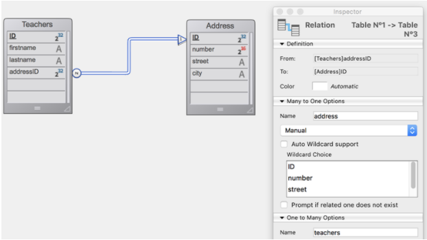

Una entity selection es un objeto que contiene una o más referencias a [entidades](ORDA/dsMapping.md#entity) pertenecientes a la misma [Dataclass](ORDA/dsMapping.md#dataclass). Una entity selection puede contener 0, 1 o X entidades de la dataclass -- donde X puede representar el número total de entidades contenidas en la dataclass.

Las selecciones de entidades pueden crearse a partir de selecciones existentes utilizando varias funciones de la clase [`DataClass` class](DataClassClass.md) tales como [`.all()`](DataClassClass.md#all) o [`.query()`](DataClassClass.md#query), o de la clase `EntityClass` misma, tal como [`.and()`](#and) o [`orderBy()`](#orderby). También puede crear entity selections vacías utilizando la función [`dataClass.newSelection()`](DataClassClass.md#newselection) o el comando [`Create new selection`](#create-new-selection).

### Resumen

|                                                                                                                                                                                                                         |
| ----------------------------------------------------------------------------------------------------------------------------------------------------------------------------------------------------------------------- |
| [<!-- INCLUDE EntitySelectionClass.index.Syntax -->](#91index93)&nbsp;&nbsp;&nbsp;&nbsp;<!-- INCLUDE EntitySelectionClass.index.Summary -->                                                         |
| [<!-- INCLUDE EntitySelectionClass.attributeName.Syntax -->](#attributename)&nbsp;&nbsp;&nbsp;&nbsp;<!-- INCLUDE EntitySelectionClass.attributeName.Summary -->                                     |
| [<!-- INCLUDE #EntitySelectionClass.add().Syntax -->](#add)&nbsp;&nbsp;&nbsp;&nbsp;<!-- INCLUDE #EntitySelectionClass.add().Summary -->                                                             |
| [<!-- INCLUDE #EntitySelectionClass.and().Syntax -->](#and)&nbsp;&nbsp;&nbsp;&nbsp;<!-- INCLUDE #EntitySelectionClass.and().Summary -->                                                             |
| [<!-- INCLUDE EntitySelectionClass.at().Syntax -->](#attributename)&nbsp;&nbsp;&nbsp;&nbsp;<!-- INCLUDE EntitySelectionClass.at().Summary -->                                                       |
| [<!-- INCLUDE #EntitySelectionClass.average().Syntax -->](#average)&nbsp;&nbsp;&nbsp;&nbsp;<!-- INCLUDE #EntitySelectionClass.average().Summary -->                                                 |
| [<!-- INCLUDE #EntitySelectionClass.contains().Syntax -->](#contains)&nbsp;&nbsp;&nbsp;&nbsp;<!-- INCLUDE #EntitySelectionClass.contains().Summary -->                                              |
| [<!-- INCLUDE #EntitySelectionClass.copy().Syntax -->](#contains)&nbsp;&nbsp;&nbsp;&nbsp;<!-- INCLUDE #EntitySelectionClass.copy().Summary -->                                                      |
| [<!-- INCLUDE #EntitySelectionClass.count().Syntax -->](#count)&nbsp;&nbsp;&nbsp;&nbsp;<!-- INCLUDE #EntitySelectionClass.count().Summary -->                                                       |
| [<!-- INCLUDE #EntitySelectionClass.distinct().Syntax -->](#distinct)&nbsp;&nbsp;&nbsp;&nbsp;<!-- INCLUDE #EntitySelectionClass.distinct().Summary -->                                              |
| [<!-- INCLUDE #EntitySelectionClass.distinctPaths().Syntax -->](#distinctPaths)&nbsp;&nbsp;&nbsp;&nbsp;<!-- INCLUDE #EntitySelectionClass.distinctPaths().Summary -->                               |
| [<!-- INCLUDE #EntitySelectionClass.drop().Syntax -->](#drop)&nbsp;&nbsp;&nbsp;&nbsp;<!-- INCLUDE #EntitySelectionClass.drop().Summary -->                                                          |
| [<!-- INCLUDE #EntitySelectionClass.extract().Syntax -->](#extract)&nbsp;&nbsp;&nbsp;&nbsp;<!-- INCLUDE #EntitySelectionClass.extract().Summary -->                                                 |
| [<!-- INCLUDE #EntitySelectionClass.first().Syntax -->](#first)&nbsp;&nbsp;&nbsp;&nbsp;<!-- INCLUDE #EntitySelectionClass.first().Summary -->                                                       |
| [<!-- INCLUDE #EntitySelectionClass.getDataClass().Syntax -->](#getdataclass)&nbsp;&nbsp;&nbsp;&nbsp;<!-- INCLUDE #EntitySelectionClass.getDataClass().Summary -->                                  |
| [<!-- INCLUDE #EntitySelectionClass.getRemoteContextAttributes().Syntax -->](#getremotecontextattributes)&nbsp;&nbsp;&nbsp;&nbsp;<!-- INCLUDE #EntityClass.getRemoteContextAttributes().Summary --> |
| [<!-- INCLUDE #EntitySelectionClass.isAlterable().Syntax -->](#isalterable)&nbsp;&nbsp;&nbsp;&nbsp;<!-- INCLUDE #EntitySelectionClass.isAlterable().Summary -->                                     |
| [<!-- INCLUDE #EntitySelectionClass.isOrdered().Syntax -->](#isordered)&nbsp;&nbsp;&nbsp;&nbsp;<!-- INCLUDE #EntitySelectionClass.isOrdered().Summary -->                                           |
| [<!-- INCLUDE #EntitySelectionClass.last().Syntax -->](#last)&nbsp;&nbsp;&nbsp;&nbsp;<!-- INCLUDE #EntitySelectionClass.last().Summary -->                                                          |
| [<!-- INCLUDE #EntitySelectionClass.length.Syntax -->](#length)&nbsp;&nbsp;&nbsp;&nbsp;<!-- INCLUDE #EntitySelectionClass.length.Summary -->                                                        |
| [<!-- INCLUDE #EntitySelectionClass.max().Syntax -->](#max)&nbsp;&nbsp;&nbsp;&nbsp;<!-- INCLUDE #EntitySelectionClass.max().Summary -->                                                             |
| [<!-- INCLUDE #EntitySelectionClass.min().Syntax -->](#min)&nbsp;&nbsp;&nbsp;&nbsp;<!-- INCLUDE #EntitySelectionClass.min().Summary -->                                                             |
| [<!-- INCLUDE #EntitySelectionClass.minus().Syntax -->](#minus)&nbsp;&nbsp;&nbsp;&nbsp;<!-- INCLUDE #EntitySelectionClass.minus().Summary -->                                                       |
| [<!-- INCLUDE #EntitySelectionClass.or().Syntax -->](#or)&nbsp;&nbsp;&nbsp;&nbsp;<!-- INCLUDE #EntitySelectionClass.or().Summary -->                                                                |
| [<!-- INCLUDE #EntitySelectionClass.orderBy().Syntax -->](#orderby)&nbsp;&nbsp;&nbsp;&nbsp;<!-- INCLUDE #EntitySelectionClass.orderBy().Summary -->                                                 |
| [<!-- INCLUDE #EntitySelectionClass.orderByFormula().Syntax -->](#orderbyformula)&nbsp;&nbsp;&nbsp;&nbsp;<!-- INCLUDE #EntitySelectionClass.orderByFormula().Summary -->                            |
| [<!-- INCLUDE #EntitySelectionClass.query().Syntax -->](#query)&nbsp;&nbsp;&nbsp;&nbsp;<!-- INCLUDE #EntitySelectionClass.query().Summary -->                                                       |
| [<!-- INCLUDE #EntitySelectionClass.queryPath.Syntax -->](#querypath)&nbsp;&nbsp;&nbsp;&nbsp;<!-- INCLUDE #EntitySelectionClass.queryPath.Summary -->                                               |
| [<!-- INCLUDE #EntitySelectionClass.queryPlan.Syntax -->](#queryplan)&nbsp;&nbsp;&nbsp;&nbsp;<!-- INCLUDE #EntitySelectionClass.queryPlan.Summary -->                                               |
| [<!-- INCLUDE #EntitySelectionClass.refresh().Syntax -->](#refresh)&nbsp;&nbsp;&nbsp;&nbsp;<!-- INCLUDE #EntitySelectionClass.refresh().Summary -->                                                 |
| [<!-- INCLUDE #EntitySelectionClass.selected().Syntax -->](#selected)&nbsp;&nbsp;&nbsp;&nbsp;<!-- INCLUDE #EntitySelectionClass.selected().Summary -->                                              |
| [<!-- INCLUDE #EntitySelectionClass.slice().Syntax -->](#slice)&nbsp;&nbsp;&nbsp;&nbsp;<!-- INCLUDE #EntitySelectionClass.slice().Summary -->                                                       |
| [<!-- INCLUDE #EntitySelectionClass.sum().Syntax -->](#sum)&nbsp;&nbsp;&nbsp;&nbsp;<!-- INCLUDE #EntitySelectionClass.sum().Summary -->                                                             |
| [<!-- INCLUDE #EntitySelectionClass.toCollection().Syntax -->](#tocollection)&nbsp;&nbsp;&nbsp;&nbsp;<!-- INCLUDE #EntitySelectionClass.toCollection().Summary -->                                  |


## Crear una entity selection


<!-- REF #_command_.Create entity selection.Syntax -->**Create entity selection** ( *dsTable* : Table { ; *settings* : Object } ) : 4D.EntitySelection<!-- END REF -->


<!-- REF #_command_.Create entity selection.Params -->
| Parámetros | Tipo               |    | Descripción                                                                                                         |
| ---------- | ------------------ |:--:| ------------------------------------------------------------------------------------------------------------------- |
| dsTable    | Tabla              | -> | Tabla de la base 4D cuya selección actual se utilizará para construir la selección de entidades                     |
| settings   | Object             | -> | Opciones de construcción: context                                                                                   |
| Result     | 4D.EntitySelection | <- | Selección de entidades que coinciden con la clase de datos relacionada con la tabla dada|<!-- END REF --> |


#### Descripción

El comando `Create entity selection` construye y devuelve una nueva, [alterable](ORDA/entities.md#shareable-or-alterable-entity-selections) selección de entidad relacionada con la clase de datos que coincide con la tabla *dsTable* dada, según la selección actual de esta tabla.

Si la selección actual está ordenada, se crea una selección de entidades [ordenada](ORDA/dsMapping.md#ordered-or-unordered-entity-selection) (se mantiene el orden de la selección actual). Si la selección actual no está ordenada, se crea una selección de entidades no ordenada.

Si la tabla *dsTable* no está expuesto en [`ds`](API/DataStoreClass.md#ds), se devuelve un error. Este comando no puede utilizarse con un datastore remoto.

En el parámetro opcional *settings*, puede pasar un objeto que contenga la siguiente propiedad:

| Propiedad | Tipo | Descripción                                                                                                             |
| --------- | ---- | ----------------------------------------------------------------------------------------------------------------------- |
| context   | Text | Etiqueta para el [contexto de optimización](ORDA/entities.md#clientserver-optimization) aplicado a la entity selection. |


#### Ejemplo

```4d
var $employees : cs.EmployeeSelection
ALL RECORDS([Employee])
$employees:=Create entity selection([Employee])
// La entity selection $employees ahora contiene un conjunto de referencias
// en todas las entidades relacionadas con la clase de datos Employee
```

#### Ver también

[`dataClass.newSelection()`](DataClassClass.md#newselection)


## USE ENTITY SELECTION


<!-- REF #_command_.USE ENTITY SELECTION.Syntax -->**USE ENTITY SELECTION** (*entitySelection*)<!-- END REF -->


<!-- REF #_command_.USE ENTITY SELECTION.Params -->
| Parámetros      | Tipo            |    | Descripción                                     |
| --------------- | --------------- |:--:| ----------------------------------------------- |
| entitySelection | EntitySelection | -> | Una entity selection|<!-- END REF --> |

#### Descripción

El comando `USE ENTITY SELECTION` actualiza la selección actual de la tabla que coincide con la dataclass del parámetro *entitySelection*, según el contenido de la entity selection.

Este comando no puede utilizarse con un [datastore remoto](../ORDA/remoteDatastores.md).

:::info

Este comando está diseñado para hacer que las selecciones actuales 4D se beneficien del poder de las consultas ORDA. Por razones de rendimiento, en 4D monousuario y 4D Server, el comando conecta directamente *entitySelection* a la selección actual. Por lo tanto, una vez que se ha utilizado *entitySelection*, no debe reutilizarse ni alterarse posteriormente.

:::

:::note

Después de una llamada a `USE ENTITY SELECTION`, el primer registro de la selección actual actualizada (si no está vacío) se convierte en el registro actual, pero no se carga en la memoria. Si necesita utilizar los valores de los campos del registro actual, utilice el comando `LOAD RECORD` después del comando `USE ENTITY SELECTION`.

:::

#### Ejemplo

```4d
var $entitySel : Object

$entitySel:=ds.Employee.query("lastName = :1";"M@") //$entitySel está asociado a la dataclass Employee 
REDUCE SELECTION([Employee];0)
USE ENTITY SELECTION($entitySel) //Se actualiza la selección actual de la tabla Employee
```


<!-- REF EntitySelectionClass.index.Desc -->
## &#91;*index*&#93;

<details><summary>Histórico</summary>

| Lanzamiento | Modificaciones |
| ----------- | -------------- |
| 17          | Añadidos       |

</details>


<!-- REF EntitySelectionClass.index.Syntax -->***&#91;index&#93;*** : 4D.Entity<!-- END REF -->


#### Descripción

La notación `EntitySelection[index]` <!-- REF EntitySelectionClass.index.Summary -->le permite acceder a las entidades dentro de la selección de entidades utilizando la sintaxis estándar de la colección<!-- END REF -->: pase la posición de la entidad que desea obtener en el parámetro *index*.

Tenga en cuenta que la entidad correspondiente se vuelve a cargar desde el almacén de datos.

*index* puede ser cualquier número entre 0 y `.length`-1.

*   Si *index* está fuera de rango, se devuelve un error.
*   If *attributeName* kind is `storage`: `.attributeName` returns a collection of values of the same type as *attributeName*.

:::caution

`EntitySelection[index]` es una expresión no asignable, lo que significa que no puede utilizarse como referencia modificable de la entidad con los métodos como [`.lock()`](EntityClass.md#lock) o [`.save()`](EntityClass.md#save). Para trabajar con la entidad correspondiente, es necesario asignar la expresión devuelta a una expresión asignable, como una variable. Ejemplos:

```4d
 $sel:=ds.Employee.all() //creación de la entity selection
  //declaraciones no válidas:
 $result:=$sel[0].lock() //NO funcionará
 $sel[0].lastName:="Smith" //NO funcionará
 $result:=$sel[0].save() //NO funcionará
  //valid code:
 $entity:=$sel[0]  //OK
 $entity.lastName:="Smith" //OK
 $entity.save() //OK
```
:::

#### Ejemplo


```4d
 var $employees : cs.EmployeeSelection
 var $employee : cs.EmployeeEntity
 $employees:=ds.Employee.query("lastName = :1";"H@")
 $employee:=$employees[2]  // La tercera entidad de la selección de entidades $employees se recarga de la base de datos
```


<!-- END REF -->

<!-- REF EntitySelectionClass.attributeName.Desc -->
## .*attributeName*

<details><summary>Histórico</summary>

| Lanzamiento | Modificaciones |
| ----------- | -------------- |
| 17          | Añadidos       |

</details>


<!-- REF EntitySelectionClass.attributeName.Syntax -->***.attributeName*** : Collection<br/>***.attributeName*** : 4D.EntitySelection<!-- END REF -->


#### Descripción

Todo atributo de la clase de datos puede utilizarse como propiedad de una selección de entidades para devolver <!-- REF EntitySelectionClass.attributeName.Summary -->una "proyección" de valores para el atributo en la selección de entidades<!-- END REF -->. Los valores proyectados pueden ser una colección o una nueva selección de entidades, dependiendo de [kind](DataClassClass.md#attributename) (`storage` o `relation`) del atributo.

*   Si el tipo de *attributeName* es `storage`: `.attributeName` devuelve una colección de valores del mismo tipo que *attributeName*.
*   If *attributeName* kind is `relatedEntity`: `.attributeName` returns a new entity selection of related values of the same type as *attributeName*. Se eliminan los duplicados (se devuelve una entity selection desordenada).
*   If *attributeName* kind is `relatedEntities`: `.attributeName` returns a new entity selection of related values of the same type as *attributeName*. Se eliminan los duplicados (se devuelve una entity selection desordenada).


Cuando se utiliza un atributo de relación como propiedad de una selección de entidades, el resultado es siempre otra selección de entidades, aunque sólo se devuelva una entidad. Cuando se utiliza un atributo de relación como propiedad de una selección de entidades, el resultado es siempre otra selección de entidades, aunque sólo se devuelva una entidad.

Si el atributo no existe en la selección de entidades, se devuelve un error.


#### Ejemplo 1

Proyección de valores de almacenamiento:


```4d
 var $firstNames : Collection
 $entitySelection:=ds.Employee.all()
 $firstNames:=$entitySelection.firstName // firstName es un string
```

La colección resultante es una colección de cadenas, por ejemplo:

```4d
[
    "Joanna",
    "Alexandra",
    "Rick"
]
```

#### Ejemplo 2

Proyección de la entidad relacionada:

```4d
 var $es; $entitySelection : cs.EmployeeSelection
 $entitySelection:=ds.Employee.all()
 $es:=$entitySelection.employer // employer está relacionado a la dataClass Company
```

El objeto resultante es una selección de entidades de la empresa con los duplicados eliminados (si los hay).

#### Ejemplo 3

Proyección de entidades relacionadas:

```4d
 var $es : cs.EmployeeSelection
 $es:=ds.Employee.all().directReports // directReports está relacionado a la dataclass Employee
```

El objeto resultante es una entity selection de la dataclass Employee sin duplicados (si los hay).

<!-- END REF -->

<!-- REF EntitySelectionClass.add().Desc -->
## .add()

<details><summary>Histórico</summary>

| Lanzamiento | Modificaciones                                |
| ----------- | --------------------------------------------- |
| 19 R7       | Soporte del parámetro *entitySelection*       |
| 18 R5       | Sólo soporta las entity selections alterables |
| 17          | Añadidos                                      |

</details>


<!-- REF #EntitySelectionClass.add().Syntax -->**.add**( *entity* : 4D.Entity ) : 4D.EntitySelection<br/>**.add**( *entitySelection* : 4D.EntitySelection ) : 4D.EntitySelection<!-- END REF -->


<!-- REF #EntitySelectionClass.add().Params -->
| Parámetros      | Tipo               |    | Descripción                                                                                          |
| --------------- | ------------------ |:--:| ---------------------------------------------------------------------------------------------------- |
| entity          | 4D.Entity          | -> | Entidad que debe añadirse a la entity selection                                                      |
| entitySelection | 4D.EntitySelection | -> | Selección de entidades que se añade a la selección de entidades original                             |
| Result          | 4D.EntitySelection | -> | Selección de entidades incluyendo la *entity* añadida o *entitySelection*|<!-- END REF --> |


#### Descripción

La función `.add()` <!-- REF #EntitySelectionClass.add().Summary -->añade la *entity* o *entitySelection* especificada a la selección de entidades original y devuelve la selección de entidades modificada<!-- END REF -->.
> Los valores de tipo Date se convierten en valores numéricos (segundos) y se utilizan para calcular la media.

:::info warning

La entity selection debe ser *alterable*, es decir, ha sido creado, por ejemplo, por [`.newSelection()`](DataClassClass.md#newselection) o `Create entity selection`, de lo contrario `.add()` devolverá un error. Las entity selections compartibles no aceptan la adición de entidades. Para más información, consulte la sección [Entity selections compartibles o modificables ](ORDA/entities.md#shareable-or-alterable-entity-selections) section.

:::

**Añadir una entidad**

*   Si la entity selection está ordenada, *entity* se añade al final de la selección. Si una referencia a la misma entidad ya pertenece a la selección de entidades, se duplica y se añade una nueva referencia.
*   Si la entity selection no está ordenada, *entity* se añade en cualquier lugar de la selección, sin un orden específico.

**Añadir una selección de entidades**

*   Si la entity selection está ordenada, su orden se mantiene y *entitySelection* se añade al final de la selección. Si las referencias a las mismas entidades de *entitySelection* ya pertenecen a la selección de entidades, se duplican y se añaden nuevas referencias.
*   Si la selección de entidades está desordenada, se convierte en ordenada.
> Para más información, consulte la sección [Entity selections ordenada o no ordenadas](ORDA/dsMapping.md#ordered-or-unordered-entity-selection).

La entity selection modificada es devuelta por la función, de modo que las llamadas a la función pueden encadenarse.

Se produce un error si *entity* y la entity selection no están relacionadas con la misma dataclass. Si *entity* es Null, no se produce ningún error.

#### Ejemplo 1

```4d
 var $employees : cs.EmployeeSelection
 var $employee : cs.EmployeeEntity
 $employees:=ds.Employee.newSelection()
 $employee:=ds.Employee.new()
 $employee.lastName:="Smith"
 $employee.save()
 $employees.add($employee) //La entidad $employee se añade a la selección de entidades $employees
```

#### Ejemplo 2

Las llamadas a la función se pueden encadenar:

```4d
 var $sel : cs.ProductSelection
 var $p1;$p2;$p3 : cs.ProductEntity

 $p1:=ds.Product.get(10)
 $p2:=ds.Product.get(11)
 $p3:=ds.Product.get(12)
 $sel:=ds.Product.newSelection()
 $sel:=$sel.add($p1).add($p2).add($p3)
```

#### Ejemplo 3

En una interfaz de usuario, tenemos dos listas. El usuario selecciona elementos de la lista1 para añadirlos a la lista2.

```4d
$sellist2:=$sellist2.add($sellist1)
```


<!-- END REF -->

<!-- REF EntitySelectionClass.and().Desc -->
## .and()

<details><summary>Histórico</summary>

| Lanzamiento | Modificaciones |
| ----------- | -------------- |
| 17          | Añadidos       |

</details>


<!-- REF #EntitySelectionClass.and().Syntax -->**.and**( *entity* : 4D.Entity ) : 4D.EntitySelection<br/>**.and**( *entitySelection* : 4D.EntitySelection ) : 4D.EntitySelection<!-- END REF -->


<!-- REF #EntitySelectionClass.and().Params -->
| Parámetros      | Tipo               |    | Descripción                                                                                          |
| --------------- | ------------------ |:--:| ---------------------------------------------------------------------------------------------------- |
| entity          | 4D.Entity          | -> | Entidad a intersectar                                                                                |
| entitySelection | 4D.EntitySelection | -> | Entity selection a intersectar                                                                       |
| Result          | 4D.EntitySelection | <- | Entity selection resultante de la intersección con el operador lógico AND|<!-- END REF --> |


#### Descripción

La función `.and()` <!-- REF #EntitySelectionClass.and().Summary -->combina la selección de la entidad con un parámetro *entity* o *entitySelection* utilizando el operador lógico AND<!-- END REF -->; devuelve una nueva selección de entidades no ordenada que contiene sólo las entidades a las que se hace referencia tanto en la selección de entidades como en el parámetro.

*   Si pasa *entity* como parámetro, se combina esta entidad con la entity selection. Si la entidad pertenece a la entity selection, se devuelve una nueva entity selection que sólo contiene la entidad. En caso contrario, se devuelve una selección de entidades vacía.
*   If you pass *entity* as parameter, you compare this entity with the entity selection. If the entity belongs to the entity selection, a new reference to the entity selection is returned. Otherwise, a new entity selection containing the original entity selection and the entity is returned.
> > You can compare [ordered and/or unordered entity selections](ORDA/dsMapping.md#ordered-or-unordered-entity-selection). La selección resultante es siempre desordenada.

Si la entity selection inicial o el parámetro *entitySelection* están vacíos, o si *entity* es Null, se devuelve una entity selection vacía.

Si la entity selection inicial y el parámetro no están relacionados con la misma dataclass, se produce un error.


#### Ejemplo 1


```4d
 var $employees; $result : cs.EmployeeSelection
 var $employee : cs.EmployeeEntity
 $employees:=ds.Employee.query("lastName = :1";"H@")   
  //la entity selection $employees contiene la entidad
  //con la llave primaria 710 y otras entidades
  //por ejemplo. "Colin Hetrick" / "Grady Harness" / "Sherlock Holmes" (primary key 710)
 $employee:=ds.Employee.get(710) // Devuelve "Sherlock Holmes"

 $result:=$employees.and($employee) //$result es una selección de entidades que contiene   
  //sólo la entidad con llave primaria 710 ("Sherlock Holmes")
```


#### Ejemplo 2

Queremos tener una selección de empleados llamados "Jones" que vivan en Nueva York:

```4d
 var $sel1; $sel2; $sel3 : cs.EmployeeSelection
 $sel1:=ds.Employee.query("name =:1";"Jones")
 $sel2:=ds.Employee.query("city=:1";"New York")
 $sel3:=$sel1.and($sel2)
```


<!-- END REF -->

<!-- REF EntitySelectionClass.at().Desc -->
## .at()

<details><summary>Histórico</summary>

| Lanzamiento | Modificaciones |
| ----------- | -------------- |
| 20          | Añadidos       |

</details>


<!-- REF #EntitySelectionClass.at().Syntax -->**.at**( *index* : Integer ) : 4D.Entity <!-- END REF -->


<!-- REF #EntitySelectionClass.at().Params -->
| Parámetros | Tipo      |    | Descripción                                         |
| ---------- | --------- |:--:| --------------------------------------------------- |
| index      | Integer   | -> | Índice de la entidad a devolver                     |
| Result     | 4D.Entity | <- | La entidad en ese índice|<!-- END REF --> |


#### Descripción

La función `.at()` <!-- REF #EntitySelectionClass.at().Summary -->devuelve la entidad en la posición *index*, permitiendo enteros positivos y negativos<!-- END REF -->.

Si *index* es negativo (de -1 a -n con n: longitud de la selección de entidades), la entidad devuelta se basará en el orden inverso de la selección de entidades.

La función devuelve Null si *index* está más allá de los límites de selección de entidades.

#### Ejemplo

```4d
var $employees : cs.EmployeeSelection
var $emp1; $emp2 : cs.EmployeeEntity
$employees:=ds.Employee.query("lastName = :1";"H@")
$emp1:=$employees.at(2)  //3rd entity of the $employees entity selection
$emp2:=$employees.at(-3) //starting from the end, 3rd entity
    //of the $employees entity selection
```


<!-- END REF -->

<!-- REF EntitySelectionClass.average().Desc -->
## .average()

<details><summary>Histórico</summary>

| Lanzamiento | Modificaciones                                       |
| ----------- | ---------------------------------------------------- |
| 18 R6       | Devuelve undefined si la entity selection está vacía |
| 17          | Añadidos                                             |

</details>


<!-- REF #EntitySelectionClass.average().Syntax -->**.average**( *attributePath* : Text ) : Real<!-- END REF -->


<!-- REF #EntitySelectionClass.average().Params -->
| Parámetros    | Tipo |    | Descripción                                                                                                                                            |
| ------------- | ---- |:--:| ------------------------------------------------------------------------------------------------------------------------------------------------------ |
| attributePath | Text | -> | Ruta del atributo a utilizar para el cálculo                                                                                                           |
| Result        | Real | <- | Media aritmética (promedio) de los valores de las entidades para el atributo (No se define para una entity selection vacía)|<!-- END REF --> |

#### Descripción

La función `.average()` <!-- REF #EntitySelectionClass.average().Summary -->The `.average()` function<!-- END REF -->.

Pase en el parámetro *attributePath* la ruta del atributo a evaluar.

Sólo se tienen en cuenta los valores numéricos para el cálculo. Tenga en cuenta, sin embargo, que si el *attributePath* de la selección de entidades contiene tipos de valores mixtos, `.average()` tiene en cuenta todos los elementos escalares para calcular el valor medio.
> Para más información sobre propiedad compartible de entity selections, consulte la sección [Entity selections compartibles o modificables](ORDA/entities.md#shareable-or-alterable-entity-selections).

`.average()` devuelve **undefined** si la entity selection está vacía o *attributePath* no contiene valores numéricos.

Se devuelve un error si:

*   *>attributePath* es un atributo relativo,
*   *attributePath* designa un atributo que no existe en la dataclass de la entity selection.


#### Ejemplo

Queremos obtener una lista de empleados cuyo salario es superior al salario medio:

```4d
 var $averageSalary : Real
 var $moreThanAv : cs.EmployeeSelection
 $averageSalary:=ds.Employee.all().average("salary")
 $moreThanAv:=ds.Employee.query("salary > :1";$averageSalary)
```


<!-- END REF -->

<!-- REF EntitySelectionClass.contains().Desc -->
## .contains()

<details><summary>Histórico</summary>

| Lanzamiento | Modificaciones |
| ----------- | -------------- |
| 17          | Añadidos       |

</details>


<!-- REF #EntitySelectionClass.contains().Syntax -->**.contains**( *entity* : 4D.Entity ) : Boolean<!-- END REF -->


<!-- REF #EntitySelectionClass.contains().Params -->
| Parámetros | Tipo      |    | Descripción                                                                                          |
| ---------- | --------- |:--:| ---------------------------------------------------------------------------------------------------- |
| entity     | 4D.Entity | -> | Entidad a evaluar                                                                                    |
| Result     | Boolean   | <- | True si la entidad pertenece a la entity selection, de lo contrario False|<!-- END REF --> |

#### Descripción

La función `.contains()` <!-- REF #EntitySelectionClass.contains().Summary -->devuelve true si la referencia de la entidad pertenece a la selección de entidades<!-- END REF -->, y false en caso contrario.

En *entity*, especifique la entidad a buscar en la entity selection. Si la entidad es Null, la función devolverá false.

Si *entity* y la entity selection no pertenecen a la misma dataclass, se produce un error.

#### Ejemplo

```4d
 var $employees : cs.EmployeeSelection
 var $employee : cs.EmployeeEntity

 $employees:=ds.Employee.query("lastName=:1";"H@")
 $employee:=ds.Employee.get(610)

 If($employees.contains($employee))
    ALERT("La entidad con llave primaria 610 tiene un apellido que empieza por H")
 Else
    ALERT("La entidad con llave primaria 610 no tiene un apellido que empiece por H")
 End if
```


<!-- END REF -->

<!-- REF EntitySelectionClass.count().Desc -->
## .count()

<details><summary>Histórico</summary>

| Lanzamiento | Modificaciones |
| ----------- | -------------- |
| 17          | Añadidos       |

</details>


<!-- REF #EntitySelectionClass.count().Syntax -->**.count**( *attributePath* : Text ) : Real<!-- END REF -->


<!-- REF #EntitySelectionClass.count().Params -->
| Parámetros    | Tipo |    | Descripción                                                                                    |
| ------------- | ---- |:--:| ---------------------------------------------------------------------------------------------- |
| attributePath | Text | -> | Ruta del atributo que se utilizará para el cálculo                                             |
| Result        | Real | <- | Número de valores de *attributePath* no null en la entity selection|<!-- END REF --> |

#### Descripción

La función `.push()` <!-- REF #EntitySelectionClass.count().Summary -->The `.count()` function<!-- END REF -->.
> Sólo se tienen en cuenta los valores escalares. Los valores de tipo objeto o colección se consideran valores nulos.

Se devuelve un error si:

*   *>attributePath* es un atributo relativo,
*   *attributePath* no se encuentra en la clase de datos de la entity selection.

#### Ejemplo

Queremos averiguar el número total de empleados de una empresa sin contar a los que no se les ha especificado el cargo:

```4d
 var $sel : cs.EmployeeSelection
 var $count : Real

 $sel:=ds.Employee.query("employer = :1";"Acme, Inc")
 $count:=$sel.count("jobtitle")
```


<!-- END REF -->

<!-- REF EntitySelectionClass.copy().Desc -->
## .copy()

<details><summary>Histórico</summary>

| Lanzamiento | Modificaciones |
| ----------- | -------------- |
| 18 R5       | Añadidos       |

</details>


<!-- REF #EntitySelectionClass.copy().Syntax -->**.copy**( { *option* : Integer } ) : 4D.EntitySelection<!-- END REF -->


<!-- REF #EntitySelectionClass.copy().Params -->
| Parámetros | Tipo               |    | Descripción                                             |
| ---------- | ------------------ |:--:| ------------------------------------------------------- |
| option     | Integer            | -> | `ck shared`: devuelve una entity selection compartible  |
| Result     | 4D.EntitySelection | <- | Copia de la entity selection|<!-- END REF --> |

#### Descripción

La función `.copy()` <!-- REF #EntitySelectionClass.copy().Summary -->The `.copy()` function<!-- END REF -->.

> Las entidades de una colección de entidades a las que se accede por medio de \[ ] no se recargan desde la base de datos.

Por defecto, si se omite el parámetro *option*, la función devuelve una nueva entity selection alterable (incluso si la función se aplica a una entity selection compartible). Pasa la constante `ck shared` en el parámetro *option* si quiere crear una entity selection compartible.

> Esta función siempre devuelve True cuando la entity selection proviene de un datastore remoto.

#### Ejemplo

Se crea una nueva entidad vacía de selección de productos cuando se carga el formulario:

```4d
 Case of
    :(Form event code=On Load)
       Form.products:=ds.Products.newSelection()
 End case

```

A continuación, esta selección de entidades se actualiza con productos y se desea compartir los productos entre varios procesos. Se copia la selección de la entidad Form.products como compartible:

```4d
 ...
  // La selección de entidades de Form.products se actualiza
 Form.products.add(Form.selectedProduct)

 Use(Storage)
    If(Storage.products=Null)
       Storage.products:=New shared object()
    End if

    Use(Storage.products)
       Storage.products:=Form.products.copy(ck shared)
    End use
 End use
```


<!-- END REF -->

<!-- REF EntitySelectionClass.distinct().Desc -->
## .distinct()

<details><summary>Histórico</summary>

| Lanzamiento | Modificaciones               |
| ----------- | ---------------------------- |
| 20          | Soporte de `dk count values` |
| 17          | Añadidos                     |

</details>


<!-- REF #EntitySelectionClass.distinct().Syntax -->**.distinct**( *attributePath* : Text { ; *options* : Integer } ) : Collection<!-- END REF -->


<!-- REF #EntitySelectionClass.distinct().Params -->
| Parámetros    | Tipo       |    | Descripción                                                     |
| ------------- | ---------- |:--:| --------------------------------------------------------------- |
| attributePath | Text       | -> | Ruta del atributo cuyos valores distintos desea obtener         |
| options       | Integer    | -> | `dk diacritical`, `dk count values`                             |
| Result        | Collection | <- | Colección con sólo valores distintos|<!-- END REF --> |

#### Descripción

La función `.distinct()` <!-- REF #EntitySelectionClass.distinct().Summary -->The `.distinct()` function<!-- END REF -->.

La colección devuelta se clasifica automáticamente. Los valores **Null** no se devuelven.

En el parámetro *attributePath*, pase el atributo de entidad cuyos valores distintos quiere obtener. Sólo se pueden manejar valores escalares (texto, número, booleano o fecha). Los tipos se devuelven en el siguiente orden: Si *attributePath* lleva a una propiedad de objeto que contiene valores de diferentes tipos, primero se agrupan por tipo y se ordenan después.

1.  booleans
2.  cadenas
3.  numbers
4.  dates

Se puede utilizar la notación `[]` para designar una colección cuando *attributePath* es una ruta dentro de un objeto (ver ejemplos).

En el parámetro *options*, puede pasar una o una combinación de las siguientes constantes:

| Constante         | Valor | Comentario                                                                                                                                                                                                      |
| ----------------- | ----- | --------------------------------------------------------------------------------------------------------------------------------------------------------------------------------------------------------------- |
| `dk diacritical`  | 8     | La evaluación distingue entre mayúsculas y minúsculas y diferencia los caracteres acentuados. Por defecto si se omite, se realiza una evaluación no diacrítica                                                  |
| `dk count values` | 32    | Devuelve el conteo de entidades para cada valor distinto. Cuando se pasa esta opción, `.distinct()` devuelve una colección de objetos que contienen un par de propiedades `{"value":*value*; "count":*count*}`. |

:::note

La opción `dk count values` sólo está disponible con atributos de almacenamiento de tipo booleano, cadena, número y fecha.

:::

Se devuelve un error si:

*   *>attributePath* es un atributo relativo,
*   *attributePath* no se encuentra en la clase de datos de la entity selection.

#### Ejemplos

Quiere obtener una colección que contenga un solo elemento por nombre de país:

```4d
var $countries : Collection
$countries:=ds.Employee.all().distinct("address.country")
//$countries[0]={"Argentina"}
//$countries[1]={"Australia"}
//$countries[2]={"Belgium"}
///...
```

`nicknames` es una colección y `extra` es un atributo de objeto:

```4d
$values:=ds.Employee.all().distinct("extra.nicknames[].first")
```

Desea obtener el número de nombres de posiciones diferentes en la empresa:

```4d
var $jobs : Collection
$jobs:=ds.Employee.all().distinct("jobName";dk count values)  
//$jobs[0]={"value":"Developer";"count":17}
//$jobs[1]={"value":"Office manager";"count":5}
//$jobs[2]={"value":"Accountant";"count":2}
//...
```


<!-- END REF -->

<!-- REF EntitySelectionClass.distinctPaths().Desc -->
## .distinctPaths()

<details><summary>Histórico</summary>

| Lanzamiento | Modificaciones |
| ----------- | -------------- |
| 20          | Añadidos       |

</details>


<!-- REF #EntitySelectionClass.distinctPaths().Syntax -->**.distinctPaths**( *attribute* : Text ) : Collection<!-- END REF -->


<!-- REF #EntitySelectionClass.distinctPaths().Params -->
| Parámetros | Tipo       |    | Descripción                                                    |
| ---------- | ---------- |:--:| -------------------------------------------------------------- |
| atributo   | Text       | -> | Nombre del atributo del objeto cuyas rutas desea obtener       |
| Result     | Collection | <- | Nueva colección con rutas distintas|<!-- END REF --> |


#### Descripción

La función `.distinctPaths()` <!-- REF #EntitySelectionClass.distinctPaths().Summary -->devuelve una colección de rutas distintas encontradas en el objeto indexado *attribute* para la selección de entidades<!-- END REF -->.

Si *attribute* no es un atributo de objeto indexado, se genera un error.

Tras la llamada, el tamaño de la colección devuelta es igual al número de rutas distintas encontradas en *attribute* para la selección de entidades. Las rutas se devuelven como cadenas que incluyen atributos anidados y colecciones, por ejemplo "info.address.number" o "children[].birthdate". Las entidades con un valor null en el *attribute* no se tienen en cuenta.

#### Ejemplo

Desea obtener todas las rutas almacenadas en un atributo objeto *fullData*:

```4d
var $paths : Collection
$paths:=ds.Employee.all().distinctPaths("fullData")
//$paths[0]="age"
//$paths[1]="Children"
//$paths[2]="Children[].age"
//$paths[3]="Children[].name"
//$paths[4]="Children.length"
///...
```


:::note

*length* se añade automáticamente como ruta para las propiedades de colección anidadas.

:::  

<!-- END REF -->

<!-- REF EntitySelectionClass.drop().Desc -->
## .drop()

<details><summary>Histórico</summary>

| Lanzamiento | Modificaciones |
| ----------- | -------------- |
| 17          | Añadidos       |

</details>


<!-- REF #EntitySelectionClass.drop().Syntax -->**.drop**( { *mode* : Integer } ) : 4D.EntitySelection<!-- END REF -->


<!-- REF #EntitySelectionClass.drop().Params -->
| Parámetros | Tipo               |    | Descripción                                                                                                                                 |
| ---------- | ------------------ |:--:| ------------------------------------------------------------------------------------------------------------------------------------------- |
| mode       | Integer            | -> | `dk stop dropping on first error`: detiene la ejecución del método en la primera entidad no suprimible                                      |
| Result     | 4D.EntitySelection | <- | Entity selection vacía si se ejecuta con éxito, si no entity selection que contengan las entidades no eliminables<!-- END REF --> |

#### Descripción

La función `.drop()` <!-- REF #EntitySelectionClass.drop().Summary -->elimina las entidades pertenecientes a la selección de entidades de la tabla relacionada con su clase de datos dentro del almacén de datos<!-- END REF -->. La entity selection permanece en la memoria.
> La eliminación de entidades es permanente y no se puede deshacer. Se recomienda llamar a esta acción en una transacción para tener una opción de recuperación.

Si se encuentra una entidad bloqueada durante la ejecución de `.drop()`, no se elimina. Por defecto, el método procesa todas las entidades de la selección de entidades y devuelve las entidades no eliminables en la selección de entidades. Si quiere que el método detenga la ejecución en la primera entidad no suprimible encontrada, pase la constante `dk stop dropping on first error` en el parámetro *mode*.


#### Ejemplo

Ejemplo sin la opción `dk stop dropping on first error`:

```4d
 var $employees; $notDropped : cs.EmployeeSelection
 $employees:=ds.Employee.query("firstName=:1";"S@")
 $notDropped:=$employees.drop() // $notDropped es una entity selection que contiene todas las entidades que no suprimidas
 If($notDropped.length=0) //La acción de eliminación es exitosa, todas las entidades han sido eliminadas
    ALERT("You have dropped "+String($employees.length)+" employees") //La selección de entidades eliminada permanece en la memoria
 Else
    ALERT("Problem during drop, try later")
 End if
```

Ejemplo con la opción `dk stop dropping on first error`:

```4d
 var $employees; $notDropped : cs.EmployeeSelection
 $employees:=ds.Employee.query("firstName=:1";"S@")
 $notDropped:=$employees.drop(dk stop dropping on first error) //$notDropped es una entity selection que contiene la primera entidad no suprimida
 If($notDropped.length=0) //La acción de eliminación es exitosa, todas las entidades han sido eliminadas
    ALERT("You have dropped "+String($employees.length)+" employees") //La selección de entidades eliminada permanece en la memoria
 Else
    ALERT("Problem during drop, try later")
 End if
```


<!-- END REF -->

<!-- REF EntitySelectionClass.extract().Desc -->
## .extract()

<details><summary>Histórico</summary>

| Lanzamiento | Modificaciones |
| ----------- | -------------- |
| 18 R3       | Añadidos       |

</details>


<!-- REF #EntitySelectionClass.extract().Syntax --> **.extract**( *attributePath* : Text { ; *option* : Integer } ) : Collection<br/>**.extract**( *attributePath* { ; *targetPath* } { ; *...attributePathN* : Text ; *targetPathN* : Text } ) : Collection<!-- END REF -->


<!-- REF #EntitySelectionClass.extract().Params -->
| Parámetros    | Tipo       |    | Descripción                                                                                 |
| ------------- | ---------- |:--:| ------------------------------------------------------------------------------------------- |
| attributePath | Text       | -> | Ruta del atributo cuyos valores deben ser extraídos en la nueva colección                   |
| targetPath    | Text       | -> | Ruta o nombre del atributo objetivo                                                         |
| option        | Integer    | -> | `ck keep null`: incluye los atributos null en la colección devuelta (ignorados por defecto) |
| Result        | Collection | <- | Colección que contiene los valores extraídos|<!-- END REF -->                     |

#### Descripción

La función `.reduce()` <!-- REF #EntitySelectionClass.extract().Summary -->devuelve una colección que contiene *attributePath* valores extraídos de la selección de la entidad<!-- END REF -->.

*attributePath* puede referirse a:

*   un atributo escalar de dataclass,
*   entidad relacionada,
*   entidades relacionadas.

Si *attributePath* no es válido, se devuelve una colección vacía.

Esta función acepta dos sintaxis.

**.extract( attributePath : Text { ; option : Integer } ) : Collection**

Con esta sintaxis, `.extract()` llena la colección devuelta con los valores *attributePath* de la entity selection.

Por defecto, las entidades para las que *attributePath* es *null* o indefinida se ignoran en la colección resultante. Puede pasar la constante `ck keep null` en el parámetro *option* para incluir estos valores como elementos **null** en la colección devuelta.

*   Los atributos dataclass [.kind](DataClassClass.md#attributename) = "relatedEntity" se extraen como una colección de entidades (se mantienen las duplicaciones).
*   Los atributos dataclass con [.kind](DataClassClass.md#attributename) = "relatedEntities" se extraen como una colección de entity selections.


**.extract ( attributePath ; targetPath { ; ...attributePathN ; ... targetPathN}) : Collection**

Con esta sintaxis, `.extract()` llena la colección devuelta con las propiedades *attributePath*. Cada elemento de la colección devuelta es un objeto con las propiedades *targetPath* llenadas con las propiedades *attributePath* correspondientes. Se mantienen los valores null (el parámetro *option* se ignora) con esta sintaxis.

Si se dan varios *attributePath*, debe darse un *targetPath* para cada uno. Sólo se extraen los pares válidos \[*attributePath*, *targetPath*].

*   Los atributos dataclass con [.kind](DataClassClass.md#attributename) = "relatedEntity" se extraen como una entidad.
*   Los atributos dataclass con [.kind](DataClassClass.md#attributename) = "relatedEntities" se extraen como una entity selection.

> Los valores Null se evalúan como inferiores a los otros valores.


#### Ejemplo

Dada la siguiente tabla y relación:



```4d
 var $firstnames; $addresses; $mailing; $teachers : Collection
  //
  //
  //$firstnames es una colección de cadenas


 $firstnames:=ds.Teachers.all().extract("firstname")
  //
  //$addresses es una colección de entidades relacionadas con la dataclass Address
  //Se extraen los valores null de Address
 $addresses:=ds.Teachers.all().extract("address";ck keep null)
  //
  //
  //$mailing es una colección de objetos con las propiedades "who" y "to"
  //El contenido de la propiedad "who" es de tipo Cadena
  //El contenido de la propiedad "to" es de tipo entity (dataclass Address)
 $mailing:=ds.Teachers.all().extract("lastname";"who";"address";"to")
  //
  //
  //$mailing es una colección de objetos con las propiedades "who" y "city"
  //El contenido de la propiedad "who" es de tipo Cadena
  //El contenido de la propiedad "city" es de tipo Cadena
 $mailing:=ds.Teachers.all().extract("lastname";"who";"address.city";"city")
  //
  //$teachers es una colección de objetos con las propiedades "where" y "who"
  //El contenido de la propiedad "where" es de tipo Cadena
  //El contenido de la propiedad "who" es una entity selection (dataclass Teachers)
 $teachers:=ds.Address.all().extract("city";"where";"teachers";"who")
  //
  //$teachers es una colección de entity selections
 $teachers:=ds.Address.all().extract("teachers")
```


<!-- END REF -->

<!-- REF EntitySelectionClass.first().Desc -->
## .first()

<details><summary>Histórico</summary>

| Lanzamiento | Modificaciones |
| ----------- | -------------- |
| 17          | Añadidos       |

</details>


<!-- REF #EntitySelectionClass.first().Syntax -->**.first()** : 4D.Entity<!-- END REF -->


<!-- REF #EntitySelectionClass.first().Params -->
| Parámetros | Tipo      |    | Descripción                                                                                                         |
| ---------- | --------- |:--:| ------------------------------------------------------------------------------------------------------------------- |
| Result     | 4D.Entity | <- | Referencia a la primera entidad de la entity selection (Null si la selección está vacía)|<!-- END REF --> |

#### Descripción

La función `.first()` <!-- REF #EntitySelectionClass.first().Summary -->devuelve una referencia a la entidad en la primera posición de la selección de entidades<!-- END REF -->.

El resultado de esta función es similar a:

```4d
 $entity:=$entitySel[0]
```

Sin embargo, hay una diferencia entre ambas afirmaciones cuando la selección está vacía:


```4d
 var $entitySel : cs.EmpSelection
 var $entity : cs.EmpEntity
 $entitySel:=ds.Emp.query("lastName = :1";"Nonexistentname") //ninguna entidad correspondiente
  //entity selection is then empty
 $entity:=$entitySel.first() //devuelve Null
 $entity:=$entitySel[0]  //genera un error
```

#### Ejemplo


```4d
 var $entitySelection : cs.EmpSelection
 var $entity : cs.EmpEntity
 $entitySelection:=ds.Emp.query("salary > :1";100000)
 If($entitySelection.length#0)
    $entity:=$entitySelection.first()
 End if
```


<!-- END REF -->

<!-- REF EntitySelectionClass.getDataClass().Desc -->
## .getDataClass()

<details><summary>Histórico</summary>

| Lanzamiento | Modificaciones |
| ----------- | -------------- |
| 17 R5       | Añadidos       |

</details>


<!-- REF #EntitySelectionClass.getDataClass().Syntax -->**.getDataClass()** : 4D.DataClass<!-- END REF -->


<!-- REF #EntitySelectionClass.getDataClass().Params -->
| Parámetros | Tipo         |    | Descripción                                                                 |
| ---------- | ------------ |:--:| --------------------------------------------------------------------------- |
| Result     | 4D.DataClass | <- | DataClass a la que pertenece la entity selection|<!-- END REF --> |

#### Descripción

La función `.getDataClass()` <!-- REF #EntitySelectionClass.getDataClass().Summary -->The `.getDataClass()` function<!-- END REF -->.

Esta función es principalmente útil en el contexto del código genérico.

#### Ejemplo

El siguiente código genérico duplica todas las entidades de la entity selection:

```4d
  //método duplicate_entities 
  //duplicate_entities($entity_selection)

 #DECLARE ( $entitySelection : 4D.EntitySelection )  
 var $dataClass : 4D.DataClass
 var $entity; $duplicate : 4D.Entity
 var $status : Object
 $dataClass:=$entitySelection.getDataClass()
 For each($entity;$entitySelection)
    $duplicate:=$dataClass.new()
    $duplicate.fromObject($entity.toObject())
    $duplicate[$dataClass.getInfo().primaryKey]:=Null //restablecer la llave primaria
    $status:=$duplicate.save()
 End for each
```


<!-- END REF -->

<!-- REF EntitySelectionClass.getRemoteContextAttributes().Desc -->
## .getRemoteContextAttributes()

<details><summary>Histórico</summary>

| Lanzamiento | Modificaciones |
| ----------- | -------------- |
| 19R5        | Añadidos       |

</details>


<!-- REF #EntitySelectionClass.getRemoteContextAttributes().Syntax -->Devuelve:<!-- END REF -->


<!-- REF #EntitySelectionClass.getRemoteContextAttributes().Params -->
| Parámetros | Tipo |    | Descripción                                                                                               |
| ---------- | ---- | -- | --------------------------------------------------------------------------------------------------------- |
| resultado  | Text | <- | Atributos de contexto vinculados a la entity selection, separados por una coma|<!-- END REF --> |

> **Modo avanzado:** esta función está pensada para los desarrolladores que necesitan personalizar las funcionalidades por defecto de ORDA para configuraciones específicas. En la mayoría de los casos, no será necesario utilizarla.


#### Descripción

La función `.getRemoteContextAttributes()` <!-- REF #EntitySelectionClass.getRemoteContextAttributes().Summary -->devuelve información sobre el contexto de optimización utilizado por la selección de entidades<!-- END REF -->.

Si no hay [contexto de optimización](../ORDA/remoteDatastores.md#clientserver-optimization) para la entity selection, la función devuelve un texto vacío.

#### Ejemplo

```4d
var $ds : 4D.DataStoreImplementation
var $persons : cs.PersonsSelection
var $p : cs.PersonsEntity

var $info : Text
var $text : Text

$ds:=Open datastore(New object("hostname"; "www.myserver.com"); "myDS")

$persons:=$ds.Persons.all()
$text:=""
For each ($p; $persons)
    $text:=$p.firstname+" lives in "+$p.address.city+" / "
End for each

$info:=$persons.getRemoteContextAttributes()
//$info = "firstname,address,address.city"
```

#### Ver también

[Entity.getRemoteContextAttributes()](./EntityClass.md#getRemoteContextAttributes)<br/>[.clearAllRemoteContexts()](./DataStoreClass.md#clearallremotecontexts)<br/>[.getRemoteContextInfo()](./DataStoreClass.md#getremotecontextinfo)<br/>[.getAllRemoteContexts()](./DataStoreClass.md#getallremotecontexts)<br/>[.setRemoteContextInfo()](./DataStoreClass.md#setremotecontextinfo)

<!-- REF EntitySelectionClass.isAlterable().Desc -->
## .isAlterable()

<details><summary>Histórico</summary>

| Lanzamiento | Modificaciones |
| ----------- | -------------- |
| 18 R5       | Añadidos       |

</details>


<!-- REF #EntitySelectionClass.isAlterable().Syntax -->**.isAlterable()** : Boolean<!-- END REF -->


<!-- REF #EntitySelectionClass.isAlterable().Params -->
| Parámetros | Tipo    |    | Descripción                                                                                  |
| ---------- | ------- |:--:| -------------------------------------------------------------------------------------------- |
| Result     | Boolean | <- | True si la entity selection es modificable, de lo contrario False|<!-- END REF --> |

#### Descripción

La función `.isAlterable()` <!-- REF #EntitySelectionClass.isAlterable().Summary -->devuelve True si la selección de entidades es modificable<!-- END REF --> y False si la selección de la entidad no es modificable.

Para más información, consulte la sección [Entity selections compartibles o modificables](ORDA/entities.md#shareable-or-alterable-entity-selections).

#### Ejemplo

Va a mostrar `Form.products` en un [list box](FormObjects/listbox_overview.md) para que el usuario pueda añadir nuevos productos. Quiere asegurarse de que es modificable para que el usuario pueda añadir nuevos productos sin error:

```4d
If (Not(Form.products.isAlterable()))
    Form.products:=Form.products.copy()
End if
...
Form.products.add(Form.product)
```


<!-- END REF -->

<!-- REF EntitySelectionClass.isOrdered().Desc -->
## .isOrdered()

<details><summary>Histórico</summary>

| Lanzamiento | Modificaciones |
| ----------- | -------------- |
| 17          | Añadidos       |

</details>


<!-- REF #EntitySelectionClass.isOrdered().Syntax -->**.isOrdered()** : Boolean<!-- END REF -->


<!-- REF #EntitySelectionClass.isOrdered().Params -->
| Parámetros | Tipo    |    | Descripción                                                                               |
| ---------- | ------- |:--:| ----------------------------------------------------------------------------------------- |
| Result     | Boolean | <- | True si la entity selection es ordenada, de lo contrario False|<!-- END REF --> |

#### Descripción

La función `.isOrdered()` <!-- REF #EntitySelectionClass.isOrdered().Summary -->devuelve True si la selección de entidades está ordenada<!-- END REF -->, y False si no está ordenada.
> Esta función no modifica la selección de entidades original.

Para más información, consulte [Entity selection ordenadas o desordenadas](ORDA/dsMapping.md#ordered-or-unordered-entity-selection).


#### Ejemplo


```4d
 var $employees : cs.EmployeeSelection
 var $employee : cs.EmployeeEntity
 var $isOrdered : Boolean
 $employees:=ds.Employee.newSelection(dk keep ordered)
 $employee:=ds.Employee.get(714) // Obtiene la entidad con llave primaria 714

  //En una entity selection ordenada, podemos añadir la misma entidad varias veces (los duplicados se mantienen)
 $employees.add($employee)
 $employees.add($employee)
 $employees.add($employee)

 $isOrdered:=$employees.isOrdered()
 If($isOrdered)
    ALERT("The entity selection is ordered and contains "+String($employees.length)+" employees")
 End if
```


<!-- END REF -->

<!-- REF EntitySelectionClass.last().Desc -->
## .last()

<details><summary>Histórico</summary>

| Lanzamiento | Modificaciones |
| ----------- | -------------- |
| 17          | Añadidos       |

</details>


<!-- REF #EntitySelectionClass.last().Syntax -->**.last()** : 4D.Entity<!-- END REF -->


<!-- REF #EntitySelectionClass.last().Params -->
| Parámetros | Tipo      |    | Descripción                                                                                                                           |
| ---------- | --------- |:--:| ------------------------------------------------------------------------------------------------------------------------------------- |
| Result     | 4D.Entity | <- | Referencia a la última entidad de la selección de entidades (Null si la selección de entidades está vacía)|<!-- END REF --> |

#### Descripción

La función `.last()` <!-- REF #EntitySelectionClass.last().Summary -->devuelve una referencia a la entidad en la última posición de la selección de entidades<!-- END REF -->.

El resultado de esta función es similar a:

```4d
 $entity:=$entitySel[length-1]
```

Si la entity selection está vacía, la función devuelve Null.


#### Ejemplo


```4d
 var $entitySelection : cs.EmpSelection
 var $entity : cs.EmpEntity
 $entitySelection:=ds.Emp.query("salary < :1";50000)
 If($entitySelection.length#0)
    $entity:=$entitySelection.last()
 End if
```


<!-- END REF -->

<!-- REF EntitySelectionClass.length.Desc -->
## .length

<details><summary>Histórico</summary>

| Lanzamiento | Modificaciones |
| ----------- | -------------- |
| 17          | Añadidos       |

</details>


<!-- REF #EntitySelectionClass.length.Syntax -->**.length**: Integer<!-- END REF -->


#### Descripción

La propiedad `.length` <!-- REF #EntitySelectionClass.length.Summary -->devuelve el número de entidades en la selección de entidades<!-- END REF -->. Si la entity selection está vacía, devuelve 0.

Las entity selections siempre tienen una propiedad `.length`.

> Las entidades de una colección de entidades a las que se accede por medio de \[ ] no se recargan desde la base de datos.

#### Ejemplo

```4d
 var $vSize : Integer
 $vSize:=ds.Employee.query("gender = :1";"male").length
 ALERT(String(vSize)+" male employees found.")
```


<!-- END REF -->

<!-- REF EntitySelectionClass.max().Desc -->
## .max()

<details><summary>Histórico</summary>

| Lanzamiento | Modificaciones                                       |
| ----------- | ---------------------------------------------------- |
| 17          | Añadidos                                             |
| 18 R6       | Devuelve undefined si la entity selection está vacía |

</details>


<!-- REF #EntitySelectionClass.max().Syntax -->**.max**( *attributePath* : Text ) : any<!-- END REF -->


<!-- REF #EntitySelectionClass.max().Params -->
| Parámetros    | Tipo |    | Descripción                                            |
| ------------- | ---- | -- | ------------------------------------------------------ |
| attributePath | Text | -> | Ruta del atributo que se utilizará para el cálculo     |
| Result        | any  | <- | Valor más alto del atributo|<!-- END REF --> |

#### Descripción

La función `.max()` <!-- REF #EntitySelectionClass.max().Summary -->devuelve el valor más alto (o máximo) entre todos los valores de *attributePath* en la selección de entidades<!-- END REF -->. En realidad devuelve el valor de la última entidad de la selección de entidades tal y como se ordenaría de forma ascendente utilizando la función [`.orderBy()`](#orderby).

Si se pasa en *attributePath* una ruta a una propiedad de objeto que contiene diferentes tipos de valores, la función `.max()` devolverá el valor máximo dentro del primer tipo escalar en el orden de la lista de tipos 4D por defecto (ver la descripción de [`.sort()`](CollectionClass.md#sort)).

`.max()` devuelve **undefined** si la entity selection está vacía o si *attributePath* no se encuentra en el atributo objeto.


Se devuelve un error si:

*   *>attributePath* es un atributo relativo,
*   *attributePath* designa un atributo que no existe en la dataclass de la entity selection.


#### Ejemplo

Queremos encontrar el salario más alto entre todas las empleadas:

```4d
 var $sel : cs.EmpSelection
 var $maxSalary : Real
 $sel:=ds.Employee.query("gender = :1";"female")
 $maxSalary:=$sel.max("salary")
```


<!-- END REF -->

<!-- REF EntitySelectionClass.min().Desc -->
## .min()

<details><summary>Histórico</summary>

| Lanzamiento | Modificaciones                                       |
| ----------- | ---------------------------------------------------- |
| 17          | Añadidos                                             |
| 18 R6       | Devuelve undefined si la entity selection está vacía |


</details>


<!-- REF #EntitySelectionClass.min().Syntax -->**.min**( *attributePath* : Text ) : any<!-- END REF -->


<!-- REF #EntitySelectionClass.min().Params -->
| Parámetros    | Tipo |    | Descripción                                            |
| ------------- | ---- |:--:| ------------------------------------------------------ |
| attributePath | Text | -> | Ruta del atributo que se utilizará para el cálculo     |
| Result        | any  | <- | Valor más bajo del atributo|<!-- END REF --> |

#### Descripción

La función `.min()` <!-- REF #EntitySelectionClass.min().Summary --> devuelve el valor más bajo (o mínimo) entre todos los valores de attributePath en la selección de entidades<!-- END REF -->.  En realidad devuelve el valor de la primera entidad de la selección si se ordenara de forma ascendente utilizando la función [`.orderBy()`](#orderby) (excluyendo los valores **null**).

Si se pasa en *attributePath* una ruta a una propiedad objeto que contiene diferentes tipos de valores, la función `.min()` devolverá el valor mínimo dentro del primer tipo de valor escalar en el orden de la lista de tipos (ver la descripción de [`.sort()`](CollectionClass.md#sort)).

`.min()` devuelve **undefined** si la entity selection está vacía o si *attributePath* no se encuentra en el atributo objeto.

Se devuelve un error si:

*   *>attributePath* es un atributo relativo,
*   *attributePath* designa un atributo que no existe en la dataclass de la entity selection.


#### Ejemplo

En este ejemplo, queremos encontrar el salario más bajo entre todas las empleadas:

```4d
 var $sel : cs.EmpSelection
 var $minSalary : Real
 $sel:=ds.Employee.query("gender = :1";"female")
 $minSalary:=$sel.min("salary")
```


<!-- END REF -->

<!-- REF EntitySelectionClass.minus().Desc -->
## .minus()

<details><summary>Histórico</summary>

| Lanzamiento | Modificaciones                    |
| ----------- | --------------------------------- |
| 19 R7       | Soporte del parámetro *keepOrder* |
| 17          | Añadidos                          |

</details>


<!-- REF #EntitySelectionClass.minus().Syntax -->**.minus**( *entity* : 4D.Entity { ; *keepOrder* : Integer } ) : 4D.EntitySelection<br/>**.minus**( *entitySelection* : 4D.EntitySelection { ; *keepOrder* : Integer } ) : 4D.EntitySelection<!-- END REF -->


<!-- REF #EntitySelectionClass.minus().Params -->
| Parámetros      | Tipo               |    | Descripción                                                                                                           |
| --------------- | ------------------ |:--:| --------------------------------------------------------------------------------------------------------------------- |
| entity          | 4D.Entity          | -> | Entidad a sustraer                                                                                                    |
| entitySelection | 4D.EntitySelection | -> | Entity selection a sustraer                                                                                           |
| keepOrder       | Integer            | -> | `dk keep ordered` (entero) para mantener el orden inicial en la selección de entidades resultante                     |
| Result          | 4D.EntitySelection | <- | Nueva selección de entidades o una nueva referencia en la selección de entidades existente|<!-- END REF --> |

#### Descripción

La función `.minus()` <!-- REF #EntitySelectionClass.minus().Summary -->excluye de la selección de entidades a la que se aplica la *entidad* o las entidades de *entitySelection* y devuelve la selección de entidades resultante<!-- END REF -->.

*   Si se pasa *entity* como parámetro, la función crea una nueva entity selection sin *entity* (si *entity* pertenece a la entity selection). Si *entity* no estaba incluida en la entity selection original, se devuelve una nueva referencia a la entity selection.
*   Si se pasa *entitySelection* como parámetro, la función devuelve una entity selection que contiene las entidades pertenecientes a la entity selection original sin las entidades pertenecientes a *entitySelection*. > You can compare [ordered and/or unordered entity selections](ORDA/dsMapping.md#ordered-or-unordered-entity-selection).

Por defecto, si se omite el parámetro *keepOrder*, la selección de entidades resultante es desordenada. Si desea mantener el orden de la selección de entidades original (por ejemplo, si desea reutilizar la selección de entidades en una interfaz de usuario), pase la constante `dk keep ordered` en *keepOrder*. En este caso, el resultado es una selección de entidades ordenada y se mantiene el orden de la selección de entidades inicial.

:::note

Si pasa `dk keep ordered` en *keepOrder* y la *entitySelection* eliminada contiene las entidades duplicadas en la selección de entidades original, se eliminan todas las ocurrencias de los duplicados.

:::

Si la entity selection inicial o la entity selection inicial y la del parámetro *entitySelection* están vacías, se devuelve una entity selection vacía.

Si *entitySelection* está vacía o si *entity* es Null, se devuelve una nueva referencia a la entity selection original.

Si la entity selection inicial y el parámetro no están relacionados con la misma dataclass, se produce un error.


#### Ejemplo 1

```4d
 var $employees; $result : cs.EmployeeSelection
 var $employee : cs.EmployeeEntity

 $employees:=ds.Employee.query("lastName = :1";"H@") 
  // la entity selection $employees contiene la entidad con llave primaria 710 y otras entidades
  // por ejemplo. "Colin Hetrick", "Grady Harness", "Sherlock Holmes" (primary key 710)

 $employee:=ds.Employee.get(710) // Devuelve "Sherlock Holmes"

 $result:=$employees.minus($employee) //$result contiene "Colin Hetrick", "Grady Harness"
```


#### Ejemplo 2

Queremos tener una selección de empleadas llamadas "Jones" que vivan en Nueva York :

```4d
 var $sel1; $sel2; $sel3 : cs.EmployeeSelection
 $sel1:=ds.Employee.query("name =:1";"Jones")
 $sel2:=ds.Employee.query("city=:1";"New York")
 $sel3:=$sel1.and($sel2).minus(ds.Employee.query("gender='male'"))
```

#### Ejemplo 3

En una interfaz de usuario, tenemos una lista que muestra los elementos en un orden específico. Si el usuario selecciona elementos de la lista para eliminarlos, el orden debe mantenerse al refrescar la lista:

```4d
$listsel:=$listsel.minus($selectedItems; dk keep ordered)
```


<!-- END REF -->

<!-- REF EntitySelectionClass.or().Desc -->
## .or()

<details><summary>Histórico</summary>

| Lanzamiento | Modificaciones |
| ----------- | -------------- |
| 17          | Añadidos       |

</details>


<!-- REF #EntitySelectionClass.or().Syntax -->**.or**( *entity* : 4D.Entity ) : 4D.EntitySelection<br/>**.or**( *entitySelection* : 4D.EntitySelection ) : 4D.EntitySelection<!-- END REF -->


<!-- REF #EntitySelectionClass.or().Params -->
| Parámetros      | Tipo               |    | Descripción                                                                                              |
| --------------- | ------------------ |:--:| -------------------------------------------------------------------------------------------------------- |
| entity          | 4D.Entity          | -> | Entidad a intersectar                                                                                    |
| entitySelection | 4D.EntitySelection | -> | Entity selection a intersectar                                                                           |
| Result          | 4D.EntitySelection | <- | Nueva entity selection o una nueva referencia a la entity selection de origen|<!-- END REF --> |

#### Descripción

La función `.or()` <!-- REF #EntitySelectionClass.or().Summary -->combina la selección de entidades con el parámetro *entity* o *entitySelection* utilizando el operador lógico (no exclusivo) OR<!-- END REF -->; devuelve una nueva selección de entidades no ordenada que contiene todas las entidades de la selección de entidades y el parámetro.

*   Si se pasa como parámetro la *entidad*, se compara esta entidad con la selección de entidades. Se devuelve una nueva selección de entidades que contiene sólo las entidades a las que se hace referencia en ambas selecciones. A new entity selection that contains only the entities that are referenced in both selections is returned.
*   If the original entity selection and the *entitySelection* parameter are empty, an empty entity selection is returned. If the original entity selection is empty, a reference to *entitySelection* or an entity selection containing only *entity* is returned.
> > You can compare [ordered and/or unordered entity selections](ORDA/dsMapping.md#ordered-or-unordered-entity-selection). La selección resultante es siempre desordenada.

The returned entity selection contains the entities specified by *startFrom* and all subsequent entities up to, but not including, the entity specified by *end*. If only the *startFrom* parameter is specified, the returned entity selection contains all entities from *startFrom* to the last entity of the original entity selection.

Si *entitySelection* está vacía o si *entity* es Null, se devuelve una nueva referencia a la entity selection original.

Si la entity selection inicial y el parámetro no están relacionados con la misma dataclass, se produce un error.


#### Ejemplo 1

```4d
 var $employees1; $employees2; $result : cs.EmployeeSelection
 $employees1:=ds.Employee.query("lastName = :1";"H@") //Devuelve "Colin Hetrick","Grady Harness"
 $employees2:=ds.Employee.query("firstName = :1";"C@") //Devuelve "Colin Hetrick", "Cath Kidston"
 $result:=$employees1.or($employees2) //$result contiene "Colin Hetrick", "Grady Harness","Cath Kidston"
```

#### Ejemplo 2

```4d
 var $employees; $result : cs.EmployeeSelection
 var $employee : cs.EmployeeEntity
 $employees:=ds.Employee.query("lastName = :1";"H@") // Devuelve "Colin Hetrick","Grady Harness", "Sherlock Holmes"
 $employee:=ds.Employee.get(686) //la entidad con llave primaria 686 no pertenece a la entity selection $employees 
  //Coincide con la empleada "Mary Smith"

 $result:=$employees.or($employee) //$result contiene "Colin Hetrick", "Grady Harness", "Sherlock Holmes", "Mary Smith"
```


<!-- END REF -->

<!-- REF EntitySelectionClass.orderBy().Desc -->
## .orderBy()

<details><summary>Histórico</summary>

| Lanzamiento | Modificaciones |
| ----------- | -------------- |
| 17          | Añadidos       |

</details>


<!-- REF #EntitySelectionClass.orderBy().Syntax -->**.orderBy**( *pathString* : Text ) : 4D.EntitySelection<br/>**.orderBy**( *pathObjects* : Collection ) : 4D.EntitySelection<!-- END REF -->


<!-- REF #EntitySelectionClass.orderBy().Params -->
| Parámetros  | Tipo               |    | Descripción                                                                      |
| ----------- | ------------------ |:--:| -------------------------------------------------------------------------------- |
| pathString  | Text               | -> | Ruta(s) de atributos e instrucciones de clasificación para la entity selection   |
| pathObjects | Collection         | -> | Colección de objetos criterio                                                    |
| Result      | 4D.EntitySelection | <- | Nueva selección de entidades en el orden especificado|<!-- END REF --> |

#### Descripción

La función `.fill()` <!-- REF #EntitySelectionClass.orderBy().Summary -->The `.orderBy()` function<!-- END REF -->.
> * Este método no modifica la selección de entidades original.
> * Para más información sobre las selecciones de entidades ordenadas, consulte la sección [Selección de entidades ordenadas o no ordenadas](ORDA/dsMapping.md#ordered-or-unordered-entity-selection).

Debe utilizar un parámetro de criterio para definir cómo deben ordenarse las entidades. Se soportan dos parámetros diferentes:

*   *pathString* (Texto): este parámetro contiene una fórmula compuesta de rutas de atributo de 1 a x y (opcionalmente) órdenes de clasificación, separados por comas. La sintaxis es:

```4d
"attributePath1 {desc or asc}, attributePath2 {desc or asc},..."
```

El orden en que se pasan los atributos determina la prioridad de ordenación de las entidades. Por defecto, los atributos se clasifican en orden ascendente. Puede definir el orden de clasificación de una propiedad en la cadena de criterios, separado de la ruta de la propiedad por un solo espacio: pase "asc" para ordenar en orden ascendente o "desc" en orden descendente.

*   *pathObjects* (collection): cada elemento de la colección contiene un objeto estructurado de la siguiente manera:

```4d
{
    "propertyPath": string,
    "descending": boolean
}
```

Por defecto, los atributos se clasifican en orden ascendente ("descending" es false).

Puede añadir tantos objetos en la colección de criterios como sea necesario.
> Esta función sólo funciona con un datastore remoto (cliente/servidor o conexión `Open datastore`).

Si pasa una ruta de atributo inválida en *pathString* o *pathObject*, la función devuelve una selección de entidad vacía.


#### Ejemplo


```4d
// ordenar por fórmula
 $sortedEntitySelection:=$entitySelection.orderBy("firstName asc, salary desc")
 $sortedEntitySelection:=$entitySelection.orderBy("firstName")

  // ordenar por colección con o sin órdenes de clasificación
 $orderColl:=New collection
 $orderColl.push(New object("propertyPath";"firstName";"descending";False))
 $orderColl.push(New object("propertyPath";"salary";"descending";True))
 $sortedEntitySelection:=$entitySelection.orderBy($orderColl)

 $orderColl:=New collection
 $orderColl.push(New object("propertyPath";"manager.lastName"))

 $orderColl.push(New object("propertyPath";"salary"))
 $sortedEntitySelection:=$entitySelection.orderBy($orderColl)
```


<!-- END REF -->

<!-- REF EntitySelectionClass.orderByFormula().Desc -->
## .orderByFormula()

<details><summary>Histórico</summary>

| Lanzamiento | Modificaciones |
| ----------- | -------------- |
| 17 R6       | Añadidos       |

</details>


<!-- REF #EntitySelectionClass.orderByFormula().Syntax -->**.orderByFormula**( *formulaString* : Text { ; *sortOrder* : Integer } { ; *settings* : Object} ) : 4D.EntitySelection<br/>**.orderByFormula**( *formulaObj* : Object { ; *sortOrder* : Integer } { ; *settings* : Object} ) : 4D.EntitySelection<!-- END REF -->


<!-- REF #EntitySelectionClass.orderByFormula().Params -->
| Parámetros    | Tipo               |    | Descripción                                                |
| ------------- | ------------------ |:--:| ---------------------------------------------------------- |
| formulaString | Text               | -> | Cadena formula                                             |
| formulaObj    | Object             | -> | Objeto fórmula                                             |
| sortOrder     | Integer            | -> | `dk ascending` (por defecto) o`dk descending`              |
| settings      | Object             | -> | Parámetros de la fórmula                                   |
| Result        | 4D.EntitySelection | <- | Nueva entity selection ordenada|<!-- END REF --> |

#### Descripción

La función `.orderByFormula()` <!-- REF #EntitySelectionClass.orderByFormula().Summary -->devuelve una nueva selección ordenada de entidades<!-- END REF --> que contiene todas las entidades de la selección de entidades en el orden definido mediante los parámetros *formulaString* o *formulaObj* y, opcionalmente, *sortOrder* y *settings*.
> Las entidades de una colección de entidades a las que se accede por medio de \[ ] no se recargan desde la base de datos.

Puede utilizar un parámetro *formulaString* o un parámetro *formulaObj*:

- *formulaString*: se pasa una expresión 4D como "Year of(this.birthDate)".
- *formulaObj*: pase un objeto fórmula válido creado con el comando `Formula` o `Formula from string`.

La fórmula de *formulaString* o *formulaObj* se ejecuta para cada entidad de la entity selection y su resultado se utiliza para definir la posición de la entidad en la entity selection devuelta. El resultado debe ser de un tipo ordenable (booleano, fecha, número, texto, hora, null).
> Un resultado null es siempre el valor más pequeño.

Por defecto, si se omite el parámetro *sortOrder*, la selección de entidades resultante se clasifica en orden ascendente. Opcionalmente, puede pasar uno de los siguientes valores en el parámetro *sortOrder*:

| Constante     | Valor | Comentario                     |
| ------------- | ----- | ------------------------------ |
| dk ascending  | 0     | Orden ascendente (por defecto) |
| dk descending | 1     | Orden descendente              |

Dentro de *formulaString* o *formulaObj*, la entidad procesada y, por tanto, sus atributos están disponibles a través del comando `This` (por ejemplo, `This.lastName`).

Puede pasar parámetros a la fórmula utilizando la propiedad `args/0> (objeto) del parámetro <code>settings`: la fórmula recibe el objeto `settings.args` en $1.

#### Ejemplo 1

Clasificar a los alumnos mediante una fórmula dada como texto:

```4d
 var $es1; $es2 : cs.StudentsSelection
 $es1:=ds.Students.query("nationality=:1";"French")
 $es2:=$es1.orderByFormula("length(this.lastname)") //ascendente por defecto
 $es2:=$es1.orderByFormula("length(this.lastname)";dk descending)
```

El mismo orden de clasificación pero utilizando un objeto fórmula:

```4d
 var $es1; $es2 : cs.StudentsSelection
 var $formula : Object
 $es1:=ds.Students.query("nationality=:1";"French")
 $formula:=Formula(Length(This.lastname))
 $es2:=$es1.orderByFormula($formula) // ascendente por defecto
 $es2:=$es1.orderByFormula($formula;dk descending)
```


#### Ejemplo 2

Una fórmula se da como un objeto fórmula con parámetros; el objeto `settings.args` se recibe como $1 en el método ***computeAverage***.

En este ejemplo, el campo objeto "marks" de la dataClass **Students** contiene las notas de los estudiantes para cada asignatura. Se utiliza un solo objeto fórmula para calcular la nota media de un alumno con diferentes coeficientes para schoolA y schoolB.

```4d
 var $es1; $es2 : cs.StudentsSelection
 var $formula; $schoolA; $schoolB : Object
 $es1:=ds.Students.query("nationality=:1";"French")
 $formula:=Formula(computeAverage($1))

 $schoolA:=New object() //settings object
 $schoolA.args:=New object("english";1;"math";1;"history";1) // Coeficientes para calcular una media

  //Ordenar a los estudiantes según los criterios de la escuela A
 $es2:=$es1.entitySelection.orderByFormula($formula;$schoolA)

 $schoolB:=New object() //object settings 
 $schoolB.args:=New object("english";1;"math";2;"history";3) // Coeficientes para calcular un promedio

  //Ordenar a los estudiantes según los criterios de la escuela B
 $es2:=$es1.entitySelection.orderByFormula($formula;dk descending;$schoolB)
```

```4d
  //
  // método computeAverage 
  // -----------------------------
 #DECLARE ($coefList : Object) -> $result : Integer
 var $subject : Text
 var $average; $sum : Integer

 $average:=0
 $sum:=0

 For each($subject;$coefList)
    $sum:=$sum+$coefList[$subject]
 End for each

 For each($subject;This.marks)
    $average:=$average+(This.marks[$subject]*$coefList[$subject])
 End for each

 $result:=$average/$sum
```


<!-- END REF -->

<!-- REF EntitySelectionClass.query().Desc -->
## .query()

<details><summary>Histórico</summary>

| Lanzamiento | Modificaciones                             |
| ----------- | ------------------------------------------ |
| 17 R6       | Soporte de los parámetros Formula          |
| 17 R5       | Soporte de los marcadores para los valores |
| 17          | Añadidos                                   |

</details>


<!-- REF #EntitySelectionClass.query().Syntax -->**.query**( *queryString* : Text { ; *...value* : any } { ; *querySettings* : Object } ) : 4D.EntitySelection <br/>**.query**( *formula* : Object { ; *querySettings* : Object } ) : 4D.EntitySelection<!-- END REF -->


<!-- REF #EntitySelectionClass.query().Params -->
| Parámetros    | Tipo               |    | Descripción                                                                                                                                                                              |
| ------------- | ------------------ |:--:| ---------------------------------------------------------------------------------------------------------------------------------------------------------------------------------------- |
| queryString   | Text               | -> | Criterios de búsqueda como cadena                                                                                                                                                        |
| formula       | Object             | -> | Criterios de búsqueda como objeto fórmula                                                                                                                                                |
| value         | any                | -> | Valor(es) a utilizar para los marcadores de posición indexados                                                                                                                           |
| querySettings | Object             | -> | Opciones de búsqueda: parameters, attributes, args, allowFormulas, context, queryPath, queryPlan                                                                                         |
| Result        | 4D.EntitySelection | <- | Nueva selección de entidades formada por las entidades de la entity selection que cumplen los criterios de búsqueda especificados en *queryString* o*formula*|<!-- END REF --> |

#### Descripción

La función `.query()` <!-- REF #EntitySelectionClass.query().Summary -->busca entidades que cumplan los criterios de búsqueda especificados en *queryString* o *formula* y (opcionalmente) *valor*(s) entre todas las entidades de la selección de entidades<!-- END REF -->y devuelve un nuevo objeto de tipo `EntitySelection` que contiene todas las entidades encontradas. Se aplica carga diferida.
> Las entidades de una colección de entidades a las que se accede por medio de \[ ] no se recargan desde la base de datos.

Si no se encuentran entidades coincidentes, se devuelve una `EntitySelection` vacía.


Si no se encuentran entidades coincidentes, se devuelve una `EntitySelection` vacía.
> Por defecto, si se omite la declaración **order by** en *queryString*, la entity selection devuelta es [no ordenada](ORDA/dsMapping.md#ordered-or-unordered-entity-selection). Sin embargo, tenga en cuenta que, en modo Cliente/Servidor, se comporta como una selección de entidades ordenada (las entidades se añaden al final de la selección).

#### Ejemplo 1


```4d
 var $entitySelectionTemp : cs.EmployeeSelection
 $entitySelectionTemp:=ds.Employee.query("lastName = :1";"M@")
 Form.emps:=$entitySelectionTemp.query("manager.lastName = :1";"S@")
```


#### Ejemplo 2

Para obtener información detallada sobre cómo construir una consulta utilizando los parámetros *queryString*, *value<* y *querySettings*, consulte la descripción de la función de dataClass [`.query()`](DataClassClass.md#query).

#### Ver también

Se pueden encontrar más ejemplos de búsquedas en la página [`.query()`](DataClassClass.md#query) DataClass.

<!-- END REF -->

<!-- REF EntitySelectionClass.queryPath.Desc -->
## .queryPath

<details><summary>Histórico</summary>

| Lanzamiento | Modificaciones |
| ----------- | -------------- |
| 17          | Añadidos       |

</details>


<!-- REF #EntitySelectionClass.queryPath.Syntax -->**.queryPath** : Text<!-- END REF -->


#### Descripción

La propiedad `.queryPath` <!-- REF #EntitySelectionClass.queryPath.Summary -->contiene una descripción detallada de la consulta tal y como fue realizada por 4D<!-- END REF -->. Esta propiedad está disponible para los objetos de tipo `EntitySelection` generados a través de búsquedas si la propiedad `"queryPath":true` fue pasada en el parámetro *querySettings* de la función [`.query()`](#query).

Para más información, consulte el párrafo del **parámetro querySettings** en la página Dataclass[`.query()`](DataClassClass.md#query).

<!-- END REF -->

<!-- REF EntitySelectionClass.queryPlan.Desc -->
## .queryPlan

<details><summary>Histórico</summary>

| Lanzamiento | Modificaciones |
| ----------- | -------------- |
| 17          | Añadidos       |

</details>


<!-- REF #EntitySelectionClass.queryPlan.Syntax -->**.queryPlan** : Text<!-- END REF -->


#### Descripción

La propiedad `.queryPlan` <!-- REF #EntitySelectionClass.queryPlan.Summary --> contiene una descripción detallada de la consulta justo antes de su ejecución (es decir, la consulta prevista)<!-- END REF -->. Esta propiedad está disponible para los objetos de tipo `EntitySelection` generados a través de búsquedas si la propiedad `"queryPlan":true` fue pasada en el parámetro *querySettings* de la función [`.query()`](#query).

Para más información, consulte el párrafo **querySettings** en la página [`.query()`](DataClassClass.html#query) Dataclass.

<!-- END REF -->

<!-- REF EntitySelectionClass.refresh().Desc -->
## .refresh()

<details><summary>Histórico</summary>

| Lanzamiento | Modificaciones |
| ----------- | -------------- |
| 18 R3       | Añadidos       |

</details>


<!-- REF #EntitySelectionClass.refresh().Syntax -->**.refresh()**<!-- END REF -->


<!-- REF #EntitySelectionClass.refresh().Params -->
| Parámetros | Tipo |  | Descripción                                             |
| ---------- | ---- |::| ------------------------------------------------------- |
|            |      |  | No requiere ningún parámetro|<!-- END REF --> |

#### Descripción
> Esta función sólo funciona con un datastore remoto (cliente/servidor o conexión `Open datastore`).

La función `.refresh()` <!-- REF #EntitySelectionClass.refresh().Summary -->invalida inmediatamente los datos de selección de entidades en la caché ORDA local<!-- END REF --> para que la próxima vez que 4D requiera la selección de entidades, ésta se recargue de la base de datos.

Por defecto, la caché local de ORDA se invalida después de 30 segundos. En el contexto de las aplicaciones cliente/servidor que utilizan tanto ORDA como el lenguaje clásico, este método le permite asegurarse de que una aplicación remota siempre funcionará con los datos más recientes.

#### Ejemplo 1

En este ejemplo, el código clásico y el código ORDA modifican los mismos datos simultáneamente:

```4d
 //En un 4D remoto

 var $selection : cs.StudentsSelection
 var $student : cs.StudentsEntity

 $selection:=ds.Students.query("lastname=:1";"Collins")
  //La primera entidad se carga en la caché de ORDA
 $student:=$selection.first()

  //Actualización con un 4D clásico, la caché ORDA no es consciente de si
 QUERY([Students];[Students]lastname="Collins")
 [Students]lastname:="Colin"
 SAVE RECORD([Students])

  //para obtener la última versión, hay que invalidar la caché de ORDA
 $selection.refresh()
  // Aunque la caché no haya caducado, la primera entidad se recarga desde el disco
 $student:=$selection.first()

  //$student.lastname contains "Colin"
```


#### Ejemplo 2

En este ejemplo, el código clásico y el código ORDA modifican los mismos datos simultáneamente:

```4d
// Form method: Case of
    :(Form event code=On Load)
       Form.students:=ds.Students.all()
 End case
  //
  //
  // On client #1, the user loads, updates, and saves the first entity
  // On client #2, the user loads, updates, and saves the same entity
  //
  //
  // On client #1:
 Form.students.refresh() // Invalidates the ORDA cache for the Form.students entity selection
  // The list box content is refreshed from the database with update made by client #2
```


<!-- END REF -->

<!-- REF EntitySelectionClass.selected().Desc -->
## .selected()

<details><summary>Histórico</summary>

| Lanzamiento | Modificaciones |
| ----------- | -------------- |
| 19 R3       | Añadidos       |

</details>


<!-- REF #EntitySelectionClass.selected().Syntax -->**.selected**( *selectedEntities* : 4D.EntitySelection ) : Object<!-- END REF -->


<!-- REF #EntitySelectionClass.selected().Params -->
| Parámetros       | Tipo               |    | Descripción                                                                                        |
| ---------------- | ------------------ |:--:| -------------------------------------------------------------------------------------------------- |
| selectedEntities | 4D.EntitySelection | -> | Selección de entidades con entidades para las cuales conocer el rango en la selección de entidades |
| Result           | Object             | <- | Rango(s) de entidades seleccionadas en la selección de entidades|<!-- END REF -->        |


#### Descripción

La función `.selected()` <!-- REF #EntitySelectionClass.selected().Summary -->devuelve un objeto que describe la(s) posición(es) de *selectedEntities* en la selección original de entidades<!-- END REF -->.
> Las entidades de una colección de entidades a las que se accede por medio de \[ ] no se recargan desde la base de datos.

Pase en el parámetro *selectedEntities* una selección de entidades que contenga entidades de las que desee conocer la posición en la selección de entidades original. *selectedEntities* debe ser una selección de entidades que pertenezca a la misma clase de datos que la selección de entidades original, de lo contrario se produce un error 1587 - "La selección de entidades procede de una clase de datos incompatible".

#### Result

El objeto devuelto contiene las siguientes propiedades:

| Propiedad      | Tipo       | Descripción                              |
| -------------- | ---------- | ---------------------------------------- |
| ranges         | Collection | Colección de objetos rango               |
| ranges[].start | Integer    | Índice de la primera entidad en el rango |
| ranges[].end   | Integer    | Índice de la última entidad en el rango  |

Si una propiedad `ranges` contiene una sola entidad, `start` = `end`. El índice comienza en 0.

La función devuelve una colección vacía en la propiedad `ranges` si la selección de entidades original o la selección de entidades *selectedEntities* está vacía.

#### Ejemplo

```4d
var $invoices; $cashSel; $creditSel : cs.Invoices
var $result1; $result2 : Object

$invoices:=ds.Invoices.all()

$cashSelection:=ds.Invoices.query("payment = :1"; "Cash")
$creditSel:=ds.Invoices.query("payment IN :1"; New collection("Cash"; "Credit Card"))

$result1:=$invoices.selected($cashSelection)
$result2:=$invoices.selected($creditSel)

//$result1 = {ranges:[{start:0;end:0},{start:3;end:3},{start:6;end:6}]}
//$result2 = {ranges:[{start:0;end:1},{start:3;end:4},{start:6;end:7}]}

```


<!-- END REF -->

<!-- REF EntitySelectionClass.slice().Desc -->
## .slice()

<details><summary>Histórico</summary>

| Lanzamiento | Modificaciones |
| ----------- | -------------- |
| 17          | Añadidos       |

</details>


<!-- REF #EntitySelectionClass.slice().Syntax -->**.slice**( *startFrom* : Integer { ; *end* : Integer } ) : 4D.EntitySelection<!-- END REF -->


<!-- REF #EntitySelectionClass.slice().Params -->
| Parámetros | Tipo               |    | Descripción                                                                                          |
| ---------- | ------------------ |:--:| ---------------------------------------------------------------------------------------------------- |
| startFrom  | Integer            | -> | Índice para iniciar la operación (incluído)                                                          |
| end        | Integer            | -> | Índice final (no incluido)                                                                           |
| Result     | 4D.EntitySelection | <- | Nueva entity selection que contiene la entidades extraídas (shallow copy)|<!-- END REF --> |

#### Descripción

La función `.slice()` <!-- REF #EntitySelectionClass.slice().Summary -->devuelve una parte de una selección de entidades en una nueva selección de entidades<!-- END REF -->, seleccionada desde el índice *startFrom* hasta el índice *end* (no se incluye*end* ) o hasta la última entidad de la selección de entidades. Este método devuelve una shallow copy (copia superficial) de la entity selection (utiliza las mismas referencias de entidades).
> Las entidades de una colección de entidades a las que se accede por medio de \[ ] no se recargan desde la base de datos.

If *startFrom* < 0, it is recalculated as *startFrom:=startFrom+length* (it is considered as the offset from the end of the entity selection). If the calculated value < 0, *startFrom* is set to 0.

*   Si *startFrom* < 0, se recalcula como *startFrom:=startFrom+length*(se considera el desplazamiento desde el final de la entity selection). Si el valor calculado < 0, *startFrom* toma el valor 0.
*   Si *startFrom >= length*, la función devuelve una selección de entidades vacía.
*   Si *end* < 0, se recalcula como *end:=end+length*.
*   If *end < startFrom* (passed or calculated values), the method does nothing.

`.sum()` devuelve 0 si la entity selection está vacía.

#### Ejemplo 1

Si la entity selection contiene entidades que se han eliminado mientras tanto, también se devuelven.

```4d
var $sel; $sliced : cs.EmployeeSelection
$sel:=ds.Employee.query("salary > :1";50000)
$sliced:=$sel.slice(0;9) //
```


#### Ejemplo 2

Assuming we have ds. Employee.all().length = 10

```4d
var $slice : cs.EmployeeSelection


$slice:=ds.Employee.all().slice(-1;-2) //intenta devolver entidades del índice 9 al 8, pero como 9 > 8, devuelve una entity selection vacía

```


<!-- END REF -->

<!-- REF EntitySelectionClass.sum().Desc -->
## .sum()

<details><summary>Histórico</summary>

| Lanzamiento | Modificaciones |
| ----------- | -------------- |
| 17          | Añadidos       |


</details>


<!-- REF #EntitySelectionClass.sum().Syntax -->**.sum**( *attributePath* : Text ) : Real<!-- END REF -->


<!-- REF #EntitySelectionClass.sum().Params -->
| Parámetros    | Tipo |    | Descripción                                                           |
| ------------- | ---- |:--:| --------------------------------------------------------------------- |
| attributePath | Text | -> | Ruta del atributo que se utilizará para el cálculo                    |
| Result        | Real | <- | Suma de los valores de la entity selection|<!-- END REF --> |

#### Descripción


La función `.orderByMethod()` <!-- REF #EntitySelectionClass.sum().Summary -->The `.sum()` function<!-- END REF -->.

La función `.sum()` <!-- REF #EntitySelectionClass.sum().Summary -->devuelve la suma de todos los valores de *attributePath* en la entity selection<!-- END REF -->.

La suma sólo puede hacerse en valores de tipo numérico. Si *attributePath* es una propiedad objeto, sólo se tienen en cuenta los valores numéricos para el cálculo (se ignoran otros tipos de valores). En este caso, si *attributePath* lleva a una propiedad que no existe en el objeto o no contiene ningún valor numérico, `.sum()` devuelve 0.

Se devuelve un error si:

*   *attributePath<* no es un atributo numérico o un objeto,
*   *>attributePath* es un atributo relativo,
*   *attributePath* no se encuentra en la clase de datos de la entity selection.


#### Ejemplo

```4d
var $sel : cs.EmployeeSelection
var $sum : Real

$sel:=ds.Employee.query("salary < :1";20000)
$sum:=$sel.sum("salary")
```


<!-- END REF -->

<!-- REF EntitySelectionClass.toCollection().Desc -->
## .toCollection()

<details><summary>Histórico</summary>

| Lanzamiento | Modificaciones |
| ----------- | -------------- |
| 17          | Añadidos       |

</details>


<!-- REF #EntitySelectionClass.toCollection().Syntax -->**.toCollection**( { *options* : Integer { ; *begin* : Integer { ; *howMany* : Integer } } ) : *Collection*<br/>**.toCollection**( *filterString* : Text {; *options* : Integer { ; *begin* : Integer { ; *howMany* : Integer }}} ) : *Collection*<br/>**.toCollection**( *filterCol* : Collection {; *options* : Integer { ; *begin* : Integer { ; *howMany* : Integer }}} ) : *Collection*<!-- END REF -->


<!-- REF #EntitySelectionClass.toCollection().Params -->
| Parámetros   | Tipo       |    | Descripción                                                                                                    |
| ------------ | ---------- |:--:| -------------------------------------------------------------------------------------------------------------- |
| filterString | Text       | -> | Cadena con la(s) ruta(s) de atributos de la entidad a extraer                                                  |
| filterCol    | Collection | -> | Colección de rutas de atributos de entidad a extraer                                                           |
| options      | Integer    | -> | `dk with primary key`: adds the primary key<br/>`dk with stamp`: adds the stamp                          |
| begin        | Integer    | -> | Designa el índice inicial                                                                                      |
| howMany      | Integer    | -> | Número de entidades a extraer                                                                                  |
| Result       | Collection | <- | Colección de objetos que contienen atributos y valores de la selección de entidades|<!-- END REF --> |

#### Descripción

La función `.toCollection()` <!-- REF #EntitySelectionClass.toCollection().Summary -->crea y devuelve una colección donde cada elemento es un objeto que contiene un conjunto de propiedades y valores <!-- END REF -->correspondientes a los nombres y valores de los atributos de la selección de entidades.

Si no se pasa ningún parámetro de filtro o si el primer parámetro contiene una cadena vacía o "*", se extraen todos los atributos. Los atributos con la propiedad [kind](DataClassClass.md#attributename) como "relatedEntity" se extraen con el formulario simple: un objeto con la propiedad \_\_KEY (llave primaria). Los atributos con la propiedad kind como "relatedEntities" no se extraen.

O bien, puede designar los atributos de la entidad a extraer utilizando un parámetro de filtro. Puede utilizar uno de estos dos filtros:

*   *filterString<* --una cadena con rutas de propiedades separadas por comas: "propertyPath1, propertyPath2, ...".
*   *filterCol*: --una colección de cadenas que contiene la rutas de propiedades: \["propertyPath1","propertyPath2",...]


Si se especifica un filtro para un atributo de tipo `relatedEntity`:

*   propertyPath = "relatedEntity" -> se extrae con una forma simple
*   propertyPath = "relatedEntity.*" -> se extraen todas las propiedades
*   propertyPath = "relatedEntity.propertyName1, relatedEntity.propertyName2, ..." -> sólo se extraen esas propiedades


Si se especifica un filtro para un atributo de tipo `relatedEntity`:

*   propertyPath = "relatedEntities.*" -> se extraen todas las propiedades
*   propertyPath = "relatedEntities.propertyName1, relatedEntities.propertyName2, ..." -> sólo se extraen esas propiedades


Si se especifica un filtro para un atributo de tipo `relatedEntities`:

:::caution Advertencia

Si utiliza otro atributo distinto de la llave primaria como atributo Uno en una relación, el valor de este atributo se escribirá en la propiedad "__KEY". Tenga en cuenta que se recomienda utilizar la llave primaria como atributo Uno en sus relaciones, especialmente cuando utilice las funciones `.toCollection()` y `.fromCollection()`.

:::

El parámetro *begin* permite indicar el índice de inicio de las entidades a extraer. Puede pasar cualquier valor entre 0 y la longitud de la entity selection -1.

El parámetro *howMany* permite especificar el número de entidades a extraer, empezando por la especificada en *begin*. Las entidades descartadas no se devuelven pero se tienen en cuenta en *howMany*. Por ejemplo, si *howMany*= 3 y hay 1 entidad descartada, sólo se extraen 2 entidades.

Si el "kind" de *attributeName* es `storage`: `.attributeName` devuelve una colección de valores del mismo tipo que *attributeName*.

Si *howMany* > longitud de la entity selection, el método devuelve (length - *begin*) objetos.

*   la entity selection está vacía, o
*   *begin* es mayor que la longitud de la entity selection.


#### Ejemplo 1

En todos los ejemplos de esta sección se utilizará la siguiente estructura:


Ejemplo sin parámetros de filtro ni de opciones:

```4d
 var $employeesCollection : Collection
 var $employees : cs.EmployeeSelection

 $employeesCollection:=New collection
 $employees:=ds.Employee.all()
 $employeesCollection:=$employees.toCollection()
```

Ejemplo con el tipo `relatedEntity` con una forma simple:

```4d
[
    {
        "ID": 416,
        "firstName": "Gregg",
        "lastName": "Wahl",
        "salary": 79100,
        "birthDate": "1963-02-01T00:00:00.000Z",
        "woman": false,
        "managerID": 412,
        "employerID": 20,
        "photo": "[object Picture]",
        "extra": null,
        "employer": {
            "__KEY": 20
        },
        "manager": {
            "__KEY": 412

        }
    },
    {
        "ID": 417,
        "firstName": "Irma",
        "lastName": "Durham",
        "salary": 47000,
        "birthDate": "1992-06-16T00:00:00.000Z",
        "woman": true,
        "managerID": 412,
        "employerID": 20,
        "photo": "[object Picture]",
        "extra": null,
        "employer": {
            "__KEY": 20
        },
        "manager": {
            "__KEY": 412
        }
    }
]
```

#### Ejemplo 2

Devuelve:

```4d
var $employeesCollection : Collection
var $employees : cs.EmployeeSelection

$employeesCollection:=New collection
$employees:=ds.Employee.all()
$employeesCollection:=$employees.toCollection("";dk with primary key+dk with stamp)
```

Ejemplo con el tipo `relatedEntity` con una forma simple:

```4d
[
    {
        "__KEY": 416,
        "__STAMP": 1,
        "ID": 416,
        "firstName": "Gregg",
        "lastName": "Wahl",
        "salary": 79100,
        "birthDate": "1963-02-01T00:00:00.000Z",
        "woman": false,
        "managerID": 412,
        "employerID": 20,
        "photo": "[object Picture]",
        "extra": null,
        "employer": {
            "__KEY": 20
        },
        "manager": {
            "__KEY": 412
        }
    },
    {
        "__KEY": 417,
        "__STAMP": 1,
        "ID": 417,
        "firstName": "Irma",
        "lastName": "Durham",
        "salary": 47000,
        "birthDate": "1992-06-16T00:00:00.000Z",
        "woman": true,
        "managerID": 412,
        "employerID": 20,
        "photo": "[object Picture]",
        "extra": null,
        "employer": {
            "__KEY": 20
        },
        "manager": {
            "__KEY": 412
        }
    }]
```

#### Ejemplo 3

Devuelve:

```4d
var $employeesCollection; $filter : Collection
var $employees : cs.EmployeeSelection


$employeesCollection:=New collection
$filter:=New collection


$filter.push("firstName")
$filter.push("lastName")

$employees:=ds.Employee.all()
$employeesCollection:=$employees.toCollection($filter;0;0;2)
```

Ejemplo con el tipo `relatedEntity` con una forma simple:

```4d
[
    {
        "firstName": "Gregg",
        "lastName": "Wahl"
    },
    {
        "firstName": "Irma",
        "lastName": "Durham"
    }
]

```


#### Ejemplo 4

Devuelve:

```4d
var $employeesCollection : Collection
$employeesCollection:=New collection
$employeesCollection:=$employees.toCollection("firstName,lastName,employer")
```

Ejemplo con el tipo `relatedEntity` con una forma simple:

```4d
[
    {
        "firstName": "Gregg",
        "lastName": "Wahl",
        "employer": {
            "__KEY": 20
        }
    },
    {
        "firstName": "Irma",
        "lastName": "Durham",
        "employer": {
            "__KEY": 20
        }
    },
    {
        "firstName": "Lorena",
        "lastName": "Boothe",
        "employer": {
            "__KEY": 20
        }
    }
   ]
```

#### Ejemplo 5

devuelve:

```4d
var $employeesCollection; $coll : Collection
$employeesCollection:=New collection
$coll:=New collection("firstName";"lastName")
$employeesCollection:=$employees.toCollection($coll)
```

Ejemplo con el tipo `relatedEntity` con una forma simple:

```4d
[
    {
        "firstName": "Joanna",
        "lastName": "Cabrera"
    },
    {
        "firstName": "Alexandra",
        "lastName": "Coleman"
    }
]
```

#### Ejemplo 6

Devuelve:

```4d
var $employeesCollection; $coll : Collection
$employeesCollection:=New collection
$coll:=New collection
$coll.push("firstName")
$coll.push("lastName")
$coll.push("employer.*")
$employeesCollection:=$employees.toCollection($coll)
```

Ejemplo con el tipo `relatedEntity` con una forma simple:

```4d
[
    {
        "firstName": "Gregg",
        "lastName": "Wahl",
        "employer": {
            "ID": 20,
            "name": "India Astral Secretary",
            "creationDate": "1984-08-25T00:00:00.000Z",
            "revenues": 12000000,
            "extra": null
        }
    },
    {
        "firstName": "Irma",
        "lastName": "Durham",
        "employer": {
            "ID": 20,
            "name": "India Astral Secretary",
            "creationDate": "1984-08-25T00:00:00.000Z",
            "revenues": 12000000,
            "extra": null
        }
    },
    {
        "firstName": "Lorena",
        "lastName": "Boothe",
        "employer": {
            "ID": 20,
            "name": "India Astral Secretary",
            "creationDate": "1984-08-25T00:00:00.000Z",
            "revenues": 12000000,
            "extra": null
        }
    }
  ]
```

#### Ejemplo 7

Devuelve:

```4d
var $employeesCollection : Collection
$employeesCollection:=New collection
$employeesCollection:=$employees.toCollection("firstName, lastName, employer.name")
```

```4d
[
    {
        "firstName": "Gregg",
        "lastName": "Wahl",

        "employer": {
            "name": "India Astral Secretary"
        }
    },
    {
        "firstName": "Irma",
        "lastName": "Durham",
        "employer": {
            "name": "India Astral Secretary"
        }
    },
    {
        "firstName": "Lorena",
        "lastName": "Boothe",
        "employer": {
            "name": "India Astral Secretary"
        }
    }]
```

#### Ejemplo 8

Ejemplo con la extracción de algunas las propiedades de relatedEntity:

```4d
 var $employeesCollection : Collection
 $employeesCollection:=New collection
 $employeesCollection:=$employees.toCollection("firstName, lastName, directReports.firstName")
```

Ejemplo con el tipo `relatedEntity` con una forma simple:

```4d
[
    {
        "firstName": "Gregg",
        "lastName": "Wahl",
        "directReports": []
    },
    {
        "firstName": "Mike",
        "lastName": "Phan",
        "directReports": [
            {
                "firstName": "Gary"
            },
            {
                "firstName": "Sadie"
            },
            {
                "firstName": "Christie"
            }
        ]
    },
    {
        "firstName": "Gary",

        "lastName": "Reichert",
        "directReports": [
            {
                "firstName": "Rex"
            },
            {
                "firstName": "Jenny"
            },
            {
                "firstName": "Lowell"
            }
        ]
    }]
```

#### Ejemplo 9

Devuelve:

```4d
var $employeesCollection : Collection
$employeesCollection:=New collection
$employeesCollection:=$employees.toCollection("firstName, lastName, directReports.*")

```

```4d
[
    {
        "firstName": "Gregg",
        "lastName": "Wahl",
        "directReports": []
    },    
    {
        "firstName": "Mike",
        "lastName": "Phan",
        "directReports": [
            {
                "ID": 425,
                "firstName": "Gary",
                "lastName": "Reichert",
                "salary": 65800,
                "birthDate": "1957-12-23T00:00:00.000Z",
                "woman": false,
                "managerID": 424,
                "employerID": 21,
                "photo": "[object Picture]",
                "extra": null,
                "employer": {
                    "__KEY": 21
                },
                "manager": {
                    "__KEY": 424
                }
            },
            {
                "ID": 426,
                "firstName": "Sadie",
                "lastName": "Gallant",
                "salary": 35200,
                "birthDate": "2022-01-03T00:00:00.000Z",
                "woman": true,
                "managerID": 424,
                "employerID": 21,
                "photo": "[object Picture]",
                "extra": null,
                "employer": {
                    "__KEY": 21
                },
                "manager": {
                    "__KEY": 424
                }
            }
                   ]
    },
    {
        "firstName": "Gary",
        "lastName": "Reichert",
        "directReports": [
            {
                "ID": 428,
                "firstName": "Rex",
                "lastName": "Chance",
                "salary": 71600,
                "birthDate": "1968-08-09T00:00:00.000Z",
                "woman": false,

                "managerID": 425,
                "employerID": 21,
                "photo": "[object Picture]",
                "extra": null,
                "employer": {
                    "__KEY": 21
                },
                "manager": {
                    "__KEY": 425
                }
            },
            {
                "ID": 429,
                "firstName": "Jenny",
                "lastName": "Parks",
                "salary": 51300,
                "birthDate": "1984-05-25T00:00:00.000Z",
                "woman": true,
                "managerID": 425,
                "employerID": 21,
                "photo": "[object Picture]",
                "extra": null,
                "employer": {
                    "__KEY": 21
                },
                "manager": {
                    "__KEY": 425
                }
            }
           ]
 }
]
```


<!-- END REF -->
