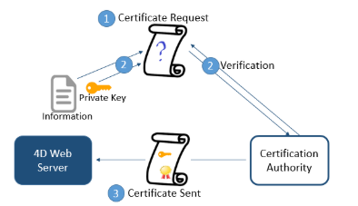

Todos los servidores 4D pueden comunicarse en modo seguro a través del protocolo TLS (Transport Layer Security):

- el servidor web
- el servidor de aplicaciones (aplicaciones de escritorio cliente-servidor)
- el servidor SQL

## Generalidades

El protocolo TLS (sucesor de SSL) ha sido diseñado para asegurar los intercambios de datos entre dos aplicaciones, principalmente entre un servidor web y un navegador. Este protocolo es ampliamente utilizado y es compatible con la mayoría de los navegadores web.

A nivel de red, el protocolo de seguridad se inserta entre la capa TCP/IP (nivel bajo) y el protocolo de alto nivel HTTP. Ha sido diseñado principalmente para trabajar con HTTP.

Configuración de red utilizando TLS:

El protocolo TLS está diseñado para autenticar al emisor y al receptor y para garantizar la confidencialidad e integridad de la información intercambiada:

- **Autenticación**: se confirma la identidad del emisor y del receptor.
- **Confidencialidad**: los datos enviados se cifran para que ninguna tercera persona pueda entender el mensaje.
- **Integridad**: los datos recibidos no han sido modificados, por accidente o de forma malintencionada.

TLS utiliza una técnica de cifrado de llave pública basada en un par de llaves asimétricas para el cifrado y el descifrado: una llave pública y una llave privada. La llave privada se utiliza para encriptar los datos. El remitente (el sitio web) no se la da a nadie. La llave pública se utiliza para descifrar la información y se envía a los receptores (navegadores web) a través de un certificado. Cuando se utiliza TLS con Internet, el certificado se entrega a través de una autoridad de certificación, como Verisign®. El sitio web paga a la Autoridad de Certificación para que le entregue un certificado que garantice la autentificación del servidor y que contenga la llave pública que permita el intercambio de datos de forma segura.
> Para más información sobre el método de encriptación y los temas de llave pública y privada, consulte la descripción del comando `ENCRYPT BLOB`.

## Versión mínima

Por defecto, la versión mínima del protocolo seguro que acepta el servidor es TLS 1.2. Puede modificar este valor utilizando `Min TLS version` con el comando `SET DATABASE PARAMETER`.

Puede controlar el nivel de seguridad de su servidor web definiendo la [versión TLS mínima ](WebServer/webServerConfig.md#minimum-tls-version) aceptada para las conexiones.

## ¿Cómo obtener un certificado?

Un servidor que funciona en modo seguro significa que necesita un certificado digital de una autoridad de certificación. Este certificado contiene diversa información, como el ID del sitio, así como la llave pública utilizada para comunicarse con el servidor. Este certificado se transmite a los clientes (por ejemplo, los navegadores web) que se conectan a este servidor. Una vez identificado y aceptado el certificado, la comunicación se realiza en modo seguro.
> Los navegadores web sólo autorizan los certificados emitidos por una autoridad de certificación referenciada en sus propiedades.

La autoridad de certificación se elige en función de varios criterios. If the certification authority is well known, the certificate will be authorized by many browsers, however the price to pay will be expensive.

Para obtener un certificado digital:

1. Genere una llave privada utilizando el comando `GENERATE ENCRYPTION KEYPAIR`.

:::caution

Por razones de seguridad, la llave privada debe mantenerse siempre en secreto. En realidad, debería permanecer siempre en la máquina del servidor. Para el servidor web, el archivo Key.pem debe colocarse en la carpeta Project.

:::

2. Utilice el comando `GENERATE CERTIFICATE REQUEST` para emitir una solicitud de certificado.

3. Envíe la solicitud de certificado a la autoridad de certificación elegida. Para llenar una solicitud de certificado, es posible que tenga que ponerse en contacto con la autoridad de certificación. La autoridad de certificación comprueba que la información transmitida es correcta. La petición de certificado se genera en un BLOB utilizando el formato PKCS codificado en base64 (formato PEM). Este principio permite copiar y pegar las llaves como texto y enviarlas por correo electrónico sin modificar el contenido de la llave. Por ejemplo, puede guardar el BLOB que contiene la solicitud de certificado en un documento de texto (utilizando el comando `BLOB TO DOCUMENT`), y luego abrirlo y copiar y pegar su contenido en un correo o un formulario web para enviarlo a la autoridad de certificación.

4. Una vez que tenga el certificado, cree un archivo de texto llamado "cert.pem" y pegue en él el contenido del certificado. Puede recibir un certificado de diferentes maneras (normalmente por correo electrónico o formulario HTML). 4D accepts all platform-related text formats for certificates (macOS, PC, Linux, etc.). Sin embargo, el certificado debe estar en formato PEM, *es decir, *, PKCS codificado en base64.
> Los caracteres de fin de línea CR no se soportan por sí solos; debe utilizar CRLF o LF.

5. Coloque el archivo "cert.pem" en la [ubicación adecuada](#instalación-y-activación).

El servidor 4D puede ahora trabajar en modo seguro. El certificado tiene una validez de entre 3 meses y un año.

## Instalación y activación

### Instalar los archivos `key.pem` y `cert.pem`

Para poder utilizar el protocolo TLS con el servidor, debe instalar el **key.pem** (documento que contiene la llave privada de cifrado) y **cert.pem** (documento que contiene el certificado) en la ubicación adecuada). Se requieren diferentes ubicaciones en función del servidor en el que se quiera utilizar TLS.

:::caution

Los archivos *key.pem* y*cert.pem* por defecto se entregan con 4D. Para un mayor nivel de seguridad, le recomendamos encarecidamente que sustituya estos archivos por sus propios certificados.

:::

#### Con el servidor Web

Para ser utilizado por el servidor web de 4D, los archivos **key.pem** y **cert.pem** deben ser colocados:

- con 4D en modo local o 4D Server, junto a la [carpeta del proyecto](Project/architecture.md#project-folder)
- con 4D en modo remoto, en la carpeta de la base cliente en la máquina remota (para más información sobre la ubicación de esta carpeta, ver el comando [`Get 4D folder`](https://doc.4d.com/4dv19/help/command/en/page485.html)).

Debe copiar estos archivos manualmente en la máquina remota.

#### Con el servidor de aplicaciones (aplicaciones de escritorio cliente-servidor)

Para ser utilizados por el servidor de la aplicación 4D, los archivos **key.pem** y **cert.pem** deben colocarse en la carpeta [**Resources**](Project/architecture.md#resources) de la aplicación 4D Server.

#### Con el servidor Web

Para ser utilizado por el servidor SQL de 4D, los archivos **key.pem** y **cert.pem** deben ubicarse junto a la [carpeta del proyecto](Project/architecture.md#project-folder).

### Activar TLS

La instalación de los archivos **key.pem** y **cert.pem** permite utilizar TLS con el servidor 4D. Sin embargo, para que las conexiones TLS sean aceptadas por el servidor, debe habilitarlas:

- Con el servidor web 4D, debe [activar HTTPS](WebServer/webServerConfig.md#enable-https). Puede definir la opción [HSTS](WebServer/webServerConfig.md#enable-hsts) para redirigir a los navegadores que intenten conectarse en modo http.
- Con el servidor de aplicaciones, debe seleccionar la opción **Encriptar las comunicaciones cliente-servidor** en la página "Opciones cliente-servidor/red" del cuadro de diálogo Parámetros.
- Con el servidor SQL, debe seleccionar la opción **Habilitar TLS** en la página "SQL" del cuadro de diálogo Parámetros.

> El servidor web 4D también soporta la opción [HSTS](WebServer/webServerConfig.md#enable-hsts) para declarar que los navegadores sólo deben interactuar con él a través de conexiones seguras HTTPS.

## Perfect Forward Secrecy (PFS)

[PFS](https://en.wikipedia.org/wiki/Forward_secrecy) añade una capa adicional de seguridad a sus comunicaciones. En lugar de utilizar llaves de intercambio predefinidas, PFS crea llaves de sesión de forma cooperativa entre las partes que se comunican utilizando algoritmos Diffie-Hellman (DH). La forma conjunta en que se construyen las llaves crea un "secreto compartido" que impide que partes externas puedan comprometerlas.

Cuando se habilita TLS en el servidor, PFS se habilita automáticamente. Si el archivo *dhparams.pem* (documento que contiene la llave privada DH del servidor) no existe todavía, 4D lo generará automáticamente con un tamaño de llave de 2048. La generación inicial de este archivo puede llevar varios minutos. El archivo se coloca con los archivos [*key.pem* y *cert.pem*](#key-pem-and-cert-pem-files).

Si utiliza una [lista de cifrado personalizada](WebServer/webServerConfig.md##cipher-list) y desea habilitar el PFS, debe comprobar que contiene entradas con algoritmos DH o ECDH (Elliptic-curve Diffie-Hellman).
