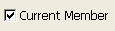

## Corrección ortográfica automática

4D incluye funcionalidades de corrección ortográfica integradas y personalizables. Se pueden verificar las [entradas](input_overview.md) de tipo texto, así como también los documentos [4D Write Pro](writeProArea_overview.md).

La propiedad de corrección ortográfica automática activa la corrección ortográfica de cada objeto. Cuando se utiliza, se realiza automáticamente una corrección ortográfica durante la entrada de datos. También puede ejecutar el comando de lenguaje 4D `SPELL CHECKING` para cada objeto a verificar.

#### Gramática JSON

| Nombre     | Tipos de datos | Valores posibles |
| ---------- | -------------- | ---------------- |
| spellcheck | boolean        | true, false      |

#### Objetos soportados

[Área 4D Write Pro](writeProArea_overview.md) - [Área de entrada](input_overview.md)

---

## Menú contextual

Permite al usuario acceder a un menú contextual estándar en el objeto cuando se ejecuta el formulario.

Para una imagen de tipo [entrada](input_overview.md), además de los comandos de edición estándar (Cortar, Copiar, Pegar y Borrar), el menú contiene el comando **Importar...**, que puede utilizarse para importar una imagen almacenada en un archivo, así como el comando **Guardar como...**, que puede utilizarse para guardar la imagen en el disco. El menú también permite modificar el formato de visualización de la imagen: se ofrecen las opciones **Truncado no centrado**, **Escalado para ajustar** y **Escalado para ajustar centrado prop.**. La modificación del [formato de visualización](properties_Display.md#picture-format) utilizando este menú es temporal; no se guarda con el registro.

Para un tipo de texto [multiestilo](properties_Text.md#multi-style) [input](input_overview.md), además de los comandos de edición estándar, el menú contextual ofrece los siguientes comandos:

- **Fuentes...**: muestra el diálogo del sistema de fuentes
- **Fuentes recientes**: muestra los nombres de las fuentes recientes seleccionadas durante la sesión. La lista puede almacenar hasta 10 fuentes (más allá, la última fuente utilizada sustituye a la más antigua). Por defecto, esta lista está vacía y la opción no se muestra. Puede gestionar esta lista utilizando los comandos `SET RECENT FONTS` y `FONT LIST`.
- comandos para las modificaciones de estilo soportados: fuente, tamaño, estilo, color y color de fondo. Cuando el usuario modifica un atributo de estilo a través de este menú emergente, 4D genera el evento de formulario `On After Edit`.

Para un [Área Web](webArea_overview.md), el contenido del menú depende del motor de renderizado de la plataforma. It is possible to control access to the context menu via the [`WA SET PREFERENCE`](../commands-legacy/wa-set-preference.md) command.

#### Gramática JSON

| Nombre      | Tipos de datos | Valores posibles                          |
| ----------- | -------------- | ----------------------------------------- |
| contextMenu | string         | "automatic" (se utiliza si falta), "none" |

#### Objetos soportados

[Entrada](input_overview.md) - [Área Web](webArea_overview.md) - [Áreas 4D Write Pro](writeProArea_overview.md)

---

## Editable

El atributo Editable indica si los usuarios pueden introducir valores en el objeto.

Los objetos son editables por defecto. Si desea hacer que un campo o un objeto no se pueda introducir en ese formulario, puede desactivar la propiedad Editable del objeto. Un objeto no editable sólo muestra datos. Los datos se controlan mediante métodos que utilizan el nombre del campo o de la variable. Puede seguir utilizando los eventos de formulario `On Clicked`, `On Double Clicked`, `On Drag Over`, `On Drop`, `On Getting Focus` y `On Losing Focus` con objetos no editables. Esto facilita la gestión de menús contextuales personalizados y permite diseñar interfaces en las que es posible arrastrar y soltar y seleccionar variables no introducibles.

Cuando esta propiedad está desactivada, se desactiva todo menú emergente asociado a una columna list box a través de una lista.

#### Gramática JSON

| Nombre   | Tipos de datos | Valores posibles |
| -------- | -------------- | ---------------- |
| editable | boolean        | true, false      |

#### Objetos soportados

[Áreas 4D Write Pro](writeProArea_overview.md) - [Casilla de selección](checkbox_overview.md) - [Lista jerárquica](list_overview.md) - [Entrada](input_overview.md) - [Columna de List Box](listbox_overview.md#list-box-columns) - [Barra de progreso](progressIndicator.md) - [Regla](ruler.md) - [Stepper](stepper.md)

---

## Filtro de entrada

Un filtro de entrada controla exactamente lo que el usuario puede escribir durante la entrada de datos. A diferencia de las [listas obligatorias ](properties_RangeOfValues.md#required-list), por ejemplo, los filtros de entrada funcionan caracter por caracter. Por ejemplo, si un número de componente siempre tiene dos letras seguidas de tres dígitos, puede utilizar un filtro de entrada para restringir al usuario a respetar ese patrón. Incluso puede controlar las letras y números en particular.

Un filtro de entrada sólo funciona durante la entrada de datos. No tiene efecto en la visualización de los datos después de que el usuario deseleccione el objeto. En general, se utilizan conjuntamente los filtros de entrada con los [formatos de visualización](properties_Display.md). El filtro restringe la entrada de datos y el formato asegura la correcta visualización del valor tras la entrada de datos.

Durante la entrada de datos, un filtro de entrada evalúa cada caracter a medida que se escribe. Si el usuario intenta escribir un caracter no válido (un número en lugar de una letra, por ejemplo), 4D simplemente no lo acepta. El caracter null permanece sin cambios hasta que el usuario escribe un caracter válido.

Los filtros de entrada también pueden utilizarse para mostrar los caracteres de formato necesarios para que el usuario no tenga que introducirlos. Por ejemplo, un número de teléfono estadounidense tiene un código de área de tres dígitos, seguido de un número de siete dígitos que se divide en dos grupos de tres y cuatro dígitos, respectivamente. Se puede utilizar un formato de visualización para encerrar el código de área entre paréntesis y para mostrar un guión después del tercer dígito del número de teléfono. Cuando se utiliza este formato, el usuario no necesita introducir los paréntesis ni los guiones.

### Definir un filtro de entrada

La mayoría de las veces, puede utilizar uno de los [filtros integrados](#default-entry-filters) de 4D para lo que necesite; sin embargo, también puede crear y utilizar filtros personalizados:

- puede introducir directamente una cadena de definición de filtro
- o puede introducir el nombre de un filtro de entrada creado en el editor de filtros de la caja de herramientas. Los nombres de los filtros personalizados que se crean comienzan con una barra vertical (|).

Para obtener información sobre la creación de filtros de entrada, consulte [Códigos de filtro y formato](https://doc.4d.com/4Dv18/4D/18/Filter-and-format-codes.300-4575706.en.html).

### Filtros de entrada por defecto

A continuación se presenta una tabla que explica cada una de las opciones de filtro de entrada en la lista desplegable Filtro de entrada:

| Filtro de entrada                      | Descripción                                                                                                                                                              |
| -------------------------------------- | ------------------------------------------------------------------------------------------------------------------------------------------------------------------------ |
| ~A                                     | Permite la entrada de todas las letras, pero las conviete a mayúsculas.                                                                                                  |
| &9                                     | Permitir sólo números.                                                                                                                                                   |
| &A                                     | Permitir sólo letras mayúsculas.                                                                                                                                         |
| &a                                     | Permitir sólo letras (mayúsculas y minúsculas).                                                                                                                          |
| &@                                     | Permitir sólo caracteres alfanuméricos. No hay caracteres especiales.                                                                                                    |
| ~a##                                   | Abreviatura del nombre del estado (por ej., CA). Permite la entrada de dos letras, pero las convierte en mayúsculas.                                                     |
| !0&9##/##/##                           | Formato de entrada de fechas estándar. Mostrar ceros en los espacios de entrada. Permitir cualquier número.                                                              |
| !0&9 Día: ## Mes: ## Año: ##           | Time entry format. Mostrar ceros en los espacios de entrada. Permitir cualquier número. Limited to hours and minutes.                                                    |
| !0&9##:##                              | Formato de entrada de hora. Limitado a horas y minutos. Mostrar ceros en los espacios de entrada. Permitir cuatro números, separados por dos puntos.                     |
| !0&9## Horas ## Minutos ## Segundos    | Formato de entrada de hora. Mostrar ceros en los espacios de entrada. Permitir dos números antes de cada palabra.                                                        |
| !0&9Horas: ## Minutas: ## Segundos: ## | Formato de entrada de hora. Mostrar ceros en los espacios de entrada. Permitir dos números después de cada palabra.                                                      |
| !0&9##-##-##-##                        | Formato de número de teléfono local. Mostrar ceros en los espacios de entrada. Permitir cualquier número. Tres entradas, guión, cuatro entradas.                         |
| !_&9(###)!0###-####                    | Número de teléfono de larga distancia. Mostrar guiones bajos en los tres primeros espacios de entrada, ceros en el resto.                                                |
| !0&9###-###-###                        | Número de teléfono de larga distancia. Mostrar ceros en los espacios de entrada. Permitir cualquier número. Tres entradas, guión, tres entradas, guión, cuatro entradas. |
| !0&9###-##-###                         | Número de la Seguridad Social. Mostrar ceros en los espacios de entrada. Permitir cualquier número.                                                                      |
| ~"A-Z;0-9; ;,;.;-"                     | Letras mayúsculas y puntuación. Permita sólo letras mayúsculas, números, espacios, comas, puntos y guiones.                                                              |
| &"a-z;0-9; ;,;.;-"                     | Letras mayúsculas y minúsculas y puntuación. Permite letras minúsculas, números, espacios, comas, puntos y guiones.                                                      |
| &"0-9;.;-"                             | Números. Sólo se permiten números, puntos decimales y guiones (signo menos).                                                                                             |

#### Gramática JSON

| Nombre      | Tipos de datos | Valores posibles                                    |
| ----------- | -------------- | --------------------------------------------------- |
| entryFilter | string         | <li>Código de filtro de entrada</li> o <li>Nombre del filtro de entrada (los nombres de los filtros empiezan por &#124;)</li> |

#### Objetos soportados

[Check Box](checkbox_overview.md) - [Combo Box](comboBox_overview.md) - [ Lista jerárquica](list_overview.md) - [Área de entrada](input_overview.md) - [Columna List Box](listbox_overview.md#list-box-columns)

---

## Focusable

Cuando la propiedad **Enfocable** está activada para un objeto, el objeto puede tener el foco (y por lo tanto puede ser activado por el teclado por ejemplo). Cuando está seleccionado, aparece delimitado por una línea de puntos gris, excepto si también se ha seleccionado la opción [Ocultar rectángulo de enfoque](properties_Appearance.md#hide-focus-rectangle).

> Un [objeto de entrada](input_overview.md) es siempre enfocable si tiene la propiedad [Editable](#enterable).

-  Casilla de verificación muestra el foco cuando se selecciona

-  La casilla de verificación está seleccionada pero no se puede mostrar el foco|

Cuando se selecciona la propiedad **Enfocable** para un objeto no editable, el usuario puede seleccionar, copiar o incluso arrastrar y soltar el contenido del área.

#### Gramática JSON

| Nombre    | Tipos de datos | Valores posibles |
| --------- | -------------- | ---------------- |
| focusable | boolean        | true, false      |

#### Objetos soportados

[Áreas 4D Write Pro](writeProArea_overview.md) - [Botón](button_overview.md) - [Casilla de selección](checkbox_overview.md) - [Lista desplegable](dropdownList_Overview.md) - [Lista jerárquica](list_overview.md) - [Entrada](input_overview.md) - [List Box](listbox_overview.md) - [Área Plug-in](pluginArea_overview.md) - [Botón de radio](radio_overview.md) - [Subformulario](subform_overview.md)

---

## Disposición del teclado

Esta propiedad asocia una distribución de teclado específica a un [objeto de entrada](input_overview.md). Por ejemplo, en una aplicación internacional, si un formulario contiene un campo cuyo contenido debe introducirse en caracteres griegos, puede asociar a este campo la disposición de teclado "griego". De este modo, durante la entrada de datos, la configuración del teclado cambia automáticamente cuando este campo tiene el foco.

Por defecto, el objeto utiliza la disposición actual del teclado.

> También puede configurar y obtener el teclado dinámicamente utilizando los comandos `OBJECT SET KEYBOARD LAYOUT` y `OBJECT Get keyboard layout`.

#### Gramática JSON

| Nombre          | Tipos de datos | Valores posibles                                                               |
| --------------- | -------------- | ------------------------------------------------------------------------------ |
| keyboardDialect | text           | Código del lenguaje, por ejemplo "ar-ma" o "cs". Ver RFC3066, ISO639 e ISO3166 |

#### Objetos soportados

[Áreas 4D Write Pro](writeProArea_overview.md) - [Área de entrada](input_overview.md)

---

## Multilínea

Esta propiedad está disponible para [objetos de entrada](input_overview.md) que contienen expresiones de tipo Texto y campos de tipo Alfa y Texto. Puede tener tres valores diferentes: Sí, No, Automático (por defecto).

#### Automático

- En las entradas de una línea, las palabras situadas al final de las líneas se truncan y no hay retornos de línea.
- En las entradas multilínea, 4D realiza retornos de línea automáticos:  
  

#### No

- En las entradas de una línea, las palabras situadas al final de las líneas se truncan y no hay retornos de línea.
- Nunca hay retornos de línea: el texto siempre se muestra en una sola línea. Si el campo o la variable Alfa o Texto contiene retornos de carro, el texto situado después del primer retorno de carro se elimina en cuanto se modifica el área:  
  

#### Sí

Cuando se selecciona este valor, la propiedad es gestionada por la opción [Retorno de línea](properties_Display.md#wordwrap).

#### Gramática JSON

| Nombre     | Tipos de datos | Valores posibles                                       |
| ---------- | -------------- | ------------------------------------------------------ |
| multilínea | text           | "yes", "no", "automatic" (por defecto si no se define) |

#### Objetos soportados

[Entrada](input_overview.md)

---

## Marcador

4D puede mostrar texto con marcador de posición en los campos de sus formularios.

El texto del marcador de posición aparece como texto de marca de agua en un campo, suministrando un mensaje de ayuda, una indicación o un ejemplo de los datos que deben introducirse. Este texto desaparece tan pronto como el usuario ingrese un caracter en el área:

El texto del marcador de posición vuelve a aparecer si se borra el contenido del campo.

Se puede mostrar un marcador de posición para los siguientes tipos de datos:

- cadena (text o alpha)
- fecha y hora en que se activa la propiedad **Blank if null**.

Puede utilizar una referencia XLIFF en la forma ":xliff:resname" como marcador de posición, por ejemplo:

 :xliff:PH_Lastname

Sólo se pasa la referencia en el campo "Marcador de posición"; no es posible combinar una referencia con texto estático.
> You can also set and get the placeholder text by programming using the [`OBJECT SET PLACEHOLDER`](../commands-legacy/object-set-placeholder.md) and [`OBJECT Get placeholder`](../commands-legacy/object-get-placeholder.md) commands.

#### Gramática JSON

| Nombre      | Tipos de datos | Valores posibles                                                    |
| ----------- | -------------- | ------------------------------------------------------------------- |
| placeholder | string         | Texto a mostrar (en gris) cuando el objeto no contiene ningún valor |

#### Objetos soportados

[Combo Box](comboBox_overview.md) - [Área de entrada](input_overview.md)

#### Ver también

[Mensaje de ayuda](properties_Help.md)

---

## Selección siempre visible

Esta propiedad mantiene la selección visible dentro del objeto después de haber perdido el foco. Esto facilita la implementación de interfaces que permiten modificar el estilo del texto (ver [Multi estilo](properties_Text.md#multi-style)).

#### Gramática JSON

| Nombre        | Tipos de datos | Valores posibles |
| ------------- | -------------- | ---------------- |
| showSelection | boolean        | true, false      |

#### Objetos soportados

[Áreas 4D Write Pro](writeProArea_overview.md) - [Área de entrada](input_overview.md)

---

## Atajo

Esta propiedad permite definir teclas de significado especial (atajos de teclado) para los [botones](button_overview.md), los [botones radio](radio_overview.md) y las [casillas de selección](checkbox_overview.md). Permiten al usuario utilizar el control utilizando el teclado en lugar de tener que utilizar el ratón.

Puede configurar esta opción haciendo clic en el botón [...] de la propiedad Accesos directos de la Lista de propiedades.

> También puede asignar un acceso directo a un comando de menú personalizado. Si hay un conflicto entre dos accesos directos, el objeto activo tiene prioridad. For more information about associating shortcuts with menus, refer to [Setting menu properties](../Menus/properties.md).

To view a list of all the shortcuts used in the 4D Design environment, see the [Shortcuts Page](../Preferences/shortcuts.md) in the Preferences dialog box.

#### Gramática JSON

| Nombre          | Tipos de datos | Valores posibles                                   |
| --------------- | -------------- | -------------------------------------------------- |
| shortcutAccel   | boolean        | true, false (Windows: Ctrl/macOS: Command)         |
| shortcutAlt     | boolean        | true, false                                        |
| shortcutCommand | boolean        | true, false                                        |
| shortcutControl | boolean        | true, false (macOS: Control)                       |
| shortcutShift   | boolean        | true, false                                        |
|                 |                |                                                    |
| shortcutKey     | string         | <li>toda llave de caracter: "a", "b"...</li><li>[F1]" -> "[F15]", "[Return]", "[Enter]", "[Backspace]", "[Tab]", "[Esc]", "[Del]", "[Home]", "[End]", "[Help]", "[Page up]", "[Page down]", "[left arrow]", "[right arrow]", "[up arrow]", "[down arrow]"</li> |

#### Objetos soportados

[Button](button_overview.md) - [Check Box](checkbox_overview.md) - [Picture Button](pictureButton_overview.md) - [Radio Button](radio_overview.md)

---

## Edición con un solo clic

Permite el paso directo al modo de edición en list boxes.

Cuando esta opción está activada, las celdas del list box cambian al modo de edición tras un solo clic del usuario, independientemente de si esta área del list box estaba seleccionada de antemano o no. Tenga en cuenta que esta opción permite editar celdas incluso cuando el list box [modo selección](properties_ListBox.md#selection-mode) está en "Ninguno".

Cuando esta opción no está activa, los usuarios deben seleccionar primero la línea de celdas y luego, hacer clic en una celda para editar su contenido.

#### Gramática JSON

| Nombre          | Tipos de datos | Valores posibles |
| --------------- | -------------- | ---------------- |
| singleClickEdit | boolean        | true, false      |

#### Objetos soportados

[List Box](listbox_overview.md)
