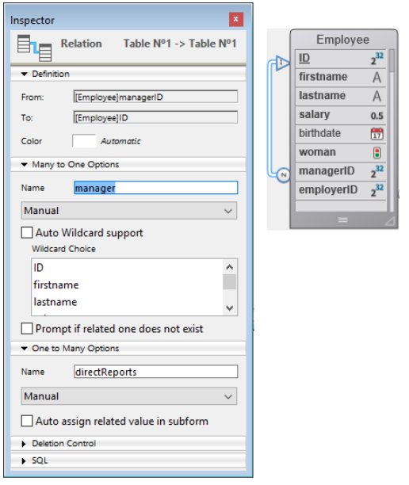
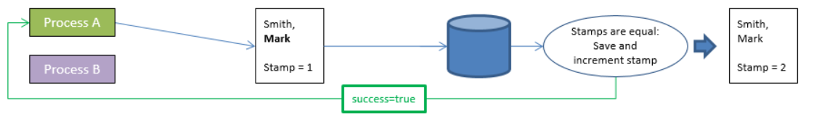

En ORDA, se accede a los datos a través de [entidades](dsMapping.md#entity) y [selecciones de entidades](dsMapping.md#entity-selection). Estos objetos permiten crear, actualizar, buscar u ordenar los datos del datastore.


## Crear una entidad

Hay dos maneras de crear una nueva entidad en una dataclass:

*   Como las entidades son referencias a registros de base de datos, puede crear entidades creando registros utilizando el lenguaje 4D "clásico" y luego referenciarlos con métodos ORDA tales como `entity.next( )` o `entitySelection.first( )`.
*   También puede crear una entidad utilizando el método `dataClass.new( )`.

Tenga en cuenta que la entidad sólo se crea en la memoria. Si desea añadirla al almacén de datos, debe llamar al método `entity.save( )`.

Los atributos de la entidad están disponibles directamente como propiedades del objeto entidad. Para más información, consulte [Uso de los atributos de entidad](#using-entity-attributes).

Por ejemplo, queremos crear una nueva entidad en la dataclass "Employee" en el datastore actual con "John" y "Dupont" asignados a los atributos firstname y name:

```4d
var $myEntity : cs.EmployeeEntity
$myEntity:=ds.Employee.new() //Crear un nuevo objeto de tipo entidad
$myEntity.name:="Dupont" //asignar 'Dupont' al atributo 'name'
$myEntity.firstname:="John" //asignar 'John' al atributo 'firstname'
$myEntity.save() //guardar la entidad
```
> Una entidad se define sólo en el proceso en el que fue creada. No se puede, por ejemplo, almacenar una referencia a una entidad en una variable interproceso y utilizarla en otro proceso.

## Entidades y referencias

Una entidad contiene una referencia a un registro 4D. Diferentes entidades pueden referenciar el mismo registro 4D. Además, como una entidad puede almacenarse en una variable objeto 4D, diferentes variables pueden contener una referencia a la misma entidad.

Si ejecuta el siguiente código:

```4d
 var $e1; $e2 : cs.EmployeeEntity
 $e1:=ds.Employee.get(1) //accede al empleado con ID 1
 $e2:=$e1
 $e1.name:="Hammer"
  //ambas variables $e1 y $e2 comparten la referencia a la misma entidad
  //$e2.name contiene "Hammer"
```

Esto es ilustrado por el siguiente gráfico:


Ahora, si se ejecuta:

```4d
 var $e1; $e2 : cs.EmployeeEntity
 $e1:=ds.Employee.get(1)
 $e2:=ds.Employee.get(1)
 $e1.name:="Hammer"
  //variable $e1 contiene una referencia a una entidad
  //variable $e2 contiene otra referencia a otra entidad
  //$e2.name contiene "smith"
```

Esto es ilustrado por el siguiente gráfico:


Sin embargo, hay que tener en cuenta que las entidades se refieren al mismo registro. En todos los casos, si se llama al método `entity.save( )`, el registro se actualizará (excepto en caso de conflicto, ver [Entity locking](#entity-locking)).

De hecho, `$e1` y `$e2` no son la entidad misma, sino referencias a la entidad. Significa que puede pasarlos directamente a cualquier función o método, y actuará como un puntero, y más rápido que un puntero 4D. Por ejemplo:

```4d
 For each($entity;$selection)
    do_Capitalize($entity)
 End for each
```

Y el método es:

```4d
 $entity:=$1
 $name:=$entity.lastname
 If(Not($name=Null))
    $name:=Uppercase(Substring($name;1;1))+Lowercase(Substring($name;2))
 End if
 $entity.lastname:=$name
```

Puede manejar las entidades como cualquier otro objeto en 4D y pasar sus referencias directamente como [parámetros](Concepts/parameters.md).
> Con las entidades, no existe el concepto de "registro actual" como en el lenguaje clásico de 4D. Puede utilizar tantas entidades como necesite al mismo tiempo. Tampoco existe un bloqueo automático de una entidad (ver [Bloqueo de una entidad](#entity-locking)). Cuando se carga una entidad, se utiliza el mecanismo de [lazy loading](glossary.md#lazy-loading), lo que significa que sólo se carga la información necesaria. No obstante, en cliente/servidor, la entidad puede cargarse directamente de forma automática si es necesario.


## Uso de los atributos de entidades

Los atributos de entidad almacenan los datos y mapean los campos correspondientes en la tabla correspondiente. Los atributos de entidad del tipo de almacenamiento pueden definirse u obtenerse en forma de propiedades simples del objeto entidad, mientras que las entidades de tipo **relatedEntity** o **relatedEntities** devolverán una entidad o una selección de entidades.
> Para más información sobre el tipo de atributo, consulte el párrafo [Atributos de almacenamiento y de relación](dsMapping.md#storage-and-relation-attributes).

Por ejemplo, para definir un atributo de almacenamiento:

```4d
 $entity:=ds.Employee.get(1) //obtener el atributo de Employee con ID 1
 $name:=$entity.lastname //obtener el nombre del empleado, por ejemplo "Smith"
$entity.lastname:="Jones" //definir el nombr del empleado
$entity.save() //guardar los cambios
```

> Los campos Blob de las bases de datos (los [blobs escalares](Concepts/dt_blob.md) se convierten automáticamente en atributos de objetos blob ([`4D.Blob`](Concepts/dt_blob.md)) cuando se manejan a través de ORDA. Cuando guarde un atributo de objeto blob, tenga en cuenta que, a diferencia del tamaño del objeto blob, que sólo está limitado por la memoria disponible, el tamaño del campo blob está limitado a 2 GB.

El acceso a un atributo relacionado depende del tipo de atributo. Por ejemplo, con la siguiente estructura:


Puede acceder a los datos a través del objeto(s) relacionado(s):

```4d
 $entity:=ds.Project.all().first().theClient //obtener la entidad Company asociada al proyecto
 $EntitySel:=ds.Company.all().first().companyProjects //obtener la selección de proyectos de la empresa
```

Observe que tanto *theClient* como *companyProjects* en el ejemplo anterior son atributos de relación primaria y representan una relación directa entre las dos dataclasses. Sin embargo, los atributos de relación también pueden crearse a partir de rutas vía las relaciones de varios niveles, incluidas las referencias circulares. Por ejemplo, consideremos la siguiente estructura:



Cada empleado puede ser gerente y puede tener un gerente. Para obtener el gerente del gerente de un empleado, puede simplemente escribir:

```4d
 $myEmp:=ds.Employee.get(50)
 $manLev2:=$myEmp.manager.manager.lastname
```

## Asignar los valores a los atributos de relación

En la arquitectura ORDA, los atributos de relación contienen directamente los datos relacionados con las entidades:

*   Un atributo de relación de tipo N->1 (**relatedEntity** kind) contiene una entidad
*   Un atributo de relación de tipo 1->N (**relatedEntities** kind) contiene una selección de entidades

Veamos la siguiente estructura (simplificada):


En este ejemplo, una entidad de la dataclass "Employee" contiene un objeto de tipo Entity en el atributo "employer" (o un valor nulo). Una entidad de la dataclass "Company" contiene un objeto de tipo EntitySelection en el atributo "staff" (o un valor nulo).
> En ORDA, la propiedad Automática o Manual de las relaciones no tiene ningún efecto.

Para asignar un valor directamente al atributo "employer", debe pasar una entidad existente de la dataclass "Company". Por ejemplo:

```4d
 $emp:=ds.Employee.new() //crear un empleado
 $emp.lastname:="Smith" //asignar un valor a un atributo
 $emp.employer:=ds.Company.query("name =:1"; "4D")[0]  //asignar una entidad de empresa
 $emp.save()
```

También puede obtener directamente la entidad relacionada "uno" a través de su valor de llave primaria (Number o Text). Por ejemplo:

```4d
 $emp:=ds.Employee.new()
 $emp.lastname:="Wesson"
 $emp.employer:=ds.Company.get(2)
  //obtiene la entidad Company con valor de llave primaria 2
  //se la asigna al empleado
 $emp.save()
```

Esto resulta especialmente útil cuando se importan grandes cantidades de datos de una base de datos relacional. Este tipo de importación suele contener una columna "ID", que hace referencia a una llave primaria que puede asignarse directamente a un atributo de relación.


Puede asignar o modificar el valor de un atributo de entidad asociado "1" a partir de la dataclass "N" directamente vía el atributo relacionado. Por ejemplo, si desea modificar el atributo de nombre de una entidad Company asociada de una entidad Employee, puede escribir:

```code4d
 $emp:=ds.Empleado.get(2) // carga la entidad Employee con la llave primaria 2
 $emp.employer.name:="4D, Inc." //modificar el atributo de nombre de la empresa asociada
 $emp.employer.save() //guardar el atributo asociado
  //la entidad asociada se actualiza
```

## Crear una entity selection

Puede crear un objeto de tipo [entity selection](dsMapping.md#entity-selection) de la siguiente manera:

*   Lance una búsqueda en las entidades [en una dataclass](API/DataClassClass.md#query) o en una [selección de entidades existente](API/EntitySelectionClass.md#query);
*   Utilice la función de dataclass [`.all()`](API/DataClassClass.md#all) para seleccionar todas las entidades de una dataclass;
*   Utilice el comando `Create entity selection` o la función de dataclass [`.newSelection()`](API/DataClassClass.md#newselection) para crear una selección de entidades vacía;
*   Utilice la función [`.copy()`](API/EntitySelectionClass.md#copy) para duplicar una selección de entidades existente;
*   Utilice una de las diversas funciones de [Entity selection class](API/EntitySelectionClass.md) que devuelve una nueva selección de entidades, como [`.or()`](API/EntitySelectionClass.md#or);
*   Utilizando un atributo de relación de tipo "related entities" (ver abajo).

Puede crear y utilizar simultáneamente tantas selecciones de entidades diferentes como desee para una dataclass. Tenga en cuenta que una selección de entidades sólo contiene referencias a entidades. Diferentes selecciones de entidades pueden contener las referencias a las mismas entidades.

### Entity selections compartibles o modificables

Una entity selection puede ser **compartible** (legible por múltiples procesos, pero no alterable después de la creación) o **modificable** (soporta la función [`.add()`](API/EntitySelectionClass.md#add), pero sólo utilizable por el proceso actual).

#### Propiedades

Una entity selection **compartible** tiene las siguientes características:

- puede almacenarse en un objeto compartido o en una colección compartida, y puede pasarse como parámetro entre varios procesos o workers;
- puede almacenarse en varios objetos o colecciones compartidos, o en un objeto o colección compartido que ya pertenezca a un grupo;
- no permite la adición de nuevas entidades. Al intentar añadir una entidad a una entity selection compartibles se producirá un error (1637 - Esta entity selection no puede modificarse). Para añadir una entidad a una entity selection compartible, primero debe transformarla en una entity selection no compartible mediante la función [`.copy()`](API/EntitySelectionClass.md#copy), antes de llamar a [`.add()`](API/EntitySelectionClass.md#add).

> La mayoría de las funciones entity selection (como [`.slice()`](API/EntitySelectionClass.md#slice), [`.and()`](API/EntitySelectionClass.md#and)...) soportan selecciones de entidades compartibles, ya que no necesitan alterar la selección de entidades original (devuelven una nueva).

Una entity selection **modificable** tiene las siguientes características:

- no puede compartirse entre los procesos, ni almacenarse en un objeto o colección compartido. Si se intenta almacenar una entity selection no compartible en un objeto o colección compartido, se producirá un error (-10721 - Tipo de valor no soportado en un objeto o colección compartido);
- acepta la adición de nuevas entidades, es decir, soporta la función [`.add()`](API/EntitySelectionClass.md#add).


#### ¿Cómo se definen?

La naturaleza **compartible** o **modificable** de una entity selection se define cuando se crea (no puede modificarse posteriormente). Puede conocer la naturaleza de una entity selection utilizando la función [.isAlterable()](API/EntitySelectionClass.md#isalterable) o el comando `OB Is shared`.


Una nueva entity selection es **compartible** en los siguientes casos:

- la nueva entity selection resulta de una función de clase ORDA aplicada a una dataClass: [dataClass.all()](API/DataClassClass.md#all), [dataClass.fromCollection()](API/DataClassClass.md#fromcollection), [dataClass.query()](API/DataClassClass.md#query),
- la nueva entity selection se basa en una relación [entidad.*attributeName*](API/EntityClass.md#attributename) (por ejemplo, "company.employees") cuando *attributeName* es un atributo relacionado uno a muchos pero la entidad no pertenece a una entity selection.
- la nueva entity selection se copia explícitamente como compartible con [entitySelection.copy()](API/EntitySelectionClass.md#copy) o `OB Copy` (es decir, con la opción `ck shared`).

Ejemplo:
```4d
$myComp:=ds.Empresa.get(2) //$myComp no pertenece a una entity selection
$employees:=$myComp.empleados //$employees es compartible
```

Una nueva entity selection es **compartible** en los siguientes casos:

- la nueva entity selection creada en un espacio vacío utilizando la función [dataClass.newSelection()](API/DataClassClass.md#newselection) o el comando `Create entity selection`,
- la nueva entity selection se copia explícitamente como modificable con [entitySelection.copy()](API/EntitySelectionClass.md#copy) o `OB Copy` (es decir, sin la opción `ck shared`).

Ejemplo:
```4d
$toModify:=ds.Company.all().copy() //$toModify es modificable
```


Una nueva entity selection **hereda** de la naturaleza de la entity selection original en los siguientes casos:

- la nueva entity selection resulta de una de las varias funciones de clase ORDA aplicadas a una entity selection existente ([.query()](API/EntitySelectionClass.md#query), [.slice()](API/EntitySelectionClass.md#slice), etc.) .
- la nueva entity selection se basa en una relación:
    - [entity.*attributeName*](API/EntityClass.md#attributename) (por ejemplo, "company.employees") cuando *attributeName* es un atributo relacionado de uno a muchos y la entidad pertenece a una entity selection (de la misma naturaleza que [.getSelection()](API/EntityClass.md#getselection)),
    - [entitySelection.*attributeName*](API/EntitySelectionClass.md#attributename) (por ejemplo, "employees.employer") cuando *attributeName* es un atributo relacionado (de la misma naturaleza que la entity selection),
    - [.extract()](API/EntitySelectionClass.md#extract) cuando la colección resultante contiene selecciones de entidades (de la misma naturaleza que la entity selection).

Ejemplos:

```4d
$highSal:=ds.Employee.query("salary >= :1"; 1000000)   
    //$highSal es compartible debido a la búsqueda en dataClass
$comp:=$highSal.employer //$comp es compartible porque $highSal es compartible

$lowSal:=ds.Employee.query("salary <= :1"; 10000).copy() 
    //$lowSal es modificable debido a copy()
$comp2:=$lowSal.employer //$comp2 es modificable porque $lowSal es modificable
```

:::note Selecciones de entidades devueltas por el servidor

En la arquitectura cliente/servidor, las selecciones de entidades devueltas por el servidor son siempre compartibles en el cliente, incluso si [`copy()`](API/EntitySelectionClass.md#copy) fue llamada en el servidor. Para que dicha selección de entidades sea alterable en el cliente, es necesario ejecutar [`copa()`](API/EntitySelectionClass.md#copa) del lado del cliente. Ejemplo:

```4d
    /una función se ejecuta siempre en el servidor
exposed Function getSome() : cs.MembersSelection
    devuelve This.query("ID >= :1"; 15).orderBy("ID ASC")

    //en un método, se ejecuta en el lado remoto
var $result : cs.MembersSelection
var $alterable : Boolean
$result:=ds.Members.getSome() //$result es compartible
$alterable:=$result.isAlterable() //False

$result:=ds.Members.getSome().copy() // $result es ahora alterable
$alterable:=$result.isAlterable() // True
```

:::


#### Compartir una selección de entidades entre procesos (ejemplo)

Se trabaja con dos selecciones de entidades que se quieren pasar a un proceso worker para que envíe correos a las personas adecuadas:

```4d

var $paid; $unpaid : cs.InvoicesSelection
//Obtenemos selecciones de entidades para facturas pagadas y no pagadas
$paid:=ds.Invoices.query("status=:1"; "Paid")
$unpaid:=ds.Invoices.query("status=:1"; "Unpaid")

//Pasamos referencias de selección de entidades como parámetros al worker
CALL WORKER("mailing"; "sendMails"; $paid; $unpaid)

```

El método `sendMails`:

```4d 

 #DECLARE ($paid : cs.InvoicesSelection; $unpaid : cs.InvoicesSelection)
 var $invoice : cs.InvoicesEntity

 var $server; $transporter; $email; $status : Object

  //Preparar emails
 $server:=New object()
 $server.host:="exchange.company.com"
 $server.user:="myName@company.com"
 $server.password:="my!!password"
 $transporter:=SMTP New transporter($server)
 $email:=New object()
 $email.from:="myName@company.com"

  //Bucles en selecciones de entidades
 For each($invoice;$paid)
    $email.to:=$invoice.customer.address // dirección de correo electrónico del cliente
    $email.subject:="Payment OK for invoice # "+String($invoice.number)

    $status:=$transporter.send($email)
 End for each

 For each($invoice;$unpaid)
    $email.to:=$invoice.customer.address // dirección de correo electrónico del cliente
    $email.subject:="Please pay invoice # "+String($invoice.number)
    $status:=$transporter.send($email)
 End for each
```


### Selecciones de entidades y atributos de almacenamiento

Todos los atributos de almacenamiento (texto, número, booleano, fecha) están disponibles como propiedades de las selecciones de entidades, así como de las entidades. Cuando se utiliza junto con una selección de entidad, un atributo escalar devuelve una colección de valores escalares. Por ejemplo:

```4d
 $locals:=ds.Person.query("ciudad = :1"; "San José") //entity selection de personas
 $localEmails:=$locals.emailAddress //colección de direcciones de correo electrónico (cadenas)
```

Este código devuelve en *$localEmails* una colección de direcciones de correo electrónico como cadenas.

### Selecciones de entidades y atributos de relación

Además de la variedad de formas en que puede consultar, también puede utilizar los atributos de relación como propiedades de selecciones de entidades para devolver nuevas selecciones de entidades. Por ejemplo, consideremos la siguiente estructura:


```4d
 $myParts:=ds.Part.query("ID < 100") //Devuelve las piezas con ID inferior a 100
 $myInvoices:=$myParts.invoiceItems.invoice
  //Todas las facturas con al menos un elemento relacionado con una pieza en $myParts
```

La última línea devolverá en $myInvoices una selección de entidades de todas las facturas que tengan al menos un elemento de factura relacionado con una pieza en la selección de entidades myParts. Cuando se utiliza un atributo de relación como propiedad de una selección de entidades, el resultado es siempre otra selección de entidades, aunque sólo se devuelva una entidad. Cuando se utiliza un atributo de relación como propiedad de una selección de entidades y no se devuelve ninguna entidad, el resultado es una selección de entidades vacía, no nula.


## Bloqueo de una entidad

A menudo es necesario gestionar los posibles conflictos que pueden surgir cuando varios usuarios o procesos cargan e intentan modificar las mismas entidades al mismo tiempo. El bloqueo de registros es una metodología utilizada en las bases de datos relacionales para evitar actualizaciones incoherentes de los datos. El concepto consiste en bloquear un registro al leerlo para que ningún otro proceso pueda actualizarlo o, alternativamente, comprobar al guardar un registro que ningún otro proceso lo ha modificado desde que se leyó. El primero se denomina **bloqueo de registro pesimista** y garantiza que un registro modificado pueda escribirse a expensas de bloquear los registros a otros usuarios. Este último se conoce como **bloqueo de registro optimista** y cambia la garantía de los privilegios de escritura en el registro por la flexibilidad de decidir privilegios de escritura sólo si el registro necesita ser actualizado. En el bloqueo de registros pesimista, el registro se bloquea aunque no haya necesidad de actualizarlo. En el bloqueo optimista de registros, la validez de la modificación de un registro se decide en el momento de la actualización.

ORDA le ofrece dos modos de bloqueo de entidad:

- un modo automático "optimista", adecuado para la mayoría de las aplicaciones,
- un modo "pesimista" que permite bloquear las entidades antes de su acceso.

### Bloqueo optimista automático

Este mecanismo automático se basa en el concepto de "bloqueo optimista", especialmente adaptado a los problemas de las aplicaciones web. Este concepto se caracteriza por los siguientes principios de funcionamiento:

*   Todas las entidades pueden cargarse siempre en lectura-escritura; no existe el "bloqueo" *a priori* de las entidades.
*   Cada entidad tiene un sello de bloqueo interno que se incrementa cada vez que se guarda.
*   Cuando un usuario o proceso intenta guardar una entidad utilizando el método `entity.save( )`, 4D compara el valor del marcador de la entidad a guardar con el de la entidad encontrada en los datos (en el caso de modificación):
    *   Cuando los valores coinciden, se guarda la entidad y se incrementa el valor del marcador interno.
    *   Cuando los valores no coinciden, significa que otro usuario ha modificado esta entidad mientras tanto. No se guarda y se devuelve un error.

El siguiente diagrama ilustra el bloqueo optimista:

1. Dos procesos cargan la misma entidad.<br/><br/>

2. El primer proceso modifica la entidad y valida el cambio. Se llama al método `entity.save( )`. El motor 4D compara automáticamente el valor del marcador interno de la entidad modificada con el de la entidad almacenada en los datos. Como corresponden, la entidad se guarda y el valor de su marcador se incrementa.<br/><br/>

3. El segundo proceso también modifica la entidad cargada y valida sus cambios. Se llama al método `entity.save( )`. Dado que el valor del marcador de la entidad modificada no coincide con el de la entidad almacenada en los datos, no se realiza el guardado y se devuelve un error.<br/><br/>


Esto también puede ilustrarse con el siguiente código:

```4d
 $person1:=ds.Person.get(1) //Referencia a la entidad
 $person2:=ds.Person.get(1) //Otra referencia a la misma entidad
 $person1.name:="Bill"
 $result:=$person1.save() //$result.success=true, cambio guardado
 $person2.name:="William"
 $result:=$person2.save() //$result.success=false, cambio no guardado
```

En este ejemplo, asignamos a $person1 una referencia a la entidad person con una llave de 1. A continuación, asignamos otra referencia de la misma entidad a la variable $person2. Con $person1, cambiamos el nombre de la persona y guardamos la entidad. Cuando intentamos hacer lo mismo con $person2, 4D verifica que la entidad en el disco es la misma que cuando se asignó por primera vez la referencia en $person1. Como no es lo mismo, devuelve false en la propiedad success y no guarda la segunda modificación.

Cuando se produce esta situación, puede, por ejemplo, volver a cargar la entidad desde el disco utilizando el método `entity.reload()` para poder intentar realizar de nuevo la modificación. El método `entity.save()` también propone una opción "automerge" para guardar la entidad en caso de que los procesos modificaran atributos que no fueran los mismos.

> Los mardadores de registro no se utilizan en las de **transacciones** porque en este contexto sólo existe una única copia de un registro. Sea cual sea el número de entidades que hacen referencia a un registro, se modifica la misma copia, por lo que las operaciones `entity.save()` nunca generarán errores de marcador.

### Bloqueo pesimista

Puede bloquear y desbloquear las entidades bajo pedido cuando acceda a los datos. Cuando una entidad es bloqueada por un proceso, es cargada en lectura/escritura en este proceso pero es bloqueada para todos los otros procesos. La entidad sólo puede cargarse en modo de sólo lectura en estos procesos; sus valores no pueden editarse ni guardarse.

Esta funcionalidad se basa en dos funciones de la clase `Entity`:

*   [`entity.lock()`](../API/EntityClass.md#lock)
*   [`entity.unlock()`](../API/EntityClass.md#unlock)

Para más información, consulte las descripciones de estas funciones.

> Los bloqueos pesimistas también pueden gestionarse a través de la [REST API](../REST/$lock.md).


### Utilización simultánea de los bloqueos clásicos 4D y de los bloqueos pesimistas ORDA

El uso de comandos clásicos y ORDA para bloquear registros se basa en los siguientes principios:

*   Un bloqueo definido con un comando 4D clásico en un registro impide a ORDA bloquear la entidad correspondiente al registro.
*   Un bloqueo definido con ORDA en una entidad impide que los comandos 4D clásicos bloqueen el registro que coincide a la entidad.

Estos principios se muestran en el siguiente diagrama:


Los **bloqueos de transacciones** también se aplican tanto a los comandos clásicos como a los comandos ORDA. En una aplicación multiproceso o multiusuario, un bloqueo definido en una transacción en un registro por un comando clásico tendrá como resultado impedir que cualquier otro proceso bloquee las entidades relacionadas con este registro (o a la inversa), hasta que la transacción sea validada o cancelada.

*   Ejemplo con un bloqueo definido por un comando clásico:<br/><br/>
*   Ejemplo con un bloqueo definido por una función ORDA:<br/><br/>
