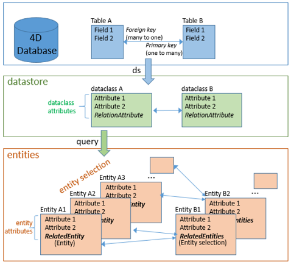

## Visión general de los principales conceptos




## Acción

Todas las acciones que pueden realizarse en un [recurso](#resource). Las acciones disponibles son: crear, leer, actualizar, eliminar, ejecutar, promover y describir.

## Atributo

Un atributo es la celda de almacenamiento más pequeña de una base de datos relacional (ver también [Atributo relacional](#relación-atributo)). No hay que confundir los atributos de la dataclass con los atributos de las entidades:

*   En un objeto dataclass, cada propiedad es un atributo de dataclass que se asigna a un campo correspondiente en la tabla correspondiente (mismo nombre y tipo).
*   En un objeto entity, los atributos de entidades son propiedades que contienen los valores para los atributos del almacén de datos correspondientes.
> Attributes and properties are similar concepts. "Atributo" se utiliza para designar las propiedades de la dataclass que almacena datos, mientras que "propiedad" es más genérico y define un dato almacenado dentro de un objeto.

## AttributePath

Un attributePath es la ruta de un atributo al interior de una determinada clase de datos o de una entidad. Ver también [PropertyPath](#propertypath).


## Class code

Código para la(s) función(es) de clase usuarios.


## Atributo calculado

Un atributo calculado no almacena realmente información. En cambio, determina su valor basándose en otros valores de la misma entidad o de otras entidades, atributos o funciones. Cuando se hace referencia a un atributo calculado, se evalúa el "cálculo" subyacente para determinar el valor. Los atributos calculados pueden incluso asignarse a valores en los que el código definido por el usuario determina qué hacer durante la asignación.

## Data model class

Clase extendida disponible para un objeto del modelo de datos.

## Data model object

Objetos de base de datos disponibles a través del concepto ORDA, es decir, datastore, dataclasses, entities y entity selections.

## Data model function

Función de una clase de modelo de datos ORDA.

## Dataclass

Una dataclass es un modelo de objeto que describe los datos. Las tablas de la base de datos suministradas por el datastore se manejan mediante clases de datos. Cada tabla de la base de datos ofrecida por el almacén de datos tiene una clase de datos correspondiente con el mismo nombre. Cada campo de la tabla es un atributo de la dataclass.

Un dataclass está relacionado con un único datastore.


## DataClass class

Clase para los objetos dataclass específicos, en la que se pueden añadir funciones personalizadas.

## Datastore

Un dtastore es el objeto de interfaz suministrado por ORDA para referenciar una estructura y acceder a sus datos. La base de datos principal, devuelta por el comando `ds`, está disponible como datastore (el datastore principal).

Un datastore ofrece:

*   una conexión a la base de datos 4D
*   un conjunto de clases de datos para trabajar con la base de datos

La base puede ser una base local 4D (el datastore principal), o una base 4D Server expuesta como recurso REST (un datastore remoto).

Un datastore referencia solo a una base de datos. Sin embargo, es posible abrir varios datastores para acceder a varias bases.

## DataStore class

Clase para los objetos datastore, en la que puede agregar funciones personalizadas.


## DataStoreImplementation

Nombre interno de la clase genérica DataStore en el class store `4D`.

## Copia profunda

Una copia profunda (deep copy) duplica un objeto y todas las referencias que contiene. Tras una copia profunda, una colección copiada contiene elementos duplicados y, por tanto, nuevas referencias de todos los elementos originales. Ver también Copia superficial.

## ds

`ds` es el comando del lenguaje 4D que devuelve una referencia de objeto [datastore](dsMapping.md#datastore). Coincide con el datastore disponible en la base de datos principal 4D.

## Entity

Una entidad es un objeto que corresponde a un modelo de dataclass. Una entidad contiene los mismos atributos que la dataclass.

Una entidad puede verse como una instancia de la dataclass, como un registro de la tabla correspondiente a la dataclass en su datastore asociado. Sin embargo, una entidad también contiene los datos relacionados. La finalidad de la entidad es gestionar los datos (crear, actualizar, eliminar).

For more information, see [entities](entities.md).

## Entity selection

Una selección de entidades es un objeto. Cuando se consulta el datastore, se devuelve una selección de entidades. Una selección de entidades es un conjunto de referencias a las entidades relacionadas con la dataclass.

Una selección de entidades contiene:


*   un conjunto de 0 a X referencias de entidades,
*   una propiedad length (siempre),
*   las propiedades queryPlan y queryPath (si se preguntan durante la consulta).

Una selección de entidades también puede estar vacía.


## Generic class

Clase integrada para los objetos ORDA tales como las entidades o las dataclasses. Las funciones y propiedades de las clases genéricas están disponibles automáticamente en las clases usuario extendidas, por ejemplo `EmployeeEntity`.


## Lazy loading

Dado que las entidades se gestionan como referencias, los datos sólo se cargan cuando es necesario, es decir, cuando se accede a ellos en el código o a través de los widgets de la interfaz. Este principio de optimización se denomina "lazy loading".

## Datastore principal

El objeto Datastore correspondiente a la base 4D abierta (autónoma o cliente/servidor). El datastore principal es devuelto por el comando ds.

## Método

Los objetos ORDA, como los datastores, dataclasses, entity selections y entities, definen las clases de objetos. Proporcionan los métodos específicos para interactuar directamente con ellos. Estos métodos también se llaman funciones miembros (member functions). Estos métodos se utilizan llamándolos sobre una instancia del objeto.

Por ejemplo, el método `query()` es una member function de dataclass. Si ha almacenado un objeto dataclass en la variable `$myClass`, puede escribir:

```code4d
$myClass.query("name = smith")
```

## Tipo de datos mixtos

En esta documentación, el tipo de datos "Mixto" se utiliza para designar los distintos tipos de valores que pueden almacenarse en los atributos de las clases de datos. Incluye:

*   number
*   text
*   null
*   boolean
*   date
*   object
*   collection
*   imagen(\*)

*(\*) el tipo Imagen no es soportado por los métodos estadísticos tales como* `entitySelection.max( )`.

## Bloqueo optimista

En el modo "bloqueo optimista", las entidades no se bloquean explícitamente antes de actualizarlas. Cada entidad tiene un marcador interno que se incrementa automáticamente cada vez que la entidad se guarda en el disco. Los métodos entity.save( ) o entity.drop( ) devolverán un error si el marcador de la entidad cargada (en memoria) y el marcador de la entidad en el disco no coinciden, o si la entidad ha sido suprimida. El bloqueo optimista sólo está disponible en la implementación ORDA. Ver también " Bloqueo pesimista ".

## Bloqueo pesimista

Un "bloqueo pesimista" significa que una entidad se bloquea antes de que se acceda a ella, utilizando el método entity.lock( ). Los otros procesos no pueden actualizar ni suprimir la entidad hasta que se desbloquee. El lenguaje 4D clásico sólo permite bloqueos pesimistas. Ver "Bloqueo optimista".


## Privilegio

La capacidad de ejecutar una o varias [acciones](#actions) en [recursos](#resource). Se pueden reunir varios privilegios en un [rol](#role) según la lógica empresarial.

## Propiedad

Ver [Atributo](#attribute).
> > *Attributes* and *properties* are similar concepts. "Atributo" se utiliza para designar las propiedades de la dataclass que almacena datos, mientras que "propiedad" es más genérico y define un dato almacenado dentro de un objeto.

## PropertyPath

Un propertyPath es la ruta de acceso a una propiedad en un objeto dado. Si la propiedad está anidada en varios niveles, cada nivel estará separado por un punto (".").

## Regular class

Clase usuario no relacionada a un objeto ORDA.

## Related dataclass

Estas son dataclasses vinculadas por los atributos de relación.

## Atributo relacional

Los atributos de relación se utilizan para conceptualizar las relaciones entre las clases de datos (muchos a uno y uno a muchos).

*   Relación Muchos a uno (la dataclassA hace referencia a una instancia de la dataclassB): un atributo de relación está disponible en la dataclassA y hace referencia a una instancia de dataclassB.
*   Relación Uno a muchos (una ocurrencia de la dataclassB hace referencia a varias ocurrencias de la dataclassA): un atributo de relación está disponible en la dataclassB y hace referencia a varias instancias de la dataclassA.

Una dataclass puede tener atributos de relación recursivos.

En una entidad, el valor de un atributo de relación puede ser una entidad o una selección de entidades.

## Related entities

Una entidad relacionada puede verse como la instancia de un atributo de relación en una clase de datos.

Las selecciones de entidades pueden referirse a entidades relacionadas según los atributos de relación definidos en las clases de datos correspondientes.

## Remote datastore

Una base de datos 4D abierta en un servidor 4D o 4D Server (disponible a través de HTTP) y expuesta como recurso REST. Esta base de datos puede ser referenciada localmente como un Datastore desde otras estaciones de trabajo, donde se le asigna un locaID. El almacén de datos remoto puede utilizarse mediante los conceptos ORDA (almacén de datos, clase de datos, selección de entidades...). Este uso se somete a un sistema de licencia.


## Recurso

Un elemento ORDA sobre el que se puede permitir o no cualquier[acción](#action) en función de un [privilegio](#privilege). Los recursos disponibles son: el almacén de datos, una clase de datos, un atributo de clase de datos, una función del modelo de datos ORDA o un método proyecto.


## Rol

Un rol es un [privilegio](#privilege) publicado destinado a ser utilizado por un administrador. Puede contener uno o varios privilegios.


## Session

Cuando la aplicación 4D se conecta a un datastore Remoto, se crea una sesión en el 4D Server (HTTP). Se genera una cookie de sesión y se asocia al identificador del datastore local.

Cada vez que se abre una nueva sesión, se utiliza una licencia. Cada vez que se cierra una sesión, se libera la licencia.

Las sesiones inactivas se cierran automáticamente después de un tiempo de espera. El tiempo de espera por defecto es de 48 horas, puede ser fijado por el desarrollador (debe ser >= 60 minutos).

## Copia superficial (Shallow copy)

Una copia superficial sólo duplica la estructura de los elementos y mantiene las mismas referencias internas. Tras una copia superficial, dos colecciones compartirán los elementos individuales. Ver también Copia profunda.

## Stamp

Utilizado en tecnología de bloqueo "optimista". Todas las entidades tienen un contador interno, el marcador, que se incrementa cada vez que se guarda la entidad. Al comparar automáticamente los marcadores entre una entidad que se está guardando y su versión almacenada en disco, 4D puede evitar las modificaciones concurrentes en las mismas entidades.

## Atributo de almacenamiento

Un atributo de almacenamiento (a veces llamado atributo escalar) es el tipo más básico de atributo en una clase de datastore y corresponde más directamente a un campo en una base de datos relacional. Un atributo de almacenamiento contiene un único valor para cada entidad de la clase.
