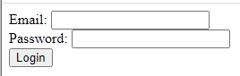

Las peticiones REST pueden beneficiarse de [sesiones de usuario web](WebServer/sessions.md), ofreciendo funcionalidades extra como la gestión de múltiples peticiones, la posibilidad de compartir datos entre los procesos del cliente web y los privilegios del usuario.

Como primer paso para abrir una sesión REST en el servidor 4D, el usuario que envía la solicitud debe estar autenticado.


## Autenticación de los usuarios

Usted inicia la sesión de un usuario en su aplicación llamando a [`$directory/login`]($directory.md#directorylogin) en una petición POST incluyendo el nombre y la contraseña del usuario en el encabezado. Esta petición llama al método base `On REST Authentication` (si existe), donde se pueden comprobar las credenciales del usuario (ver ejemplo abajo).

## Apertura de las sesiones

Cuando las [sesiones escalables se activan](WebServer/sessions.md#enabling-sessions) (recomendado), si el método base `On REST Authentication` devuelve `true`, se abre automáticamente una sesión de usuario y se puede manejar a través del objeto `Session` y la [API Session](API/SessionClass.md). Las siguientes peticiones REST reutilizarán la misma cookie de sesión.

Si no se ha definido el método base `On REST Authentication`, se abre una sesión `guest`.

## Modo apropiativo

En 4D Server, las peticiones REST se gestionan automáticamente a través de procesos apropiativos, **incluso en modo interpretado**. Debe asegurarse de que su código es [compatible con una ejecución apropiativa](../WebServer/preemptiveWeb.md#writing-thread-safe-web-server-code).

> To debug interpreted web code on the server machine, make sure the debugger is [attached to the server](../Debugging/debugging-remote.md) or [to a remote machine](../Debugging/debugging-remote.md). Los procesos web pasan entonces al modo cooperativo y se puede depurar el código del servidor web.

Con 4D monopuesto, el código interpretado siempre se ejecuta en modo cooperativo.

## Ejemplo

En este ejemplo, el usuario introduce su correo electrónico y contraseña en una página html que solicita [`$directory/login`]($directory.md#directorylogin) en un POST (se recomienda utilizar una conexión HTTPS para enviar la página html). Se llama al método base `On REST Authentication` para validar las credenciales y establecer la sesión.

Página de inicio de sesión HTML:




```html
<html><body bgcolor="#ffffff">

<div id="demo">
    <FORM name="myForm">
Email: <INPUT TYPE=TEXT NAME=userId VALUE=""><br/>
Password: <INPUT TYPE=TEXT NAME=password VALUE=""><br/>
<button type="button" onclick="onClick()">
Login
</button>
<div id="authenticationFailed" style="visibility:hidden;">Authentication failed</div>
</FORM>
</div>

<script>
function sendData(data) {
  var XHR = new XMLHttpRequest();

  XHR.onreadystatechange = function() {
    if (this.status == 200) {      
      window.location = "authenticationOK.shtml"; 
      }
      else {
      document.getElementById("authenticationFailed").style.visibility = "visible";
      }
  };

  XHR.open('POST', 'http://127.0.0.1:8044/rest/$directory/login'); //dirección del servidor rest

  XHR.setRequestHeader('username-4D', data.userId);
  XHR.setRequestHeader('password-4D', data.password);
  XHR.setRequestHeader('session-4D-length', data.timeout);

  XHR.send();
};
function onClick()
{
sendData({userId:document.forms['myForm'].elements['userId'].value , password:document.forms['myForm'].elements['password'].value , timeout:120})
}
</script></body></html>

```

Cuando la página de inicio de sesión se envía al servidor, se llama al método base `On REST Authentication`:

```4d
    //On REST Authentication

#DECLARE($userId : Text; $password : Text) -> $Accepted : Boolean
var $sales : cs.SalesPersonsEntity

$Accepted:=False

    //Una URL '/rest' ha sido llamada con los encabezados username-4D y password-4D
If ($userId#"")
    $sales:=ds.SalesPersons.query("email = :1"; $userId).first()
    If ($sales#Null)
        If (Verify password hash($password; $sales.password))
            fillSession($sales)
            $Accepted:=True
        End if 
    End if 
End if 
```

> Tan pronto como se ha llamado y devuelto `True`, el método base `On REST Authentication` deja de llamarse en la sesión.

El método proyecto `fillSession` inicializa la sesión usuario, por ejemplo:

```4d
#DECLARE($sales : cs.SalesPersonsEntity)
var $info : Object

$info:=New object()
$info.userName:=$sales.firstname+" "+$sales.lastname

Session.setPrivileges($info)

Use (Session.storage)
    If (Session.storage.myTop3=Null)
        Session.storage.myTop3:=$sales.customers.orderBy("totalPurchase desc").slice(0; 3)
    End if 
End use
```
