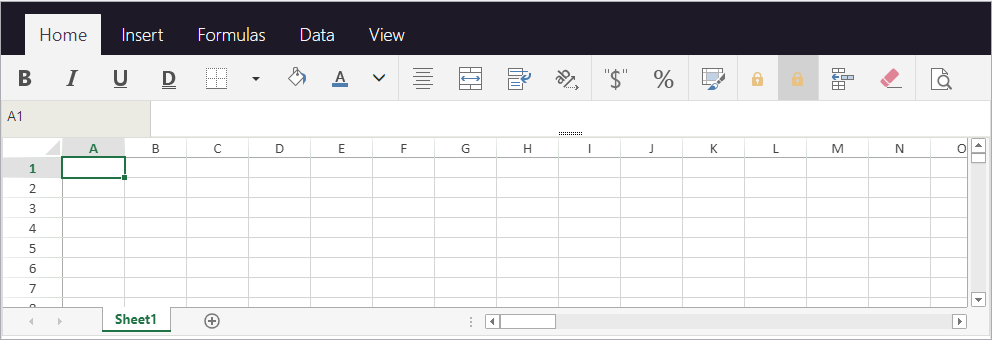
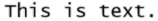

Las propiedades del área 4D View Pro pueden configurarse utilizando la lista de propiedades. Las propiedades de las hojas de cálculo están disponibles a través del lenguaje.

## Propiedades del área de formulario

Utilizando la lista de propiedades del área, puede configurar las [propiedades objeto 4D View Pro](FormObjects/viewProArea_overview.md#supported-properties) como **Nombre del objeto**, [**Variable o expresión**](#4d-view-pro-form-object-variable), **Apariencia**, **Acción**, y **Eventos**.


### Selección de una interfaz usuario

Puede seleccionar la interfaz a utilizar con sus áreas de formulario 4D View Pro en la **Lista de propiedades**, en **Apariencia**:


> También puede utilizar las propiedades JSON [`userInterface`](FormObjects/properties_Appearance.md#user-interface) y [`withFormulaBar`](FormObjects/properties_Appearance.md#show-formula-bar)(sólo con la interfaz "toolbar").

Las interfaces permiten realizar modificaciones básicas y manipular los datos. Las modificaciones definidas por el usuario se guardan en el objeto 4D View Pro cuando el usuario guarda el documento.

#### Cinta


#### Toolbar (Barra de herramientas)

Al activar la interfaz de la barra de herramientas aparece la opción [**Mostrar barra de fórmula**](FormObjects/properties_Appearance.md#show-formula-bar). Cuando se selecciona, la barra de fórmulas es visible debajo de la interfaz Barra de herramientas.

Con barra de fórmula visible:



#### Funcionalidades

Tanto la interfaz de la cinta de opciones como la de la barra de herramientas agrupan funciones relacionadas en pestañas:

| Pestaña  | Acciones                        | Interfaz Cinta | Interfaz Barra de herramientas |
| -------- | ------------------------------- |:--------------:|:------------------------------:|
| File     | Gestión de archivos             |       X        |                                |
| Inicio   | Apariencia del texto            |       X        |               X                |
| Insertar | Añadir elementos                |       X        |               X                |
| Fórmulas | Cálculos de fórmulas y librería |       X        |               X                |
| Datos    | Gestión de los datos            |       X        |               X                |
| Mostrar  | Presentación visual             |       X        |               X                |
| Settings | Presentación de la hoja         |       X        |                                |

## Eventos formulario

Los siguientes eventos formulario están disponibles en la Lista de propiedades de las áreas 4D View Pro.

Algunos de los eventos son eventos formulario estándar (disponibles para todos los objetos activos) y otros son eventos formulario específicos de 4D View Pro. Algunos eventos formulario estándar suministran información extendida en el objeto devuelto por el comando [`FORM Event`](https://doc.4d.com/4dv19/help/command/en/page1606.html) cuando son generados para las áreas 4D View Pro. La siguiente tabla indica los eventos estándar y los eventos específicos o los que ofrecen información adicional a las áreas 4D View Pro:

| Evento 4D estándar                              | Eventos 4D View Pro específicos y extendidos          |
| ----------------------------------------------- | ----------------------------------------------------- |
| [On Load](../Events/onLoad.md)                  | [On VP Ready](../Events/onVpReady.md)                 |
| [On Getting Focus](../Events/onGettingFocus.md) | [On Clicked](../Events/onClicked.md)                  |
| [On Losing Focus](../Events/onLosingFocus.md)   | [On Double Clicked](../Events/onDoubleClicked.md)     |
| [On Unload](../Events/onUnload.md)              | [On Header Click](../Events/onHeaderClick.md)         |
|                                                 | [On After Edit](../Events/onAfterEdit.md)             |
|                                                 | [On Selection Change](../Events/onSelectionChange.md) |
|                                                 | [On Column Resize](../Events/onColumnResize.md)       |
|                                                 | [On Row Resize](../Events/onRowResize.md)             |
|                                                 | [On VP Range Changed](../Events/onVpRangeChanged.md)  |

## Opciones hoja

El objeto opciones hoja 4D View Pro le permite controlar varias opciones de sus áreas 4D View Pro. Este objeto es manejado por los siguientes comandos:

* [VP SET SHEET OPTIONS](method-list.md#vp-set-sheet-options)
* [VP Get sheet options](method-list.md#vp-get-sheet-options)

### Apariencia de la hoja

| Propiedad            |                        | Tipo         | Descripción                                                                                                                                                                                                                                                                                                  |
| -------------------- | ---------------------- | ------------ | ------------------------------------------------------------------------------------------------------------------------------------------------------------------------------------------------------------------------------------------------------------------------------------------------------------ |
| allowCellOverflow    |                        | boolean      | Especifica si los datos pueden desbordarse hacia las celdas vacías adyacentes.                                                                                                                                                                                                                               |
| sheetTabColor        |                        | string       | Una cadena color utilizada para representar el color de la pestaña de la hoja, como "red", "#FFFF00", "rgb(255,0,0)", "Accent 5", etc.                                                                                                                                                                       |
| frozenlineColor      |                        | string       | Una cadena color utilizada para representar el color de la línea congelada, como "red", "#FFFF00", "rgb(255,0,0)", "Accent 5", "Acento 5", etc.                                                                                                                                                              |
| clipBoardOptions     |                        | entero largo | La opción portapapeles. Valores disponibles: `vk clipboard paste options all`, `vk clipboard paste options formatting`, `vk clipboard paste options formulas`, `vk clipboard paste options formulas and formatting`, `vk clipboard paste options values`, `vk clipboard paste options values and formatting` |
| rejilla              |                        | object       | Las opciones de la línea de rejilla.                                                                                                                                                                                                                                                                         |
|                      | color                  | string       | Una cadena color utilizada para representar el color de la línea de la cuadrícula, como "red", "#FFFF00", "rgb(255,0,0)", "Accent 5", etc.                                                                                                                                                                   |
|                      | showVerticalGridline   | boolean      | Especifica si se debe mostrar la línea de la cuadrícula vertical.                                                                                                                                                                                                                                            |
|                      | showHorizontalGridline | boolean      | Especifica si mostrar o no la línea de rejilla horizontal.                                                                                                                                                                                                                                                   |
| rowHeaderVisible     |                        | boolean      | Especifica si el encabezado de la línea es visible.                                                                                                                                                                                                                                                          |
| colHeaderVisible     |                        | boolean      | Especifica si el encabezado de la columna es visible.                                                                                                                                                                                                                                                        |
| rowHeaderAutoText    |                        | entero largo | Especifica si el encabezado de la linea muestra letras o números o está en blanco. Valores disponibles: `vk header auto text blank`, `vk header auto text letters`, `vk header auto text numbers`                                                                                                            |
| colHeaderAutoText    |                        | entero largo | Especifica si el encabezado de la columna muestra letras o números o está en blanco. Valores disponibles: `vk header auto text blank`, `vk header auto text letters`, `vk header auto text numbers`                                                                                                          |
| selectionBackColor   |                        | string       | El color de fondo de la selección para la hoja. (formato RGBA preferido)                                                                                                                                                                                                                                     |
| selectionBorderColor |                        | string       | El color del borde de la selección para la hoja.                                                                                                                                                                                                                                                             |
| sheetAreaOffset      |                        | object       | Las opciones de sheetAreaOffset.                                                                                                                                                                                                                                                                             |
|                      | left                   | entero largo | El desplazamiento a la izquierda de la hoja desde la local.                                                                                                                                                                                                                                                  |
|                      | top                    | entero largo | El desplazamiento superior de la hoja desde el local.                                                                                                                                                                                                                                                        |
> Todas las propiedades son opcionales.

### Protección de la hoja

Para bloquear toda la hoja, basta con poner la propiedad *isProtected* en **true**. A continuación, puede desbloquear las celdas individualmente colocando la propiedad de estilo de celda [bloqueada](#layout).

| Propiedad         |                          | Tipo    | Descripción                                                                                                                       |
| ----------------- | ------------------------ | ------- | --------------------------------------------------------------------------------------------------------------------------------- |
| isProtected       |                          | boolean | Especifica si las celdas de esta hoja que están marcadas como protegidas no se pueden editar.                                     |
| protectionOptions |                          | object  | Valor que indica los elementos que desea que los usuarios puedan modificar. Si null : el parámetro protectionOptions se reinicia. |
|                   | allowSelectLockedCells   | boolean | Especifica si el usuario puede seleccionar celdas bloqueadas, opcional. True por defecto.                                         |
|                   | allowSelectUnlockedCells | boolean | Indica si el usuario puede seleccionar las celdas no bloqueadas, opcional. True por defecto.                                      |
|                   | allowSort                | boolean | Especifica si el usuario puede ordenar rangos, opcional. Falso por defecto.                                                       |
|                   | allowFilter              | boolean | Especifica si el usuario puede filtrar rangos, opcional. Falso por defecto.                                                       |
|                   | allowEditObjects         | boolean | Indica si el usuario puede editar los objetos flotantes, opcional. Falso por defecto.                                             |
|                   | allowResizeRows          | boolean | Indica si el usuario puede redimensionar las líneas, opcional. Falso por defecto.                                                 |
|                   | allowResizeColumns       | boolean | Indica si el usuario puede redimensionar las columnas, opcional. Falso por defecto.                                               |
|                   | allowDragInsertRows      | boolean | Especifica si el usuario puede realizar la operación de arrastre para insertar líneas, opcional. Falso por defecto.               |
|                   | allowDragInsertColumns   | boolean | Especifica si el usuario puede realizar la operación de arrastre para insertar columnas, opcional. Falso por defecto.             |
|                   | allowInsertRows          | boolean | Indica si el usuario puede insertar las líneas, opcional. Falso por defecto.                                                      |
|                   | allowInsertColumns       | boolean | Indica si el usuario puede insertar las columnas, opcional. Falso por defecto.                                                    |
|                   | allowDeleteRows          | boolean | Indica si el usuario puede eliminar las líneas, opcional. Falso por defecto.                                                      |
|                   | allowDeleteColumns       | boolean | Indica si el usuario puede eliminar las columnas, opcional. Falso por defecto.                                                    |
> Todas las propiedades son opcionales.

## Formato de las celdas

La definición de un modelo de formato garantiza que el contenido de sus documentos 4D View Pro se muestre de la forma que usted desea. Los formatos pueden definirse utilizando la [interfaz](#selecting-a-user-interface) 4D View Pro seleccionada, o utilizando los métodos [VP SET VALUE](method-list.md#vp-set-value) o [VP SET NUM VALUE](method-list.md#vp-set-num-value).

4D View Pro tiene formatos integrados para números, fechas, horas y texto, pero también puede crear sus propios modelos para dar formato al contenido de las celdas utilizando caracteres y códigos especiales.

Por ejemplo, al utilizar los métodos [VP SET VALUE](method-list.md#vp-set-value) o [VP SET NUM VALUE](method-list.md#vp-set-num-value) para introducir las cifras en una factura, es posible que desee que los símbolos de moneda ($, €, ¥, etc.) se alineen independientemente del espacio requerido por el número (es decir, si el importe es de 5,00 $ o de 5.000,00 $). Podría utilizar caracteres de formato y espectificar el patrón _($* #,##0.00_) que mostraría los importes como se muestra:


Tenga en cuenta que al crear sus propios formatos, sólo se modifica la visualización de los datos. El valor de los datos permanece sin cambios.

### Formatos numérico y texto

Los formatos numéricos se aplican a todos los tipos de números (por ejemplo, positivos, negativos y ceros).

| Caracter  | Descripción                                                                                                                                                                                                                                          | Ejemplo                                                                                                                                                 |
| --------- | ---------------------------------------------------------------------------------------------------------------------------------------------------------------------------------------------------------------------------------------------------- | ------------------------------------------------------------------------------------------------------------------------------------------------------- |
| 0         | Marcador de posición que muestra ceros.                                                                                                                                                                                                              | #.00 mostrará 1.1 como 1.10                                                                                                                             |
| .         | Muestra un punto decimal                                                                                                                                                                                                                             | 0.00 mostrará 1999 como 1999.00                                                                                                                         |
| ,         | Muestra el separador de miles en un número. Los miles se separan por comas si el formato contiene una coma encerrada por signos de número "#" o por ceros. Una coma a continuación de un marcador de posición de dígitos escala el número por 1.000. | #,0 mostrará 12200000 como 12,200,000                                                                                                                   |
| \_      | Salta el ancho del siguiente caracter.                                                                                                                                                                                                               | Suele utilizarse en combinación con paréntesis para añadir sangrías a izquierda y derecha, \_( y _) respectivamente.                                  |
| @         | Formateador de texto. Aplica el formato a todo el texto de la celda                                                                                                                                                                                  | "\[Red]@" aplica el color de fuente rojo para los valores de texto.                                                                                    |
| *         | Repite el siguiente caracter para llenar el ancho de la columna.                                                                                                                                                                                     | 0*- incluirá suficientes guiones después de un número para llenar la celda, mientras que *0 antes de cualquier formato incluirá ceros a la izquierda. |
| " "       | Muestra el texto entre comillas sin interpretarlo.                                                                                                                                                                                                   | "8%" será mostrado como: 8%                                                                                                                             |
| %         | Muestra los números como un porcentaje de 100.                                                                                                                                                                                                       | 8% se mostrará como 0,08                                                                                                                                |
| \#      | Marcador de posición de dígitos que no muestra ceros adicionales. Si un número tiene más dígitos a la derecha del decimal que marcadores de posición, el número se redondea.                                                                         | #.# mostrará 1.54 como 1.5                                                                                                                              |
| ?         | Marcador de posición de dígitos que deja espacio para ceros adicionales, pero no los muestra. Normalmente se utiliza para alinear números por punto decimal.                                                                                         | $?? $?? displays a maximum of 2 decimals and causes dollar signs to line up for varying amounts.                                                        |
| \        | Muestra el caracter que lo sigue.                                                                                                                                                                                                                    | #.00\? #.00\? will display 123 as 123.00?                                                                                                             |
| /         | Cuando se utiliza con números, los muestra como fracciones. Cuando se utiliza con códigos de texto, fecha u hora, se muestra "tal cual".                                                                                                             | #/# mostrará .75 como 3/4                                                                                                                               |
| \[ ]     | Crea formatos condicionales.                                                                                                                                                                                                                         | \[>100]\[GREEN]#,##0;\[`<=-100`]\[YELLOW]#,##0;\[BLUE]#,##0                                                                                     |
| E         | Formato notación científica.                                                                                                                                                                                                                         | #E+# - mostrará 2E+6 en lugar de 1,500,500                                                                                                              |
| \[color] | Formatea el texto o el número en el color especificado                                                                                                                                                                                               | \[Green]###.##\[Red]-###.###                                                                                                                          |

#### Ejemplo

```4d
//Definir el valor de la celda como $125,571.35
VP SET VALUE(VP Cell("ViewProArea";3;2);New object("value";125571.35;"format";"_($* #,##0.00_)")
```

### Formatos fecha y hora

4D View Pro ofrece las siguientes constantes para los modelos de fecha y hora ISO 8601:

| Constante                                 | Valor                                | Comentario                                                                                                                                                             |
| ----------------------------------------- | ------------------------------------ | ---------------------------------------------------------------------------------------------------------------------------------------------------------------------- |
| `vk pattern full date time`               | "*fullDateTimePattern*"              | ISO 8601 format for the full date and time in current localization. USA default pattern: "dddd, dd MMMM yyyy HH:mm:ss"                                                 |
| `vk pattern long date`                    | "*longDatePattern*"                  | ISO 8601 format for the full date in current localization. USA default pattern: "dddd, dd MMMM yyyy"                                                                   |
| `vk pattern long time`                    | "*longTimePattern*"                  | ISO 8601 format for the time in current localization. USA default pattern: "HH:mm:ss"                                                                                  |
| `vk pattern month day`                    | "*monthDayPattern*"                  | ISO 8601 format for the month and day in current localization. USA default pattern: "MMMM dd"                                                                          |
| `vk pattern short date`                   | "*shortDatePattern*"                 | Abbreviated ISO 8601 format for the date in current localization. USA default pattern: "MM/dd/yyyy"                                                                    |
| `vk pattern short time`                   | "*shortTimePattern*"                 | Abbreviated ISO 8601 format for the time in current localization. USA default pattern: "HH:mm"                                                                         |
| `vk pattern sortable date time`           | "*sortableDateTimePattern*"          | ISO 8601 format for the date and time in current localization which can be sorted. USA default pattern: "yyyy\'-\'MM\'-\'dd\'T\'HH\':\'mm\':\'ss"            |
| `vk pattern universal sortable date time` | "*universalSortableDateTimePattern*" | ISO 8601 format for the date and time in current localization using UTC which can be sorted. USA default pattern: "yyyy\'-\'MM\'-\'dd HH\':\'mm\':\'ss\'Z\'" |
| `vk pattern year month`                   | "*yearMonthPattern*"                 | ISO 8601 format for the month and year in current localization. USA default pattern: "yyyy MMMM"                                                                       |

#### Ejemplo

```4d
//Definir el valor de la celda como fecha y hora específicas
VP SET VALUE(VP Cell("ViewProArea";3;9);New object("value";!2024-12-18!);"time";?14:30:10?;"format";vk pattern full date time))
```

### Formato fecha y hora personalizados

Para crear sus propios patrones de fecha y hora, en su localización actual, puede utilizar combinaciones de los siguientes códigos:

|       | Code<br/>(no distingue entre mayúsculas y minúsculas) | Descripción                                                     | Ejemplo               |
| ----- | ----------------------------------------------------------- | --------------------------------------------------------------- | --------------------- |
| Fecha |                                                             |                                                                 | (January 1, 2019)     |
|       | m                                                           | Número de mes sin cero inicial                                  | 1                     |
|       | mm                                                          | Número de mes con cero precedente                               | 01                    |
|       | mmm                                                         | Nombre del mes, corto                                           | Jan                   |
|       | mmmm                                                        | Nombre del mes, long                                            | January               |
|       | d                                                           | Número del día sin el cero inicial                              | 1                     |
|       | dd                                                          | Número de días con cero precedente                              | 01                    |
|       | ddd                                                         | Día de la semana, corto                                         | Tue                   |
|       | dddd                                                        | Día de la semana, largo                                         | Tuesday               |
|       | yy                                                          | Año, formato corto                                              | 19                    |
|       | yyyy                                                        | Año, formato largo                                              | 2019                  |
| Hora  |                                                             |                                                                 | (2:03:05 PM)          |
|       | h                                                           | Hora sin cero precedente. 0-23                                  | 2                     |
|       | hh                                                          | Hora con cero precedente. 00-23                                 | 02                    |
|       | m                                                           | Minutos sin cero inicial. 0-59                                  | 3                     |
|       | mm                                                          | Minutos con cero precedente. 00-59                              | 03                    |
|       | s                                                           | Segundos sin cero a la izquierda. 0-59                          | 5                     |
|       | ss                                                          | Segundo con cero precedente. 00-59                              | 05                    |
|       | \[h]                                                       | Tiempo transcurrido en horas                                    | 14 (puede superar 24) |
|       | \[mm]                                                      | Tiempo transcurrido en minutos                                  | 843                   |
|       | \[ss]                                                      | Tiempo transcurrido en segundos                                 | 50585                 |
|       | AM/PM                                                       | Periodos del día. Se utiliza el fomato de 24 horas si se omite. | PM                    |
> El código "m" se interpreta en función de su posición en el patrón. Si está inmediatamente después de 'h' o 'hh' o inmediatamente antes de 's' o 'ss', se interpretará como minutos, de lo contrario se interpretará como meses.

### Símbolos adicionales

Además de los caracteres y códigos especiales descritos en las secciones anteriores, existen caracteres y símbolos adicionales que pueden utilizarse en sus patrones de formato. Estos caracteres y símbolos adicionales no requieren un \ o "" y no afectan a la interpretación del patrón de formato. Aparecen "tal cual" dentro del patrón.

| Caracter    | Descripción                                                                                 | Ejemplo              |
| ----------- | ------------------------------------------------------------------------------------------- | -------------------- |
| + y -       | Signos más y menos                                                                          | ### + ### = ###,### |
| ( )         | Paréntesis izquierdo y derecho                                                              | (-###.##)            |
| :           | Dos puntos                                                                                  | hh:mm:ss             |
| ^           | Circunflejo                                                                                 | #\^#                |
| '           | Apostrofe                                                                                   | '######              |
| { }         | Paréntesis curvos                                                                           | {###,###,###}        |
| `< >` | Signos menor que y mayor que                                                                | ## >##              |
| =           | Signo igual                                                                                 | #+#=##               |
| /           | Barra inclinada hacia adelante. Cuando se utiliza con números, los muestra como fracciones. | mm/dd/yyyy           |
| !           | Signo de exclamación                                                                        | $###.00!             |
| &           | Ampersand                                                                                   | "Hello" & "Welcome"  |
| ~           | Tilde                                                                                       | ~##                  |
|             | Caracter de espacio                                                                         |                      |
| €           | Euro                                                                                        | €###.00              |
| £           | Libra esterlina                                                                             | £###.00              |
| ¥           | Yen japonés                                                                                 | ¥###.00              |
| $           | Signo dólar                                                                                 | $###.00              |
| ¢           | Signo de centavo                                                                            | .00¢                 |

## Atributos de impresión

Los atributos de impresión de 4D View Pro le permiten controlar todos los aspectos de la impresión de las áreas de 4D View Pro. Estos atributos son manejados por los siguientes comandos:

* [VP SET PRINT INFO](method-list.md#vp-set-print-info)
* [VP Get print info](method-list.md#vp-get-print-info)

### Columnas / Líneas

Los atributos de columna y línea se utilizan para especificar el inicio, el final y la repetición de columnas y líneas.

| Propiedad         | Tipo         | Descripción                                                                                                                      |
| ----------------- | ------------ | -------------------------------------------------------------------------------------------------------------------------------- |
| columnEnd         | entero largo | The last row to print in a cell range. Default value = -1 (all rows)                                                             |
| columnStart       | entero largo | The first row to print in a cell range. Default value = -1 (all rows)                                                            |
| repeatColumnEnd   | entero largo | La última columna de un rango de columnas a imprimir a la izquierda de cada página. Default value = -1 (all rows)                |
| repeatColumnStart | entero largo | La primera columna de un rango de columnas a imprimir a la izquierda de cada página. Default value = -1 (all rows)               |
| repeatRowEnd      | entero largo | La última línea de un rango de líneas a imprimir en la parte superior de cada página. Valor por defecto = -1 (todas las líneas)  |
| repeatRowStart    | entero largo | La primera línea de un rango de líneas a imprimir en la parte superior de cada página. Valor por defecto = -1 (todas las líneas) |
| rowEnd            | entero largo | The last column to print in a cell range. Valor por defecto = -1 (todas las líneas)                                              |
| rowStart          | entero largo | La primera línea a imprimir en un rango de celdas. Valor por defecto = -1 (todas las líneas)                                     |

### Encabezados / Pies de página

Los atributos de encabezado y pie de página se utilizan para especificar texto o imágenes en las secciones de encabezado/pie de página izquierda, derecha y central.

| Propiedad         | Tipo                 | Descripción                                                                |
| ----------------- | -------------------- | -------------------------------------------------------------------------- |
| footerCenter      | text                 | El texto y el formato del pie de página central en las páginas impresas.   |
| footerCenterImage | picture &#124; text* | La imagen para la sección central del pie de página.                       |
| footerLeft        | text                 | El texto y el formato del pie de página izquierdo en las páginas impresas. |
| footerLeftImage   | picture &#124; text* | La imagen de la parte izquierda del pie de página.                         |
| footerRight       | text                 | El texto y el formato del pie de página derecho en las páginas impresas.   |
| footerRightImage  | picture &#124; text* | La imagen de la parte derecha del pie de página.                           |
| headerCenter      | text                 | El texto y el formato del encabezado central en las páginas impresas.      |
| headerCenterImage | picture &#124; text* | La imagen para la sección central del encabezado.                          |
| headerLeft        | text                 | El texto y el formato del encabezado izquierdo en las páginas impresas.    |
| headerLeftImage   | picture &#124; text* | La imagen de la sección izquierda del encabezado.                          |
| headerRight       | text                 | El texto y el formato del encabezado derecho en las páginas impresas.      |
| headerRightImage  | picture &#124; text* | La imagen de la sección derecha del encabezado.                            |

\* Si utiliza el tipo texto, pase la ruta de archivo (absoluta o relativa) de la imagen. Si pasa una ruta relativa, el archivo debe estar situado junto al archivo de estructura de la base de datos. En Windows, la extensión del archivo debe ser indicada. No importa el tipo utilizado para establecer una imagen, la imagen en sí (no una referencia) se almacena en el área de 4D View Pro y es devuelta por [VP Get print info](method-list.md#vp-get-print-info).

### Caracteres especiales

Los siguientes caracteres especiales permiten añadir o dar formato automáticamente a la información del encabezado y pie de página cuando se imprime el área de 4D View Pro.

| Caracter | Descripción                       | Ejemplo                                                                | Result                                               |
| -------- | --------------------------------- | ---------------------------------------------------------------------- | ---------------------------------------------------- |
| &        | Caracter de escape                | (ver ejemplos más abajo)                                               |                                                      |
| P        | Página actual                     | printInfo.headerLeft:="Esta es la página &P."                          | Esta es la página 5.|                                |
| N        | Conteo de páginas                 | printInfo.headerLeft:="Hay &N páginas."                                | Hay 10 páginas.                                      |
| D        | Fecha actual (formato yyyy/mm/dd) | printInfo.headerLeft:="Es &D."                                         | Es 2015/6/19.                                        |
| T        | Hora actual                       | printInfo.headerLeft:="Es &T."                                         | Es 16:30:36.                                         |
| G        | Imagen                            | printInfo.headerLeftImage:=smiley<br/>printInfo.headerLeft:="&G" |  |
| S        | Tachado                           | printInfo.headerLeft:="&SEsto es texto."                               | ~~Esto es texto.~~                                   |
| U        | Subrayado                         | printInfo.headerLeft:="&UEsto es texto."                               | Esto es texto. (Subrayado)                           |
| B        | Negrita                           | printInfo.headerLeft:="&BEsto es texto."                               | **Esto es texto.**                                   |
| I        | Itálica                           | printInfo.headerLeft:="&IEsto es texto."                               | *Esto es texto.*                                     |
| "        | Prefijo fuente                    | printInfo.headerLeft:="&\"Lucida Console\"&14This is text."          |  |
| K        | Prefijo de color de texto         | printInfo.headerLeft:="&KFF0000Esto es texto."                         | Esto es texto (en rojo).                             |
| F        | Nombre del libro                  | printInfo.headerLeft:="&F"                                             | 2019 Monthly Revenue Forecasts                       |
| A        | Nombre de la hoja de cálculo      | printInfo.headerLeft:="&A"                                             | June 2019 revenue forecast                           |

### Márgenes

Los atributos margen se utilizan para especificar los márgenes del área 4D View Pro para la impresión. Expresado en centésimas de pulgada.

| Propiedad |        | Tipo         | Descripción                                                                  |
| --------- | ------ | ------------ | ---------------------------------------------------------------------------- |
| margin    |        | object       | Los márgenes de impresión                                                    |
|           | top    | entero largo | Margen superior, en centésimas de pulgada. Por defecto = 75                  |
|           | bottom | entero largo | El margen inferior, en centésimas del pulgada. Por defecto = 75              |
|           | left   | entero largo | Margen derecho, en centésimas de pulgada. Por defecto = 70                   |
|           | right  | entero largo | Margen derecho, en centésimas de pulgada. Por defecto = 70                   |
|           | header | entero largo | Desplazamiento del encabezado, en centésimas de pulgada. Por defecto = 30    |
|           | footer | entero largo | Desplazamiento del pie de página, en centésimas de pulgada. Por defecto = 30 |

### Orientación

Los atributos de orientación se utilizan para especificar la dirección del diseño de la página impresa.
> Este atributo define sólo la información de renderizado.

| Propiedad   | Tipo         | Descripción                                                                                                                              |
| ----------- | ------------ | ---------------------------------------------------------------------------------------------------------------------------------------- |
| orientation | entero largo | Orientación de la página. Valores disponibles: `vk print page orientation landscape`, `vk print page orientation portrait` (por defecto) |

### Página

Los atributos página se utilizan para especificar la configuración general de impresión del documento.

| Propiedad       | Tipo         | Descripción                                                                                                                                                                                                      |
| --------------- | ------------ | ---------------------------------------------------------------------------------------------------------------------------------------------------------------------------------------------------------------- |
| blackAndWhite   | boolean      | Impresión sólo en blanco y negro. <p>Valor por defecto: false</p><p>**Nota**: los PDFs no se ven afectados por este atributo. Los colores en PDFs permanecen.</p>                                                                                                                              |
| centering       | entero largo | Como se centran los contenidos en la página impresa. Valores disponibles: `vk print centering both`, `vk print centering horizontal`, `vk print centering none` (por defecto), `vk print centering vertical`     |
| firstPageNumber | entero largo | El número de página a imprimir en la primera página. Valor por defecto = 1                                                                                                                                       |
| pageOrder       | entero largo | Las páginas del pedido se imprimen. Valores disponibles: `vk print page order auto` (por defecto), `vk print page order down then over`, `vk print page order over then down`.                                   |
| pageRange       | text         | El rango de páginas a imprimir                                                                                                                                                                                   |
| qualityFactor   | entero largo | El factor de calidad para la impresión (1 - 8).  Cuanto mayor sea el factor de calidad, mejor será la calidad de impresión, aunque el rendimiento de la impresión puede verse afectado.<p>Por defecto = 2</p> |
| useMax          | boolean      | Sólo se imprimen columnas y líneas con datos.<p>Valor por defecto: true</p>                                                                                                                                           |
| zoomFactor      | real         | La cantidad para ampliar o reducir la página impresa.<p>Por defecto = 1</p>                                                                                                                                   |

### Tamaño del papel

Los atributos de tamaño de papel se utilizan para especificar las dimensiones o el modelo de papel que se utilizará para la impresión. Hay dos maneras de definir el tamaño del papel:

* Tamaño personalizado - atributos de alto y ancho
* Tamaño estándar - atributo kind

| Propiedad |        | Tipo         | Descripción                                                                                                                         |
| --------- | ------ | ------------ | ----------------------------------------------------------------------------------------------------------------------------------- |
| paperSize |        | object       | Dimensiones del papel (alto, ancho) o formato específico (tipo) para la impresión.                                                  |
|           | height | entero largo | La altura del papel, en centésimas del pulgada.                                                                                     |
|           | ancho  | entero largo | Ancho del papel, en centésimas de pulgada.                                                                                          |
|           | kind   | text         | Nombre del tamaño de papel estándar (por ejemplo, A2, A4, legal, etc.) devuelto por `Get Print Option`. Valor por defecto: "letter" |

* Si el tamaño del papel se especifica utilizando las propiedades `height` y `width`,  [`VP Get print info`](./method-list.md#vp-get-print-info) devuelve un tamaño de papel con `custom` como valor para `kind`.

* Si establece el tamaño del papel mediante la propiedad `kind`, puede utilizar cualquiera de los dos:
  * uno de los formatos de la [lista de formatos SpreadJS](https://www.grapecity.com/spreadjs/docs/latest/online/SpreadJS~GC.Spread.Sheets.Print.PaperKind.html)
  * uno de los formatos devueltos por el comando [`PRINT OPTION VALUES`](https://doc.4d.com/4dv19/help/command/en/page785.html). En ese caso, [`VP Get print info`](./method-list.md#vp-get-print-info) devuelve el formato correspondiente con el alto y el ancho.

### Escala

El atributo de escala se utiliza para la optimización y el ajuste de la impresión.

| Propiedad      | Tipo         | Descripción                                                                                                                 |
| -------------- | ------------ | --------------------------------------------------------------------------------------------------------------------------- |
| bestFitColumns | boolean      | El ancho de la columna se ajusta para adaptarse al ancho del texto más grande para la impresión. Valor por defecto: "false" |
| bestFitRows    | boolean      | La altura de la línea se ajusta a la altura del texto más alto para la impresión. Valor por defecto: "false"                |
| fitPagesTall   | entero largo | El número de páginas verticales (orientación vertical) que hay que comprobar al optimizar la impresión. Por defecto = -1    |
| fitPagesWide   | entero largo | El número de páginas horizontales (orientación horizontal) a comprobar cuando se optimiza la impresión. Por defecto = -1    |

### Mostrar / Ocultar

Los atributos Mostrar / Ocultar se utilizan para especificar la visibilidad (impresión) de los elementos de área 4D View Pro.

| Propiedad        | Tipo         | Descripción                                                                                                                                                                                                     |
| ---------------- | ------------ | --------------------------------------------------------------------------------------------------------------------------------------------------------------------------------------------------------------- |
| showBorder       | boolean      | Prints the outline border. Default value = "true"                                                                                                                                                               |
| showColumnHeader | entero largo | Parámetros de impresión del encabezado de la columna. Valores disponibles: `vk print visibility hide`, `vk print visibility inherit` (por defecto), `vk print visibility show`, `vk print visibility show once` |
| showGridLine     | boolean      | Imprime las líneas de la cuadrícula. Valor por defecto: "false"                                                                                                                                                 |
| showRowHeader    | entero largo | Parámetros de impresión de los encabezados de línea. Valores disponibles: `vk print visibility hide`, `vk print visibility inherit` (por defecto), `vk print visibility show`, `vk print visibility show once`  |

### Marca de agua

Los atributos de marca de agua se utilizan para superponer texto o una imagen en el área de 4D View Pro.

| Propiedad     |                | Tipo                 | Descripción                                                                                                                                                                            |
| ------------- | -------------- | -------------------- | -------------------------------------------------------------------------------------------------------------------------------------------------------------------------------------- |
| marca de agua |                | collection           | Colección de parámetros de marcas de agua.  Valor por defecto: indefinido                                                                                                              |
|               | \[ ].height   | entero largo         | La altura del texto/imagen de la marca de agua.                                                                                                                                        |
|               | \[ ].imageSrc | picture &#124; text* | El texto/imagen de la marca de agua.                                                                                                                                                   |
|               | \[ ].page     | text                 | La(s) página(s) donde se imprime la marca de agua. Para todas las páginas: "all". Para páginas específicas: números de página o rangos de páginas separados por comas. Ej.: "1,3,5-12" |
|               | \[ ].width    | entero largo         | El ancho del texto/imagen marca de agua.                                                                                                                                               |
|               | \[ ].x        | entero largo         | La coordenada horizontal del punto superior izquierdo del texto / imagen de la marca de agua.                                                                                          |
|               | \[ ].y        | entero largo         | La coordenada vertical del punto superior izquierdo del texto/imagen de la marca de agua.                                                                                              |

\* Si utiliza el tipo texto, pase la ruta de archivo (absoluta o relativa) de la imagen. Si pasa una ruta relativa, el archivo debe estar situado junto al archivo de estructura de la base de datos. En Windows, la extensión del archivo debe ser indicada. No importa el tipo utilizado para establecer una imagen, la imagen en sí (no una referencia) se almacena en el área de 4D View Pro y es devuelta por [VP Get print info](method-list.md#vp-get-print-info).

## Objetos Estilo

Los objetos de estilo y las hojas de estilo de 4D View Pro le permiten controlar los aspectos gráficos y el aspecto de sus documentos 4D View Pro.

### Objetos de estilo & Hojas de estilo

Los objetos Estilo contienen parámetros de estilo. Se pueden utilizar en una hoja de estilo o por su cuenta. Los objetos Estilo también pueden utilizarse además de una hoja de estilo, de modo que puedan definirse diferentes parámetros para rangos de celdas individuales sin que ello afecte al resto del documento. Puede utilizar objetos de estilo directamente con los comandos [VP SET CELL STYLE](method-list.md#vp-set-cell-style) y [VP SET DEFAULT STYLE](method-list.md#vp-set-default-style). También puede utilizar objetos de estilo al definir temas de tabla personalizados mediante los comandos [VP SET TABLE THEME](method-list.md#vp-set-table-theme) o [VP CREATE TABLE](method-list.md#vp-create-table).

Una **hoja de estilo** agrupa una combinación de propiedades en un objeto estilo para especificar el aspecto de todas las celdas de sus documentos 4D View Pro. Las hojas de estilo guardadas con el documento pueden utilizarse para definir las propiedades de una sola hoja, de varias hojas o de todo un libro de trabajo. Cuando se crea, una hoja de estilo 4D View Pro recibe un nombre que se guarda dentro de la hoja de estilo en la propiedad "name". Esto permite utilizar fácilmente una hoja de estilo y si se selecciona cuidadosamente, puede facilitar su identificación y finalidad (por ejemplo, Membrete_interno, Membrete_externo).

Las hojas de estilo se crean con el comando [VP ADD STYLESHEET](method-list.md#vp-add-stylesheet) y se aplican con los comandos [VP SET DEFAULT STYLE](method-list.md#vp-set-default-style) o [VP SET CELL STYLE](method-list.md#vp-set-cell-style). Puede eliminar una hoja de estilo con el comando [VP REMOVE STYLESHEET](method-list.md#vp-remove-stylesheet).

El comando [VP Get stylesheet](method-list.md#vp-get-stylesheet) se puede utilizar para devolver el objeto de estilo de una única hoja de estilo o se puede utilizar el comando [VP Get stylesheets](method-list.md#vp-get-stylesheets) para recuperar una colección de objetos de estilo para múltiples hojas de estilo.

### Propiedades del objeto de estilo

Ejemplo:

```4d
 $style:=New object
 $style.hAlign:=vk horizontal align left
 $style.font:="12pt papyrus"
 $style.backColor:="#E6E6FA" //color morado claro

 VP SET DEFAULT STYLE("myDoc";$style)
```

#### Fondo & Primer plano

| Propiedad             | Tipo          | Descripción                               | Valores posibles                                                                                                                                                                                                                                                                                                                                                                                                                                       |
| --------------------- | ------------- | ----------------------------------------- | ------------------------------------------------------------------------------------------------------------------------------------------------------------------------------------------------------------------------------------------------------------------------------------------------------------------------------------------------------------------------------------------------------------------------------------------------------ |
| backColor             | text          | Define el color del fondo.                | Sintaxis de color CSS "#rrggbb" (sintaxis preferida), sintaxis de color CSS "rgb(r,g,b)" (sintaxis alternativa), nombre de color CSS (sintaxis alternativa)                                                                                                                                                                                                                                                                                            |
| backgroundImage       | picture, text | Especifica una imagen de fondo.           | Puede especificarse directamente o a través de la ruta de la imagen (sólo ruta completa o nombre de archivo). Si sólo se utiliza el nombre del archivo, éste debe estar situado junto al archivo de estructura de la base. Independientemente de la configuración (imagen o texto), la imagen se guarda con el documento. Esto podría afectar al tamaño de un documento si la imagen es grande. Nota para Windows: la extensión del archivo incluirse. |
| backgroundImageLayout | entero largo  | Define el diseño para la imagen de fondo. | `vk image layout center`, `vk image layout none`, `vk image layout stretch`, `vk image layout zoom`                                                                                                                                                                                                                                                                                                                                                    |
| foreColor             | text          | Define el color del primer plano.         | Sintaxis de color CSS "#rrggbb" (sintaxis preferida), sintaxis de color CSS "rgb(r,g,b)" (sintaxis alternativa), nombre de color CSS (sintaxis alternativa)                                                                                                                                                                                                                                                                                            |

#### Bordes

| Propiedad                                                                  |       | Tipo         | Descripción                                                                      | Valores posibles                                                                                                                                                                                                                                                                                                                                                 |
| -------------------------------------------------------------------------- | ----- | ------------ | -------------------------------------------------------------------------------- | ---------------------------------------------------------------------------------------------------------------------------------------------------------------------------------------------------------------------------------------------------------------------------------------------------------------------------------------------------------------- |
| borderBottom, borderLeft, borderRight, borderTop, diagonalDown, diagonalUp |       | object       | Define la línea de borde correspondiente                                         |                                                                                                                                                                                                                                                                                                                                                                  |
|                                                                            | color | text         | Define el color del borde. Por defecto = black.                                  | Sintaxis de color CSS "#rrggbb" (sintaxis preferida), sintaxis de color CSS "rgb(r,g,b)" (sintaxis alternativa), nombre de color CSS (sintaxis alternativa)                                                                                                                                                                                                      |
|                                                                            | style | entero largo | Define el estilo del borde. Por defecto = empty. No puede ser null o indefinido. | `vk line style dash dot`, `vk line style dash dot dot`, `vk line style dashed`, `vk line style dotted`, `vk line style double`, `vk line style empty`, `vk line style hair`, `vk line style medium`, `vk line style medium dash dot`, `vk line style medium dash dot dot`,`vk line style medium dashed`, `vk line style slanted dash dot`, `vk line style thick` |

#### Fuentes y texto

| Propiedad       |            | Tipo         | Descripción                                                                                                                                                                                                                                                                                                                                                                                                  | Valores posibles                                                                                                                                                                                                                      |
| --------------- | ---------- | ------------ | ------------------------------------------------------------------------------------------------------------------------------------------------------------------------------------------------------------------------------------------------------------------------------------------------------------------------------------------------------------------------------------------------------------ | ------------------------------------------------------------------------------------------------------------------------------------------------------------------------------------------------------------------------------------- |
| font            |            | text         | Especifica las características de la fuente en la abreviatura de fuentes CSS ("font-style font-variant font-weight font-size/line-height font-family"). Ejemplo: "14pt Century Gothic". Los valores font-size y font-family son obligatorios. Si falta alguno de los otros valores, se utilizan sus valores por defecto. Nota: si un nombre de fuente contiene un espacio, el nombre debe ir entre comillas. | Una abreviatura de fuente CSS. 4D ofrece comandos utilitarios para manejar características de fuentes como objetos: [`VP Font to object`](method-list.md#vp-font-to-object) y [`VP Object to font`](method-list.md#vp-object-to-font) |
| formatter       |            | text         | Patrón de propiedad valor/tiempo.                                                                                                                                                                                                                                                                                                                                                                            | Formatos número/texto/fecha/hora, caracteres especiales. Ver [Formato de celda](#cell-format).                                                                                                                                        |
| isVerticalText  |            | boolean      | Especifica la dirección del texto.                                                                                                                                                                                                                                                                                                                                                                           | True = texto vertical, False = texto horizontal.                                                                                                                                                                                      |
| labelOptions    |            | object       | Define las opciones de etiqueta de celda (opciones de marca de agua).                                                                                                                                                                                                                                                                                                                                        |                                                                                                                                                                                                                                       |
|                 | alignement | entero largo | Especifica la posición de la etiqueta de la celda. Propiedad opcional.                                                                                                                                                                                                                                                                                                                                       | `vk label alignment top left`, `vk label alignment bottom left`, `vk label alignment top center`, `vk label alignment bottom center`, `vk label alignment top right`, `vk label alignment bottom right`                               |
|                 | visibility | entero largo | Especifica la visibilidad de la etiqueta de la celda. Propiedad opcional.                                                                                                                                                                                                                                                                                                                                    | `vk label visibility auto`, `vk label visibility hidden`, `vk label visibility visible`                                                                                                                                               |
|                 | foreColor  | text         | Define el color del primer plano. Propiedad opcional.                                                                                                                                                                                                                                                                                                                                                        | Sintaxis de color CSS "#rrggbb" (sintaxis preferida), sintaxis de color CSS "rgb(r,g,b)" (sintaxis alternativa), nombre de color CSS (sintaxis alternativa)                                                                           |
|                 | font       | text         | Especifica las características de la fuente con la abreviatura de fuentes CSS ("font-style font-variant font-weight font-size/line-height font-family"). Los valores font-size y font-family son obligatorios.                                                                                                                                                                                               |                                                                                                                                                                                                                                       |
| textDecoration  |            | entero largo | Especifica la decoración añadida al texto.                                                                                                                                                                                                                                                                                                                                                                   | `vk text decoration double underline`, `vk text decoration line through`, `vk text decoration none`, `vk text decoration overline`, `vk text decoration underline`                                                                    |
| textIndent      |            | entero largo | Define la unidad de indentación del texto. 1 = 8 píxeles                                                                                                                                                                                                                                                                                                                                                     |                                                                                                                                                                                                                                       |
| textOrientation |            | entero largo | Define el ángulo de rotación del texto en una celda. Número entre -90 y 90                                                                                                                                                                                                                                                                                                                                   |                                                                                                                                                                                                                                       |
| marca de agua   |            | text         | Define el contenido de la marca de agua (etiqueta de la celda)                                                                                                                                                                                                                                                                                                                                               |                                                                                                                                                                                                                                       |
| wordWrap        |            | boolean      | Especifica si el texto debe ser ajustado.                                                                                                                                                                                                                                                                                                                                                                    | True = texto ajustado, False = texto no ajustado                                                                                                                                                                                      |

#### Disposición

| Propiedad   | Tipo         | Descripción                                                                                                                              | Valores posibles                                                                                                     |
| ----------- | ------------ | ---------------------------------------------------------------------------------------------------------------------------------------- | -------------------------------------------------------------------------------------------------------------------- |
| cellPadding | text         | Define el relleno de la celda                                                                                                            |                                                                                                                      |
| hAlign      | entero largo | Define la alineación horizontal del contenido de la celda.                                                                               | `vk horizontal align center`, `vk horizontal align general`, `vk horizontal align left`, `vk horizontal align right` |
| locked      | boolean      | Especifica el estado de protección de la celda. Nota, sólo está disponible si está activada la [protección de hojas](#sheet-protection). | True = bloqueado, False = desbloqueado.                                                                              |
| shrinkToFit | boolean      | Especifica si el contenido de la celda debe ser reducido.                                                                                | True = contenido reducido, False = sin reducción.                                                                    |
| tabStop     | boolean      | Especifica si el foco de la celda se puede ajustar utilizando la tecla Tab.                                                              | True = La tecla Tab define el foco, False = La tecla Tab no define el foco.                                          |
| vAlign      | entero largo | Especifica la alineación vertical del contenido de la celda.                                                                             | `vk vertical align bottom`, `vk vertical align center`, `vk vertical align top`                                      |

#### Información de estilo

| Propiedad  | Tipo | Descripción                                                                                                                                                                                                                                                                                                      |
| ---------- | ---- | ---------------------------------------------------------------------------------------------------------------------------------------------------------------------------------------------------------------------------------------------------------------------------------------------------------------- |
| name       | text | Define el nombre del estilo                                                                                                                                                                                                                                                                                      |
| parentName | text | Especifica el estilo en el que se basa el estilo actual. Se aplicarán los valores del estilo padre y, a continuación, se aplicarán los valores del estilo actual. Los cambios realizados en el estilo actual no se reflejarán en el estilo principal. Sólo está disponible cuando se utiliza una hoja de estilo. |

## Objeto 4D View Pro

El [objeto](Concepts/dt_object.md) 4D View Pro almacena todo el contenido de la hoja de cálculo. Es manejado automáticamente por 4D View Pro. Puede definir u obtener este objeto utilizando los métodos [VP IMPORT FROM OBJECT](method-list.md#vp-import-from-object) o [VP Export to object](method-list.md#vp-export-to-object).

Contiene las siguientes propiedades:

| Propiedad    | Tipo de valor | Descripción                                            |
| ------------ | ------------- | ------------------------------------------------------ |
| version      | Integer       | Versión del componente interno                         |
| dateCreation | Timestamp     | Fecha de creación                                      |
| dateModified | Timestamp     | Fecha última modificación                              |
| meta         | Object        | Contenido gratuito, reservado para el desarrollador 4D |
| spreadJS     | Object        | Reservado para el componente 4D View Pro               |

## Variable de objeto de formulario 4D View Pro

La variable del objeto del formulario 4D View Pro es la variable del objeto [](Concepts/dt_object.md) asociada al área del formulario 4D View Pro. Gestiona la información utilizada por el objeto 4D View Pro.
> La variable objeto del formulario 4D View Pro sólo tiene fines informativos (es decir, de depuración). Bajo ninguna circunstancia debe modificarse.

Contiene las siguientes propiedades:

| Propiedad              | Tipo de valor | Descripción                                                                                                                                                                                                                                                                                                                         |
| ---------------------- | ------------- | ----------------------------------------------------------------------------------------------------------------------------------------------------------------------------------------------------------------------------------------------------------------------------------------------------------------------------------- |
| ViewPro.area           | Text          | Nombre del área 4D View Pro                                                                                                                                                                                                                                                                                                         |
| ViewPro.callbacks      | Object        | Almacena la información temporal necesaria para los comandos que requieren retrollamadas, como la importación y la exportación.                                                                                                                                                                                                     |
| ViewPro.commandBuffers | Collection    | Almacena secuencialmente los comandos llamados por el método y los ejecuta como un lote (en lugar de individualmente) al salir del método, o si un comando devuelve un valor o se llama a [VP FLUSH COMMANDS](method-list.md#vp-flush-commands). Este mecanismo aumenta el rendimiento al reducir el número de peticiones enviadas. |
| ViewPro.events         | Object        | [Event](#form-events) list.                                                                                                                                                                                                                                                                                                         |
| ViewPro.formulaBar     | Boolean       | Indica si se muestra o no la barra de fórmulas. Disponible sólo para la interfaz de la "barra de herramientas".                                                                                                                                                                                                                     |
| ViewPro.inited         | Boolean       | Indica si el área 4D View Pro ha sido inicializada o no (ver evento[On VP Ready](Events/onVpReady.md)).                                                                                                                                                                                                                             |
| ViewPro.interface      | Text          | Especifica el tipo de interfaz de usuario: "cinta", "barra de herramientas", "ninguna".                                                                                                                                                                                                                                             |
