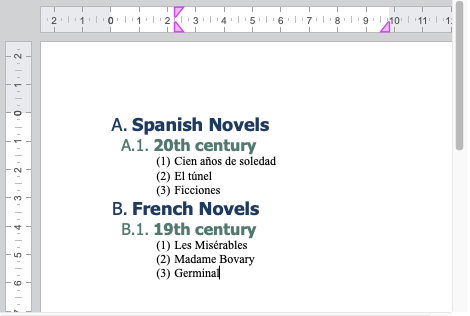
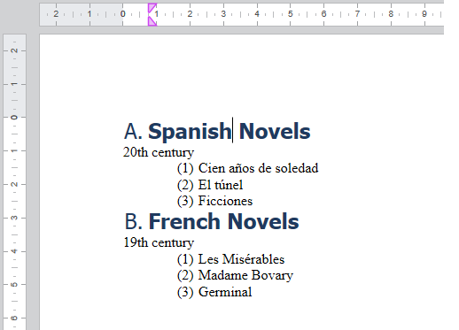

para importar

<!-- REF lists-WP.Desc -->

## Listas

4D Write Pro admite listas planas (de un solo nivel) y listas jerárquicas (de varios niveles).

### Listas de un solo nivel

4D Write Pro soporta dos tipos principales de listas de un solo nivel:

- listas desordenadas: donde los elementos de la lista se marcan con viñetas, viñetas personalizadas o imágenes utilizadas como marcadores.
- listas ordenadas: en las que los elementos de la lista se marcan con números o letras

Pueden crearse utilizando:

- la barra de herramientas o la barra lateral de la [interfaz de 4D Write Pro](https://doc.4d.com/4Dv20/4D/20.2/Entry-areas.300-6750367.en.html#5865253)
- las [acciones estándar](./standard-actions) `listStyleType` o `listStyleImage`,
- o [por programación](../commands-legacy/4d-write-pro-attributes.md#lists) utilizando [WP SET ATTRIBUTE](../commands/wp-set-attributes).

Cuando se crea una lista utilizando una acción estándar (`listStyleType` o `listStyleImage`) o la barra de herramientas/barra lateral, 4D Write Pro inserta automáticamente un margen antes del texto para que el marcador se sitúe en él. El valor del margen insertado corresponde al desplazamiento de la pestaña por defecto (`wk tab default`).


When the list is created using [the WP SET ATTRIBUTE command](../commands-legacy/4d-write-pro-attributes.md#lists), no specific margin is managed, by default the marker is added at the left boundary of the paragraph. El desarrollador puede añadir un margen personalizado si es necesario.

:::tip Entrada de blog relacionada

[4D Write Pro – Adding a margin automatically when bullets are set using standard actions](https://blog.4d.com/4d-write-pro-adding-a-margin-automatically-when-bullets-are-set-using-standard-actions)

:::

### Listas de múltiples niveles

Las listas multinivel contienen una hoja de estilo de nivel raíz y una o más hojas de estilo de subnivel. Multi-level lists are based on [multi-level list style sheets](../user-legacy/stylesheets.md#multi-level-list-style-sheets). Multi-level lists are based on [hierarchical list style sheets](../user-legacy/stylesheets.md#hierarchical-list-style-sheets).

Cuando se crea un nuevo subnivel, la numeración de niveles vuelve a empezar en 1. Cuando añade o elimina un elemento en su lista de nivel múltiple, los números se ajustan automáticamente.


Multi-level lists are created with command [WP New style sheet](../commands/wp-new-style-sheet.md) and can be applied to a paragraph using [WP SET ATTRIBUTE](../commands/wp-set-attributes.md).

Listas de varios niveles pueden ser gestionadas usando:

- paragraph [style sheet attributes](../commands-legacy/4d-write-pro-attributes.md#style-sheets) (such as `wk list level index`, `wk list level count`, and `wk list concat string format`)
- [acciones estándar](../user-legacy/standard-actions.md) dedicadas para la gestión de niveles (`listLevelAppend`, `listLevelInc`, `listLevelDec`)
- dedicated standard actions for numbering marker management (`listConcatStringFormat`, `listNumberFormat`).

:::tip Entrada de blog relacionada

[4D Write Pro – Creating Multi-level Bullet or Numbered Lists Using Hierarchical list Style Sheets](https://blog.4d.com/4d-write-pro-creating-multi-level-bullet-or-numbered-lists-using-hierarchical-paragraph-style-sheets)

:::

<!-- END REF -->

<!-- REF hierarchical-list.Desc -->

## Hojas de estilo de listas jerárquicas

Las hojas de estilo de listas jerárquicas se utilizan para crear [listas multinivel](../user-legacy/using-a-4d-write-pro-area.md#multi-level-lists).

To create a hierarchical list style sheet, use [WP New style sheet](../commands/wp-new-style-sheet.md) and pass in *listLevelCount* the desired number of levels. You then define a hierarchy of related paragraph style sheets: one **root-level** style sheet and one or more **sub-level** style sheets linked to it. Cada nivel representa una profundidad en la lista (nivel 1, nivel 2, nivel 3, etc.) and is automatically named "root-level name + lvl + index", for example "Mylist lvl 2".

To customize hierarchical list styles, the paragraph style sheet object can be customized using [style sheet attributes](../commands-legacy/4d-write-pro-attributes.md#style-sheets).

Hierarchical list style sheets are fully supported by the following commands: [`WP Get style sheet`](../commands/wp-get-style-sheet.md), [`WP SET ATTRIBUTES`](../commands/wp-set-attributes.md), [`WP DELETE STYLE SHEET`](../commands/wp-delete-style-sheet.md).

### Ejemplo

El siguiente ejemplo crea una hoja de estilo de lista jerárquica de tres niveles y la aplica a los párrafos.

```4d
// Create 3 hierarchical list style sheets
WP New style sheet(wpArea; wk type paragraph; "MyList"; 3)

// Retrieve each level
var $level1; $level2; $level3 : Object
$level1:=WP Get style sheet(wpArea; "MyList"; 1) // Root level
$level2:=WP Get style sheet(wpArea; "MyList"; 2) // 1st sub-level
$level3:=WP Get style sheet(wpArea; "MyList"; 3) // 2nd sub-level

// Customize styles
WP SET ATTRIBUTES($level1; {listStyleType: wk upper latin; fontBold: wk true})
WP SET ATTRIBUTES($level2; {listConcatStringFormat: True})
WP SET ATTRIBUTES($level3; {listStringFormatLtr: "(#)"})

// Apply hierarchical style sheets to paragraphs
var $paragraphs : Collection
$paragraphs:=WP Get elements(wpArea; wk type paragraph)

WP SET ATTRIBUTES($paragraphs[0]; wk style sheet; $level1)
WP SET ATTRIBUTES($paragraphs[1]; wk style sheet; $level2)
WP SET ATTRIBUTES($paragraphs[2]; wk style sheet; $level3)
```

resultado:



Para eliminar el primer subnivel:

```4d
WP DELETE STYLE SHEET(wpArea; "MyList"; 2)
```

resultado:



### Valores de atributos predefinidos

Cuando se crean, las hojas de estilo de listas jerárquicas utilizan valores predefinidos:

- `wk margin left` = 0,75 cm \* (número de niveles anteriores) o 0,25 pulgadas \* (número de niveles anteriores), dependiendo de la unidad de diseño actual
- `wk list type` = `wk decimal`
- `wk name` se deriva del nombre de la hoja de estilo raíz (Sólo lectura para subniveles)
- `wk list level count` se fija en el valor especificado para todos los niveles

  - Ejemplo:

    - Nivel de raíz: `"MyList"`
    - Primer subnivel: `"MyList nivel 2"`
    - Segundo subnivel: `"MyList lvl 3"`

<!-- END REF -->

