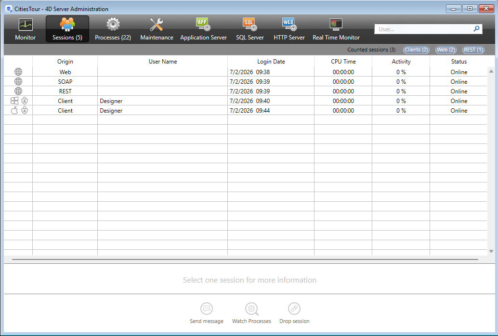

La página **Sesiones** muestra todas las sesiones activas conectadas al servidor, incluidas las sesiones de cliente, web, REST y SOAP.



El botón **Sesiones** indica, entre paréntesis, el número total de sesiones activas (esta cifra no tiene en cuenta los filtros de visualización aplicados a la ventana).

La página contiene un área de búsqueda dinámica, controles de filtrado y botones de administración. Puede modificar el orden de las columnas arrastrando y soltando sus áreas de encabezados.

También puede ordenar la lista haciendo clic en el encabezado de una columna. Haga clic repetidamente para alternar entre orden ascendente y descendente.


## Lista de sesiones

Cada fila representa una sesión activa.

La lista ofrece la siguiente información:

- Icono que representa el tipo de sesión (Apple para sesiones de cliente de macOS, Windows para sesiones de cliente de Windows y un globo terráqueo para sesiones web, REST y SOAP). Además, un indicador visual adicional muestra si la sesión está autenticada.
- **Origen**: tipo de sesión (cliente, web, REST o SOAP).
- **Nombre de usuario**: nombre del usuario 4D conectado o el alias definido mediante el comando [`SET USER ALIAS`](../commands/set-user-alias), cuando corresponda. En el caso de las sesiones web, REST o SOAP, no se muestra ningún nombre de usuario a menos que se haya asociado uno a la sesión mediante la propiedad `userName` de la función [`setPrivileges()`](../API/SessionClass.md#setprivileges).
- **Fecha de inicio de sesión**: fecha y hora en las que se inició la sesión.
- **Tiempo de CPU**: tiempo de CPU consumido por la sesión desde su creación.
- **Actividad**: porcentaje de la actividad del servidor dedicada actualmente a la sesión (valor dinámico).
- **Estado**: estado de la sesión. Las sesiones con los clientes pueden ser **en línea**, **[en reposo](../Desktop/clientServer.md#management-of-sleeping-client-sessions)** o **[inalcanzables](../Desktop/clientServer.md#management-of-unreachable-peer)**. Las sesiones Web, REST y SOAP siempre tienen el estado **En línea**.

Cuando se selecciona una sesión, se muestra información adicional en el panel de detalles.

## Panel de detalles de la sesión

Al seleccionar una sesión, se muestra información adicional en el panel inferior.

### Sesiones cliente

La siguiente información está disponible:

- **Nombre de usuario del sistema**: nombre de la sesión del sistema operativo abierta en el equipo remoto.
- **Dirección IP**: dirección IP de la máquina remota que abrió la sesión.
- **Nombre de máquina**: Nombre de la máquina remota.
- **4D Write Pro**: indica si el usuario de la sesión pertenece a un grupo que le concede acceso a 4D Write Pro.
- **4D View Pro**: indica si el usuario de la sesión pertenece a un grupo que le concede acceso a 4D View Pro.

### Sesiones REST, web y SOAP

El panel de detalles muestra información como:

- **Estado de invitado**: indica si la sesión es una sesión de invitado. Las sesiones de invitado son sesiones web sin autenticar.
- **Privilegios**: lista de privilegios asociados a la sesión.
- **Dirección IP**: dirección IP de la máquina remota que abrió la sesión.
- **Agente de usuario**: identifica la aplicación cliente, el navegador o el servicio que ha iniciado la sesión.

### Botón de búsqueda IP

El botón de búsqueda IP está activado cuando se muestra una dirección IP pública. Puede hacer clic en el botón para recuperar la geolocalización de la sesión seleccionada.

Si la información está disponible, la ubicación se muestra junto al botón de búsqueda IP en el formato **Ciudad, País**. De lo contrario, se muestra el mensaje **No encontrado**.

## Búsqueda y Filtros

### Barra de búsqueda

El campo de búsqueda permite reducir el número de filas que se muestran en la lista a aquellas que coincidan con el texto introducido. La búsqueda se realiza en las columnas **Nombre de usuario**, **Nombre del equipo**, **Nombre de la sesión** y **Dirección IP**.

La lista se actualiza en tiempo real al introducir texto.

Puede buscar varios valores separándolos con un punto y coma (`;`). En este caso, los valores se combinan mediante el operador **OR**.

Por ejemplo, si ingresa:

```
John;Mary;REST
```

solo se muestran las filas que contienen **John**, **Mary** o **REST** en las columnas en las que se puede realizar la búsqueda.

### Filtros por tipo de sesión

La página Sesiones también ofrece filtros rápidos para mostrar solo tipos de sesión específicos.

Están disponibles los siguientes filtros:

- **Sesiones contadas**: sólo incluye sesiones contadas para consumo de licencias flotantes.
- **Clientes**: incluye únicamente las sesiones cliente de escritorio.
- **Web**: incluye únicamente sesiones web y SOAP.
- **REST**: incluye únicamente sesiones REST.

Los filtros se pueden activar o desactivar de forma independiente, o combinarse con otros filtros, y se aplican inmediatamente a la lista de sesiones.

## Botones de administración

Hay tres botones de administración: **Enviar mensaje** está disponible cuando se seleccionan una o más sesiones cliente. **Ver procesos** está disponible cuando se selecciona una sola sesión de cualquier tipo, y **Desconectar sesión** está disponible cuando una o más sesiones de cualquier tipo se seleccionan.
Puede seleccionar varias líneas manteniendo presionada la tecla **Mayús** para una selección adyacente o la tecla **Ctrl** (Windows) / **Comando** (macOS) para una selección no adyacente.

### Enviar mensaje

Este botón sirve para enviar un mensaje a la(s) sesión(es) **Cliente** seleccionada(s). Si no hay ninguna sesión cliente seleccionada, el botón no está activo. Al hacer clic en este botón, aparece un diálogo que le permite introducir el mensaje. El cuadro de diálogo también indica el número de sesiones de cliente que recibirán el mensaje:


El mensaje se muestra como una alerta en los equipos remotos correspondientes.

Puede realizar la misma acción por programación utilizando el comando [`SEND MESSAGE TO REMOTE USER`](../commands/send-message-to-remote-user).

### Visualizar procesos

Este botón se puede utilizar para mostrar directamente los procesos asociados con la sesión seleccionada en la [página **Procesos**](processes.md).

La lista de procesos se filtra automáticamente utilizando el UUID de la sesión seleccionada.

Cuando se seleccionan varias sesiones, este botón aparece desactivado.

### Desconectar sesión

Este botón permite forzar la desconexión de las sesiones de cliente seleccionadas.

Antes de desconectar la sesión, aparece un cuadro de diálogo de confirmación para confirmar o cancelar esta operación (mantenga pulsada la tecla **Alt** mientras hace clic en **Desconectar usuario** para desconectarse inmediatamente sin que aparezca el cuadro de diálogo de confirmación).

Puede realizar la misma acción por programación utilizando el comando [`DROP REMOTE USER`](../commands/drop-remote-user).
