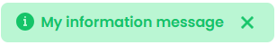

La clase `WebForm` contiene funciones y propiedades que permiten manejar sus componentes de páginas Qodly. Los objetos `4D.WebForm` se instancian con el comando [`webForm`](../commands/web-form.md).

<details><summary>Historia</summary>

| Lanzamiento | Modificaciones                                                                  |
| ----------- | ------------------------------------------------------------------------------- |
| 20 R6       | Adición de enableState() y disableState() |
| 20 R2       | Añadidos                                                                        |

</details>

### Comandos y funciones

|                                                                                                                                 |
| ------------------------------------------------------------------------------------------------------------------------------- |
| [<!-- INCLUDE WebFormClass.componentName.Syntax -->](#componentname)<br/><!-- INCLUDE #WebFormClass.componentName.Summary -->   |
| [<!-- INCLUDE #WebFormClass.disableState().Syntax -->](#disablestate)<br/><!-- INCLUDE #WebFormClass.disableState().Summary --> |
| [<!-- INCLUDE #WebFormClass.enableState().Syntax -->](#enablestate)<br/><!-- INCLUDE #WebFormClass.enableState().Summary -->    |
| [<!-- INCLUDE #WebFormClass.setError().Syntax -->](#seterror)<br/><!-- INCLUDE #WebFormClass.setError().Summary -->             |
| [<!-- INCLUDE #WebFormClass.setMessage().Syntax -->](#setmessage)<br/><!-- INCLUDE #WebFormClass.setMessage().Summary -->       |
| [<!-- INCLUDE #WebFormClass.setWarning().Syntax -->](#setwarning)<br/><!-- INCLUDE #WebFormClass.setWarning().Summary -->       |

### *.componentName*

<!-- REF #WebFormClass.componentName.Syntax -->***.componentName*** : [4D.WebFormItem](WebFormItemClass.md)<!-- END REF -->

#### Descripción

Los componentes de las páginas web son objetos <!-- REF #WebFormClass.componentName.Summary -->que están disponibles directamente como propiedades<!-- END REF --> de estas páginas web.

Los objetos devueltos son de la clase [`4D.WebFormItem`](WebFormItemClass.md). Estos objetos tienen funciones que puede utilizar para gestionar sus componentes de forma dinámica.

#### Ejemplo

```4d
shared singleton Class constructor()
	
	var myForm : 4D.WebForm
	var component : 4D.WebFormItem
	
	myForm:=webForm //devuelve la página web como un objeto, cada propiedad es un componente
	component:=myForm.myImage //devuelve el componente myImage de la página web

```

:::info

Aunque `myForm` puede no mostrar las propiedades típicas de un objeto cuando se examina en el depurador, se comporta como si fuera el objeto `webForm` real. Puede interactuar con las propiedades y funciones del objeto `webForm` subyacente a través de `myForm`. Por ejemplo, puede manipular dinámicamente los componentes de la página o transmitir mensajes a las páginas web utilizando funciones especializadas como `myForm.setMessage()`.

:::

### .disableState()

<!-- REF #WebFormClass.disableState().Syntax -->**.disableState**( *state* : string)<!-- END REF -->

<!-- REF #WebFormClass.disableState().Params -->

| Parámetros | Tipo   |     | Descripción                                     |
| ---------- | ------ | :-: | ----------------------------------------------- |
| state      | string |  -> | Nombre del estado a desactivar de la página web |

<!-- END REF -->

#### Descripción

La función `.disableState()` <!-- REF #WebFormClass.disableState().Summary -->desactiva la renderización del *estado* en la página web actual<!-- END REF -->.

Esta función no hace nada si:

- el *state* no está habilitado actualmente en la página web,
- el *estado* no existe para la página web.

Si [activa](#enablestate) o desactiva varios estados en la misma función usuario, todas las modificaciones se envían al mismo tiempo al cliente una vez finalizada la función.

Para más información sobre los estados de las páginas web, consulte la sección [Estados en la documentación de Qodly](https://developer.4d.com/qodly/4DQodlyPro/pageLoaders/states/stateOverview).

### .enableState()

<!-- REF #WebFormClass.enableState().Syntax -->**.enableState**( *state* : string )<!-- END REF -->

<!-- REF #WebFormClass.enableState().Params -->

| Parámetros | Tipo   |     | Descripción                                    |
| ---------- | ------ | :-: | ---------------------------------------------- |
| state      | string |  -> | Nombre del estado a activar en las páginas web |

<!-- END REF -->

#### Descripción

La función `.enableState()` <!-- REF #WebFormClass.enableState().Summary -->activa la renderización del *estado* en la página web actual<!-- END REF -->.

Esta función no hace nada si:

- el *estado* ya ha sido activado en la página web,
- el *estado* no existe para la página web.

Si activa o [desactiva](#disablestate) varios estados dentro de la misma función usuario, todas las modificaciones se envían al mismo tiempo al cliente una vez que la función termina.

Para más información sobre los estados de las páginas web, consulte la sección [Estados en la documentación de Qodly](https://developer.4d.com/qodly/4DQodlyPro/pageLoaders/states/stateOverview).

#### Ejemplo

Usted activa un estado específico llamado "wrongCredentials" en caso de error en su página de conexión:

```4d
Function authenticationError()
	If (Session.info.type#"remote")
		Web Form.enableState("wrongCredentials")
	End if
```

### .setError()

<!-- REF #WebFormClass.setError().Syntax -->**.setError**( *msg* : string)<!-- END REF -->

<!-- REF #WebFormClass.setError().Params -->

| Parámetros | Tipo   |     | Descripción                                 |
| ---------- | ------ | :-: | ------------------------------------------- |
| msg        | string |  -> | Mensaje de error a mostrar en la página web |

<!-- END REF -->

#### Descripción

La función `.setError()` <!-- REF #WebFormClass.setError().Summary -->envía *msg* como mensaje de error a la página web<!-- END REF -->.

La función devuelve una respuesta con un estado `200 OK` y un objeto `__WEBFORM` en el cuerpo con una propiedad `__NOTIFICATION.message` definida como *msg* y un `__NOTIFICATION.type` definido como "error".

#### Ejemplo

```4d
shared singleton Class constructor()
exposed function myError()

var myForm : 4D.WebForm
myForm:=web Form

myForm.setError("My error message")

```

Si la funcionalidad [**Provide feedback**](https://developer.4d.com/qodly/4DQodlyPro/pageLoaders/events/bindingActionToEvents#providing-feedback) está activada para el evento, el *mensaje* se muestra automáticamente como un *toast* rojo en la parte inferior de la página y desaparece automáticamente después de 5 segundos:


### .setMessage()

<!-- REF #WebFormClass.setMessage().Syntax -->**.setMessage**( *msg* : string)<!-- END REF -->

<!-- REF #WebFormClass.setMessage().Params -->

| Parámetros | Tipo   |     | Descripción                                       |
| ---------- | ------ | :-: | ------------------------------------------------- |
| msg        | string |  -> | Mensaje de información a mostrar en la página web |

<!-- END REF -->

#### Descripción

La función `.setMessage()` <!-- REF #WebFormClass.setMessage().Summary -->envía *msg* como mensaje de información a la página web<!-- END REF -->.

La función devuelve una respuesta con un estado `200 OK` y un objeto `__WEBFORM` en el cuerpo con una propiedad `__NOTIFICATION.message` definida como *msg* y un `__NOTIFICATION.type` definido como "message".

#### Ejemplo

```4d
shared singleton Class constructor()
exposed function myMessage()

var myForm : 4D.WebForm
myForm:=web Form

myForm.setMessage("My information message")

```

Si la funcionalidad [**Provide feedback**](https://developer.4d.com/qodly/4DQodlyPro/pageLoaders/events/bindingActionToEvents#providing-feedback) está activada para el evento, el *mensaje* se muestra automáticamente como un *toast* verde en la parte inferior de la página y desaparece automáticamente después de 5 segundos:



### .setWarning()

<!-- REF #WebFormClass.setWarning().Syntax -->**.setWarning**( *msg* : string)<!-- END REF -->

<!-- REF #WebFormClass.setWarning().Params -->

| Parámetros | Tipo   |     | Descripción                                          |
| ---------- | ------ | :-: | ---------------------------------------------------- |
| msg        | string |  -> | Mensaje de advertencia para mostrar en la página web |

<!-- END REF -->

#### Descripción

La función `.setWarning()` <!-- REF #WebFormClass.setWarning().Summary -->envía *msg* como mensaje de advertencia a la página web<!-- END REF -->.

La función devuelve una respuesta con un estado `200 OK` y un objeto `__WEBFORM` en el cuerpo con una propiedad `__NOTIFICATION.message` definida como *msg* y un `__NOTIFICATION.type` definido como "warning".

#### Ejemplo

```4d
shared singleton Class constructor()
exposed function myWarning()

var myForm : 4D.WebForm
myForm:=web Form

myForm.setWarning("My warning message")

```

Si la funcionalidad [**Provide feedback**](https://developer.4d.com/qodly/4DQodlyPro/pageLoaders/events/bindingActionToEvents#providing-feedback) está activada para el evento, el *mensaje* se muestra automáticamente como un *toast* amarillo en la parte inferior de la página web y desaparece automáticamente después de 5 segundos:


## Ver también

[Web Form](../commands/web-form.md)</br>
[Web Event](../commands/web-event.md)</br>
[WebFormItem class](../API/WebFormItemClass.md)