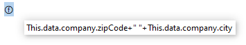

## Generalidades

Los documentos 4D Write Pro pueden contener referencias a fórmulas 4D como variables, campos, expresiones, métodos proyecto o comandos 4D. Información específica como el número de página también puede ser referenciada a través de fórmulas (ver [Inserción de documentos y expresiones de página](#inserting-date-and-time-formulas) más abajo).

La inserción de fórmulas en las áreas de 4D Write Pro se realiza con el comando [**WP INSERT FORMULA**](commands/wp-insert-formula.md) y puede leerse utilizando el comando [**WP Get formulas**](commands-legacy/wp-get-formulas.md). También los devuelve el comando [**WP Get text**](commands-legacy/wp-get-text.md).

Las fórmulas son evaluadas:

- cuando se insertan en un objeto de formulario que muestra valores calculados
- cuando el objeto 4D Write Pro se carga en un objeto de formulario que muestra valores calculados
- cuando se llama al comando [**WP COMPUTE FORMULAS**](commands-legacy/wp-compute-formulas.md)
- cuando estén "congelados" usando el comando [**WP FREEZE FORMULAS**](commands-legacy/wp-freeze-formulas.md) (si aún no se ha calculado)
- antes de imprimir (si no se ha calculado ya)
- antes de exportar a .docx (si la fórmula no se puede asignar con fórmulas MS Word)
- cuando se llaman las acciones estándar para congelar, imprimir, exportar o calcular fórmulas. Ver *Acciones estándar*

Las fórmulas no son evaluadas cuando un documento es cargado (usando [**WP New**](commands-legacy/wp-new.md), [**WP Insert document body**](commands/wp-insert-document-body.md), o `wpArea:=[table]field`):

- si el documento sólo está fuera de la pantalla,
- si el documento se muestra en pantalla pero el objeto formulario sólo muestra referencias.

Las fórmulas se convierten en valores estáticos si se llama al comando [**WP FREEZE FORMULAS**](commands-legacy/wp-freeze-formulas.md) (excepto para el número de página y el recuento de páginas, ver más abajo).

**Nota de compatibilidad**: *el manejo de expresiones utilizando los comandos [**ST INSERT EXPRESSION**](../commands-legacy/st-insert-expression.md), [**ST Get expression**](../commands-legacy/st-get-expression.md), [**ST COMPUTE EXPRESSIONS**](../commands-legacy/st-compute-expressions.md), y [**ST FREEZE EXPRESSIONS**](../commands-legacy/st-freeze-expressions.md) es obsoleto, sin embargo, sigue siendo soportado en 4D Write Pro por compatibilidad*.

:::note

Por razones de seguridad, cuando se pegan fórmulas desde una aplicación 4D diferente o un entorno externo, solo se pegan los *valores calculados* (texto o imágenes) disponibles en el momento de la copia. Si no hay ningún valor disponible (por ejemplo, la fórmula nunca se calculó), 4D pega la fuente de la fórmula como texto sin formato.

:::

### Ejemplo

Desea sustituir la selección en un área de 4D Write Pro por el contenido de una variable:

```4d
 var fullName: Text
 var $sel: Object
 fullName:="John Smith"
 $sel:=WP Selection range(4DWPArea)
 Case of
    :(Form event code=On Clicked)
       WP INSERT FORMULA($sel;Formula(fullName);wk replace)
 End case
```

## Objeto de contexto de fórmula

Puede insertar expresiones especiales relacionadas con los atributos del documento en cualquier área del documento (cuerpo, encabezado, pie de página) utilizando el comando [WP Insertar fórmula](commands/wp-insert-formula.md). Dentro de una fórmula, un objeto contextual de la fórmula se expone automáticamente. Puede utilizar las propiedades de este objeto a través de [**This**](../commands/this.md):

| Propiedades                                                                    | Tipo   | Descripción                                                                                                                                                                                                                                                                                                                                                        |
| ------------------------------------------------------------------------------ | ------ | ------------------------------------------------------------------------------------------------------------------------------------------------------------------------------------------------------------------------------------------------------------------------------------------------------------------------------------------------------------------ |
| [This](../commands/this.md).title                              | Text   | Título definido en el atributo wk title                                                                                                                                                                                                                                                                                                                            |
| [This](../commands/this.md).author                             | Text   | Autor definido en el atributo wk author                                                                                                                                                                                                                                                                                                                            |
| [This](../commands/this.md).subject                            | Text   | Asunto definido en el atributo wk subject                                                                                                                                                                                                                                                                                                                          |
| [This](../commands/this.md).company                            | Text   | Empresa definida en el atributo wk company                                                                                                                                                                                                                                                                                                                         |
| [This](../commands/this.md).notes                              | Text   | Notas definidas en el atributo wk notes                                                                                                                                                                                                                                                                                                                            |
| [This](../commands/this.md).dateCreation                       | Fecha  | Fecha de creación definida en el atributo wk date creation                                                                                                                                                                                                                                                                                                         |
| [This](../commands/this.md).dateModified                       | Fecha  | Fecha de modificación definida en el atributo wk date modified                                                                                                                                                                                                                                                                                                     |
| [This](../commands/this.md).pageNumber (\*) | Number | Page number as it is defined:<li>- From the document start (default) or </li><li>- From the section page start if it is defined by section page start.</li> Esta fórmula siempre es dinámica; no se ve afectada por el comando [**FORMULAS WP FREEZE**](commands-legacy/wp-freeze-formulas.md). |
| [This](../commands/this.md).pageCount (\*)  | Number | Número de páginas: número total de páginas.<br/> Esta fórmula siempre es dinámica; no se ve afectada por el comando [**FORMULAS WP FREEZE**](commands-legacy/wp-freeze-formulas.md).                                                                                                                               |
| [This](../commands/this.md).document                           | Object | Documento 4D Write Pro                                                                                                                                                                                                                                                                                                                                             |
| [This](../commands/this.md).data                               | Object | Contexto de datos del documento 4D Write Pro definido por [**WP SET DATA CONTEXT**](commands-legacy/wp-set-data-context.md)                                                                                                                                                                                                                                        |
| [This](../commands/this.md).sectionIndex                       | Number | El índice de la sección en el documento 4D Write Pro a partir de 1                                                                                                                                                                                                                                                                                                 |
| [This](../commands/this.md).pageIndex                          | Number | El número de página real en el documento 4D Write Pro a partir de 1 (independientemente de los números de página de la sección)                                                                                                                                                                                                                 |
| [This](../commands/this.md).sectionName                        | String | El nombre que el usuario da a la sección                                                                                                                                                                                                                                                                                                                           |

:::note

Existen propiedades de contexto adicionales cuando se trabaja con tablas. Vea *Gestión de tablas* para más información.

:::

(\*) **Importante**: **This.pageNumber**, **This.pageIndex** y **This.pageCount** sólo deben utilizarse directamente en una fórmula 4D Write Pro (deben estar presentes en la cadena *formula.source*). Devolverán valores incorrectos si son utilizados por el lenguaje 4D dentro de un método llamado por la fórmula. Sin embargo, pueden pasarse como parámetros a un método llamado directamente por la fórmula:

- Esto funcionará: " *formatNumber(This.pageNumber)* "
- Esto NO funcionará: « *formatNumber* » con el método *formatNumber* de procesamiento *This.pageNumber*.

Por ejemplo, para insertar el número de página en el pie de página:

```4d
 $footer:=WP Get footer(4DWP;1)
 WP INSERT FORMULA($footer;Formula(This.pageNumber);wk append)
  //Usando Formula(myMethod) con myMethod procesando This.pageNumber
  //no funcionaría correctamente
```

## Table formula context object

Cuando se utiliza en una fórmula dentro de la tabla, la palabra clave **This** da acceso a diferentes datos según el contexto:

| **Contexto**                                                                                                           | **Expression**                                                               | **Tipo**                                                          | **Devuelve**                                                                                                                                                                                                                                                                                                                                                                                                                                                                                                                          |
| ---------------------------------------------------------------------------------------------------------------------- | ---------------------------------------------------------------------------- | ----------------------------------------------------------------- | ------------------------------------------------------------------------------------------------------------------------------------------------------------------------------------------------------------------------------------------------------------------------------------------------------------------------------------------------------------------------------------------------------------------------------------------------------------------------------------------------------------------------------------- |
| En cualquier sitio                                                                                                     | [This](../commands/this.md).table                            | Object                                                            | Tabla actual                                                                                                                                                                                                                                                                                                                                                                                                                                                                                                                          |
|                                                                                                                        | [This](../commands/this.md).row                              | Object                                                            | Current table row element                                                                                                                                                                                                                                                                                                                                                                                                                                                                                                             |
|                                                                                                                        | [This](../commands/this.md).rowIndex                         | Number                                                            | Índice de la línea actual, a partir de 1                                                                                                                                                                                                                                                                                                                                                                                                                                                                                              |
| Cuando se ha definido una fuente de datos para la tabla                                                                | [This](../commands/this.md).table.dataSource | Objet (fórmula)                                | Fuente de datos como fórmula                                                                                                                                                                                                                                                                                                                                                                                                                                                                                                          |
|                                                                                                                        | [This](../commands/this.md).tableData                        | Collection o Entity selection (por lo general) | table.dataSource evaluada                                                                                                                                                                                                                                                                                                                                                                                                                                                                                             |
| In each data row when a table datasource returns a collection or an entity selection                                   | [This](../commands/this.md).item.xxx         | Cualquiera                                                        | Mapped to each item of the table datasource collection or entity selection, for example **This.item.firstName** if the associated entity has the *firstName* attribute                                                                                                                                                                                                                                                                                                                                |
|                                                                                                                        | [This](../commands/this.md).itemIndex                        | Number                                                            | Índice del elemento actual en la colección o selección de entidades, a partir de 0                                                                                                                                                                                                                                                                                                                                                                                                                                                    |
| In any row (except header rows) when a table datasource returns a collection or an entity selection | [This](../commands/this.md).previousItems                    | Collection o entity selection                                     | Items displayed on the pages before the bottom carry over row (if any) or before the row of the expression, including the page where is displayed the row containing the expression. <br/>Esta expresión devuelve el mismo tipo de valor que la expresión **This.tableData**.                                                                                                                                                                                      |
| In a break row                                                                                                         | [This](../commands/this.md).breakItems                       | Collection o entity selection                                     | Items of the collection or entity selection displayed in the rows between:<br/><ul><li>the current break row and the previous break row of the same level (or the start of the table) if the break row(s) are displayed after the data row.</li><li>the current break and the next break row of the same level (or the end of the table) if the break row(s) are displayed before the data row.</li></ul> |

En cualquier otro contexto, estas expresiones devolverán *undefined*.

:::note

Para más información sobre la inserción de fórmulas, ver [WP INSERT FORMULA](../commands/wp-insert-formula).

:::

## Inserción de fórmulas de fecha y hora

**Date**

Cuando se inserta en una fórmula el comando [**Current date**](../commands-legacy/current-date.md), una variable de fecha o un método que devuelve una fecha, ésta se transformará automáticamente en texto utilizando el formato abreviado de fecha del sistema.

**Time**

Cuando el comando [**Current time**](../commands-legacy/current-time.md), una variable de hora o un método que devuelve una hora es insertado en una fórmula, debe estar encerrado dentro de un comando [**String**](../commands/string.md) porque el tipo de tiempo no está soportado en JSON. Considera los siguientes ejemplos de fórmulas:

```4d
  // Este código es la mejor práctica
 $formula1:=Formula(String(Current time)) //OK 
 
  // Este código funcionará pero normalmente no se recomienda, excepto después de "Edit formula"
 $formula2:=Formula from string("String(Current time)") //OK
 
  // Código incorrecto porque los valores de tiempo se mostrarían como un longint para los segundos (o milisegundos), no como un tiempo
 $formula3:=Formula from string("Current time") //NO válido
 $formula4:=Formula(Current time) //NO válido
 
```

## Soporte de estructura virtual

Las expresiones de tablas y campos insertadas en los documentos 4D Write Pro soportan la definición de la estructura virtual de la base de datos. La estructura virtual expuesta a las fórmulas se define mediante los comandos [**SET FIELD TITLES**](../commands-legacy/set-field-titles.md)(...;\*) y [**SET TABLE TITLES**](../commands-legacy/set-table-titles.md)(...;\*).

Cuando se define una estructura virtual:

- las referencias a expresiones que contienen campos muestran nombres virtuales cuando el documento 4D Write Pro muestra referencias y no valores.
- [**WP Get text**](commands-legacy/wp-get-text.md) devuelve nombres de estructura virtual si la opción `wk expressions as source` está establecida en el parámetro de expresiones.
- [WP Insert formula](commands/wp-insert-formula.md) ignora la estructura virtual y siempre espera nombres de tablas/campos reales

:::note

Cuando un documento se visualiza en modo "expresiones de visualización", las referencias a tablas o campos que no pertenecen a la estructura virtual se muestran con caracteres "`?`", por ejemplo `[VirtualTableName]?` cuando el campo no está definido en la estructura virtual.

:::

## Mostrar fórmulas

Puede controlar cómo se muestran las fórmulas en sus documentos:

- como *valores* o como \*referencias
- cuando se muestran como referencias, muestran el texto, símbolo o nombre de la fuente.

### Referencias o valores

Por defecto, las fórmulas 4D se muestran como valores. Al insertar una fórmula 4D, 4D Write Pro calcula y muestra su valor actual.  Si desea saber qué fórmula se utiliza o cuál es su nombre, debe mostrarla como referencia.

Para mostrar fórmulas como referencias, puede:

- check the **Show references** option in the Property list (see *Configuring View properties*), or
- utilizar la acción estándar visibleReferences (ver *Expresiones dinámicas*), o bien
- usa el comando [**WP SET VIEW PROPERTIES**](commands-legacy/wp-set-view-properties.md) con el selector `wk visible references` en **True**.

Las referencias a fórmulas pueden mostrarse como:

- textos fuente (por defecto)
- symbols
- names

### Referencias como textos fuente (por defecto)

Cuando las fórmulas se muestran como referencias, por defecto el texto fuente de la fórmula aparece en su documento, con un fondo gris por defecto (puede personalizarse usando el selector `wk formula highlight`).

Por ejemplo, ha insertado la fecha actual junto con un formato, la fecha se muestra:


Cuando se muestran fórmulas como referencias, se muestra la **fuente** de la fórmula:


### Referencias como símbolos

Cuando los textos fuente de las fórmulas se muestran en un documento, el diseño puede resultar confuso si se trabaja con plantillas sofisticadas que utilizan tablas, por ejemplo, y cuando las fórmulas son complejas:


En este caso, puede mostrar las referencias a fórmulas como símbolos , para que el documento sea más compacto:


Para mostrar las referencias a fórmulas como símbolos, puede:

- active la opción **Mostrar origen de fórmula como símbolo** en la lista de propiedades (consulte *Configuración de las propiedades de la vista*), o
- utilizar la acción estándar displayFormulaAsSymbol (ver *Uso de las acciones estándar de 4D Write Pro*), o bien
- usa el comando [**WP SET VIEW PROPERTIES**](commands-legacy/wp-set-view-properties.md) con el selector `wk display formula as symbol` en **True**.

### Referencias como nombres

Puede asignar nombres a las fórmulas, haciendo que los documentos de plantilla de 4D Write Pro sean más fáciles de leer y entender para los usuarios finales. Cuando las fórmulas se muestran como referencias (y no como símbolos) y se ha definido un nombre para una fórmula, se muestra el nombre de la fórmula.

Por ejemplo, las siguientes referencias a fórmulas se muestran como texto fuente por defecto:


Si asigna nombres a las fórmulas, se mostrarán en lugar de los textos:


Para asignar un nombre a una fórmula, debe utilizar el comando [WP Insert formula](commands/wp-insert-formula.md) con un parámetro objeto. Por ejemplo:

```4d
  //inserta el día anterior en el documento
 $o:=New object("formula";Formula(Current date-1); "name"; "Yesterday")
 $range:=WP Text range(WPArea;wk start text;wk end text)
 WP INSERT FORMULA($range;$o;wk append)
 
```


:::note

Sólo las fórmulas en línea pueden tener un nombre (las fórmulas para imágenes ancladas, romper filas y las fórmulas de fuentes de datos de tablas no pueden tener nombres).

:::

### Consejos sobre fórmulas

Sea cual sea el modo de visualización de las fórmulas, puede obtener información adicional sobre las fórmulas a través de **tips** que se muestran al pasar el ratón sobre las fórmulas.

- Cuando las fórmulas no tienen nombre, los consejos proporcionan el texto fuente de las fórmulas:

  

- Cuando las fórmulas tienen nombre pero se muestran como valores o como símbolos, el consejo ofrece el nombre de las fórmulas:

  

En este contexto, puede visualizar el texto fuente de la fórmula pulsando **Ctrl** (Windows) o **Cmd** (macOS) mientras pasa el ratón sobre la fórmula.

- Cuando las fórmulas tienen nombres y se muestran como nombres, no se muestra ningún consejo por defecto.
  Puede mostrar el texto original de la fórmula presionando **Ctrl** (Windows) o **Cmd** (macOS) mientras pasa el cursor sobre la fórmula:

  !&#x20;

#### Ver también

[Descargar base de datos HDI](http://download.4d.com/Demos/4D_v16/HDI_4DWP_Filter4DExpressions.zip)</br>
*Usar comandos del tema Texto con estilo*
