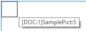

## Adición de imágenes 

Agregar imágenes a un documento 4D Write Pro puede lograrse de múltiples maneras y depender de sus necesidades:

* para agregar una imagen de fondo, use el atributo wk background image o wk background image url con el comando [WP SET ATTRIBUTES](../commands/wp-set-attributes)
* para agregar una imagen en línea, es decir, insertada en el flujo de texto como un caracter, use el comando [WP INSERT PICTURE](../commands/wp-insert-picture) o el comando [ST INSERT EXPRESSION](../../commands/st-insert-expression)
* para agregar una imagen anclada en la página (detrás o enfrente del texto), utilice el comando [WP Add picture](../commands/wp-add-picture).

La forma en que agrega una imagen determina la capa en la que está colocada, como se ilustra en el siguiente diagrama:


## Imágenes de fondo 

Las imágenes se pueden configurar como fondo de los documentos 4D Write Pro y los elementos del documento (tablas, párrafos, secciones, encabezados/pies de página, etc.).

Aquí hay un ejemplo que muestra dos maneras diferentes en que se puede usar una imagen como fondo de un documento:

>  

Las imágenes de fondo pueden definirse por programación o mediante el menú contextual. Para más información, consulte la sección *Fondo* en el artículo *Utilizar un área 4D Write Pro*.

La visualización de la imagen de fondo también puede establecerse por programación o a través del menú contextual. Tenga en cuenta que los valores del modo de visualización de fondo en realidad definen preajustes de la configuración de fondo, como se indica en la descripción de la constante:

| Constante                | Comentario                                                                                                                                                                                                                                                                                                                                                                                                                                                                                                                                                                 |
| ------------------------ | -------------------------------------------------------------------------------------------------------------------------------------------------------------------------------------------------------------------------------------------------------------------------------------------------------------------------------------------------------------------------------------------------------------------------------------------------------------------------------------------------------------------------------------------------------------------------- |
| wk proportional          | Cuando se utiliza como valor de wk image display mode, la imagen se alinea en la parte superior izquierda de la caja de contenido, no se replica, se escala para ajustarse a la caja de contenido y mantiene su relación de aspecto. Cuando se utiliza como valor de wk background display mode, preestablece los siguientes atributos: wk background width \= "contain" wk background height \= "auto" wk background repeat \= wk no repeat wk background origin \= wk padding box wk background position horizontal \= wk left wk background position vertical \= wk top |
| wk proportional centered | Cuando se utiliza como valor de wk image display mode, la imagen se centra en la caja de contenido, no se replica, se escala para ajustarse a la caja de contenido y mantiene su relación de aspecto. Cuando se utiliza como valor de wk background display mode, preestablece los siguientes atributos: wk background width \= "contain" wk background height \= "auto" wk background repeat \= wk no repeat wk background origin \= wk padding box wk background position horizontal \= wk center wk background position vertical \= wk center                           |
| wk replicated            | Cuando se utiliza como valor de wk image display mode, la imagen se alinea en la parte superior izquierda de la caja de contenido, se replica y mantiene su tamaño original. Cuando se utiliza como valor de wk background display mode, preestablece los siguientes atributos: wk background width \= "auto" wk background height \= "auto" wk background repeat \= wk repeat wk background origin \= wk padding box wk background position horizontal \= wk left wk background position vertical \= wk top                                                               |
| wk replicated centered   | Cuando se utiliza como valor de wk image display mode, la imagen se centra en la caja de contenido, se replica y mantiene su tamaño original. Cuando se utiliza como valor de wk background display mode, preestablece los siguientes atributos: wk background width \= "auto" wk background height \= "auto" wk background repeat \= wk repeat wk background origin \= wk padding box wk background position horizontal \= wk center wk background position vertical \= wk center                                                                                         |
| wk scaled to fit         | Cuando se utiliza como valor de wk image display mode, la imagen se escala para ajustarse a la caja de contenido y no se replica. Cuando se utiliza como valor de wk background display mode, se modifican los siguientes atributos: wk background width \= "100%" wk background height \= "100%" wk background repeat \= wk no repeat wk background origin \= wk padding box wk background position horizontal \= wk left wk background position vertical \= wk top                                                                                                       |
| wk truncated             | Cuando se utiliza como valor de wk image display mode, la imagen se alinea en la parte superior izquierda de la caja de contenido, no se replica, y mantiene su tamaño original. Cuando se utiliza como valor de wk background display mode, preestablece los siguientes atributos: wk background width \= "auto" wk background height \= "auto" wk background repeat \= wk no repeat wk background origin \= wk padding box wk background position horizontal \= wk left wk background position vertical \= wk top                                                        |
| wk truncated centered    | Cuando se utiliza como valor de wk image display mode, la imagen se centra en la caja de contenido, no se replica, y mantiene su tamaño original. Cuando se utiliza como valor de wk background display mode, preestablece los siguientes atributos: wk background width \= "auto" wk background height \= "auto" wk background repeat \= wk no repeat wk background origin \= wk padding box wk background position horizontal \= wk center wk background position vertical \= wk center                                                                                  |

## Posicionamiento y visualización de imágenes ancladas 

Las imágenes ancladas se agregan con una posición absoluta, delante y detrás del texto, y también se anclan a la página o partes específicas de un documento (es decir, encabezado, pie de página, secciones). Establecer una posición absoluta para una imagen se logra con los comandos [WP Add picture](../commands/wp-add-picture) y [WP SET ATTRIBUTES](../commands/wp-set-attributes).

Las posiciones de las imágenes ancladas se pueden modificar con los siguientes atributos específicos y/o acciones estándar:

| **Propiedad (constante)**   | **Acción estándar**     |
| --------------------------- | ----------------------- |
| wk anchor layout            | *anchorLayout*          |
| wk anchor horizontal offset |                         |
| wk anchor horizontal align  | *anchorHorizontalAlign* |
| wk anchor vertical offset   |                         |
| wk anchor vertical align    | *anchorVerticalAlign*   |
| wk anchor origin            | *anchorOrigin*          |
| wk anchor page              | *anchorPage*            |
| wk anchor section           | *anchorSection*         |
| | *moveToBack*              |                         |
| | *moveToFront*             |                         |

Las imágenes ancladas admiten el ajuste automático del texto cuando se anclan a un documento con opciones como a la izquierda, a la derecha, al lado más grande, por encima y por debajo, o todo alrededor ofrecidas a través de la propiedad wk anchor layout o la acción estándar **anchorLayout**. Lea esta [entrada del blog](https://blog.4d.com/4d-write-pro-more-display-options-for-anchored-pictures-and-text-boxes/) para más detalles.

  
  
Las imágenes con ajuste de texto ancladas al cuerpo de la página no afectan al encabezado ni al pie de página (la imagen se muestra delante del encabezado o del pie de página); por el contrario, las imágenes ancladas al encabezado y al pie de página afectan al cuerpo de la página si se solapan con él.  
  
**Nota**: si desea anclar una imagen con ajuste de texto al encabezado o al pie de página, también debe definir la alineación vertical de la imagen en la parte superior.

Todas las imágenes ancladas se muestran únicamente en el modo de visualización de página. No se muestran si:

* están anclados a un encabezado o pie de página que no es visible;
* el modo de vista es Borrador;
* están centradas o ancladas en secciones y la opción **Mostrar HTML WYSIWYG** está marcada;
* la opción "Mostrar fondo" no está seleccionada.

## Expresiones Imagen 

Puede insertar expresiones 4D que devuelvan imágenes en sus áreas 4D Write Pro. Las expresiones pueden ser variables, campos, métodos proyecto, atributos de objeto o elementos de colección.

Puede ver la referencia de una expresión en la punta de la imagen (\*):


(\*)Como no hay texto asociado con una imagen anclada, su referencia de expresión no se puede mostrar.

Todos los atributos imagen se pueden aplicar a expresiones imagen (wk image y los atributos wk image url solo se pueden leer). Sin embargo, tenga en cuenta que, dado que las imágenes tienen atributos específicos, 4D Write Pro debe evaluar la expresión al menos una vez para detectar que su resultado es una imagen y manejarla como una expresión de imagen. Esto significa que cuando se inserta una expresión de imagen con [WP INSERT FORMULA](../commands/wp-insert-formula), se debe llamar [WP COMPUTE FORMULAS](../commands/wp-compute-formulas) antes de definir todo atributo imagen.

**Nota**: al igual que con otras expresiones, las expresiones imagen también se ven afectadas por los comandos [WP COMPUTE FORMULAS](../commands/wp-compute-formulas) y [WP FREEZE FORMULAS](../commands/wp-freeze-formulas).

### Imágenes ancladas 

Las expresiones imagen ancladas se agregan con el comando [WP Add picture](../commands/wp-add-picture) (sin el segundo parámetro), seguido de una llamada al comando [WP SET ATTRIBUTES](../commands/wp-set-attributes) con el selector wk image formula.

Ejemplo:

```4d
 obImage:=WP Add picture(myDoc)
 WP SET ATTRIBUTES(obImage;wk image formula;Formula(m_buildPict))
```

También puede insertar expresiones de imagen usando [WP SET ATTRIBUTES](../commands/wp-set-attributes) y wk image formula en imágenes ancladas existentes.

**Nota de compatibilidad**: wk image expression aún se puede utilizar para definir expresiones imagen a través de texto. Sin embargo, se recomienda utilizar wk image formula y objetos.

Llamar al comando [WP RESET ATTRIBUTES](../commands/wp-reset-attributes) con wk image formula es similar a llamar a [WP FREEZE FORMULAS](../commands/wp-freeze-formulas) (en todo el documento) en que la expresión es limpiada desde el atributo imagen. Sin embargo, [WP FREEZE FORMULAS](../commands/wp-freeze-formulas) calcula la expresión antes de borrar, mientras que [WP RESET ATTRIBUTES](../commands/wp-reset-attributes) no lo hace. Si nunca se ha calculado una expresión, se mostrará la imagen de marco negro predeterminada.

### Expresiones imagen en línea 

Las expresiones imagen en línea se agregan con el comando [WP INSERT FORMULA](../commands/wp-insert-formula).

Ejemplos:

```4d
  //Inserta una variable imagen 

WP INSERT FORMULA(wpRange;Formula($vpict);wk prepend)
 
  //Inserta un campo
 WP INSERT FORMULA(wpRange;Formula([DOC]SamplePict);wk prepend)
 
  //Inserta un método 4D
 WP INSERT FORMULA(wpRange;Formula(M_ComputeChart);wk prepend)


```

### Imágenes vacías 

Si una imagen está vacía (por ejemplo, no se ha podido cargar, o es el resultado de una expresión que no se ha podido calcular, o utiliza un formato de imagen no soportado), por defecto 4D Write Pro muestra un rectángulo de marco negro:



Puede eliminar estos rectángulos negros de la vista actual utilizando:

* la opción "Mostrar imágenes vacías o no soportadas" de la lista de Propiedades (ver *Configurar propiedades Vista*), o
* el comando [WP SET VIEW PROPERTIES](../commands/wp-set-view-properties) con el selector wk visible empty images, o bien
* la acción estándar *visibleEmptyImage* (ver *Utilizar las acciones estándar 4D Write Pro*).

También puede utilizar el selector wk visible empty images con los comandos [WP EXPORT DOCUMENT](../commands/wp-export-document) y [WP EXPORT VARIABLE](../commands/wp-export-variable) para eliminar los rectángulos negros de los contenidos exportados.  
  
Tenga en cuenta que cuando esta opción está activada, los elementos de imagen que falten no se mostrarán en absoluto aunque tengan bordes, ancho, alto o fondo; esto puede afectar al diseño de página para imágenes en línea.

## Propiedades de la imagen 

Todas las imágenes tienen propiedades (atributos) como altura, ancho, bordes, modo de visualización etc., que se pueden obtener o definir a través del lenguaje 4D Write Pro ([WP GET ATTRIBUTES](../commands/wp-get-attributes) y [WP SET ATTRIBUTES](../commands/wp-set-attributes)) o de acciones estándar.

* La lista completa de propiedades disponibles para imágenes se ofrece en la página *Atributos 4D Write Pro*.
* La sección *Imagen* contiene atributos que son específicos de las imágenes solamente.
* La página *Utilizar las acciones estándar 4D Write Pro* también lista las propiedades de imagen disponibles.

### Referencia de imagen o URL de imagen 

Puede trabajar con referencias de imágenes (variables de imagen, campos, expresiones) o URL de imágenes (texto que representa una dirección local o de red de la imagen).

Dos conjuntos de atributos le permiten definir si desea establecer u obtener una referencia de imagen o una URL de imagen:

* wk image, wk background image, wk list style image: para definir u obtener referencias de imagen.  
Cuando obtiene una imagen utilizando uno de estos atributos, recibe una imagen 4D, sin importar cómo se definió la imagen.
* wk image url, wk background image url, wk list style image url: para definir u obtener URLs de imágenes.  
Cuando obtiene una imagen utilizando uno de estos atributos, recibe un texto. Si la imagen se definió a través de una referencia (por ejemplo, una variable de imagen), se obtiene un URI local seguido de la imagen en Base64.

**Ejemplo**:

```4d
 $range:=WP Get selection(WPArea) //obtiene la imagen seleccionada por el usuario
 $range:=WP Picture range($range) //crea un rango
 $url:="http://doc.4d.com/image/logo/poweredby4D_web.png"
 
 WP SET ATTRIBUTES($range;wk image;$url) //define una referencia de imagen desde una URL
 
  //obtener la imagen
 var vPictureGet : Picture
 WP GET ATTRIBUTES($range;wk image;vPictureGet) //vPictureGet contiene una imagen
 var vPictureURLGet : Text
 WP GET ATTRIBUTES($range;wk image url;vPictureURLGet) //vPictureURLGet=$url
```

## Recuperar imágenes 

Los siguientes comandos se pueden usar para devolver imágenes:

* [WP Picture range](../commands/wp-picture-range) \- aplica solo a imágenes en línea
* [WP Selection range](../commands/wp-selection-range) \- solo aplica a las imágenes seleccionadas por el usuario

## Eliminar imágenes 

Puede eliminar imágenes en línea y ancladas con:

* *Acciones ratón/teclado*
* el comando [WP DELETE PICTURE ](../commands/wp-delete-picture)

## Acciones ratón/teclado 

Las imágenes se pueden manipular con el ratón o el teclado. Las acciones disponibles incluyen:

* **SELECT**  
   * Las imágenes en la capa frontal se pueden seleccionar haciendo clic en ellas;  
   * Las imágenes de fondo se pueden seleccionar presionando CTRL + haciendo clic en ellas (Windows) o COMANDO + haciendo clic en ellas (Mac);  
   * Solo se puede seleccionar una sola imagen con una posición absoluta: no es posible la selección múltiple.
* **MOVE**  
   * Las imágenes se pueden mover y cambiar de tamaño con el ratón; (las imágenes en línea no se pueden arrastrar fuera del documento).
* **INSERT**  
   * Si las imágenes con una posición absoluta se pegan en modo Borrador, se muestran en línea al comienzo de la selección del teclado actual.
* **CUT/PASTE/COPY**  
   * Las imágenes se pueden copiar al portapapeles, o cortar/pegar mientras se selecciona.  
   * Pegar una imagen con una posición absoluta en el modo Página pegará la imagen en la primera página seleccionada y la anclará a esa página, sin importar la configuración de anclaje de la página original; las imágenes pegadas mantendrán sus desplazamientos, a menos que se peguen en un modo diferente al original (por ejemplo, si la imagen se copia en modo Página y se pega en modo Anidado, los desplazamientos se restablecen en 0).
* **DELETE** \- Las imágenes se pueden borrar mientras se seleccionan con:  
   * Tecla DELETE, o  
   * atajo de teclado para la acción Clear