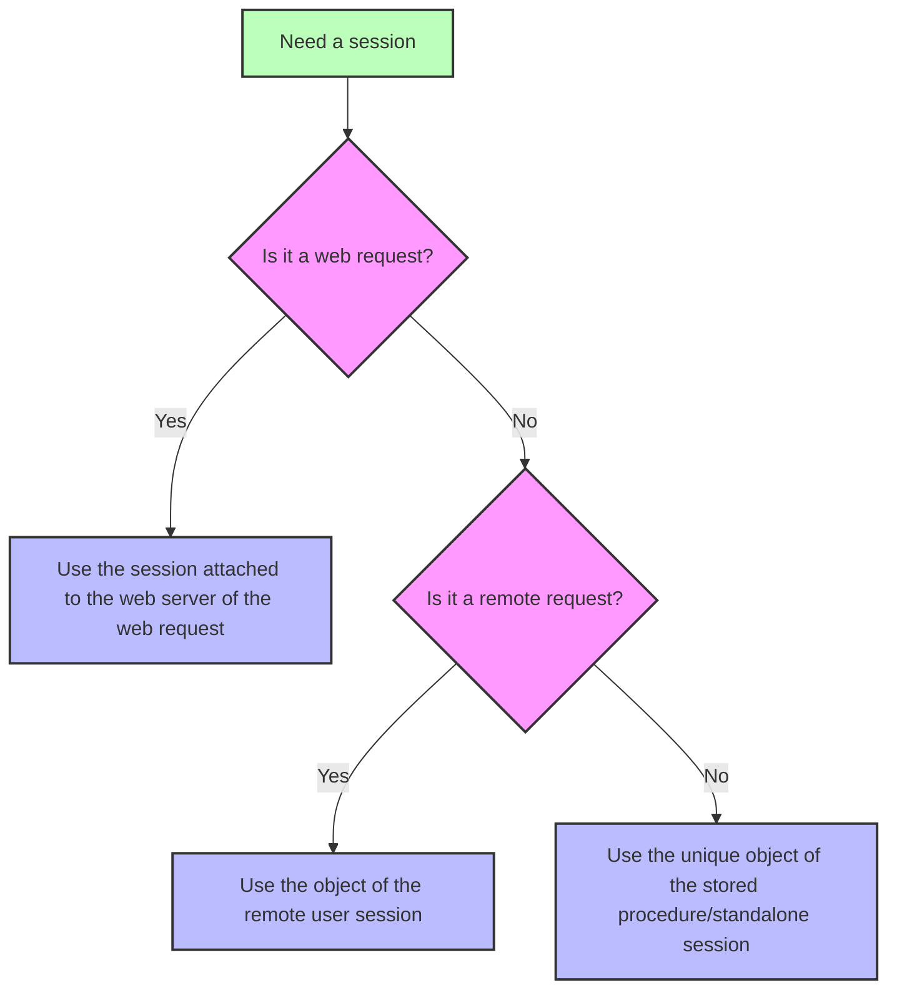

<!-- REF #_command_.Session.Syntax -->**Session** : 4D.Session<!-- END REF -->

<!--REF #_command_.Session.Params-->

| Parámetros | Tipo                       |                             | Descripción    |
| ---------- | -------------------------- | --------------------------- | -------------- |
| Resultado  | 4D.Session | &#8592; | Objeto Session |

<!-- END REF-->

<details><summary>Historia</summary>

| Lanzamiento | Modificaciones                                                     |
| ----------- | ------------------------------------------------------------------ |
| 20 R8       | Soporte de sesiones autónomas                                      |
| 20 R5       | Soporte de cliente remoto y sesiones de procedimientos almacenados |
| 18 R6       | Añadidos                                                           |

</details>

## Descripción

The `Session` command <!-- REF #_command_.Session.Summary -->returns the `Session` object corresponding to the current session<!-- END REF -->.

Depending on the process from which the command is called, the current session can be:

- una sesión web (cuando las [sesiones escalables están activadas](WebServer/sessions.md#enabling-web-sessions)),
- una sesión de cliente remoto (en el servidor),
- una sesión de procedimientos almacenados,
- a standalone session.

Para obtener más información, consulte el párrafo [Tipos de sesion](../API/SessionClass.md#session-types).

El comando devuelve *Null* si:

- se llama en un proceso web y se desactivan las sesiones escalables en el servidor web,
- se llama en un 4D remoto.

### Sesiones web

El objeto `Session` de las sesiones web está disponible desde cualquier proceso web:

- Métodos base `On Web Authentication`, `On Web Connection` y `On REST Authentication`,
- código procesado a través de las etiquetas 4D en las páginas semidinámicas (4DTEXT, 4DHTML, 4DEVAL, 4DSCRIPT/, 4DCODE)
- los métodos proyecto con el atributo "Available through 4D tags and URLs (4DACTION...)" y llamados a través de 4DACTION/ urls,
- métodos base [`On Mobile App Authentication`](https://developer.4d.com/go-mobile/docs/4d/on-mobile-app-authentication) y [`On Mobile App Action`](https://developer.4d.com/go-mobile/docs/4d/on-mobile-app-action) para peticiones móviles,
- Funciones ORDA [llamadas con peticiones REST](../REST/ClassFunctions.md).

Para más información sobre las sesiones usuario web, consulte la sección [Sesiones web](../WebServer/sessions.md).

### Sesiones de cliente remoto

El objeto `Session` de las sesiones cliente remotas está disponible desde:

- Métodos proyecto que tienen el atributo [Ejecutar en el Servidor](../Project/code-overview.md#execute-on-server) (se ejecutan en el proceso "twinned" del proceso cliente),
- Triggers,
- ORDA [funciones del modelo de datos](../ORDA/ordaClasses.md) (excepto las declaradas con la palabra clave [`local`](../ORDA/ordaClasses.md#local-functions),
- Los métodos base `On Server Open Connection` y `On Server Shutdown Connection` de la base de datos.

For more information on remote user sessions, please refer to the [**Remote user sessions**](../Desktop/sessions.md#remote-user-sessions) paragraph.

### Sesión de procedimientos almacenados

Todos los procesos de procedimientos almacenados comparten la misma sesión virtual de usuario. El objeto `Session` de los procedimientos almacenados está disponible desde:

- métodos llamados con el comando [`Execute on server`](../commands-legacy/execute-on-server.md),
- Los métodos base `On Server Startup`, `On Server Shutdown`, `On Backup Startup`, `On Backup Shutdown` y `On System event`

For more information on stored procedures virtual user session, please refer to the [**Stored procedure sessions**](../Desktop/sessions.md#stored-procedure-sessions) paragraph.

### Sesión independiente

El objeto `Session` está disponible desde cualquier proceso en aplicaciones independientes (monousuario) para que pueda escribir y probar su código cliente/servidor utilizando el objeto `Session` en su entorno de desarrollo 4D.

For more information on standalone sessions, please refer to the [**Standalone sessions**](../Desktop/sessions.md#standalone-sessions) paragraph.

### `Session` and components

When `Session` is called from the code of different [components loaded in the project](../Concepts/components.md), the command returns an object depending on the calling request and the context:

- in case of a web request, `Session` always returns the session attached to the target web server of the request (and not a session of the component's web server),
- in case of a remote request executed on the server, `Session` always returns the session attached to the remote user,
- in case of a stored procedure session or a standalone session, `Session` always returns the single current session (the same object is used during all the work session).



## Ejemplo

Ha definido el método `action_Session` con el atributo "Disponible a través de etiquetas 4D y URLs". Se llama al método introduciendo la siguiente URL en el navegador:

```
IP:port/4DACTION/action_Session
```

```4d
  //action_Session method
 Case of
    :(Session#Null)
       If(Session.hasPrivilege("CreateInvoices")) //calling the hasPrivilege function
          WEB SEND TEXT("4DACTION --> Session is CreateInvoices")
       Else
          WEB SEND TEXT("4DACTION --> Session is not CreateInvoices")
       End if
    Else
       WEB SEND TEXT("4DACTION --> Session is null")
 End case
```

## Ver también

[Session storage](session-storage.md)  
[Session API](../API/SessionClass.md)
[Desktop sessions](../Desktop/sessions.md)
[Web server user sessions](../WebServer/sessions.md)  
[*Scalable sessions for advanced web applications* (blog post)](https://blog.4d.com/scalable-sessions-for-advanced-web-applications/)

## Propiedades

|                   |      |
| ----------------- | ---- |
| Número de comando | 1714 |
| Hilo seguro       | sí   |


