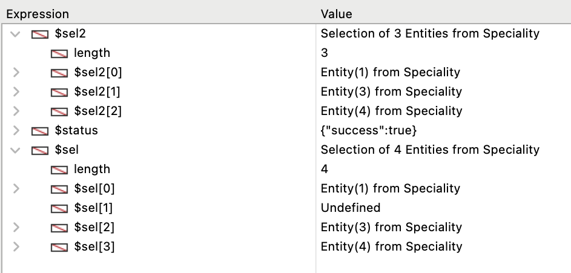

Une entity selection est un objet contenant une ou plusieurs référence(s) à des [entités](ORDA/dsMapping.md#entity) appartenant à la même [Dataclass](ORDA/dsMapping.md#dataclass). Une entity selection peut contenir 0, 1 ou X entités de la dataclass - où X peut représenter le nombre total d'entités contenues dans la dataclass.

Les entity selections peuvent être créées à partir de sélections existantes en utilisant diverses fonctions de la classe [`DataClass`](DataClassClass.md) telles que [`.all()`](DataClassClass.md#all) ou [`.query()`](DataClassClass.md#query), ou des fonctions de la classe `EntityClass` elle-même, telles que [`.and()`](#and) ou [`orderBy()`](#orderby). You can also create blank entity selections using the [`dataClass.newSelection()`](DataClassClass.md#newselection) function or the [`Create entity selection`](../commands/create-entity-selection.md) command.

### Sommaire

|                                                                                                                                                                                  |
| -------------------------------------------------------------------------------------------------------------------------------------------------------------------------------- |
| [<!-- INCLUDE EntitySelectionClass.index.Syntax -->](#91index93)<br/><!-- INCLUDE EntitySelectionClass.index.Summary -->                                                         |
| [<!-- INCLUDE EntitySelectionClass.attributeName.Syntax -->](#attributename)<br/><!-- INCLUDE EntitySelectionClass.attributeName.Summary -->                                     |
| [<!-- INCLUDE #EntitySelectionClass.add().Syntax -->](#add)<br/><!-- INCLUDE #EntitySelectionClass.add().Summary -->                                                             |
| [<!-- INCLUDE #EntitySelectionClass.and().Syntax -->](#and)<br/><!-- INCLUDE #EntitySelectionClass.and().Summary -->                                                             |
| [<!-- INCLUDE #EntitySelectionClass.at().Syntax -->](#at)<br/><!-- INCLUDE #EntitySelectionClass.at().Summary -->                                                                |
| [<!-- INCLUDE #EntitySelectionClass.average().Syntax -->](#average)<br/><!-- INCLUDE #EntitySelectionClass.average().Summary -->                                                 |
| [<!-- INCLUDE #EntitySelectionClass.clean().Syntax -->](#clean)<br/><!-- INCLUDE #EntitySelectionClass.clean().Summary -->                                                       |
| [<!-- INCLUDE #EntitySelectionClass.contains().Syntax -->](#contains)<br/><!-- INCLUDE #EntitySelectionClass.contains().Summary -->                                              |
| [<!-- INCLUDE #EntitySelectionClass.copy().Syntax -->](#contains)<br/><!-- INCLUDE #EntitySelectionClass.copy().Summary -->                                                      |
| [<!-- INCLUDE #EntitySelectionClass.count().Syntax -->](#count)<br/><!-- INCLUDE #EntitySelectionClass.count().Summary -->                                                       |
| [<!-- INCLUDE #EntitySelectionClass.distinct().Syntax -->](#distinct)<br/><!-- INCLUDE #EntitySelectionClass.distinct().Summary -->                                              |
| [<!-- INCLUDE #EntitySelectionClass.distinctPaths().Syntax -->](#distinctPaths)<br/><!-- INCLUDE #EntitySelectionClass.distinctPaths().Summary -->                               |
| [<!-- INCLUDE #EntitySelectionClass.drop().Syntax -->](#drop)<br/><!-- INCLUDE #EntitySelectionClass.drop().Summary -->                                                          |
| [<!-- INCLUDE #EntitySelectionClass.extract().Syntax -->](#extract)<br/><!-- INCLUDE #EntitySelectionClass.extract().Summary -->                                                 |
| [<!-- INCLUDE #EntitySelectionClass.first().Syntax -->](#first)<br/><!-- INCLUDE #EntitySelectionClass.first().Summary -->                                                       |
| [<!-- INCLUDE #EntitySelectionClass.getDataClass().Syntax -->](#getdataclass)<br/><!-- INCLUDE #EntitySelectionClass.getDataClass().Summary -->                                  |
| [<!-- INCLUDE #EntitySelectionClass.getRemoteContextAttributes().Syntax -->](#getremotecontextattributes)<br/><!-- INCLUDE #EntityClass.getRemoteContextAttributes().Summary --> |
| [<!-- INCLUDE #EntitySelectionClass.isAlterable().Syntax -->](#isalterable)<br/><!-- INCLUDE #EntitySelectionClass.isAlterable().Summary -->                                     |
| [<!-- INCLUDE #EntitySelectionClass.isOrdered().Syntax -->](#isordered)<br/><!-- INCLUDE #EntitySelectionClass.isOrdered().Summary -->                                           |
| [<!-- INCLUDE #EntitySelectionClass.last().Syntax -->](#last)<br/><!-- INCLUDE #EntitySelectionClass.last().Summary -->                                                          |
| [<!-- INCLUDE #EntitySelectionClass.length.Syntax -->](#length)<br/><!-- INCLUDE #EntitySelectionClass.length.Summary -->                                                        |
| [<!-- INCLUDE #EntitySelectionClass.max().Syntax -->](#max)<br/><!-- INCLUDE #EntitySelectionClass.max().Summary -->                                                             |
| [<!-- INCLUDE #EntitySelectionClass.min().Syntax -->](#min)<br/><!-- INCLUDE #EntitySelectionClass.min().Summary -->                                                             |
| [<!-- INCLUDE #EntitySelectionClass.minus().Syntax -->](#minus)<br/><!-- INCLUDE #EntitySelectionClass.minus().Summary -->                                                       |
| [<!-- INCLUDE #EntitySelectionClass.or().Syntax -->](#or)<br/><!-- INCLUDE #EntitySelectionClass.or().Summary -->                                                                |
| [<!-- INCLUDE #EntitySelectionClass.orderBy().Syntax -->](#orderby)<br/><!-- INCLUDE #EntitySelectionClass.orderBy().Summary -->                                                 |
| [<!-- INCLUDE #EntitySelectionClass.orderByFormula().Syntax -->](#orderbyformula)<br/><!-- INCLUDE #EntitySelectionClass.orderByFormula().Summary -->                            |
| [<!-- INCLUDE #EntitySelectionClass.query().Syntax -->](#query)<br/><!-- INCLUDE #EntitySelectionClass.query().Summary -->                                                       |
| [<!-- INCLUDE #EntitySelectionClass.queryPath.Syntax -->](#querypath)<br/><!-- INCLUDE #EntitySelectionClass.queryPath.Summary -->                                               |
| [<!-- INCLUDE #EntitySelectionClass.queryPlan.Syntax -->](#queryplan)<br/><!-- INCLUDE #EntitySelectionClass.queryPlan.Summary -->                                               |
| [<!-- INCLUDE #EntitySelectionClass.refresh().Syntax -->](#refresh)<br/><!-- INCLUDE #EntitySelectionClass.refresh().Summary -->                                                 |
| [<!-- INCLUDE #EntitySelectionClass.selected().Syntax -->](#selected)<br/><!-- INCLUDE #EntitySelectionClass.selected().Summary -->                                              |
| [<!-- INCLUDE #EntitySelectionClass.slice().Syntax -->](#slice)<br/><!-- INCLUDE #EntitySelectionClass.slice().Summary -->                                                       |
| [<!-- INCLUDE #EntitySelectionClass.sum().Syntax -->](#sum)<br/><!-- INCLUDE #EntitySelectionClass.sum().Summary -->                                                             |
| [<!-- INCLUDE #EntitySelectionClass.toCollection().Syntax -->](#tocollection)<br/><!-- INCLUDE #EntitySelectionClass.toCollection().Summary -->                                  |

#### Voir également

[`USE ENTITY SELECTION`](../commands/use-entity-selection.md)

<!-- REF EntitySelectionClass.index.Desc -->

## \[*index*]

<details><summary>Historique</summary>

| Release | Modifications |
| ------- | ------------- |
| 17      | Ajout         |

</details>

<!-- REF EntitySelectionClass.index.Syntax -->***&#91;index&#93;*** : 4D.Entity<!-- END REF -->

#### Description

La notation `EntitySelection[index]` <!-- REF EntitySelectionClass.index.Summary -->vous permet d'accéder aux entités de l'entity selection en utilisant la syntaxe standard des collections<!-- END REF --> : passez la position de l'entité que vous souhaitez obtenir dans le paramètre *index*.

A noter que l'entité correspondante est rechargée depuis le datastore.

*index* peut être tout nombre compris entre 0 et `.length`-1.

- Si *index* est en-dehors de ces limites, une erreur est retournée.
- Si *index* correspond à une entité supprimée, une valeur Null est retournée.

:::caution

`EntitySelection[index]` est une expression non assignable, ce qui signifie qu'elle ne peut pas être utilisée comme référence d'entité modifiable avec des fonctions telles que [`.lock()`](EntityClass.md#lock) ou [`.save()`](EntityClass.md#save). Pour travailler avec l'entité correspondante, vous devez assigner l'expression retournée à une expression assignable, comme une variable. Exemples :

```4d
 $sel:=ds.Employee.all() //creation de l'entity selection
  //code invalide:
 $result:=$sel[0].lock() //ne fonctionnera PAS
 $sel[0].lastName:="Smith" //ne fonctionnera PAS
 $result:=$sel[0].save() //ne fonctionnera PAS
  //code valide :
 $entity:=$sel[0]  //OK
 $entity.lastName:="Smith" //OK
 $entity.save() //OK
```

:::

#### Exemple

```4d
 var $employees : cs.EmployeeSelection
 var $employee : cs.EmployeeEntity
 $employees:=ds.Employee.query("lastName = :1";"H@")
 $employee:=$employees[2]  // La 3e entité de l'entity selection $employees est rechargée depuis le datastore
```

<!-- END REF -->

<!-- REF EntitySelectionClass.attributeName.Desc -->

## .*attributeName*

<details><summary>Historique</summary>

| Release | Modifications |
| ------- | ------------- |
| 17      | Ajout         |

</details>

<!-- REF EntitySelectionClass.attributeName.Syntax -->***.attributeName*** : Collection<br/>***.attributeName*** : 4D.EntitySelection<!-- END REF -->

#### Description

Tout attribut de dataclass peut être utilisé en tant que propriété d'une entity selection afin de retourner <!-- REF EntitySelectionClass.attributeName.Summary -->une "projection" des valeurs de l'attribut dans l'entity selection<!-- END REF -->. Les valeurs projetées peuvent être une collection ou une nouvelle entity selection, en fonction du [kind](DataClassClass.md#attributename) (`storage` ou `relation`) de l'attribut.

- Si le "kind" de *attributeName* est `storage` : `.attributeName` retourne une collection de valeurs du même type que *attributeName*.
- Si le "kind" de *attributeName* est `relatedEntity` : `.attributeName` retourne une nouvelle entity selection de valeurs liées du même type que *attributeName*. Les doublons sont supprimés (une entity selection non ordonnée est retournée).
- Si le "kind" de *attributeName* est `relatedEntities` : `.attributeName` retourne une nouvelle entity selection de valeurs liées du même type que *attributeName*. Les doublons sont supprimés (une entity selection non ordonnée est retournée).

Lorsqu'un attribut relationnel est utilisé comme propriété d'une entity selection, le résultat est toujours une autre entity selection, même si une seule entité est retournée. Dans ce cas, si aucune entité n'est renvoyée, le résultat est une sélection d'entités vide.

Si l'attribut n'existe pas dans l'entity selection, une erreur est retournée.

#### Exemple 1

Projection de valeurs de stockage :

```4d
 var $firstNames : Collection
 $entitySelection:=ds.Employee.all()
 $firstNames:=$entitySelection.firstName // firstName est un texte
```

Le résultat est une collection de chaînes, par exemple :

```4d
[
    "Joanna",
    "Alexandra",
    "Rick"
]
```

#### Exemple 2

Projection d'entité liée :

```4d
 var $es; $entitySelection : cs.EmployeeSelection
 $entitySelection:=ds.Employee.all()
 $es:=$entitySelection.employer // employer est lié à la dataclass Company
```

L'objet résultant est une entity selection de la dataclass Company sans doublons (s'il y en a).

#### Exemple 3

Projection d'entités liées :

```4d
 var $es : cs.EmployeeSelection
 $es:=ds.Employee.all().directReports // directReports est récursif et lié à la dataclass Employee
```

L'objet résultant est une entity selection de la dataclass Employee sans doublons (s'il y en a).

<!-- END REF -->

<!-- REF EntitySelectionClass.add().Desc -->

## .add()

<details><summary>Historique</summary>

| Release | Modifications                                        |
| ------- | ---------------------------------------------------- |
| 19 R7   | Prise en charge du paramètre *entitySelection*       |
| 18 R5   | Supporte uniquement les entity selections altérables |
| 17      | Ajout                                                |

</details>

<!-- REF #EntitySelectionClass.add().Syntax -->**.add**( *entity* : 4D.Entity ) : 4D.EntitySelection<br/>**.add**( *entitySelection* : 4D.EntitySelection ) : 4D.EntitySelection<!-- END REF -->

<!-- REF #EntitySelectionClass.add().Params -->

| Paramètres      | Type                               |                             | Description                                                      |
| --------------- | ---------------------------------- | :-------------------------: | ---------------------------------------------------------------- |
| entity          | 4D.Entity          |              ->             | Entité à ajouter à l'entity selection                            |
| entitySelection | 4D.EntitySelection |              ->             | Entity selection à ajouter à l'entity selection d'origine        |
| Résultat        | 4D.EntitySelection | <- | Entity selection incluant l'*entity* ou *entitySelection*ajoutée |

<!-- END REF -->

#### Description

La fonction `.add()` <!-- REF #EntitySelectionClass.add().Summary -->ajoute l'*entity* ou l'*entitySelection* spécifiée à l'entity selection originale et renvoie l'entity selection modifiée<!-- END REF -->.

> Cette fonction modifie l'entity selection d'origine.

:::info attention

L'entity selection doit être *modifiable*, c'est-à-dire qu'elle a été créée par exemple par [`.newSelection()`](DataClassClass.md#newselection) ou `Create entity selection`, sinon `.add()` renverra une erreur. Les entity selections partageables n'acceptent pas l'ajout d'entités. Les entity selections partageables n'acceptent pas l'ajout d'entités.

:::

**Ajouter une entité**

- Si l'entity selection est ordonnée, le paramètre *entity* est ajouté à la fin de la sélection. Si une référence à la même entité appartient déjà à l'entity selection, elle est dupliquée et une nouvelle référence est ajoutée.
- Si l'entity selection est non ordonnée, le paramètre *entity* est ajouté n'importe où dans la sélection, sans ordre spécifique.

**Ajouter une entity selection**

- Si l'entity selection est ordonnée, son ordre est conservé et *entitySelection* est ajoutée à la fin de la sélection. Si des références aux mêmes entités de *entitySelection* appartiennent déjà à l'entity selection, elles sont dupliquées et de nouvelles références sont ajoutées.
- Si l'entity selection n'est pas ordonnée, elle devient ordonnée.

> Pour plus d'informations, reportez-vous au paragraphe [Entity selections triées ou non triées](ORDA/dsMapping.md#ordered-or-unordered-entity-selection).

L'entity selection modifiée est retournée par la fonction, afin que les appels vers la fonction puissent être chaînés.

Une erreur est générée si *entity* et l'entity selection ne sont pas liées à la même dataclass. Si *entity* est Null, aucune erreur n'est générée.

#### Exemple 1

```4d
 var $employees : cs.EmployeeSelection
 var $employee : cs.EmployeeEntity
 $employees:=ds.Employee.newSelection()
 $employee:=ds.Employee.new()
 $employee.lastName:="Smith"
 $employee.save()
 $employees.add($employee) //L'entité $employee est ajoutée à l'entity selection $employees
```

#### Exemple 2

Les appels vers la fonction peuvent être chaînés :

```4d
 var $sel : cs.ProductSelection
 var $p1;$p2;$p3 : cs.ProductEntity

 $p1:=ds.Product.get(10)
 $p2:=ds.Product.get(11)
 $p3:=ds.Product.get(12)
 $sel:=ds.Product.newSelection()
 $sel:=$sel.add($p1).add($p2).add($p3)
```

#### Exemple 3

Dans une interface utilisateur, nous avons deux listes. L'utilisateur sélectionne des éléments de list1 pour les ajouter dans list2.

```4d
$sellist2:=$sellist2.add($sellist1)
```

<!-- END REF -->

<!-- REF EntitySelectionClass.and().Desc -->

## .and()

<details><summary>Historique</summary>

| Release | Modifications |
| ------- | ------------- |
| 17      | Ajout         |

</details>

<!-- REF #EntitySelectionClass.and().Syntax -->**.and**( *entity* : 4D.Entity ) : 4D.EntitySelection<br/>**.and**( *entitySelection* : 4D.EntitySelection ) : 4D.EntitySelection<!-- END REF -->

<!-- REF #EntitySelectionClass.and().Params -->

| Paramètres      | Type                               |                             | Description                                                                      |
| --------------- | ---------------------------------- | :-------------------------: | -------------------------------------------------------------------------------- |
| entity          | 4D.Entity          |              ->             | Entité à intersecter                                                             |
| entitySelection | 4D.EntitySelection |              ->             | Entity selection à intersecter                                                   |
| Résultat        | 4D.EntitySelection | <- | Entity selection résultante de l'intersection à l'aide de l'opérateur logique ET |

<!-- END REF -->

#### Description

La fonction `.and()` <!-- REF #EntitySelectionClass.and().Summary -->combine l'entity selection avec un paramètre *entity* ou *entitySelection* en utilisant l'opérateur logique AND<!-- END REF --> ; elle renvoie une nouvelle entity selection non ordonnée qui ne contient que les entités référencées à la fois dans l'entity selection et dans le paramètre.

- Si vous passez *entity* comme paramètre, vous combinez cette entité avec l'entity selection. Si l'entité appartient à l'entity selection, une nouvelle entity selection contenant uniquement l'entité est retournée. Sinon, une entity selection vide est retournée.
- Si vous passez *entitySelection* comme paramètre, vous combinez les deux entity selections. Une nouvelle entity selection contenant uniquement les entités référencées dans les deux sélections est retournée. S'il n'y a pas d'intersection d'entité, une entity selection vide est retournée.

> Vous pouvez comparer des [entity selections ordonnées et/ou non ordonnées](ORDA/dsMapping.md#entity-selections-tri%C3%A9es-vs-entity-selections-non-tri%C3%A9es). La sélection résultante est toujours non ordonnée.

Si l'entity selection initiale ou celle du paramètre *entitySelection* est vide, ou si *entity* est Null, une entity selection vide est retournée.

Si l'entity selection initiale et le paramètre ne sont pas liés à la même dataclass, une erreur est retournée.

#### Exemple 1

```4d
 var $employees; $result : cs.EmployeeSelection
 var $employee : cs.EmployeeEntity
 $employees:=ds.Employee.query("lastName = :1" ; "H@")   
  //L'entity selection $employees contient l'entité
  //avec la clé primaire 710 et d'autres entités
  //par ex. "Colin Hetrick" / "Grady Harness" / "Sherlock Holmes" (clé primaire 710)
 $employee:=ds.Employee.get(710) // Retourne "Sherlock Holmes"

 $result:=$employees.and($employee) //$result est une entity selection contenant   
  //uniquement l'entité avec la clé primaire 710 ("Sherlock Holmes")
```

#### Exemple 2

Nous voulons obtenir une sélection d'employés nommés "Jones" qui vivent à New York :

```4d
 var $sel1; $sel2; $sel3 : cs.EmployeeSelection
 $sel1:=ds.Employee.query("name =:1";"Jones")
 $sel2:=ds.Employee.query("city=:1";"New York")
 $sel3:=$sel1.and($sel2)
```

<!-- END REF -->

<!-- REF EntitySelectionClass.at().Desc -->

## .at()

<details><summary>Historique</summary>

| Release | Modifications |
| ------- | ------------- |
| 20      | Ajout         |

</details>

<!-- REF #EntitySelectionClass.at().Syntax -->**.at**( *index* : Integer ) : 4D.Entity <!-- END REF -->

<!-- REF #EntitySelectionClass.at().Params -->

| Paramètres | Type                      |                             | Description                  |
| ---------- | ------------------------- | :-------------------------: | ---------------------------- |
| index      | Integer                   |              ->             | Index de l'entité à renvoyer |
| Résultat   | 4D.Entity | <- | L'entité à cet index         |

<!-- END REF -->

#### Description

La fonction `.at()` <!-- REF #EntitySelectionClass.at().Summary -->retourne l'entité à la position *index*, acceptant un entier positif ou négatif<!-- END REF -->.

Si *index* est négatif (de -1 à -n avec n : taille de l'entity selection), l'entité retournée sera basée sur l'ordre inverse de l'entity selection.

La fonction renvoie la valeur Null si *index* est au-delà des limites de l'entity selection.

#### Exemple

```4d
var $employees : cs.EmployeeSelection
var $emp1; $emp2 : cs.EmployeeEntity
$employees:=ds.Employee.query("lastName = :1" ; "H@")
$emp1:=$employees.at(2) //3e entité de l'entity selection $employees 
$emp2:=$employees.at(-3) //en partant de la fin, 3e entité
    //de l'entity selection $employees
```

<!-- END REF -->

<!-- REF EntitySelectionClass.average().Desc -->

## .average()

<details><summary>Historique</summary>

| Release | Modifications                                     |
| ------- | ------------------------------------------------- |
| 18 R6   | Retourne undefined si l'entity selection est vide |
| 17      | Ajout                                             |

</details>

<!-- REF #EntitySelectionClass.average().Syntax -->**.average**( *attributePath* : Text ) : Real<!-- END REF -->

<!-- REF #EntitySelectionClass.average().Params -->

| Paramètres    | Type |                             | Description                                                                                                                |
| ------------- | ---- | :-------------------------: | -------------------------------------------------------------------------------------------------------------------------- |
| attributePath | Text |              ->             | Chemin de l'attribut à utiliser pour le calcul                                                                             |
| Résultat      | Real | <- | Moyenne arithmétique des valeurs des entités pour l'attribut (Undefined pour une entity selection vide) |

<!-- END REF -->

#### Description

La fonction `.average()` <!-- REF #EntitySelectionClass.average().Summary -->renvoie la moyenne arithmétique de toutes les valeurs non nulles de *attributePath* dans l'entity selection<!-- END REF -->.

Passez dans le paramètre *attributePath* le chemin de l'attribut à utiliser pour le calcul.

Seules les valeurs numériques sont utilisées pour le calcul. Notez cependant que, lorsque le *attributePath* de l'entity selection contient des valeurs de types variés, `.average()` tient compte de tous les éléments contenant des valeurs scalaires pour calculer la moyenne.

> Les valeurs de type Date sont converties en valeurs numériques (secondes) et utilisées pour calculer la moyenne.

`.average()` retourne **undefined** si l'entity selection est vide ou si *attributePath* ne contient pas de valeurs numériques.

Une erreur est retournée si :

- *attributePath* est un attribut relatif,
- *attributePath* désigne un attribut qui n'existe pas dans la dataclass de l'entity selection.

#### Exemple

Nous voulons obtenir la liste des employés dont le salaire est supérieur au salaire moyen :

```4d
 var $averageSalary : Real
 var $moreThanAv : cs.EmployeeSelection
 $averageSalary:=ds.Employee.all().average("salary")
 $moreThanAv:=ds.Employee.query("salary > :1";$averageSalary)
```

<!-- END REF -->

<!-- REF EntitySelectionClass.clean().Desc -->

## .clean()

<details><summary>Historique</summary>

| Release | Modifications |
| ------- | ------------- |
| 20 R6   | Ajout         |

</details>

<!-- REF #EntitySelectionClass.clean().Syntax -->**.clean**() : 4D.EntitySelection<!-- END REF -->

<!-- REF #EntitySelectionClass.clean().Params -->

| Paramètres | Type                               |                             | Description                                       |
| ---------- | ---------------------------------- | :-------------------------: | ------------------------------------------------- |
| Résultat   | 4D.EntitySelection | <- | Nouvelle entity selection sans entités supprimées |

<!-- END REF -->

#### Description

La fonction `.clean()` <!-- REF #EntitySelectionClass.clean().Summary -->renvoie une nouvelle entity selection basée sur l'entity selection originale mais sans les entités supprimées, le cas échéant<!-- END REF -->.

Par défaut, lorsqu'une entité est [supprimée] (EntitySelectionClass.md#drop), sa ou ses référence(s) dans les entity selection existantes deviennent *undefined* mais ne sont pas supprimées des objets entity selection. Les entités supprimées sont toujours comptabilisées dans la propriété [`.length`](#length) et sont affichées sous forme de lignes vides si l'entity selection est liée à un objet d'interface tel qu'une liste. Dans ce cas, appeler la fonction `.clean()` sur l'entity selection vous permet d'obtenir une nouvelle entity selection à jour, ne contenant pas de références d'entités *undefined*.

La sélection d'entités résultante conserve la même propriété [triable](../ORDA/dsMapping.md#ordered-or-unordered-entity-selection) et la même propriété [alterable/shareable](../ORDA/entities.md#shareable-or-alterable-entity-selections) que l'entity selection d'origine.

#### Exemple

```4d
var $sel; $sel2 : cs.SpecialitySelection
var $status : Object

$sel:=ds.Speciality.query("ID <= 4")
$status:=ds.Speciality.get(2).drop() //supprime l'entité de la dataclass
  //$sel.length = 4

$sel2:=$sel.clean()
  //$sel2.length = 3
```



#### Voir également

[`.refresh()`](#refresh)

<!-- END REF -->

<!-- REF EntitySelectionClass.contains().Desc -->

## .contains()

<details><summary>Historique</summary>

| Release | Modifications |
| ------- | ------------- |
| 17      | Ajout         |

</details>

<!-- REF #EntitySelectionClass.contains().Syntax -->**.contains**( *entity* : 4D.Entity ) : Boolean<!-- END REF -->

<!-- REF #EntitySelectionClass.contains().Params -->

| Paramètres | Type                      |                             | Description                                                  |
| ---------- | ------------------------- | :-------------------------: | ------------------------------------------------------------ |
| entity     | 4D.Entity |              ->             | Entité à évaluer                                             |
| Résultat   | Boolean                   | <- | Vrai si l'entité appartient à l'entity selection, sinon Faux |

<!-- END REF -->

#### Description

La fonction `.contains()` <!-- REF #EntitySelectionClass.contains().Summary -->renvoie true si la référence de l'entité appartient à l'entity selection<!-- END REF -->, et sinon false.

Dans *entity*, spécifiez l'entité à rechercher dans l'entity selection. Si l'entité est Null, la fonction retournera faux.

Si *entity* et l'entity selection n'appartiennent pas à la même dataclass, une erreur est générée.

#### Exemple

```4d
 var $employees : cs.EmployeeSelection
 var $employee : cs.EmployeeEntity

 $employees:=ds.Employee.query("lastName=:1";"H@")
 $employee:=ds.Employee.get(610)

 If($employees.contains($employee))
    ALERT("L'entité ayant la clé primaire 610 a un nom commençant par H")
 Else
    ALERT("L'entité ayant la clé primaire 610 n'a pas un nom commençant par H")
 End if
```

<!-- END REF -->

<!-- REF EntitySelectionClass.count().Desc -->

## .count()

<details><summary>Historique</summary>

| Release | Modifications |
| ------- | ------------- |
| 17      | Ajout         |

</details>

<!-- REF #EntitySelectionClass.count().Syntax -->**.count**( *attributePath* : Text ) : Real<!-- END REF -->

<!-- REF #EntitySelectionClass.count().Params -->

| Paramètres    | Type |                             | Description                                                           |
| ------------- | ---- | :-------------------------: | --------------------------------------------------------------------- |
| attributePath | Text |              ->             | Chemin de l'attribut à utiliser pour le calcul                        |
| Résultat      | Real | <- | Nombre de valeurs de *attributePath* non null dans l'entity selection |

<!-- END REF -->

#### Description

La fonction `.count()` <!-- REF #EntitySelectionClass.count().Summary -->renvoie le nombre d'entités de l'entity selection ayant une valeur non nulle pour *attributePath*<!-- END REF -->.

> Seules les valeurs scalaires sont prises en compte. Les valeurs de type objet ou collection sont considérées comme des valeurs null.

Une erreur est retournée si :

- *attributePath* est un attribut relatif,
- *attributePath* n'est pas trouvé dans la dataclass de l'entity selection.

#### Exemple

Nous voulons trouver le nombre total d'employés d'une entreprise sans compter ceux dont l'intitulé du poste n'a pas été défini :

```4d
 var $sel : cs.EmployeeSelection
 var $count : Real

 $sel:=ds.Employee.query("employer = :1";"Acme, Inc")
 $count:=$sel.count("jobtitle")
```

<!-- END REF -->

<!-- REF EntitySelectionClass.copy().Desc -->

## .copy()

<details><summary>Historique</summary>

| Release | Modifications |
| ------- | ------------- |
| 18 R5   | Ajout         |

</details>

<!-- REF #EntitySelectionClass.copy().Syntax -->**.copy**( { *option* : Integer } ) : 4D.EntitySelection<!-- END REF -->

<!-- REF #EntitySelectionClass.copy().Params -->

| Paramètres | Type                               |                             | Description                                                             |
| ---------- | ---------------------------------- | :-------------------------: | ----------------------------------------------------------------------- |
| option     | Integer                            |              ->             | `ck shared` : retourne une entity selection partageable |
| Résultat   | 4D.EntitySelection | <- | Copie de l'entity selection                                             |

<!-- END REF -->

#### Description

La fonction `.copy()` <!-- REF #EntitySelectionClass.copy().Summary -->renvoie une copie de l'entity selection originale<!-- END REF -->.

> Cette fonction ne modifie pas l'entity selection d'origine.

Par défaut, si le paramètre *option* est omis, la fonction retourne une nouvelle entity selection non partageable (même si la fonction est appliquée à une entity selection partageable). Passez la constante `ck shared` dans le paramètre *option* si vous souhaitez créer une entity selection partageable.

> Pour plus d'informations, reportez-vous au paragraphe [Entity selections partageables ou modifiables](ORDA/entities.md#entity-selections-partageables-ou-modifiables).

#### Exemple

Vous créez une nouvelle entity selection de produits, vide lorsque le formulaire est chargé :

```4d
 Case of
    :(Form event code=On Load)
       Form.products:=ds.Products.newSelection()
 End case

```

Cette entity selection est ensuite mise à jour avec les produits et vous souhaitez partager les produits entre plusieurs process. Copiez l'entity selection Form.products comme sélection partageable:

```4d
 // L'entity selection Form.products est mise à jour
 Form.products.add(Form.selectedProduct)

 Use(Storage)
    If(Storage.products=Null)
       Storage.products:=New shared object()
    End if

    Use(Storage.products)
       Storage.products:=Form.products.copy(ck shared)
    End use
 End use
```

<!-- END REF -->

<!-- REF EntitySelectionClass.distinct().Desc -->

## .distinct()

<details><summary>Historique</summary>

| Release | Modifications                        |
| ------- | ------------------------------------ |
| 20      | Prise en charge de `dk count values` |
| 17      | Ajout                                |

</details>

<!-- REF #EntitySelectionClass.distinct().Syntax -->**.distinct**( *attributePath* : Text { ; *options* : Integer } ) : Collection<!-- END REF -->

<!-- REF #EntitySelectionClass.distinct().Params -->

| Paramètres    | Type       |                             | Description                                                             |
| ------------- | ---------- | :-------------------------: | ----------------------------------------------------------------------- |
| attributePath | Text       |              ->             | Chemin de l'attribut dont vous souhaitez obtenir les valeurs distinctes |
| options       | Integer    |              ->             | `dk diacritical`, `dk count values`                                     |
| Résultat      | Collection | <- | Collection avec seulement les valeurs distinctes                        |

<!-- END REF -->

#### Description

La fonction `.distinct()` <!-- REF #EntitySelectionClass.distinct().Summary -->renvoie une collection contenant uniquement des valeurs distinctes (différentes) de *attributePath* dans l'entity selection<!-- END REF -->.

La collection retournée est automatiquement triée. Les valeurs **Null** ne sont pas retournées.

Dans le paramètre *attributePath* passez l'attribut d'entité dont vous voulez obtenir les valeurs distinctes. Seules les valeurs scalaires (texte, nombre, booléen ou date) peuvent être gérées. Seules les valeurs scalaires (texte, nombre, booléen ou date) peuvent être gérées. Les types sont renvoyés dans l'ordre suivant :

1. booléens
2. chaînes
3. nombres
4. dates

Vous pouvez utiliser la notation `[]` pour désigner une collection lorsque *attributePath* est un chemin dans un objet (cf. exemples).

Dans le paramètre *options*, vous pouvez passer une ou une combinaison des constantes suivantes :

| Constante         | Valeur | Commentaire                                                                                                                                                                                                                                         |
| ----------------- | ------ | --------------------------------------------------------------------------------------------------------------------------------------------------------------------------------------------------------------------------------------------------- |
| `dk diacritical`  | 8      | L'évaluation est sensible à la casse et différencie les caractères accentués. Par défaut si omis, une évaluation non diacritique est effectuée                                                                                      |
| `dk count values` | 32     | Renvoie le nombre d'entités pour chaque valeur distincte. Lorsque cette option est activée, `.distinct()` renvoie une collection d'objets contenant une paire de propriétés `{"value":*value* ; "count":*count*}` . |

:::note

L'option `dk count values` n'est disponible qu'avec les attributs storage de type booléen, chaîne, nombre et date.

:::

Une erreur est retournée si :

- *attributePath* est un attribut relatif,
- *attributePath* n'est pas trouvé dans la dataclass de l'entity selection.

#### Exemples

Vous souhaitez obtenir une collection contenant un seul élément par nom de pays :

```4d
var $countries : Collection
$countries:=ds.Employee.all().distinct("address.country")
//$countries[0]={"Argentina"}
//$countries[1]={"Australia"}
//$countries[2]={"Belgium"}
///...
```

`nicknames` est une collection et `extra` est un attribut d'objet :

```4d
$values:=ds.Employee.all().distinct("extra.nicknames[].first")
```

Vous souhaitez connaître le nombre de noms de postes différents dans l'entreprise :

```4d
var $jobs : Collection
$jobs:=ds.Employee.all().distinct("jobName";dk count values)  
//$jobs[0]={"value":"Developer";"count":17}
//$jobs[1]={"value":"Office manager";"count":5}
//$jobs[2]={"value":"Accountant";"count":2}
//...
```

<!-- END REF -->

<!-- REF EntitySelectionClass.distinctPaths().Desc -->

## .distinctPaths()

<details><summary>Historique</summary>

| Release | Modifications |
| ------- | ------------- |
| 20      | Ajout         |

</details>

<!-- REF #EntitySelectionClass.distinctPaths().Syntax -->**.distinctPaths**( *attribute* : Text ) : Collection<!-- END REF -->

<!-- REF #EntitySelectionClass.distinctPaths().Params -->

| Paramètres | Type       |                             | Description                                                             |
| ---------- | ---------- | :-------------------------: | ----------------------------------------------------------------------- |
| attribut   | Text       |              ->             | Nom de l'attribut objet dont vous souhaitez obtenir les chemins d'accès |
| Résultat   | Collection | <- | Nouvelle collection avec chemins distincts                              |

<!-- END REF -->

#### Description

La fonction `.distinctPaths()` <!-- REF #EntitySelectionClass.distinctPaths().Summary -->renvoie une collection de chemins distincts trouvés dans l'attribut objet indexé *attribute* de l'entity selection<!-- END REF -->.

Si *attribute* n'est pas un attribut objet indexé, une erreur est générée.

Après l'appel, la taille de la collection renvoyée est égale au nombre de chemins distincts trouvés dans *attribute* pour l'entity selection. Les chemins sont renvoyés sous forme de chaînes, y compris les attributs imbriqués et les collections, par exemple "info.address.number" ou "children[].birthdate". Les entités ayant une valeur d'*attribut* nulle ne sont pas prises en compte.

#### Exemple

Vous souhaitez obtenir tous les chemins d'accès stockés dans l'attribut objet *fullData* :

```4d
var $paths : Collection
$paths:=ds.Employee.all().distinctPaths("fullData")
//$paths[0]="age"
//$paths[1]="Children"
//$paths[2]="Children[].age"
//$paths[3]="Children[].name"
//$paths[4]="Children.length"
///...
```

:::note

*length* est automatiquement ajouté comme chemin d'accès pour les collections imbriquées.

:::

<!-- END REF -->

<!-- REF EntitySelectionClass.drop().Desc -->

## .drop()

<details><summary>Historique</summary>

| Release | Modifications |
| ------- | ------------- |
| 17      | Ajout         |

</details>

<!-- REF #EntitySelectionClass.drop().Syntax -->**.drop**( { *mode* : Integer } ) : 4D.EntitySelection<!-- END REF -->

<!-- REF #EntitySelectionClass.drop().Params -->

| Paramètres | Type                               |                             | Description                                                                                                                                                |
| ---------- | ---------------------------------- | :-------------------------: | ---------------------------------------------------------------------------------------------------------------------------------------------------------- |
| mode       | Integer                            |              ->             | `dk stop dropping on first error` : stoppe l'exécution de la fonction au niveau de la première entité non-supprimable                      |
| Résultat   | 4D.EntitySelection | <- | Entity selection vide si exécutée avec succès, sinon entity selection contenant la ou les entité(s) non supprimée(s) |

<!-- END REF -->

#### Description

La fonction `.drop()` <!-- REF #EntitySelectionClass.drop().Summary -->supprime les entités appartenant à l'entity selection dans la table liée à sa dataclass<!-- END REF -->. L'entity selection reste en mémoire.

> La suppression d'entités est permanente et ne peut pas être annulée. Il est recommandé d'appeler cette action dans une transaction afin d'avoir une possibilité de récupération.

Si une entité verrouillée est rencontrée lors de l'exécution de `.drop()`, elle n'est pas supprimée. Par défaut, la fonction traite toutes les entités de l'entity selection et renvoie des entités non supprimables dans l'entity selection. Si vous souhaitez que la fonction arrête l'exécution au niveau de la première entité non supprimable rencontrée, passez la constante `dk stop dropping on first error` dans le paramètre *mode*.

#### Exemple

Exemple sans l'option `dk stop dropping on first error` :

```4d
 var $employees; $notDropped : cs.EmployeeSelection
 $employees:=ds.Employee.query("firstName=:1";"S@")
 $notDropped:=$employees.drop() // $notDropped est une entity selection contenant toutes les entités non supprimées
 If($notDropped.length=0) ///La suppression est un succès, toutes les entités ont été supprimées
    ALERT("Vous avez supprimé "+String($employees.length)+" employés") //L'entity selection supprimée reste en mémoire
 Else
    ALERT("Problème durant la suppression, réessayez plus tard")
 End if
```

Exemple avec l'option `dk stop dropping on first error` :

```4d
 var $employees; $notDropped : cs.EmployeeSelection
 $employees:=ds.Employee.query("firstName=:1";"S@")
 $notDropped:=$employees.drop(dk stop dropping on first error) //$notDropped est une entity selection contenant la première entité non supprimée
 If($notDropped.length=0) //La suppression est un succès, toutes les entités ont été supprimées
    ALERT("Vous avez supprimé "+String($employees.length)+" employés") //L'entity selection supprimée reste en mémoire
 Else
    ALERT("Problème durant la suppression, réessayez plus tard")
 End if
```

<!-- END REF -->

<!-- REF EntitySelectionClass.extract().Desc -->

## .extract()

<details><summary>Historique</summary>

| Release | Modifications |
| ------- | ------------- |
| 18 R3   | Ajout         |

</details>

<!-- REF #EntitySelectionClass.extract().Syntax -->**.extract**( *attributePath* : Text { ; *option* : Integer } ) : Collection<br/>**.extract**( *attributePath* { ; *targetPath* } { ; *...attributePathN* : Text ; *targetPathN* : Text } ) : Collection<!-- END REF -->

<!-- REF #EntitySelectionClass.extract().Params -->

| Paramètres    | Type       |                             | Description                                                                                                                                       |
| ------------- | ---------- | :-------------------------: | ------------------------------------------------------------------------------------------------------------------------------------------------- |
| attributePath | Text       |              ->             | Chemin d'attribut dont les valeurs doivent être extraites dans la nouvelle collection                                                             |
| targetPath    | Text       |              ->             | Chemin ou nom d'attribut cible                                                                                                                    |
| option        | Integer    |              ->             | `ck keep null` : inclure les attributs null dans la collection retournée (ignorés par défaut). |
| Résultat      | Collection | <- | Collection contenant les valeurs extraites                                                                                                        |

<!-- END REF -->

#### Description

La fonction `.extract()` <!-- REF #EntitySelectionClass.extract().Summary -->renvoie une collection contenant les valeurs de *attributePath* extraites de l'entity selection<!-- END REF -->.

*attributePath* peut désigner :

- un attribut scalaire de dataclass,
- une entité liée,
- des entités liées.

Si *attributePath* est invalide, une collection vide est retournée.

Cette fonction accepte deux syntaxes.

**.extract( attributePath : Text { ; option : Integer } ) : Collection**

Avec cette syntaxe, `.extract()` remplit la collection retournée avec des valeurs de *attributePath* de l'entity selection.

Par défaut, les entités pour lesquelles *attributePath* est *null* ou indéfini sont ignorées dans la collection résultante. Vous pouvez passer la constante `ck keep null` dans le paramètre *option* pour intégrer ces valeurs comme des éléments **null** dans la collection retournée.

- Les attributs dataclass avec [.kind](DataClassClass.md#attributename) = "relatedEntity" sont extraits sous forme de collection d'entités (les duplications sont conservées).
- Les attributs dataclass avec [.kind](DataClassClass.md#attributename) = "relatedEntities" sont extraits sous forme de collection d'entity selections.

**.extract ( attributePath ; targetPath { ; ...attributePathN ; ... targetPathN}) : Collection**

Avec cette syntaxe, `.extract()` remplit la collection retournée avec les valeurs de *attributePath*. Chaque élément de la collection retournée est un objet avec les propriétés *targetPath* complétées par les propriétés *attributePath* correspondantes. Les valeurs null sont conservées (le paramètre *option* est ignoré avec cette syntaxe).

Si plusieurs *attributePath* sont renseignés, un *targetPath* doit être fourni pour chacun. Seules les paires \[*attributePath*, *targetPath*] valides sont extraites.

- Les attributs dataclass avec [.kind](DataClassClass.md#attributename) = "relatedEntity" sont extraits sous forme d'entity.
- Les attributs dataclass avec [.kind](DataClassClass.md#attributename) = "relatedEntities" sont extraits sous forme d'entity selection.

> Les entités d'une collection d'entités auxquelles on accède par \[ ] ne sont pas rechargées depuis la base de données.

#### Exemple

Considérons les tables et relations suivantes :


```4d
 var $firstnames; $addresses; $mailing; $teachers : Collection
  //
  //
  //$firstnames est une collection de Chaînes


 $firstnames:=ds.Teachers.all().extract("firstname")
  //
  //$addresses est une collection d'entités liées à la dataclass Address
  //Les valeurs null d'Address sont extraites
 $addresses:=ds.Teachers.all().extract("address";ck keep null)
  //
  //
  //$mailing est une collection d'objets avec les propriétés "who" et "to"
  //Le contenu de la propriété "who" est de type Chaîne 
  //Le contenu de la propriété "to" est de type entity (dataclass Address)
 $mailing:=ds.Teachers.all().extract("lastname";"who";"address";"to")
  //
  //
  //$mailing est une collection d'objets avec les propriétés "who" et "city"
  //Le contenu de la propriété "who" est de type Chaîne 
  //Le contenu de la propriété "city" est de type Chaîne 
 $mailing:=ds.Teachers.all().extract("lastname";"who";"address.city";"city")
  //
  //$teachers est une collection d'objets avec les propriétés "where" et "who"
  //Le contenu de la propriété "where" est de type Chaîne
  //Le contenu de la propriété "who" est une entity selection (dataclass Teachers)
 $teachers:=ds.Address.all().extract("city";"where";"teachers";"who")
  //
  //$teachers est une collection d'entity selections
 $teachers:=ds.Address.all().extract("teachers")
```

<!-- END REF -->

<!-- REF EntitySelectionClass.first().Desc -->

## .first()

<details><summary>Historique</summary>

| Release | Modifications |
| ------- | ------------- |
| 17      | Ajout         |

</details>

<!-- REF #EntitySelectionClass.first().Syntax -->**.first**() : 4D.Entity<!-- END REF -->

<!-- REF #EntitySelectionClass.first().Params -->

| Paramètres | Type                      |                             | Description                                                                                                |
| ---------- | ------------------------- | :-------------------------: | ---------------------------------------------------------------------------------------------------------- |
| Résultat   | 4D.Entity | <- | Référence vers la première entité de l'entity selection (Null si la selection est vide) |

<!-- END REF -->

#### Description

La fonction `.first()` <!-- REF #EntitySelectionClass.first().Summary -->renvoie une référence à l'entité en première position de l'entity selection<!-- END REF -->.

Le résultat de cette fonction est similaire à :

```4d
 $entity:=$entitySel[0]
```

Il existe cependant une différence entre les deux instructions lorsque la sélection est vide :

```4d
 var $entitySel : cs.EmpSelection
 var $entity : cs.EmpEntity
 $entitySel:=ds.Emp.query("lastName = :1";"Nonexistentname") //aucune entité correspondante
  //l'entity selection est alors vide
 $entity:=$entitySel.first() //renvoie Null
 $entity:=$entitySel[0]  //génère une erreur
```

#### Exemple

```4d
 var $entitySelection : cs.EmpSelection
 var $entity : cs.EmpEntity
 $entitySelection:=ds.Emp.query("salary  :1";100000)
 If($entitySelection.length#0)
    $entity:=$entitySelection.first()
 End if
```

<!-- END REF -->

<!-- REF EntitySelectionClass.getDataClass().Desc -->

## .getDataClass()

<details><summary>Historique</summary>

| Release | Modifications |
| ------- | ------------- |
| 17 R5   | Ajout         |

</details>

<!-- REF #EntitySelectionClass.getDataClass().Syntax -->**.getDataClass**() : 4D.DataClass<!-- END REF -->

<!-- REF #EntitySelectionClass.getDataClass().Params -->

| Paramètres | Type                         |                             | Description                                        |
| ---------- | ---------------------------- | :-------------------------: | -------------------------------------------------- |
| Résultat   | 4D.DataClass | <- | Dataclass à laquelle appartient l'entity selection |

<!-- END REF -->

#### Description

La fonction `.getDataClass()` <!-- REF #EntitySelectionClass.getDataClass().Summary -->renvoie la dataclass de l'entity selection<!-- END REF -->.

Cette fonction est utile principalement dans le contexte de code générique.

#### Exemple

Le code générique suivant duplique toutes les entités de l'entity selection :

```4d
  //méthode duplicate_entities
  //duplicate_entities($entity_selection)

 #DECLARE ( $entitySelection : 4D.EntitySelection )  
 var $dataClass : 4D.DataClass
 var $entity; $duplicate : 4D.Entity
 var $status : Object
 $dataClass:=$entitySelection.getDataClass()
 For each($entity;$entitySelection)
    $duplicate:=$dataClass.new()
    $duplicate.fromObject($entity.toObject())
    $duplicate[$dataClass.getInfo().primaryKey]:=Null //réinitialise la clé primaire
    $status:=$duplicate.save()
 End for each
```

<!-- END REF -->

<!-- REF EntitySelectionClass.getRemoteContextAttributes().Desc -->

## .getRemoteContextAttributes()

<details><summary>Historique</summary>

| Release | Modifications |
| ------- | ------------- |
| 19R5    | Ajout         |

</details>

<!-- REF #EntitySelectionClass.getRemoteContextAttributes().Syntax -->**.getRemoteContextAttributes**() : Text<!-- END REF -->

<!-- REF #EntitySelectionClass.getRemoteContextAttributes().Params -->

| Paramètres | Type |                             | Description                                                                  |
| ---------- | ---- | --------------------------- | ---------------------------------------------------------------------------- |
| Résultat   | Text | <- | Attributs de contexte associés à l'entity selection, séparés par une virgule |

<!-- END REF -->

> **Mode avancé :** Cette fonction est destinée aux développeurs qui souhaitent personnaliser les fonctionnalités par défaut de ORDA dans le cadre de configurations spécifiques. Dans la plupart des cas, vous n'aurez pas besoin de l'utiliser.

#### Description

La fonction `.getRemoteContextAttributes()`<!-- REF #EntitySelectionClass.getRemoteContextAttributes().Summary -->retourne des informations sur le contexte d'optimisation utilisé par l'entity selection<!-- END REF -->.

S'il n'existe pas de [contexte d'optimisation](../ORDA/remoteDatastores.md#clientserver-optimization) pour l'entity selection, la fonction retourne un texte vide.

#### Exemple

```4d
var $ds : 4D.DataStoreImplementation
var $persons : cs.PersonsSelection
var $p : cs.PersonsEntity

var $info : Text
var $text : Text

$ds:=Open datastore(New object("hostname"; "www.myserver.com"); "myDS")

$persons:=$ds.Persons.all()
$text:=""
For each ($p; $persons)
    $text:=$p.firstname+" lives in "+$p.address.city+" / "
End for each

$info:=$persons.getRemoteContextAttributes()
//$info = "firstname,address,address.city"
```

#### Voir également

[Entity.getRemoteContextAttributes()](./EntityClass.md#getRemoteContextAttributes)<br/>[.clearAllRemoteContexts()](./DataStoreClass.md#clearallremotecontexts)<br/>[.getRemoteContextInfo()](./DataStoreClass.md#getremotecontextinfo)<br/>[.getAllRemoteContexts()](./DataStoreClass.md#getallremotecontexts)<br/>[.setRemoteContextInfo()](./DataStoreClass.md#setremotecontextinfo)

<!-- REF EntitySelectionClass.isAlterable().Desc -->

## .isAlterable()

<details><summary>Historique</summary>

| Release | Modifications |
| ------- | ------------- |
| 18 R5   | Ajout         |

</details>

<!-- REF #EntitySelectionClass.isAlterable().Syntax -->**.isAlterable**() : Boolean<!-- END REF -->

<!-- REF #EntitySelectionClass.isAlterable().Params -->

| Paramètres | Type    |                             | Description                                           |
| ---------- | ------- | :-------------------------: | ----------------------------------------------------- |
| Résultat   | Boolean | <- | Vrai si l'entity selection est modifiable, sinon Faux |

<!-- END REF -->

#### Description

La fonction `.isAlterable()` <!-- REF #EntitySelectionClass.isAlterable().Summary -->retourne Vrai si l'entity selection est modifiable<!-- END REF -->, et Faux si l'entity selection n'est pas modifiable.

Pour plus d'informations, voir [Entity selections partageables ou modifiables](ORDA/entities.md#entity-selections-partageables-ou-modifiables).

#### Exemple

Vous êtes sur le point d'afficher l'entity selection `Form.products` dans une [list box](FormObjects/listbox_overview.md) pour permettre à l'utilisateur d'ajouter de nouveaux produits. Vous voulez vous assurer qu'elle est modifiable afin que l'utilisateur puisse ajouter de nouveaux produits sans erreur :

```4d
If (Not(Form.products.isAlterable()))
    Form.products:=Form.products.copy()
End if
...
Form.products.add(Form.product)
```

<!-- END REF -->

<!-- REF EntitySelectionClass.isOrdered().Desc -->

## .isOrdered()

<details><summary>Historique</summary>

| Release | Modifications |
| ------- | ------------- |
| 17      | Ajout         |

</details>

<!-- REF #EntitySelectionClass.isOrdered().Syntax -->**.isOrdered**() : Boolean<!-- END REF -->

<!-- REF #EntitySelectionClass.isOrdered().Params -->

| Paramètres | Type    |                             | Description                                      |
| ---------- | ------- | :-------------------------: | ------------------------------------------------ |
| Résultat   | Boolean | <- | Vrai si l'entity selection est triée, sinon Faux |

<!-- END REF -->

#### Description

La fonction `.isOrdered()` <!-- REF #EntitySelectionClass.isOrdered().Summary -->retourne Vrai si l'entity selection est ordonnée<!-- END REF -->, et Faux si elle n'est pas ordonnée.

> Cette fonction renvoie toujours Vrai lorsque l'entity selection provient d'un datastore distant.

Pour plus d'informations, voir [Entity selections triées vs Entity selections non-triées](ORDA/dsMapping.md#entity-selections-triees-vs-entity-selections-non-triees).

#### Exemple

```4d
 var $employees : cs.EmployeeSelection
 var $employee : cs.EmployeeEntity
 var $isOrdered : Boolean
 $employees:=ds.Employee.newSelection(dk keep ordered)
 $employee:=ds.Employee.get(714) // renvoie l'entité avec clé primaire 714

  //Dans une entity selection triée, vous pouvez ajouter la même entité plusieurs fois (les duplications sont conservées)
 $employees.add($employee)
 $employees.add($employee)
 $employees.add($employee)

 $isOrdered:=$employees.isOrdered()
 If($isOrdered)
    ALERT("L'entity selection est triée et contient "+String($employees.length)+" employés")
 End if
```

<!-- END REF -->

<!-- REF EntitySelectionClass.last().Desc -->

## .last()

<details><summary>Historique</summary>

| Release | Modifications |
| ------- | ------------- |
| 17      | Ajout         |

</details>

<!-- REF #EntitySelectionClass.last().Syntax -->**.last**() : 4D.Entity<!-- END REF -->

<!-- REF #EntitySelectionClass.last().Params -->

| Paramètres | Type                      |                             | Description                                                                                                      |
| ---------- | ------------------------- | :-------------------------: | ---------------------------------------------------------------------------------------------------------------- |
| Résultat   | 4D.Entity | <- | Référence vers la dernière entité de l'entity selection (Null si l'entity selection est vide) |

<!-- END REF -->

#### Description

La fonction `.last()` <!-- REF #EntitySelectionClass.last().Summary -->renvoie une référence à l'entité en dernière position de l'entity selection<!-- END REF -->.

Le résultat de cette fonction est similaire à :

```4d
 $entity:=$entitySel[length-1]
```

Si l'entity selection est vide, la fonction renvoie Null.

#### Exemple

```4d
 var $entitySelection : cs.EmpSelection
 var $entity : cs.EmpEntity
 $entitySelection:=ds.Emp.query("salary < :1";50000)
 If($entitySelection.length#0)
    $entity:=$entitySelection.last()
 End if
```

<!-- END REF -->

<!-- REF EntitySelectionClass.length.Desc -->

## .length

<details><summary>Historique</summary>

| Release | Modifications |
| ------- | ------------- |
| 17      | Ajout         |

</details>

<!-- REF #EntitySelectionClass.length.Syntax -->**.length** : Integer<!-- END REF -->

#### Description

La propriété `.length` <!-- REF #EntitySelectionClass.length.Summary -->contient le nombre d'entités dans l'entity selection<!-- END REF -->. Si l'entity selection est vide, elle contient 0.

Les entity selections ont toujours une propriété `.length`.

> Pour connaître le nombre total d'entités dans une dataclass, il est recommandé d'utiliser la fonction [`getCount()`](#getcount) qui est plus optimisée que l'expression `ds.myClass.all().length`.

#### Exemple

```4d
 var $vSize : Integer
 $vSize:=ds.Employee.query("gender = :1";"male").length
 ALERT(String(vSize)+" employés masculins trouvés.")
```

<!-- END REF -->

<!-- REF EntitySelectionClass.max().Desc -->

## .max()

<details><summary>Historique</summary>

| Release | Modifications                                     |
| ------- | ------------------------------------------------- |
| 17      | Ajout                                             |
| 18 R6   | Retourne undefined si l'entity selection est vide |

</details>

<!-- REF #EntitySelectionClass.max().Syntax -->**.max**( *attributePath* : Text ) : any<!-- END REF -->

<!-- REF #EntitySelectionClass.max().Params -->

| Paramètres    | Type |                             | Description                                    |
| ------------- | ---- | --------------------------- | ---------------------------------------------- |
| attributePath | Text | ->                          | Chemin de l'attribut à utiliser pour le calcul |
| Résultat      | any  | <- | Valeur la plus haute de l'attribut             |

<!-- END REF -->

#### Description

La fonction `.max()` <!-- REF #EntitySelectionClass.max().Summary -->retourne la valeur la plus élevée (ou maximale) parmi toutes les valeurs de *attributePath* dans l'entity selection<!-- END REF -->. En fait, elle retourne la valeur de la dernière entité de l'entity selection si elle était triée par ordre croissant en utilisant la fonction [`.orderBy()`](#orderby).

Si vous passez dans *attributePath* un chemin vers une propriété objet contenant différents types de valeurs, la fonction `.max()` retournera la valeur maximale du premier type scalaire dans l'ordre par défaut de la liste des types 4D (voir la description de [`.sort()`](CollectionClass.md#sort)).

`.max()` retourne **undefined** si l'entity selection est vide ou si *attributePath* n'est pas trouvé dans l'attribut objet.

Une erreur est retournée si :

- *attributePath* est un attribut relatif,
- *attributePath* désigne un attribut qui n'existe pas dans la dataclass de l'entity selection.

#### Exemple

Nous souhaitons connaître le salaire le plus élevé parmi les employées :

```4d
 var $sel : cs.EmpSelection
 var $maxSalary : Real
 $sel:=ds.Employee.query("gender = :1";"female")
 $maxSalary:=$sel.max("salary")
```

<!-- END REF -->

<!-- REF EntitySelectionClass.min().Desc -->

## .min()

<details><summary>Historique</summary>

| Release | Modifications                                     |
| ------- | ------------------------------------------------- |
| 17      | Ajout                                             |
| 18 R6   | Retourne undefined si l'entity selection est vide |

</details>

<!-- REF #EntitySelectionClass.min().Syntax -->**.min**( *attributePath* : Text ) : any<!-- END REF -->

<!-- REF #EntitySelectionClass.min().Params -->

| Paramètres    | Type |                             | Description                                    |
| ------------- | ---- | :-------------------------: | ---------------------------------------------- |
| attributePath | Text |              ->             | Chemin de l'attribut à utiliser pour le calcul |
| Résultat      | any  | <- | Valeur la plus basse de l'attribut             |

<!-- END REF -->

#### Description

La fonction `.min()` <!-- REF #EntitySelectionClass.min().Summary --> retourne la plus faible valeur (ou valeur minimale) parmi toutes les valeurs de attributePath dans l'entity selection<!-- END REF -->.  En fait, elle retourne la première entité de l'entity selection si elle était triée par ordre croissant en utilisant la fonction [`.orderBy()`](#orderby) (en excluant les valeurs **null**).

Si vous passez dans *attributePath* un chemin vers une propriété objet contenant différents types de valeurs, la fonction `.min()` retournera la valeur minimale du premier type de valeur scalaire dans l'ordre de la liste des types (voir la description de [`.sort()`](CollectionClass.md#sort)).

`.min()` retourne **undefined** si l'entity selection est vide ou si *attributePath* n'est pas trouvé dans l'attribut objet.

Une erreur est retournée si :

- *attributePath* est un attribut relatif,
- *attributePath* désigne un attribut qui n'existe pas dans la dataclass de l'entity selection.

#### Exemple

Nous souhaitons connaître le salaire le plus bas parmi les employées :

```4d
 var $sel : cs.EmpSelection
 var $minSalary : Real
 $sel:=ds.Employee.query("gender = :1";"female")
 $minSalary:=$sel.min("salary")
```

<!-- END REF -->

<!-- REF EntitySelectionClass.minus().Desc -->

## .minus()

<details><summary>Historique</summary>

| Release | Modifications                            |
| ------- | ---------------------------------------- |
| 19 R7   | Prise en charge du paramètre *keepOrder* |
| 17      | Ajout                                    |

</details>

<!-- REF #EntitySelectionClass.minus().Syntax -->**.minus**( *entity* : 4D.Entity { ; *keepOrder* : Integer } ) : 4D.EntitySelection<br/>**.minus**( *entitySelection* : 4D.EntitySelection { ; *keepOrder* : Integer } ) : 4D.EntitySelection<!-- END REF -->

<!-- REF #EntitySelectionClass.minus().Params -->

| Paramètres      | Type                               |                             | Description                                                                                                      |
| --------------- | ---------------------------------- | :-------------------------: | ---------------------------------------------------------------------------------------------------------------- |
| entity          | 4D.Entity          |              ->             | Entité à soustraire                                                                                              |
| entitySelection | 4D.EntitySelection |              ->             | Entity selection à soustraire                                                                                    |
| keepOrder       | Integer                            |              ->             | `dk keep ordered` (integer) pour conserver l'ordre initial dans l'entity selection résultante |
| Résultat        | 4D.EntitySelection | <- | Nouvelle entity selection ou une nouvelle référence sur l'entity selection existante                             |

<!-- END REF -->

#### Description

La fonction `.minus()` <!-- REF #EntitySelectionClass.minus().Summary -->exclut de l'entity selection à laquelle elle est appliquée l'*entity* ou les entités de *entitySelection* et renvoie l'entity selection résultante<!-- END REF -->.

- Si vous passez *entity* en paramètre, la fonction crée une nouvelle entity selection sans *entity* (si *entity* appartient à l'entity selection). Si *entity* n'était pas incluse dans l'entity selection d'origine, une nouvelle référence à l'entity selection est renvoyée.
- Si vous passez *entitySelection* en paramètre, la fonction retourne une entity selection contenant les entités appartenant à l"entity selection d'origine, sans les entités appartenant à *entitySelection*. Vous pouvez comparer des [entity selections ordonnées et/ou non ordonnées](ORDA/dsMapping.md#entity-selections-tri%C3%A9es-vs-entity-selections-non-tri%C3%A9es).

Par défaut, si vous omettez le paramètre *keepOrder*, l'entity selection résultante n'est pas triée. Si vous souhaitez conserver l'ordre de l'entity selection originale (par exemple si vous voulez réutiliser l'entity selection dans une interface utilisateur), passez la constante `dk keep ordered` dans *keepOrder*. Dans ce cas, le résultat est une entity selection ordonnée et l'ordre de l'entity selection initiale est conservé.

:::note

Si vous passez `dk keep ordered` dans *keepOrder* et que l'*entitySelection* supprimée contient des entités dupliquées dans l'entity selection originale, toutes les occurrences des doublons sont supprimées.

:::

Si l'entity selection initiale ou l'entity selection initiale et celle du paramètre *entitySelection* sont vides, une entity selection vide est retournée.

Si *entitySelection* est vide ou si *entity* est Null, une nouvelle référence à l'entity selection d'origine est renvoyée.

Si l'entity selection initiale et le paramètre ne sont pas liés à la même dataclass, une erreur est retournée.

#### Exemple 1

```4d
 var $employees; $result : cs.EmployeeSelection
 var $employee : cs.EmployeeEntity

 $employees:=ds.Employee.query("lastName = :1";"H@")
  // L'entity selection $employees contient l'entité avec la clé primaire 710 et d'autres entités
  // par exemple "Colin Hetrick", "Grady Harness", "Sherlock Holmes" (clé primaire 710)

 $employee:=ds.Employee.get(710) // Renvoie "Sherlock Holmes"

 $result:=$employees.minus($employee) //$result contient "Colin Hetrick", "Grady Harness"
```

#### Exemple 2

Vous voulez avoir une sélection d'employées nommées "Jones" qui vivent à New York :

```4d
 var $sel1; $sel2; $sel3 : cs.EmployeeSelection
 $sel1:=ds.Employee.query("name =:1";"Jones")
 $sel2:=ds.Employee.query("city=:1";"New York")
 $sel3:=$sel1.and($sel2).minus(ds.Employee.query("gender='male'"))
```

#### Exemple 3

Dans une interface utilisateur, nous avons une liste qui affiche des éléments dans un ordre spécifique. Si l'utilisateur sélectionne des éléments dans la liste pour les supprimer, l'ordre doit être conservé lors du rafraîchissement de la liste :

```4d
$listsel:=$listsel.minus($selectedItems; dk keep ordered)
```

<!-- END REF -->

<!-- REF EntitySelectionClass.or().Desc -->

## .or()

<details><summary>Historique</summary>

| Release | Modifications |
| ------- | ------------- |
| 17      | Ajout         |

</details>

<!-- REF #EntitySelectionClass.or().Syntax -->**.or**( *entity* : 4D.Entity ) : 4D.EntitySelection<br/>**.or**( *entitySelection* : 4D.EntitySelection ) : 4D.EntitySelection<!-- END REF -->

<!-- REF #EntitySelectionClass.or().Params -->

| Paramètres      | Type                               |                             | Description                                                                    |
| --------------- | ---------------------------------- | :-------------------------: | ------------------------------------------------------------------------------ |
| entity          | 4D.Entity          |              ->             | Entité à intersecter                                                           |
| entitySelection | 4D.EntitySelection |              ->             | Entity selection à intersecter                                                 |
| Résultat        | 4D.EntitySelection | <- | Nouvelle entity selection ou nouvelle référence à l'entity selection d'origine |

<!-- END REF -->

#### Description

La fonction `.or()` <!-- REF #EntitySelectionClass.or().Summary -->combine l'entity selection avec le paramètre *entity* ou *entitySelection* en utilisant l'opérateur logique OR (non exclusif)<!-- END REF --> ; elle renvoie une nouvelle entity selection non ordonnée qui contient toutes les entités de l'entity selection et du paramètre.

- Si vous passez *entity* comme paramètre, vous combinez cette entité avec l'entity selection. Si l'entité appartient à l'entity selection, une nouvelle référence à l'entity selection est retournée. Sinon, une nouvelle entity selection contenant l'entity selection d'origine et l'entité est retournée.
- Si vous passez *entitySelection* comme paramètre, vous comparez les deux entity selections. Une nouvelle entity selection contenant les entités appartenant à la sélection d'entités d'origine ou à *entitySelection* est renvoyée (ou n'est pas exclusif, les entités référencées dans les deux sélections ne sont pas dupliquées dans la sélection résult

> Vous pouvez comparer des [entity selections ordonnées et/ou non ordonnées](ORDA/dsMapping.md#entity-selections-tri%C3%A9es-vs-entity-selections-non-tri%C3%A9es). La sélection résultante est toujours non ordonnée.

Si l'entity selection d'origine et celle du paramètre *entitySelection* sont vides, une entity selection vide est retournée. Si l'entity selection d'origine est vide, une référence à *entitySelection* ou une entity selection contenant uniquement *entity* est retournée.

Si *entitySelection* est vide ou si *entity* est Null, une nouvelle référence à l'entity selection d'origine est renvoyée.

Si l'entity selection initiale et le paramètre ne sont pas liés à la même dataclass, une erreur est retournée.

#### Exemple 1

```4d
 var $employees1; $employees2; $result : cs.EmployeeSelection
 $employees1:=ds.Employee.query("lastName = :1";"H@") //"Colin Hetrick","Grady Harness"
 $employees2:=ds.Employee.query("firstName = :1";"C@") //"Colin Hetrick", "Cath Kidston"
 $result:=$employees1.or($employees2) //$result contient "Colin Hetrick", "Grady Harness","Cath Kidston"
```

#### Exemple 2

```4d
 var $employees; $result : cs.EmployeeSelection
 var $employee : cs.EmployeeEntity
 $employees:=ds.Employee.query("lastName = :1";"H@") // "Colin Hetrick","Grady Harness", "Sherlock Holmes"
 $employee:=ds.Employee.get(686) //l'entité avec clé primaire 686 n'appartient pas à l'entity selection $employees 
  //elle correspond à l'employée "Mary Smith"

 $result:=$employees.or($employee) //$result contient "Colin Hetrick", "Grady Harness", "Sherlock Holmes", "Mary Smith"
```

<!-- END REF -->

<!-- REF EntitySelectionClass.orderBy().Desc -->

## .orderBy()

<details><summary>Historique</summary>

| Release | Modifications |
| ------- | ------------- |
| 17      | Ajout         |

</details>

<!-- REF #EntitySelectionClass.orderBy().Syntax -->**.orderBy**( *pathString* : Text ) : 4D.EntitySelection<br/>**.orderBy**( *pathObjects* : Collection ) : 4D.EntitySelection<!-- END REF -->

<!-- REF #EntitySelectionClass.orderBy().Params -->

| Paramètres  | Type                               |                             | Description                                                                                                                |
| ----------- | ---------------------------------- | :-------------------------: | -------------------------------------------------------------------------------------------------------------------------- |
| pathString  | Text                               |              ->             | Chemin(s) d'attribut(s) et mode(s) de tri pour l'entity selection |
| pathObjects | Collection                         |              ->             | Collection d'objets critère                                                                                                |
| Résultat    | 4D.EntitySelection | <- | Nouvelle entity selection dans l'ordre spécifié                                                                            |

<!-- END REF -->

#### Description

La fonction `.orderBy()` <!-- REF #EntitySelectionClass.orderBy().Summary -->renvoie une nouvelle entity selection triée contenant toutes les entités de l'entity selection dans l'ordre spécifié par les critères *pathString* ou *pathObjects*<!-- END REF -->.

> - Cette fonction ne modifie pas l'entity selection d'origine.
> - Pour plus d'informations sur les sélections triées ou non, voir [Entity selections triées vs Entity selections non-triées](ORDA/dsMapping.md#entity-selections-triees-vs-entity-selections-non-triees).

Vous devez utiliser un paramètre de critère pour définir la manière dont les entités doivent être triées. Deux paramètres différents sont pris en charge :

- *pathString* (Texte) : Ce paramètre contient une formule composée de chemins d'attribut de 1 à n et (optionnellement) de tri, séparés par des virgules. La syntaxe est :

```4d
"attributePath1 {desc or asc}, attributePath2 {desc or asc},..."
```

L'ordre dans lequel les attributs sont passés détermine la priorité de tri des entités. Par défaut, les attributs sont triés par ordre croissant. Vous pouvez définir l'ordre de tri de chaque propriété dans la formule de critère, séparée du chemin de propriété par un simple espace : passez "asc" pour trier par ordre croissant ou "desc" pour un ordre décroissant.

- *pathObjects* (collection) : chaque élément de la collection contient un objet structuré de la façon suivante :

```4d
{
    "propertyPath": string,
    "descending": boolean
}
```

Par défaut, les attributs sont triés par ordre croissant ("descending" est false).

Vous pouvez ajouter autant d'objets que nécessaire dans la collection de critères.

> Les valeurs nulles sont évaluées comme étant inférieures aux autres valeurs.

Si vous passez un chemin d'attribut non valide dans *pathString* ou *pathObject*, la fonction renvoie une entity selection vide.

#### Exemple

```4d
// order by formula
 $sortedEntitySelection:=$entitySelection.orderBy("firstName asc, salary desc")
 $sortedEntitySelection:=$entitySelection.orderBy("firstName")


  // order by collection avec ou sans tri
 $orderColl:=New collection
 $orderColl.push(New object("propertyPath";"firstName";"descending";False))
 $orderColl.push(New object("propertyPath";"salary";"descending";True))
 $sortedEntitySelection:=$entitySelection.orderBy($orderColl)

 $orderColl:=New collection
 $orderColl.push(New object("propertyPath";"manager.lastName"))

 $orderColl.push(New object("propertyPath";"salary"))
 $sortedEntitySelection:=$entitySelection.orderBy($orderColl)
```

<!-- END REF -->

<!-- REF EntitySelectionClass.orderByFormula().Desc -->

## .orderByFormula()

<details><summary>Historique</summary>

| Release | Modifications |
| ------- | ------------- |
| 17 R6   | Ajout         |

</details>

<!-- REF #EntitySelectionClass.orderByFormula().Syntax -->**.orderByFormula**( *formulaString* : Text { ; *sortOrder* : Integer } { ; *settings* : Object} ) : 4D.EntitySelection<br/>**.orderByFormula**( *formulaObj* : Object { ; *sortOrder* : Integer } { ; *settings* : Object} ) : 4D.EntitySelection<!-- END REF -->

<!-- REF #EntitySelectionClass.orderByFormula().Params -->

| Paramètres    | Type                               |                             | Description                                                      |
| ------------- | ---------------------------------- | :-------------------------: | ---------------------------------------------------------------- |
| formulaString | Text                               |              ->             | Chaîne formule                                                   |
| formulaObj    | Object                             |              ->             | Objet formule                                                    |
| sortOrder     | Integer                            |              ->             | `dk ascending` (par défaut) ou`dk descending` |
| settings      | Object                             |              ->             | Paramètre(s) de la formule                    |
| Résultat      | 4D.EntitySelection | <- | Nouvelle entity selection triée                                  |

<!-- END REF -->

#### Description

La fonction `.orderByFormula()` <!-- REF #EntitySelectionClass.orderByFormula().Summary -->renvoie une nouvelle entity selection triée<!-- END REF --> contenant toutes les entités de l'entity selection dans l'ordre défini grâce aux paramètres *formulaString* ou *formulaObj* et, éventuellement, *sortOrder* et *settings*.

> Cette fonction ne modifie pas l'entity selection d'origine.

Vous pouvez utiliser soit le paramètre *formulaString*, soit le paramètre *formulaObj* :

- *formulaString* : passez une expression 4D telle que "Year of(this.birthDate)".
- *formulaObj* : passez un objet formule valide créé à l'aide de la commande `Formula` ou `Formula from string`.

La formule de *formulaString* ou *formulaObj* est exécutée pour chaque entité de l'entity selection et son résultat sert à définir la position de l'entité dans l'entity selection retournée. Le résultat doit être de type triable (booléen, date, numérique, texte, heure, null).

> Un résultat null est toujours la plus petite valeur.

Par défaut, si vous omettez le paramètre *sortOrder*, l'entity selection résultante est triée par ordre croissant. Vous pouvez optionnellement passer l'une des valeurs suivantes dans le paramètre *sortOrder* :

| Constante     | Valeur | Commentaire                                        |
| ------------- | ------ | -------------------------------------------------- |
| dk ascending  | 0      | Ordre de tri croissant (défaut) |
| dk descending | 1      | Ordre de tri décroissant                           |

Dans *formulaString* et *formulaObj*, l'entité qui est traitée ainsi que ses attributs sont disponibles via la commande `This` (par exemple, `This.lastName`).

Vous pouvez passer un ou plusieurs paramètre(s) à la formule à l'aide de la propriété `args` (objet) du paramètre `settings` : la formule reçoit l'objet `settings.args` dans $1.

#### Exemple 1

Pour effectuer un tri d'étudiants à l'aide d'une formule texte :

```4d
 var $es1; $es2 : cs.StudentsSelection
 $es1:=ds.Students.query("nationality=:1";"French")
 $es2:=$es1.orderByFormula("length(this.lastname)") //croissant par défaut
 $es2:=$es1.orderByFormula("length(this.lastname)";dk descending)
```

Pour effectuer le même tri dans le même ordre, mais à l'aide d'un objet formule :

```4d
 var $es1; $es2 : cs.StudentsSelection
 var $formula : Object
 $es1:=ds.Students.query("nationality=:1";"French")
 $formula:=Formula(Length(This.lastname))
 $es2:=$es1.orderByFormula($formula) // croissant par défaut
 $es2:=$es1.orderByFormula($formula;dk descending)
```

#### Exemple 2

Une formule est donnée sous forme d'objet formule avec des paramètres; l'objet `settings.args` est reçu dans $1 dans la méthode ***computeAverage***.

Dans cet exemple, le champ objet "marks" de la dataclass **Students** contient les notes des étudiants dans chaque matière. Un seul objet formule est utilisé pour calculer la note moyenne des étudiants à l'aide de différents coefficients pour schoolA et schoolB.

```4d
 var $es1; $es2 : cs.StudentsSelection
 var $formula; $schoolA; $schoolB : Object
 $es1:=ds.Students.query("nationality=:1";"French")
 $formula:=Formula(computeAverage($1))

 $schoolA:=New object() //objet settings
 $schoolA.args:=New object("english";1;"math";1;"history";1) // Coefficients permettant de calculer la moyenne

  //Trier les étudiants en fonction du critère schoolA
 $es2:=$es1.entitySelection.orderByFormula($formula;$schoolA)

 $schoolB:=New object() //objet settings 
 $schoolB.args:=New object("english";1;"math";2;"history";3) // Coefficients permettant de calculer une moyenne

  //Trier les étudiants en fonction du critère schoolB
 $es2:=$es1.entitySelection.orderByFormula($formula;dk descending;$schoolB)
```

```4d
  //
  // méthode computeAverage 
  // -----------------------------
 #DECLARE ($coefList : Object) -> $result : Integer
 var $subject : Text
 var $average; $sum : Integer

 $average:=0
 $sum:=0

 For each($subject;$coefList)
    $sum:=$sum+$coefList[$subject]
 End for each

 For each($subject;This.marks)
    $average:=$average+(This.marks[$subject]*$coefList[$subject])
 End for each

 $result:=$average/$sum
```

<!-- END REF -->

<!-- REF EntitySelectionClass.query().Desc -->

## .query()

<details><summary>Historique</summary>

| Release | Modifications                                     |
| ------- | ------------------------------------------------- |
| 17 R6   | Prise en charge des paramètres Formula            |
| 17 R5   | Prise en charge des placeholders pour les valeurs |
| 17      | Ajout                                             |

</details>

<!-- REF #EntitySelectionClass.query().Syntax -->**.query**( *queryString* : Text { ; *...value* : any } { ; *querySettings* : Object } ) : 4D.EntitySelection <br/>**.query**( *formula* : Object { ; *querySettings* : Object } ) : 4D.EntitySelection<!-- END REF -->

<!-- REF #EntitySelectionClass.query().Params -->

| Paramètres    | Type                               |                             | Description                                                                                                                                             |
| ------------- | ---------------------------------- | :-------------------------: | ------------------------------------------------------------------------------------------------------------------------------------------------------- |
| queryString   | Text                               |              ->             | Critères de recherche en texte                                                                                                                          |
| formula       | Object                             |              ->             | Critères de recherche en objet formule                                                                                                                  |
| value         | any                                |              ->             | Valeur(s) à utiliser comme placeholder(s)                                                                         |
| querySettings | Object                             |              ->             | Options de recherche : parameters, attributes, args, allowFormulas, context, queryPath, queryPlan                                       |
| Résultat      | 4D.EntitySelection | <- | Nouvelle entity selection composée d'entités issues de l'entity selection répondant aux critères de recherche spécifiés dans *queryString* ou *formula* |

<!-- END REF -->

#### Description

La fonction `.query()` <!-- REF #EntitySelectionClass.query().Summary -->recherche les entités qui répondent aux critères de recherche spécifiés dans *queryString* ou *formula* et (optionnellement) *value*(s) parmi toutes les entités de l'entity selection<!-- END REF -->, et renvoie un nouvel objet de type `EntitySelection` contenant toutes les entités trouvées. Le mode lazy loading est appliqué.

> Cette fonction ne modifie pas l'entity selection d'origine.

Si aucune entité correspondante n'est trouvée, une `EntitySelection` vide est retournée.

Pour plus d'informations sur la génération d'une requête à l'aide des paramètres *queryString*, *value* et *querySettings*, reportez-vous à la description de la fonction de DataClass [`query()`](DataClassClass.md#query).

> Par défaut, si vous omettez la déclaration **order by** dans *queryString*, l'entity selection retournée n'est [pas triée](ORDA/dsMapping.md#entity-selections-triees-vs-entity-selections-non-triees). A noter cependant qu'en client/server, elle se comporte comme une entity selection triée (les entités sont ajoutées à la fin de la sélection).

#### Exemple 1

```4d
 var $entitySelectionTemp : cs.EmployeeSelection
 $entitySelectionTemp:=ds.Employee.query("lastName = :1";"M@")
 Form.emps:=$entitySelectionTemp.query("manager.lastName = :1";"S@")
```

#### Exemple 2

La page DataClass [`.query()`](DataClassClass.md#query) contient de nombreux autres exemples de recherches.

#### Voir également

[`.query()`](DataClassClass.md#query) pour dataclass

<!-- END REF -->

<!-- REF EntitySelectionClass.queryPath.Desc -->

## .queryPath

<details><summary>Historique</summary>

| Release | Modifications |
| ------- | ------------- |
| 17      | Ajout         |

</details>

<!-- REF #EntitySelectionClass.queryPath.Syntax -->**.queryPath** : Text<!-- END REF -->

#### Description

La propriété `.queryPath` <!-- REF #EntitySelectionClass.queryPath.Summary -->contient une description détaillée de la requête telle qu'elle a été réellement exécutée par 4D<!-- END REF -->. Cette propriété est disponible pour les objets de type `EntitySelection` générés via des recherches si la propriété `"queryPath":true` a été passée dans le paramètre *querySettings* de la fonction [`.query()`](#query).

Pour plus d'informations, veuillez vous reporter au paragraphe **querySettings parameter** dans la page de la fonction Dataclass[`.query()`](DataClassClass.md#query).

<!-- END REF -->

<!-- REF EntitySelectionClass.queryPlan.Desc -->

## .queryPlan

<details><summary>Historique</summary>

| Release | Modifications |
| ------- | ------------- |
| 17      | Ajout         |

</details>

<!-- REF #EntitySelectionClass.queryPlan.Syntax -->**.queryPlan** : Text<!-- END REF -->

#### Description

La propriété `.queryPlan` <!-- REF #EntitySelectionClass.queryPlan.Summary --> contient une description détaillée de la requête juste avant son exécution (c'est-à-dire la requête planifiée)<!-- END REF -->. Cette propriété est disponible pour les objets de type `EntitySelection` générés via des recherches si la propriété `"queryPlan":true` a été passée dans le paramètre *querySettings* de la fonction [`.query()`](#query).

Pour plus d'informations, veuillez vous reporter au paragraphe **querySettings parameter** dans la page de la fonction Dataclass[`.query()`](DataClassClass.md#query).

<!-- END REF -->

<!-- REF EntitySelectionClass.refresh().Desc -->

## .refresh()

<details><summary>Historique</summary>

| Release | Modifications |
| ------- | ------------- |
| 18 R3   | Ajout         |

</details>

<!-- REF #EntitySelectionClass.refresh().Syntax -->**.refresh**()<!-- END REF -->

<!-- REF #EntitySelectionClass.refresh().Params -->

| Paramètres | Type |     | Description                 |
| ---------- | ---- | :-: | --------------------------- |
|            |      |     | Ne requiert aucun paramètre |

<!-- END REF -->

#### Description

> Cette fonction est utilisable uniquement avec un datastore distant (client/serveur ou connexion `Open datastore`).

La fonction `.refresh()` <!-- REF #EntitySelectionClass.refresh().Summary -->"invalide" immédiatement les données de l'entity selection dans le [cache local ORDA](../ORDA/client-server-optimization.md#orda-cache)<!-- END REF --> de sorte que, la prochaine fois que 4D accède à l'entity selection, elle soit rechargée à partir de la base.

Par défaut, le cache local d'ORDA est invalidé après 30 secondes. Dans le contexte des applications client/serveur à l'aide d'ORDA et du langage classique, cette fonction vous permet d'être certain que l'application distante fonctionne toujours avec les données les plus récentes.

#### Exemple 1

Dans cet exemple, les langages classiques et ORDA modifient simultanément les mêmes données :

```4d
 //Sur un 4D distant

 var $selection : cs.StudentsSelection
 var $student : cs.StudentsEntity

 $selection:=ds.Students.query("lastname=:1";"Collins")
  //La première entité est chargée dans le cache d'ORDA
 $student:=$selection.first()

  //Mise à jour avec un 4D classique, le cache ORDA cache n'en est pas informé
 QUERY([Students];[Students]lastname="Collins")
 [Students]lastname:="Colin"
 SAVE RECORD([Students])

  //pour obtenir la dernière version, le cache d'ORDA doit être invalidé
 $selection.refresh()
  // Même si le cache n'a pas expiré, la première entité est rechargée à partir du disque
 $student:=$selection.first()

  //$student.lastname contient "Colin"
```

#### Exemple 2

Une list box affiche l'entity selection Form.students, sur laquelle plusieurs clients travaillent.

```4d
// Methode formulaire:
 Case of
    :(Form event code=On Load)
       Form.students:=ds.Students.all()
 End case
  //
  //
  // Sur client #1, l'utilisateur charge, met à jour et sauvegarde la première entité
  // Sur client #2, l'utilisateur charge, met à jour et sauvegarde la même entité
  //
  //
  // Sur client #1:
 Form.students.refresh() // Invalide le cache ORDA pour l'entity selection Form.students
  // Le contenu de la list box est rafraîchi à partir de la base avec les mises à jour effectuées par le client #2
```

#### Voir également

[`.clean()`](#clean)<br/>
[dataClass.clearRemoteCache()](DataClassClass.md#clearremotecache)

<!-- END REF -->

<!-- REF EntitySelectionClass.selected().Desc -->

## .selected()

<details><summary>Historique</summary>

| Release | Modifications |
| ------- | ------------- |
| 19 R3   | Ajout         |

</details>

<!-- REF #EntitySelectionClass.selected().Syntax -->**.selected**( *selectedEntities* : 4D.EntitySelection ) : Object<!-- END REF -->

<!-- REF #EntitySelectionClass.selected().Params -->

| Paramètres       | Type                               |                             | Description                                                                              |
| ---------------- | ---------------------------------- | :-------------------------: | ---------------------------------------------------------------------------------------- |
| selectedEntities | 4D.EntitySelection |              ->             | Entity selection avec des entités dont il faut connaître le rang dans l'entity selection |
| Résultat         | Object                             | <- | Plage(s) d'entités sélectionnées dans l'entity selection              |

<!-- END REF -->

#### Description

La fonction `.selected()` <!-- REF #EntitySelectionClass.selected().Summary -->renvoie un objet décrivant la ou les position(s) des *selectedEntities* dans l'entity selection d'origine<!-- END REF -->.

> Cette fonction ne modifie pas l'entity selection d'origine.

Passez, dans le paramètre *selectedEntities* une entity selection contenant des entités dont vous souhaitez connaître la position dans l'entity selection d'origine. *selectedEntities* doit être une entity selection appartenant à la même dataclass que l'entity selection d'origine, sinon une erreur 1587 - "La sélection d'entités provient d'une dataclass incompatible" est générée.

#### Résultat

L'objet retourné contient les propriétés suivantes :

| Propriété                                                                          | Type       | Description                              |
| ---------------------------------------------------------------------------------- | ---------- | ---------------------------------------- |
| ranges                                                                             | Collection | Collection d'objets plage                |
| ranges[].start | Integer    | Indice de la première entité de la plage |
| ranges[].end   | Integer    | Indice de la dernière entité de la plage |

Si une propriété `ranges` contient une seule entité, `start` = `end`. L'indice démarre à 0.

La fonction retourne une collection vide dans la propriété `ranges` si l'entity selection d'origine ou l'entity selection *selectedEntities* est vide.

#### Exemple

```4d
var $invoices; $cashSel; $creditSel : cs.Invoices
var $result1; $result2 : Object

$invoices:=ds.Invoices.all()

$cashSelection:=ds.Invoices.query("payment = :1"; "Cash")
$creditSel:=ds.Invoices.query("payment IN :1"; New collection("Cash"; "Credit Card"))

$result1:=$invoices.selected($cashSelection)
$result2:=$invoices.selected($creditSel)

//$result1 = {ranges:[{start:0;end:0},{start:3;end:3},{start:6;end:6}]}
//$result2 = {ranges:[{start:0;end:1},{start:3;end:4},{start:6;end:7}]}

```

<!-- END REF -->

<!-- REF EntitySelectionClass.slice().Desc -->

## .slice()

<details><summary>Historique</summary>

| Release | Modifications |
| ------- | ------------- |
| 17      | Ajout         |

</details>

<!-- REF #EntitySelectionClass.slice().Syntax -->**.slice**( *startFrom* : Integer { ; *end* : Integer } ) : 4D.EntitySelection<!-- END REF -->

<!-- REF #EntitySelectionClass.slice().Params -->

| Paramètres | Type                               |                             | Description                                                                               |
| ---------- | ---------------------------------- | :-------------------------: | ----------------------------------------------------------------------------------------- |
| startFrom  | Integer                            |              ->             | Indice auquel démarrer l'opération (inclus)                            |
| end        | Integer                            |              ->             | Indice de fin (non inclus)                                             |
| Résultat   | 4D.EntitySelection | <- | Nouvelle entity selection contenant les entités copiées (shallow copy) |

<!-- END REF -->

#### Description

La fonction `.slice()` <!-- REF #EntitySelectionClass.slice().Summary -->retourne une partie d'une entity selection dans une nouvelle entity selection<!-- END REF -->, sélectionnée de l'indice *startFrom* à l'indice *end* (*end* n'est pas inclus) ou jusqu'à la dernière entité de l'entity selection. Cette fonction effectue une shallow copy (copie superficielle) de l'entity selection (les mêmes références d'entités sont utilisées).

> Cette fonction ne modifie pas l'entity selection d'origine.

L'entity selection retournée contient les entités comprises entre l'entité désignée par *startFrom* et, sans la contenir, celle désignée par *end*. Si seul le paramètre *startFrom* est spécifié, la sélection d'entités renvoyée contient toutes les entités à partir de *startFrom* jusqu'à la dernière entité de la sélection d'entités originale.

- Si *startFrom* < 0, il est recalculé comme *startFrom:=startFrom+length* (il est considéré comme partant de la fin de l'entity selection). Si la valeur calculée est négative, *startFrom* prend la valeur 0.
- Si *startFrom >= length*, la fonction retourne une entity selection vide.
- Si *end* < 0, le paramètre est recalculé comme *end:=end+length*.
- Si *end < startFrom* (valeurs passées ou recalculées), la fonction ne fait rien.

Si l'entity selection contient des entités qui ont été supprimées entre-temps, elles sont également retournées.

#### Exemple 1

Vous souhaitez obtenir une sous-sélection des 9 premières entités de l'entity selection :

```4d
var $sel; $sliced : cs.EmployeeSelection
$sel:=ds.Employee.query("salary > :1";50000)
$sliced:=$sel.slice(0;9)
```

#### Exemple 2

En supposant que ds.Employee.all().length = 10

```4d
var $slice : cs.EmployeeSelection


$slice:=ds.Employee.all().slice(-1;-2) //essaie de retourner les entités de l'indice 9 à 8, mais comme 9 > 8, retourne une entity selection vide

```

<!-- END REF -->

<!-- REF EntitySelectionClass.sum().Desc -->

## .sum()

<details><summary>Historique</summary>

| Release | Modifications |
| ------- | ------------- |
| 17      | Ajout         |

</details>

<!-- REF #EntitySelectionClass.sum().Syntax -->**.sum**( *attributePath* : Text ) : Real<!-- END REF -->

<!-- REF #EntitySelectionClass.sum().Params -->

| Paramètres    | Type |                             | Description                                    |
| ------------- | ---- | :-------------------------: | ---------------------------------------------- |
| attributePath | Text |              ->             | Chemin de l'attribut à utiliser pour le calcul |
| Résultat      | Real | <- | Somme des valeurs de l'entity selection        |

<!-- END REF -->

#### Description

La fonction `.sum()` <!-- REF #EntitySelectionClass.sum().Summary -->retourne la somme de toutes les valeurs de *attributePath* dans l'entity selection<!-- END REF -->.

`.sum()` retourne 0 si l'entity selection est vide.

La somme peut uniquement être effectuée sur des valeurs numériques. Si *attributePath* est de type objet, seules les valeurs numériques qu'il contient seront prises en compte (les autres types de valeurs sont ignorés). Dans ce cas, si *attributePath* désigne une propriété qui n'existe pas dans l'objet ou qui ne contient pas de valeurs numériques, `.sum()` retourne 0.

Une erreur est retournée si :

- *attributePath* est un attribut qui n'est ni de type numérique ni de type objet,
- *attributePath* est un attribut relatif,
- *attributePath* n'est pas trouvé dans la dataclass de l'entity selection.

#### Exemple

```4d
var $sel : cs.EmployeeSelection
var $sum : Real

$sel:=ds.Employee.query("salary < :1";20000)
$sum:=$sel.sum("salary")
```

<!-- END REF -->

<!-- REF EntitySelectionClass.toCollection().Desc -->

## .toCollection()

<details><summary>Historique</summary>

| Release | Modifications |
| ------- | ------------- |
| 17      | Ajout         |

</details>

<!-- REF #EntitySelectionClass.toCollection().Syntax -->**.toCollection**( { *options* : Integer { ; *begin* : Integer { ; *howMany* : Integer } } ) : Collection<br/>**.toCollection**( *filterString* : Text {; *options* : Integer { ; *begin* : Integer { ; *howMany* : Integer }}} ) : Collection<br/>**.toCollection**( *filterCol* : Collection {; *options* : Integer { ; *begin* : Integer { ; *howMany* : Integer }}} ) : Collection<!-- END REF -->

<!-- REF #EntitySelectionClass.toCollection().Params -->

| Paramètres   | Type       |                             | Description                                                                                                             |
| ------------ | ---------- | :-------------------------: | ----------------------------------------------------------------------------------------------------------------------- |
| filterString | Text       |              ->             | Chemin(s) d'attribut(s) à extraire                                                |
| filterCol    | Collection |              ->             | Collection d'attribut(s) à extraire                                                                  |
| options      | Integer    |              ->             | `dk with primary key` : ajoute la clé primaire<br/>`dk with stamp` : ajoute le marqueur |
| begin        | Integer    |              ->             | Désigne la position de début                                                                                            |
| howMany      | Integer    |              ->             | Nombre d'entités à extraire                                                                                             |
| Résultat     | Collection | <- | Collection d'objets contenant les attributs et valeurs de l'entity selection                                            |

<!-- END REF -->

#### Description

La fonction `.toCollection()` <!-- REF #EntitySelectionClass.toCollection().Summary -->crée et renvoie une collection où chaque élément est un objet contenant un ensemble de propriétés et de valeurs <!-- END REF -->correspondant aux noms et aux valeurs des attributs de l'entity selection.

Si aucun paramètre de filtre n'est passé ou si le paramètre contient une chaîne vide ou "\*", tous les attributs sont extraits. Les attributs dont la propriété [kind](DataClassClass.md#attributename) est "relatedEntity" sont extraits avec la forme simple : un objet avec la propriété \_\_KEY (clé primaire). Les attributs dont la propriété "kind" est "relatedEntities" ne sont pas extraits.

Vous pouvez également indiquer les attributs à extraire à l'aide d'un paramètre de filtre. Deux types de filtres sont utilisables :

- *filterString* --une chaîne avec les chemins des propriétés séparés par des virgules : "propertyPath1, propertyPath2, ...".
- *filterCol* --une collection de chaînes contenant des chemins de propriétés : ["propertyPath1","propertyPath2",...]

Si un filtre est spécifié pour un attribut de type `relatedEntity` :

- propertyPath = "relatedEntity" -> l'extraction se fait dans une forme simple
- propertyPath = "relatedEntity.\*" -> toutes les propriétés sont extraites
- propertyPath = "relatedEntity.propertyName1, relatedEntity.propertyName2, ..." -> seules ces propriétés sont extraites

Si un filtre est spécifié pour un attribut de type `relatedEntity` :

- propertyPath = "relatedEntities.\*" -> toutes les propriétés sont extraites
- propertyPath = "relatedEntities.propertyName1, relatedEntities.propertyName2, ..." -> seules ces propriétés sont extraites

Dans le paramètre *options* , vous pouvez passer le(s) sélecteur(s) `dk with primary key` et/ou `dk with stamp` pour ajouter les clés primaires et/ou les marqueurs de l'entité dans les objets extraits.

:::caution Attention

Si vous utilisez un autre attribut que la clé primaire comme attribut 1 dans une relation, la valeur de cet attribut sera inscrite dans la propriété "__KEY". N'oubliez pas qu'il est recommandé d'utiliser la clé primaire comme attribut 1 dans vos relations, en particulier lorsque vous utilisez les fonctions `.toCollection()` et `.fromCollection()` .

:::

Le paramètre *begin* vous permet d'indiquer la position de départ des entités à extraire. Vous pouvez passer toute valeur comprise entre 0 et la longueur de l'entity selection -1.

Le paramètre *howMany* vous permet de spécifier le nombre d'entités à extraire, à partir de celle désignée par *begin*. Les entités supprimées ne sont pas retournées mais sont prises en compte dans *howMany*. Par exemple, si *howMany*= 3 et s'il y a une entité supprimée, seulement 2 entités sont extraites.

Si *howMany* > length de l'entity selection, la fonction retourne (length - *begin*) objets.

Une collection vide est retournée si :

- l'entity selection est vide, ou
- *begin* est supérieur à la longueur de l'entity selection.

#### Exemple 1

La structure suivante sera utilisée pour les exemples de cette section :


Exemple sans paramètres de filtre ni d'options :

```4d
 var $employeesCollection : Collection
 var $employees : cs.EmployeeSelection

 $employeesCollection:=New collection
 $employees:=ds.Employee.all()
 $employeesCollection:=$employees.toCollection()
```

Retourne :

```4d
[
    {
        "ID": 416,
        "firstName": "Gregg",
        "lastName": "Wahl",
        "salary": 79100,
        "birthDate": "1963-02-01T00:00:00.000Z",
        "woman": false,
        "managerID": 412,
        "employerID": 20,
        "photo": "[object Picture]",
        "extra": null,
        "employer": {
            "__KEY": 20
        },
        "manager": {
            "__KEY": 412

        }
    },
    {
        "ID": 417,
        "firstName": "Irma",
        "lastName": "Durham",
        "salary": 47000,
        "birthDate": "1992-06-16T00:00:00.000Z",
        "woman": true,
        "managerID": 412,
        "employerID": 20,
        "photo": "[object Picture]",
        "extra": null,
        "employer": {
            "__KEY": 20
        },
        "manager": {
            "__KEY": 412
        }
    }
]
```

#### Exemple 2

Retourne :

```4d
var $employeesCollection : Collection
var $employees : cs.EmployeeSelection

$employeesCollection:=New collection
$employees:=ds.Employee.all()
$employeesCollection:=$employees.toCollection("";dk with primary key+dk with stamp)
```

Retourne :

```4d
[
    {
        "__KEY": 416,
        "__STAMP": 1,
        "ID": 416,
        "firstName": "Gregg",
        "lastName": "Wahl",
        "salary": 79100,
        "birthDate": "1963-02-01T00:00:00.000Z",
        "woman": false,
        "managerID": 412,
        "employerID": 20,
        "photo": "[object Picture]",
        "extra": null,
        "employer": {
            "__KEY": 20
        },
        "manager": {
            "__KEY": 412
        }
    },
    {
        "__KEY": 417,
        "__STAMP": 1,
        "ID": 417,
        "firstName": "Irma",
        "lastName": "Durham",
        "salary": 47000,
        "birthDate": "1992-06-16T00:00:00.000Z",
        "woman": true,
        "managerID": 412,
        "employerID": 20,
        "photo": "[object Picture]",
        "extra": null,
        "employer": {
            "__KEY": 20
        },
        "manager": {
            "__KEY": 412
        }
    }]
```

#### Exemple 3

Retourne :

```4d
var $employeesCollection; $filter : Collection
var $employees : cs.EmployeeSelection


$employeesCollection:=New collection
$filter:=New collection


$filter.push("firstName")
$filter.push("lastName")

$employees:=ds.Employee.all()
$employeesCollection:=$employees.toCollection($filter;0;0;2)
```

Retourne :

```4d
[
    {
        "firstName": "Gregg",
        "lastName": "Wahl"
    },
    {
        "firstName": "Irma",
        "lastName": "Durham"
    }
]

```

#### Exemple 4

Exemple avec le type `relatedEntity` avec une forme simple :

```4d
var $employeesCollection : Collection
$employeesCollection:=New collection
$employeesCollection:=$employees.toCollection("firstName,lastName,employer")
```

Retourne :

```4d
[
    {
        "firstName": "Gregg",
        "lastName": "Wahl",
        "employer": {
            "__KEY": 20
        }
    },
    {
        "firstName": "Irma",
        "lastName": "Durham",
        "employer": {
            "__KEY": 20
        }
    },
    {
        "firstName": "Lorena",
        "lastName": "Boothe",
        "employer": {
            "__KEY": 20
        }
    }
   ]
```

#### Exemple 5

Exemple avec le paramètre *filterCol* :

```4d
var $employeesCollection; $coll : Collection
$employeesCollection:=New collection
$coll:=New collection("firstName";"lastName")
$employeesCollection:=$employees.toCollection($coll)
```

Retourne :

```4d
[
    {
        "firstName": "Joanna",
        "lastName": "Cabrera"
    },
    {
        "firstName": "Alexandra",
        "lastName": "Coleman"
    }
]
```

#### Exemple 6

Dans cet exemple, les langages classiques et ORDA modifient simultanément les mêmes données :

```4d
var $employeesCollection; $coll : Collection
$employeesCollection:=New collection
$coll:=New collection
$coll.push("firstName")
$coll.push("lastName")
$coll.push("employer.*")
$employeesCollection:=$employees.toCollection($coll)
```

Retourne :

```4d
[
    {
        "firstName": "Gregg",
        "lastName": "Wahl",
        "employer": {
            "ID": 20,
            "name": "India Astral Secretary",
            "creationDate": "1984-08-25T00:00:00.000Z",
            "revenues": 12000000,
            "extra": null
        }
    },
    {
        "firstName": "Irma",
        "lastName": "Durham",
        "employer": {
            "ID": 20,
            "name": "India Astral Secretary",
            "creationDate": "1984-08-25T00:00:00.000Z",
            "revenues": 12000000,
            "extra": null
        }
    },
    {
        "firstName": "Lorena",
        "lastName": "Boothe",
        "employer": {
            "ID": 20,
            "name": "India Astral Secretary",
            "creationDate": "1984-08-25T00:00:00.000Z",
            "revenues": 12000000,
            "extra": null
        }
    }
  ]
```

#### Exemple 7

Exemple avec extraction de quelques propriétés de relatedEntity :

```4d
var $employeesCollection : Collection
$employeesCollection:=New collection
$employeesCollection:=$employees.toCollection("firstName, lastName, employer.name")
```

```4d
[
    {
        "firstName": "Gregg",
        "lastName": "Wahl",

        "employer": {
            "name": "India Astral Secretary"
        }
    },
    {
        "firstName": "Irma",
        "lastName": "Durham",
        "employer": {
            "name": "India Astral Secretary"
        }
    },
    {
        "firstName": "Lorena",
        "lastName": "Boothe",
        "employer": {
            "name": "India Astral Secretary"
        }
    }]
```

#### Exemple 8

Exemple avec extraction de certaines propriétés de `relatedEntities`:

```4d
 var $employeesCollection : Collection
 $employeesCollection:=New collection
 $employeesCollection:=$employees.toCollection("firstName, lastName, directReports.firstName")
```

Retourne :

```4d
[
    {
        "firstName": "Gregg",
        "lastName": "Wahl",
        "directReports": []
    },
    {
        "firstName": "Mike",
        "lastName": "Phan",
        "directReports": [
            {
                "firstName": "Gary"
            },
            {
                "firstName": "Sadie"
            },
            {
                "firstName": "Christie"
            }
        ]
    },
    {
        "firstName": "Gary",

        "lastName": "Reichert",
        "directReports": [
            {
                "firstName": "Rex"
            },
            {
                "firstName": "Jenny"
            },
            {
                "firstName": "Lowell"
            }
        ]
    }]
```

#### Exemple 9

Exemple avec extraction de toutes les propriétés de `relatedEntities` :

```4d
var $employeesCollection : Collection
$employeesCollection:=New collection
$employeesCollection:=$employees.toCollection("firstName, lastName, directReports.*")

```

```4d
[
    {
        "firstName": "Gregg",
        "lastName": "Wahl",
        "directReports": []
    },    
    {
        "firstName": "Mike",
        "lastName": "Phan",
        "directReports": [
            {
                "ID": 425,
                "firstName": "Gary",
                "lastName": "Reichert",
                "salary": 65800,
                "birthDate": "1957-12-23T00:00:00.000Z",
                "woman": false,
                "managerID": 424,
                "employerID": 21,
                "photo": "[object Picture]",
                "extra": null,
                "employer": {
                    "__KEY": 21
                },
                "manager": {
                    "__KEY": 424
                }
            },
            {
                "ID": 426,
                "firstName": "Sadie",
                "lastName": "Gallant",
                "salary": 35200,
                "birthDate": "2022-01-03T00:00:00.000Z",
                "woman": true,
                "managerID": 424,
                "employerID": 21,
                "photo": "[object Picture]",
                "extra": null,
                "employer": {
                    "__KEY": 21
                },
                "manager": {
                    "__KEY": 424
                }
            }
                   ]
    },
    {
        "firstName": "Gary",
        "lastName": "Reichert",
        "directReports": [
            {
                "ID": 428,
                "firstName": "Rex",
                "lastName": "Chance",
                "salary": 71600,
                "birthDate": "1968-08-09T00:00:00.000Z",
                "woman": false,

                "managerID": 425,
                "employerID": 21,
                "photo": "[object Picture]",
                "extra": null,
                "employer": {
                    "__KEY": 21
                },
                "manager": {
                    "__KEY": 425
                }
            },
            {
                "ID": 429,
                "firstName": "Jenny",
                "lastName": "Parks",
                "salary": 51300,
                "birthDate": "1984-05-25T00:00:00.000Z",
                "woman": true,
                "managerID": 425,
                "employerID": 21,
                "photo": "[object Picture]",
                "extra": null,
                "employer": {
                    "__KEY": 21
                },
                "manager": {
                    "__KEY": 425
                }
            }
           ]
 }
]
```

<!-- END REF -->
