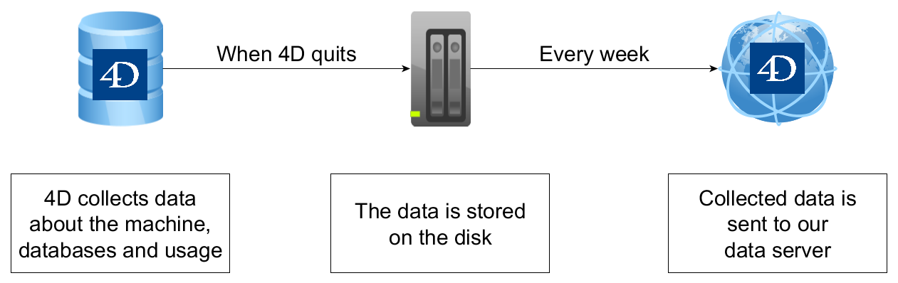

Pour nous aider à améliorer sans cesse nos produits, nous collectons automatiquement des données concernant les statistiques d'utilisation des applications 4D Server. Les données collectées sont transférées sans incidence sur l'expérience utilisateur. Aucune information personnelle n'est collectée. For more information on 4D policy regarding personal data protection, please visit [this page](https://us.4d.com/privacy-policy).

La section ci-dessous explique :

- quelles sont les informations collectées,
- où les informations sont stockées et quand elles sont envoyées à 4D,
- comment désactiver la collecte automatique de données dans les applications client/serveur générées.

## Informations collectées

Les données sont collectées lors des événements suivants :

- démarrage de la base de données,
- fermeture de la base de données,
- démarrage du serveur web,
- utilisation de fonctions spécifiques telles que php, open datastore, débogueur distant,
- connexion client,
- envoi de la collecte de données.

Certaines données sont également collectées à intervalles réguliers.

| Data                                                                                                              | Type                                     | Notes                                                                                                                                |
| ----------------------------------------------------------------------------------------------------------------- | ---------------------------------------- | ------------------------------------------------------------------------------------------------------------------------------------ |
| appServer                                                                                                         | Object                                   | Object containing application server information                                                                                     |
| appServer.hits                                                                                    | Number                                   | Number of requests from internal processes                                                                                           |
| appServer.bytesIn                                                                                 | Number                                   | Bytes received by internal processes                                                                                                 |
| appServer.bytesOut                                                                                | Number                                   | Bytes sent by internal processes                                                                                                     |
| appServer.executionTime                                                                           | Number                                   | CPU execution time for internal processes                                                                                            |
| cacheMissBytes                                                                                                    | Object                                   | Nombre d'octets manqués dans le cache                                                                                                |
| cacheMissCount                                                                                                    | Object                                   | Nombre de lectures manquées dans le cache                                                                                            |
| cacheReadBytes                                                                                                    | Object                                   | Nombre d'octets lus à partir de la mémoire cache                                                                                     |
| cacheReadCount                                                                                                    | Object                                   | Nombre de lectures dans le cache                                                                                                     |
| classUsage                                                                                                        | Object                                   | Nombre d'instances de certaines classes du langage                                                                                   |
| connectionSystems                                                                                                 | Collection                               | Système d'exploitation du client sans le numéro de build (entre parenthèses) et nombre de clients qui l'utilisent |
| databases[].cacheSize                         | Number                                   | Taille du cache en octets                                                                                                            |
| databases[].externalDatastoreOpened           | Number                                   | Nombre d'appels à `Open datastore`                                                                                                   |
| databases[].id                                | Number                                   | Database ID                                                                                                                          |
| databases[].internalDatastoreOpened           | Number                                   | Nombre de fois où le datastore est ouvert par un serveur externe                                                                     |
| databases[].maxConcurrent4DClients            | Number                                   | Maximum number of simultaneous 4D Client sessions (using a 4D Client license) over the collection interval        |
| databases[].maxConcurrentRestSessions         | Number                                   | Maximum number of simultaneous REST sessions over the collection interval                                                            |
| databases[].maxConcurrentWebSessions          | Number                                   | Maximum number of simultaneous Web sessions (4DACTION and SOAP) over the collection interval                      |
| databases[].maximum4DClientConnections        | Number                                   | Nombre maximal de connexions de 4D Client au serveur                                                                                 |
| databases[].numberOfDistinctClients           | Number                                   | Distinct count of client persistent UUID seen over collection interval                                                               |
| databases[].numberOfFields                    | Number                                   | Nombre de champs                                                                                                                     |
| databases[].numberOfKeepRecordSyncInfo        | Number                                   | Nombre de tables dont l'option "Activer la réplication" est cochée                                                                   |
| databases[].numberOfRecordsMax                | Number                                   | Nombre total d'enregistrements                                                                                                       |
| databases[].numberOfTables                    | Number                                   | Nombre de tables                                                                                                                     |
| databases[].qodly.webforms    | Number                                   | Nombre de webforms Qodly                                                                                                             |
| databases[].remoteDebugger4DRemoteAttachments | Number                                   | Nombre de rattachements au débogueur distant à partir d'un 4D distant                                                                |
| databases[].remoteDebuggerQodlyAttachments    | Number                                   | Nombre de rattachements au débogueur distant à partir de Qodly                                                                       |
| databases[].remoteDebuggerVSCodeAttachments   | Number                                   | Nombre de rattachements au débogueur distant à partir de VS Code                                                                     |
| databases[].structureHash                     | Text                                     |                                                                                                                                      |
| databases[].uniqueID                          | Texte (chaîne hachée) | Identifiant unique associé à la base de données (*Hachage par roulement polynomial du nom de la base de données*) |
| databases[].uptime                            | Number                                   | Time elapsed (in seconds) between two collection events                                                           |
| databases[].uuid                              | Text                                     | Database UUID                                                                                                                        |
| databases[].webIPAddressesNumber              | Number                                   | Nombre d'adresses IP différentes ayant adressé une requête à 4D Server                                                               |
| databases[].webMaxScalableSessions            | Number                                   | Maximum number of scalable sessions on the server                                                                                    |
| databases[].webScalableSessions               | Boolean                                  | Vrai si les sessions évolutives sont activées                                                                                        |
| dataSegment1.diskReadBytes                                                                        | Object                                   | Nombre d'octets lus dans le fichier de données                                                                                       |
| dataSegment1.diskReadCount                                                                        | Object                                   | Nombre de lectures dans le fichier de données                                                                                        |
| dataSegment1.diskWriteBytes                                                                       | Object                                   | Nombre d'octets écrits dans le fichier de données                                                                                    |
| dataSegment1.diskWriteCount                                                                       | Object                                   | Nombre d'écritures dans le fichier de données                                                                                        |
| dataSize                                                                                                          | Number                                   | Taille du fichier de données en octets                                                                                               |
| dbServer                                                                                                          | Object                                   | Object containing DB4D server information                                                                                            |
| dbServer.hits                                                                                     | Number                                   | Number of requests from internal processes                                                                                           |
| dbServer.bytesIn                                                                                  | Number                                   | Bytes received by internal processes                                                                                                 |
| dbServer.bytesOut                                                                                 | Number                                   | Bytes sent by internal processes                                                                                                     |
| dbServer.executionTime                                                                            | Number                                   | CPU execution time for internal processes                                                                                            |
| encryptedConnections                                                                                              | Boolean                                  | True si les connexions client/serveur sont cryptées                                                                                  |
| externalPHP                                                                                                       | Boolean                                  | True si le client effectue un appel à `PHP execute` et utilise sa propre version de php                                              |
| general.buildNumber                                                                               | Number                                   | Numéro de build de l'application 4D                                                                                                  |
| general.headless                                                                                  | Boolean                                  | True si l'application fonctionne en mode headless                                                                                    |
| general.isRosetta                                                                                 | Boolean                                  | True si 4D est émulé par Rosetta sous macOS, False sinon (non émulé ou sous Windows).             |
| general.license                                                                                   | Object                                   | Nom commercial et description des licences des produits                                                                              |
| general.uniqueID                                                                                  | Text                                     | ID unique du serveur 4D                                                                                                              |
| general.version                                                                                   | Text                                     | Numéro de version de l'application 4D                                                                                                |
| hasDataChangeTracking                                                                                             | Boolean                                  | True si une table "__DeletedRecords" existe                                                |
| indexSegment.diskReadBytes                                                                        | Number                                   | Nombre d'octets lus dans le fichier d'index                                                                                          |
| indexSegment.diskReadCount                                                                        | Number                                   | Nombre de lectures dans le fichier d'index                                                                                           |
| indexSegment.diskWriteBytes                                                                       | Number                                   | Nombre d'octets écrits dans le fichier d'index                                                                                       |
| indexSegment.diskWriteCount                                                                       | Number                                   | Nombre d'écritures dans le fichier d'index                                                                                           |
| indexSize                                                                                                         | Number                                   | Taille des index en octets                                                                                                           |
| isCompiled                                                                                                        | Boolean                                  | True si l'application est compilée                                                                                                   |
| isEncrypted                                                                                                       | Boolean                                  | Vrai si le fichier de données est chiffré                                                                                            |
| isEngined                                                                                                         | Boolean                                  | True si l'application est fusionnée avec 4D Volume Desktop                                                                           |
| isProjectMode                                                                                                     | Boolean                                  | True si l'application est un projet                                                                                                  |
| LDAPLogin                                                                                                         | Number                                   | Nombre d'appels à la fonction `LDAP LOGIN`                                                                                           |
| license.sffPrimaryKey                                                                             | Number                                   | Server master product number                                                                                                         |
| machine.CPU                                                                                       | Text                                     | Nom, type et vitesse du processeur                                                                                                   |
| machine.memory                                                                                    | Number                                   | Taille de la mémoire (en octets) disponible sur la machine                                                        |
| machine.numberOfCores                                                                             | Number                                   | Nombre total de cœurs                                                                                                                |
| machine.system                                                                                    | Text                                     | Version du système d'exploitation et numéro de version                                                                               |
| maximumNumberOfWebProcesses                                                                                       | Number                                   | Nombre maximal de process web simultanés                                                                                             |
| maximumUsedPhysicalMemory                                                                                         | Number                                   | Utilisation maximale de la mémoire physique                                                                                          |
| maximumUsedVirtualMemory                                                                                          | Number                                   | Utilisation maximale de la mémoire virtuelle                                                                                         |
| mobile                                                                                                            | Collection                               | Informations sur les sessions mobiles                                                                                                |
| numberOfWebServices                                                                                               | Number                                   | Nombre de méthodes publiées en tant que Services Web                                                                                 |
| ODBCLogin                                                                                                         | Number                                   | Nombre d'appels à `SQL LOGIN` utilisant ODBC                                                                                         |
| phpCall                                                                                                           | Number                                   | Nombre d'appels à `PHP execute`                                                                                                      |
| QueryBySQL                                                                                                        | Number                                   | Nombre d'appels à `QUERY BY SQL`                                                                                                     |
| restServer                                                                                                        | Object                                   | Object containing REST server information                                                                                            |
| restServer.bytesIn                                                                                | Number                                   | Bytes received by the REST server                                                                                                    |
| restServer.bytesOut                                                                               | Number                                   | Bytes sent by the REST server                                                                                                        |
| restServer.hits                                                                                   | Number                                   | Number of hits on the REST server                                                                                                    |
| restServer.executionTime                                                                          | Number                                   | CPU execution time for  the REST WEB server                                                                                          |
| soapServer                                                                                                        | Object                                   | Object containing SOAP server information                                                                                            |
| soapServer.bytesIn                                                                                | Number                                   | Bytes received by the SOAP server                                                                                                    |
| soapServer.bytesOut                                                                               | Number                                   | Bytes sent by the SOAP server                                                                                                        |
| soapServer.hits                                                                                   | Number                                   | Number of hits on the SOAP server                                                                                                    |
| soapServer.executionTime                                                                          | Number                                   | CPU execution time for the SOAP server                                                                                               |
| SQLBeginEndStatement                                                                                              | Number                                   | Nombre d'utilisations de `Begin SQL` / `End SQL`                                                                                     |
| SQLLoginInternal                                                                                                  | Number                                   | Nombre d'appels à `SQL LOGIN` utilisant SQL_INTERNAL                                                            |
| sqlServer                                                                                                         | Object                                   | Object containing SQL server information                                                                                             |
| sqlServer.hits                                                                                    | Number                                   | Number of SQL queries executed                                                                                                       |
| sqlServer.bytesIn                                                                                 | Number                                   | Bytes received by the SQL engine                                                                                                     |
| sqlServer.bytesOut                                                                                | Number                                   | Bytes sent by the SQL engine                                                                                                         |
| sqlServer.executionTime                                                                           | Number                                   | CPU execution time for SQL queries                                                                                                   |
| usingQUICNetworkLayer                                                                                             | Boolean                                  | True si la base de données utilise la couche réseau QUIC                                                                             |
| totalExecutionTime                                                                                                | Number                                   | Total CPU execution time: sum of all request types                                                                   |
| totalRequests                                                                                                     | Number                                   | Total requests: sum of web, REST, SOAP, SQL, and internal traffic                                                    |
| webServer                                                                                                         | Object                                   | Object containing Web server information                                                                                             |
| webServer.bytesIn                                                                                 | Number                                   | Bytes received by the Web server                                                                                                     |
| webServer.bytesOut                                                                                | Number                                   | Bytes sent by the Web server                                                                                                         |
| webServer.hits                                                                                    | Number                                   | Number of hits on the Web server                                                                                                     |
| webServer.executionTime                                                                           | Number                                   | CPU execution time for the Web server                                                                                                |
| webStaticServer                                                                                                   | Object                                   | Object containing the static Web server information                                                                                  |
| webStaticServer.bytesIn                                                                           | Number                                   | Bytes received by the static Web server                                                                                              |
| webStaticServer.bytesOut                                                                          | Number                                   | Bytes sent by the static Web server                                                                                                  |
| webStaticServer.hits                                                                              | Number                                   | Number of hits on the static Web server                                                                                              |
| webStaticServer.executionTime                                                                     | Number                                   | CPU execution time for the static Web server                                                                                         |

## Où sont-elles stockées et envoyées ?

Les données collectées sont écrites dans un fichier texte (format JSON) par base de données lorsque 4D Server quitte. Le fichier est stocké dans le [dossier 4D actif](../commands/get-4d-folder), c'est-à-dire :

- sous Windows : `Users\[userName]\AppData\Roaming\4D Server`
- sous macOS : `/Users/[userName]/Library/ApplicationSupport/4D Server`

Une fois par semaine, le fichier est automatiquement envoyé par le réseau à 4D. Le fichier est ensuite supprimé du dossier 4D actif.

> Si le fichier n'a pas pu être envoyé pour une raison quelconque, il est néanmoins supprimé et aucun message d'erreur n'est affiché côté 4D Server.

Le fichier est envoyé au serveur à l'adresse suivante : `https://dcollector.4d.com` (ip : 195.68.52.83).

## Désactiver la collecte de données dans les applications client/serveur générées

Vous pouvez désactiver la collecte automatique de données dans [les applications client/serveur générées](../Desktop/building.md#clientserver-page).

Pour désactiver la collecte, passez la valeur **False** à la clé [`ServerDataCollection`](https://doc.4d.com/4Dv20/4D/20/ServerDataCollection.300-6335775.en.html) dans le fichier `buildApp.4DSettings`, utilisé pour construire l'application client/serveur.
