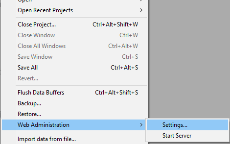

An embedded web server component, named `WebAdmin`, is used by 4D and 4D Server to provide a secured web access to specific features:

- REST accesses to the project
- l'[Explorateur de données](dataExplorer.md)
- the [Qodly Studio preview rendering](https://developer.4d.com/qodly/4DQodlyPro/rendering#preview-in-qodly-studio)

Ce serveur est accessible en local ou à distance, depuis un navigateur ou une application web, et permet d'accéder à l'application 4D associée.

The Web Administration Server handles the authentication of users with `WebAdmin` privileges, so that they can open administration sessions and access dedicated interfaces.

Cette fonctionnalité est disponible pour les applications 4D avec ou sans interfaces.

## Starting the Web Administration Server

By default, the Web Administration Server web server is not launched. Il faut configurer son lancement automatique au démarrage, ou (dans les versions avec une interface) le lancer manuellement via un menu.

### Lancement au démarrage

You can configure the Web Administration Server to be launched at 4D or 4D Server application startup (before any project is loaded).

- Si vous utilisez une application 4D avec une interface, sélectionnez **Fichier > Administration Web > Propriétés...**.



Cochez l'option **Lancer le serveur WebAdmin au démarrage** dans la boîte de dialogue des paramètres :


- Que vous utilisiez une application 4D avec ou sans interface, vous pouvez activer le lancement automatique au démarrage en utilisant l'argument suivant dans *L'interface de ligne de commande* :

```
open ~/Desktop/4D.app --webadmin-auto-start true
```

> If the TCP port used by the Web Administration Server ([HTTPS](#https-port) or [HTTP](#http-port), depending on the settings) is not free at startup, 4D will try successively the 20 following ports, and use the first one that is available. Si aucun port n'est disponible, le serveur web ne se lance pas et un message d'erreur s'affiche. Pour les applications sans interface, il apparaît dans la console.

### Démarrage et arrêt

If you use a 4D application with interface, you can start or stop the Web Administration Server for your project at any moment:

Sélectionnez **Fichier> Administration web > Démarrer le serveur**.


The menu item becomes **Stop Server** when the server is launched; select **Stop Server** to stop the Web Administration Server.

## Settings {#settings}

Configuring the Web Administration Server is mandatory in particular to define the [**access key**](#access-key). Par défaut, quand la clé d'accès n'est pas configurée, les connexions via url ne sont pas autorisées.

You can configure the Web Administration Server using the [Web Administration settings dialog box](#settings-dialog-box) (see below).

> Si vous utilisez une application 4D sans interface, vous pouvez utiliser les [arguments de l'*Interface de ligne de commande*](#webadmin-headless-configuration) pour définir les paramètres de base. La définition de paramètres avancés se fait via le fichier de paramètres.

### Boîte de dialogue des Propriétés

Pour ouvrir la fenêtre de configuration des paramètres d'administration web, sélectionnez **Fichier > Administration web > Propriétés...**.


La fenêtre suivante s'affiche :


#### Lancer le serveur WebAdmin au démarrage

Check this option if you want the Web Administration Server to be automatically launched when the 4D or 4D Server application starts ([see above](#launch-at-startup)). Cette option n'est pas cochée par défaut.

#### Connexions HTTP sur localhost acceptées

When this option is checked, you will be able to connect to the Web Administration Server through HTTP on the same machine as the 4D application. Cette option est activée par défaut.

:::note Notes

- Les connections HTTP autres que sur localhost ne sont jamais acceptées.
- Même si cette option est activée, quand [HTTPS Accepté](#accept-https) est activé et que la configuration TLS est valide, les connections sur localhost se font via HTTPS.

:::

#### Port HTTP

Port number to use for connections through HTTP to the Web Administration Server when the **Accept HTTP connections on localhost** option is checked. La valeur par défaut est 7080.

#### HTTPS Accepté

When this option is checked, you will be able to connect to the Web Administration Server through HTTPS. Cette option est activée par défaut.

#### Port HTTPS

Port number to use for connections through HTTPS to the Web Administration Server when the **Accept HTTPS** option is checked. La valeur par défaut est 7443.

#### Chemin du dossier de certificat

Chemin du dossier qui contient les fichiers de certificat TLS. Par défaut, le chemin du dossier de certificat est vide, et 4D ou 4D server utilise les fichiers de certificat contenus dans l'application 4D (les certificats personnalisés doivent être stockés au niveau du dossier de projet).

#### Mode du debug log

Statut ou format du fichier de logs des requêtes HTTP (HTTPDebugLog_*nn*.txt, stocké dans le dossier "Logs" de l'application. --*nn* représente le numéro du fichier). Les options suivantes sont disponibles :

- **Désactivé** (valeur par défaut)
- **Avec tous les body** - activé avec toutes les parts des body des requêtes et réponses
- **Sans les body** - activé sans les parts des body (la taille du body est indiquée)
- **Avec les body des requêtes** - activé avec les parts des body uniquement dans les requêtes
- **Avec la réponse corps** - activé avec les parts des body uniquement dans les réponses

#### Clé d'accès

Defining an access key is mandatory to unlock access to the Web Administration Server through a URL (access via a 4D menu command does not require an access key). Lorsque aucune clé d'accès n'est définie, il n'est pas possible pour les clients web d'accéder aux interfaces d'administration web telles que l'[Explorateur de données](dataExplorer.md) via des URL. En cas de requête de connexion, une page d'erreur est retournée:


Une clé d'accès est similaire à un mot de passe, mais sans login associé.

- Pour définir une nouvelle clé d'accès, cliquez sur le bouton **Définir**, entrez une chaîne de caractères et cliquez sur **OK**. Une fois fait, le label du bouton devient **Modifier**.
- Pour modifier la clé d'accès, cliquez sur **Modifier**, entrez la nouvelle clé d'accès et cliquez sur **OK**.
- Pour supprimer la clé d'accès, cliquez sur **Modifier**, laissez le champ d'entrée vide et cliquez sur **OK**.

#### Activer l'accès à Qodly Studio

:::note

Cette option n'apparaît que si la licence Qodly Studio est activée.

:::

Cette option permet l'accès utilisateur à [Qodly Studio](../WebServer/qodly-studio.md) au niveau de l'application 4D. Notez que vous devez également [activer l'accès au niveau de chaque projet](../settings/web.md#enable-access-to-qodly-studio).

:::note

This option is automatically checked if you used the [One-click configuration dialog box](https://developer.4d.com/qodly/4DQodlyPro/gettingStarted#one-click-configuration).

:::

## Headless Configuration

All [Web Administration Server settings](#settings) are stored in the `WebAdmin.4DSettings` file. Boîte de dialogue des Propriétés Par défaut, il existe un fichier `WebAdmin.4DSettings` par application 4D et 4D Server.

Dans le cas d'une application 4D ou 4D Server sans interface, vous pouvez configurer et utiliser le fichier `WebAdmin.4DSettings` par défaut, ou désigner un fichier `.4DSettings` personnalisé.

Boîte de dialogue des Propriétés Par défaut, il existe un fichier `WebAdmin.4DSettings` par application 4D et 4D Server. Par défaut, il existe un fichier `WebAdmin.4DSettings` par application 4D et 4D Server.

Vous pouvez aussi définir un fichier `.4DSettings`. (format XML) et l'utiliser à la place du fichier par défaut. Plusieurs arguments dédiés sont disponibles dans [l'interface de ligne de commande](cli.md) pour prendre en charge cette fonctionnalité.

> Cette clé d'accès n'est pas stockée de façon transparente dans le fichier `.4DSettings`.

Voici un exemple :

```
"%HOMEPATH%\Desktop\4D Server.exe" MyApp.4DLink --webadmin-access-key 
	"my Fabulous AccessKey" --webadmin-auto-start true   
	--webadmin-store-settings

```

## Authentification

When a web page controlled by the Web Administration Server is accessed by entering a URL and without prior identification, an authentication is required. L'utilisateur doit entrer la [clé d'accès](#access-key) dans une fenêtre d'authentification:


If the access key was not defined in the Web Administration Server settings, no access via URL is possible (a specific message is displayed).

When a web page controlled by the Web Administration Server page is accessed directly from a 4D or 4D Server menu item (such as **Records > Data Explorer** or **Window > Data Explorer** (4D Server)), access is granted without authentication, the user is automatically authenticated.

:::note

Once the access is granted, a [web session](WebServer/sessions.md) with a specific "WebAdmin" privilege is created by the Web Administration Server. This privilege provides an open access to all data through web processes, as soon as no [specific permissions are applied to resources](../ORDA/privileges.md).

:::

