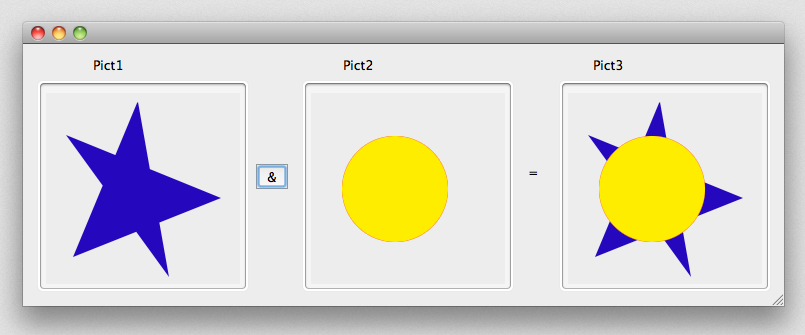

Un champ, une variable ou expression de type image peut constituer une image Windows ou Macintosh. In general, this includes any picture that can be put on the pasteboard or read from the disk using 4D commands such as `READ PICTURE FILE`.

4D utilise des API natives pour encoder (écrire) et décoder (lire) les champs et les variables des images sous Windows et macOS. Ces implémentations donnent accès à de nombreux formats natifs, dont le format RAW, couramment utilisé par les appareils photo numériques.

- sous Windows, 4D utilise WIC (Windows Imaging Component).
- sous macOS, 4D utilise ImageIO.

WIC et ImageIO permettent l’utilisation de métadonnées dans les images. Two commands, `SET PICTURE METADATA` and `GET PICTURE METADATA`, let you benefit from metadata in your developments.

## Identifiants de codecs d'images

4D supports natively a wide set of [picture formats](FormEditor/pictures.md#native-formats-supported), such as .jpeg, .png, or .svg.

Picture formats recognized by 4D are returned by the `PICTURE CODEC LIST` command as picture Codec IDs.  Ces identifiants peuvent être :

- une extension (par exemple “.gif”)
- Un type Mime (par exemple “image/jpg”)

La forme utilisée pour chaque format dépend du mode de déclaration du codec au niveau du système d’exploitation. Notez que les listes de codecs disponibles pour la lecture et pour l'écriture peuvent différer, étant donné que les codecs d'encodage peuvent nécessiter des licences spécifiques.

Most of the [4D picture management commands](https://doc.4d.com/4Dv18/4D/18/Pictures.201-4504337.en.html) can receive a Codec ID as a parameter. It is therefore imperative to use the system ID returned by the `PICTURE CODEC LIST` command.
Picture formats recognized by 4D are returned by the `PICTURE CODEC LIST` command.

## Opérateurs sur les images

| Opération                 | Syntaxe                           | Retourne | Action                                                                                                                                                                                                |
| ------------------------- | --------------------------------- | -------- | ----------------------------------------------------------------------------------------------------------------------------------------------------------------------------------------------------- |
| Concaténation horizontale | Image1 + Image2                   | Picture  | Place Image2 à la droite d'Image1                                                                                                                                                                     |
| Concaténation verticale   | Image1 / Image2                   | Picture  | Place Image2 au-dessous d'Image1                                                                                                                                                                      |
| Superposition exclusive   | Pict1 & Pict2 | Picture  | Superpose Image2 à Image1 (Image2 est au premier plan). Produces the same result as `COMBINE PICTURES(pict3;pict1;Superimposition;pict2)`                          |
| Superposition inclusive   | Image1                            | Picture  | Image    \| Superpose Image2 à Image1 et retourne le masque résultant si les deux images sont de même taille. Produces the same result as `$equal:=Equal pictures(Pict1;Pict2;Pict3)` |
| Déplacement horizontal    | Image + Nombre                    | Picture  | Déplace l'image horizontalement d'un nombre de pixels égal à Nombre                                                                                                                                   |
| Déplacement vertical      | Image / Nombre                    | Picture  | Déplace l'image verticalement d'un nombre de pixels égal à Nombre                                                                                                                                     |
| Redimensionnement         | Image \* Nombre                   | Picture  | Redimensionne l'image au pourcentage Nombre                                                                                                                                                           |
| Extension horizontale     | Image \*+ Nombre                  | Picture  | Redimensionne l'image horizontalement au pourcentage Nombre                                                                                                                                           |
| Extension verticale       | Image \*\| Nombre                 | Picture  | Image    \| Redimensionne l'image verticalement au pourcentage Nombre                                                                                                                                 |

**Notes :**

- A noter que pour que l'opérateur | puisse être utilisé, Image1 et Image2 doivent être strictement de la même dimension. Si les deux images sont de taille différente, l’opération Image1 | Image2 produit une image vide.
- The `COMBINE PICTURES` command can be used to superimpose pictures while keeping the characteristics of each source picture in the resulting picture.
- Additional operations can be performed on pictures using the `TRANSFORM PICTURE` command.
- There is no comparison operators on pictures, however 4D proposes the `Equal picture` command to compare two pictures.

### Exemples

Concaténation horizontale

```4d
 cercle+rectangle // Place le rectangle à droite du cercle
rectangle+cercle // Place le cercle à droite du rectangle
```


Concaténation verticale

```4d
 circle/rectangle //Place the rectangle under the circle
 rectangle/circle //Place the circle under the rectangle
```


Superposition exclusive

```4d
Pict3:=Pict1 & Pict2 // Superimposes Pict2 on top of  Pict1
```



Superposition inclusive

```4d
Pict3:=Pict1|Pict2 // Récupérer le masque résultant de la superposition de deux images de même taille
```


Déplacement horizontal

```4d
rectangle+50 // Déplace le rectangle 50 pixels vers la droite
rectangle-50 // Déplace le rectangle 50 pixels vers la gauche
```


Déplacement vertical

```4d
rectangle/50 // Déplace le rectangle 50 pixels vers le bas
rectangle/-20 // Déplace le rectangle 20 pixels vers le haut
```


Redimensionnement

```4d
rectangle*1.5 // Augmente la taille du rectangle de 50%
 rectangle*0.5 // Réduit la taille du rectangle de 50%
```


Extension horizontale

```4d
cercle*+3 // Multiplie par 3 la largeur du cercle
 cercle*+0,25 // La largeur du cercle est réduite à un quart de sa taille originale
```


Extension verticale

```4d
cercle*|2 // Double la hauteur du cercle
 cercle*|0.25 // La hauteur du cercle est réduite à un quart de sa taille originale
```


