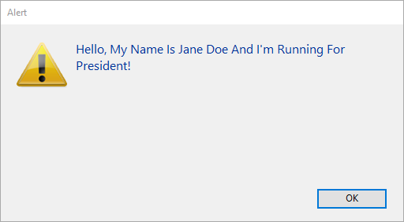

String ("Chaîne") est un terme générique utilisé pour :

- Les variables ou champs de type Texte : un champ, une variable ou une expression de type Texte peut contenir de 0 à 2 Go de texte.
- Les variables ou champs de type alphanumérique : un champ alphanumérique peut contenir de 0 à 255 caractères (la limite est fixée lors de la définition du champ).

## Constantes littérales de type chaîne

Une constante littérale de type chaîne est incluse entre des guillemets droits ("…"). En voici quelques exemples :

```4d
"Ajouter Enregistrements"
"Aucun enregistrement trouvé."
"Facture"
```

Une chaîne vide est spécifiée par la succession de deux guillemets ("").

### Séquences d’échappement

Les séquences d’échappement suivantes peuvent être utilisées dans les chaînes :

| Séquence d’échappement                                | Caractère remplacé                     |
| ----------------------------------------------------- | -------------------------------------- |
| \n                                                    | LF (Retour ligne)   |
| \t                                                    | HT (Tabulation)     |
| \r                                                    | CR (Retour chariot) |
| \\\\|\ (Barre oblique inversée) |                                        |
| \\"                                                 | " (Guillemets)      |

**Note :** Le caractère \ (backslash) est utilisé comme séparateur dans les chemins d'accès sous Windows. Vous devez donc saisir un double \\ lorsque vous souhaitez insérer une barre oblique inversée devant un caractère utilisé dans une des séquences d’échappement reconnues par 4D (ex : “C:\\MesDocuments\\Nouveaux.txt”).

## Opérateurs sur les chaînes

| Opération           | Syntaxe          | Retourne | Expression              | Valeur   |
| ------------------- | ---------------- | -------- | ----------------------- | -------- |
| Concaténation       | Chaîne + Chaîne  | String   | "abc" + "def"           | "abcdef" |
| Répétition          | Chaîne \* Nombre | String   | "ab" \* 3               | "ababab" |
| Egalité             | Chaîne = Chaîne  | Boolean  | "abc" = "abc"           | True     |
|                     |                  |          | "abc" = "abd"           | False    |
| Inégalité           | Chaîne # Chaîne  | Boolean  | "abc" # "abd"           | True     |
|                     |                  |          | "abc" # "abc"           | False    |
| Supérieur à         | Chaîne > Chaîne  | Boolean  | "abd" > "abc"           | True     |
|                     |                  |          | "abc" > "abc"           | False    |
| Inférieur à         | Chaîne < Chaîne  | Boolean  | "abc" < "abd"           | True     |
|                     |                  |          | "abc" < "abc"           | False    |
| Supérieur ou égal à | Chaîne >= Chaîne | Boolean  | "abd" >= "abc"          | True     |
|                     |                  |          | "abc" >= "abd"          | False    |
| Inférieur ou égal à | Chaîne <= Chaîne | Boolean  | "abc" <= "abd"          | True     |
|                     |                  |          | "abd" <= "abc"          | False    |
| Contient mot-clé    | Chaîne % Chaîne  | Boolean  | "Alpha Bravo" % "Bravo" | True     |
|                     |                  |          | "Alpha Bravo" % "ravo"  | False    |

## Comparaisons de chaînes

- Les chaînes sont toujours comparées caractère par caractère (hormis en cas de recherche par [mot-clé](dt_string.md#mots-cles), cf. ci-dessous).
- Lors d'une comparaison de chaînes, la casse des caractères est ignorée ; ainsi, "a"="A" retourne `VRAI`. Pour savoir si des caractères sont en majuscules ou en minuscules, vous devez comparer leurs codes de caractères. Par exemple, l'expression suivante renvoie `FALSE` :

```4d
Character code("A")=Character code("a") // 65 n'est pas égal à 97
```

- Lorsque des chaînes de caractères sont comparées, les caractères diacritiques sont comparés en utilisant la table de comparaison des caractères système de votre ordinateur. Par exemple, les expressions suivantes renvoient `TRUE` :

```4d
     "n"="ñ"
     "n"="Ñ"
     "A"="å"
      // etc
```

**Note :** Les comparaisons de chaîne tiennent compte des spécificités du langage **défini pour le fichier de données 4D** (qui n'est pas toujours identique au langage défini pour le système).

### Le joker (@)

Le langage 4D prend en charge **@** en tant que joker. Ce caractère peut être utilisé dans toute comparaison de chaînes. Par exemple, l'expression suivante est `TRUE` :

```4d
"abcdefghij"="abc@"
```

Le joker doit être utilisé dans le second opérande (la chaîne qui se trouve à droite de l'opérateur). L'expression suivante est `FALSE`, car le @ est considéré comme un caractère dans le premier opérande :

```4d
    "abc@"="abcdefghij"
```

Le joker signifie “un ou plusieurs caractères sinon rien”. Les expressions suivantes sont `TRUE`:

```4d
     "abcdefghij"="abcdefghij@"
     "abcdefghij"="@abcdefghij"
     "abcdefghij"="abcd@efghij"
     "abcdefghij"="@abcdefghij@"
     "abcdefghij"="@abcde@fghij@"
```

En revanche, dans tous les cas, lorsque deux jokers consécutifs sont placés dans une comparaison de chaînes, celle-ci sera toujours évaluée à `FALSE`. L'expression suivante est `FALSE` :

```4d
"abcdefghij"="abc@@fg"
```

Lorsque l'opérateur de comparaison est ou contient un symbole < ou >, seule la comparaison avec un seul joker situé en fin d'opérande est prise en charge :

```4d
     "abcd"<="abc@" // Comparaison valide
     "abcd"<="abc@ef" //Comparaison non valide
```

Si vous souhaitez exécuter des comparaisons ou des requêtes en utilisant @ comme caractère (et non comme joker), vous devez utiliser l'instruction `Character code(At sign)`. Imaginons par exemple que vous souhaitiez savoir si une chaîne se termine par le caractère @. L'expression suivante (si $vsValue n'est pas vide) est toujours `TRUE` :

```4d
($vsValue[[Length($vsValue)]]="@")
```

L'expression suivante sera correctement évaluée :

```4d
(Character code($vsValue[[Length($vsValue)]])#64)  
```

**Note :** Une option 4D du mode Développement vous permet de définir comment le caractère @ est interprété lorsqu'il est inclus dans une chaîne de caractères.

### Mots-clés

A la différence des autres comparaisons de chaîne, les recherches par mots-clés recherchent des “mots” dans des “textes” : les mots sont évalués individuellement et dans leur globalité. L'opérateur **%** retournera toujours `False` si la requête concerne plusieurs mots ou seulement une partie d'un mot (par exemple, une syllabe). Les “mots” sont des chaînes de caractères encadrées par des “séparateurs”, qui sont les espaces, les caractères de ponctuation et les tirets. Une apostrophe, comme dans “aujourd'hui”, est généralement considérée comme partie du mot, mais sera ignorée dans certains cas (cf. règles ci-dessous). Les nombres peuvent être recherchés car ils sont évalués dans leur ensemble (incluant les symboles décimaux). Les autres symboles (monnaie, température, etc.) seront ignorés.

```4d
     "Alpha Bravo Charlie"%"Bravo" // Retourne Vrai
 "Alpha Bravo Charlie"%"vo" // Retourne Faux
 "Alpha Bravo Charlie"%"Alpha Bravo" // Retourne Faux
 "Alpha,Bravo,Charlie"%"Alpha" // Retourne Vrai
 "Software and Computers"%"comput@" // Retourne Vrai
```

> **Notes :**
>
> - 4D utilise la librairie ICU pour la comparaison des chaînes (à l'aide des opérateurs `<>=#`) et la détection des mots-clés. Pour plus d'informations sur les règles mises en oeuvre, veuillez vous référer à l'adresse suivante : http://www.unicode.org/reports/tr29/#Word_Boundaries.
> - Dans la version japonaise, au lieu de ICU, 4D utilise Mecab par défaut pour la détection des mots-clés.

## Symboles d'indice de chaîne

Les symboles d'indice de chaîne sont les suivants : [[...]]

Ces symboles sont utilisés pour désigner un caractère particulier dans une chaîne. Cette syntaxe vous permet de référencer un caractère dans un champ ou une variable de type Alpha ou Texte.

Lorsque les symboles d'indice de chaîne sont placés à gauche de l'opérateur d'affectation (:=), un caractère est affecté à la position référencée dans la chaîne. Par exemple, en postulant que la chaîne vsNom n'est pas une chaîne vide, le code suivant passe le premier caractère de la chaîne vsNom en majuscule :

```4d
If(vsNom#"")
    vsNom[[1]]:=Uppercase(vsNom[[1]])
End if
```

Lorsque les symboles d'indice de chaîne apparaissent dans une expression, ils retournent le caractère auquel ils font référence sous la forme d'une chaîne d'un caractère. Par exemple :

```4d
//L'exemple suivant teste si le dernier caractère de vtText est un signe "@"
 If(vtText#"")
    If(Character code(Substring(vtText;Length(vtText);1))=At sign)
  //...
    End if
 End if

  //En utilisant la syntaxe des symboles d'indice de chaîne, vous écririez d'une manière plus simple :
 If(vtText#"")
    If(Character code(vtText[[Length(vtText)]])=At sign)
  // ...
    End if
 End if
```

### Note avancée sur la référence à des caractères invalides

Lorsque vous utilisez les symboles d'indice de chaîne, il est de votre responsabilité de vous référer à des caractères existant dans la chaîne, de la même manière que pour les éléments d'un tableau. Si, par exemple, vous référencez le 20e caractère d'une chaîne, cette chaîne doit contenir au moins 20 caractères.

- Ne pas respecter cette condition en mode interprété n'est pas signalé comme une erreur par 4D.
- Ne pas respecter cette condition en mode compilé (sans options) peut entraîner une "corruption" de la mémoire, si, par exemple, vous écrivez un caractère au-delà de la fin d'une chaîne ou d'un texte.
- Ne pas respecter cette condition en mode compilé est signalé lorsque le contrôle d'exécution est activé. Si, par exemple, vous exécutez le code suivant :

```
//Très mauvaise et vilaine chose à faire, bouh !
 vsAnyText:=""
 vsAnyText[[1]]:="A"
```

L'alerte suivante s'affichera en mode compilé :


### Exemple

La méthode projet suivante ajoute une lettre capitale à tous les mots du texte passé en paramètre et retourne le texte modifié :

```4d
  //Capitalize_text project method
  //Capitalize_text ( Text ) -> Text
  //Capitalize_text ( Source text ) -> Capitalized text

 $0:=$1
 $vlLen:=Length($0)
 If($vlLen>0)
    $0[[1]]:=Uppercase($0[[1]])
    For($vlChar;1;$vlLen-1)
       If(Position($0[[$vlChar]];" !&()-{}:;<>?/,.=+*")>0)
          $0[[$vlChar+1]]:=Uppercase($0[[$vlChar+1]])
       End if
    End for
 End if
```

Une fois cette méthode placée dans la base, la ligne :

```4d
ALERT(Capitalize_text("Bonjour, mon nom est Jean Bon et je me présente aux présidentielles !"))
```

affiche l'alerte suivante :


