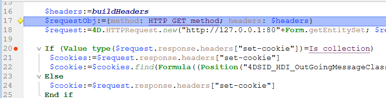

## Vue d’ensemble

Les points d'arrêt et les points d'arrêts sur commande sont des techniques de débogage très efficaces. Elles ont toutes deux le même effet : elles interrompent l'exécution du code (et affichent la fenêtre du débogueur si elle n'est pas déjà affichée) à une étape souhaitée.

Définissez des points d'arrêt sur n'importe quelle ligne de code où vous souhaitez interrompre l'exécution. Vous pouvez associer une condition au point d'arrêt.

Les points d'arrêt sur commande vous permettent de commencer à tracer l'exécution d'un process dès qu'une commande est appelée par ce process.

## Points d'arrêt

Pour créer un point d'arrêt, cliquez dans la marge gauche de la fenêtre d'évaluation du code du débogueur ou dans l'éditeur de code.

In the following example, a break point (the red bullet) has been set, in the debugger, on the line `If ($in.dataClass#Null)`:

In the above example, clicking the [**No Trace**](./debugger.md/#no-trace) button resumes normal execution up to the line marked with the break point. Cette ligne n'est pas exécutée - vous retournez en mode trace. Setting a break point beyond the program counter and clicking the **No Trace** button allows you to skip portions of the method being traced.

Pour supprimer un point d'arrêt, cliquez sur la puce correspondante.

### Propriétés des points d'arrêt

Vous pouvez modifier le comportement d'un point d'arrêt à l'aide de la fenêtre Propriétés du point d'arrêt :

This window is available from the Code Editor or the [Source Code Pane](debugger.md#source-code-pane). Vous pouvez :

- right-click a line and select **Edit Breakpoint** in the contextual menu, or
- `Alt+click` (Windows) or `Option+click` (macOS) in the left margin.

Si un point d'arrêt existe déjà, la fenêtre s'affiche pour ce point d'arrêt. Sinon, un point d'arrêt est créé et la fenêtre s'affiche pour le point d'arrêt nouvellement créé.

Voici une description des propriétés :

- **Location**: indicates the name of the method and the line number attached to the breakpoint.
- **Break when following expression is true**: You can create **conditional breakpoints** by entering a 4D formula that returns `True` or `False`. For example, insert `Records in selection(\[aTable])=0` to make sure the break occurs only if there no record selected for the table \[aTable]. Breakpoint conditions are available in the **Condition** column of the [Break list](#break-list).
- **Number of times to skip before breaking**: You can attach a breakpoint to a line located in a loop structure (While, Repeat, or For) or located in subroutine or function called from within a loop.
- **Breakpoint is disabled**: If you currently do not need a break point, but might need it later, you can temporarily disable it. Un point d'arrêt désactivé apparaît sous la forme d'un tiret (-) au lieu d'une puce (•)|

### Points d'arrêt dans le débogueur distant

La liste des points d'arrêt est stockée localement. En mode de débogage à distance, si le débogueur connecté est un 4D distant, la liste des points d'arrêt distants remplace temporairement la liste des points d'arrêt du serveur pendant la session de débogage.

La liste de points d'arrêt du serveur est automatiquement restaurée s'il redevient le débogueur associé.

### Liste des points d'arrêt

La liste des points d'arrêt est une page de l'Explorateur d'exécution qui vous permet de gérer les points d'arrêt créés dans la fenêtre du débogueur ou dans l'éditeur de code. For more information on the Runtime Explorer, see its dedicated page in [the Design reference manual](https://doc.4d.com/4Dv19/4D/19/Runtime-Explorer.200-5416614.en.html).

Pour ouvrir la page de la liste des points d'arrêt :

1. From the **Run menu**, click **Runtime Explorer...**

2. Click the **Break** tab to display the Break list:

À l'aide de cette fenêtre, vous pouvez :

- Set conditions for breakpoints in the **Conditions** column
- Activer ou désactiver les points d'arrêt en cliquant sur les puces dans la marge. Les points d'arrêt désactivés affichent des puces transparentes
- Delete breakpoints by pressing the `Delete` or `Backspace` key, or click on the **Delete** button below the list.
- Ouvrez les méthodes où se trouvent les points d'arrêt en doube-cliquant sur n'importe quelle ligne de la liste

Vous ne pouvez pas ajouter de nouveaux points d'arrêt à partir de cette fenêtre. Les points d'arrêt ne peuvent être créés qu'à partir de la fenêtre du débogueur ou de l'éditeur de code.

## Points d'arrêts sur commandes

The **Catch** tab of the Runtime Explorer lets you add additional breaks to your code by catching calls to 4D commands. Contrairement à un point d'arrêt, qui est situé dans une méthode de projet particulière (et qui déclenche donc une exception de traçage uniquement lorsqu'il est atteint), la portée de la capture d'une commande inclut tous les process qui exécutent le code 4D et appellent cette commande.

Les points d'arrêt sur une commande sont un moyen pratique de tracer de grandes portions de code sans avoir à définir des points d'arrêt à des endroits arbitraires. For example, if a record that should not be deleted is deleted after you've executed one or several processes, you can try to reduce the field of your investigation by catching commands such as `DELETE RECORD` and `DELETE SELECTION`. Chaque fois que ces commandes sont appelées, vous pouvez vérifier si l'enregistrement en question a été supprimé, et ainsi isoler la partie défectueuse du code.

N'hésitez pas à combiner les points d'arrêt et les points d'arrêt sur commandes.

Pour ouvrir la page des points d'arrêt sur commandes :

1. Choose **Run** > **Runtime explorer...** to open the Runtime Explorer.

2. Click **Catch** to display the Caught Commands List:

Cette page répertorie les points d'arrêt sur commande pendant l'exécution. Elle est composée de deux colonnes :

- La colonne de gauche affiche l'état d'activation/désactivation du point d'arrêt sur commande, suivi du nom de la commande
- La colonne de droite affiche la condition associée au point d'arrêt sur commande, le cas échéant

Pour ajouter un point d'arrêt sur commande :

1. Click on the **Add New Catch** button (in the shape of a +) located below the list. A new entry is added to the list with the `ALERT` command as default
2. Click the **ALERT** label, type the name of the command you want to catch, then press **Enter**.

Pour activer ou désactiver un point d'arrêt sur commande, cliquez sur la puce (•) devant l'étiquette de la commande.
La puce est transparente lorsque la commande est désactivée.

> La désactivation d'un point d'arrêt sur commande a pratiquement le même effet que sa suppression. Pendant l'exécution, le débogueur ne passe presque pas de temps sur l'entrée. L'avantage de désactiver une entrée est de ne pas avoir à la recréer lorsque vous en avez à nouveau besoin.

Pour supprimer un point d'arrêt sur commande :

1. Sélectionnez une commande dans la liste.
2. Press **Backspace** or **Delete** on your keyboard or click on the **Delete** button beneath the list (**Delete All** removes all commands in the list).

### Définir une condition pour un point d'arrêt sur commande

1. Cliquez sur l'entrée dans la colonne de droite
2. Saisissez une formule 4D (expression, appel de commande ou méthode de projet) qui retourne une valeur booléenne.

> Pour supprimer une condition, supprimez sa formule.

L'ajout de conditions vous permet d'arrêter l'exécution lorsque la commande est invoquée uniquement si la condition est remplie. For example, if you associate the condition `Records in selection(\[Emp]>10)` with the break point on the `DELETE SELECTION` command, the code will not be stopped during execution of the `DELETE SELECTION` command if the current selection of the \[Emp] table only contains 9 records (or less).

L'ajout de conditions aux points d'arrêt sur commandes ralentit l'exécution, car la condition doit être évaluée chaque fois qu'une exception est rencontrée. En revanche, l'ajout de conditions accélère le processus de débogage, car 4D ignore automatiquement les occurrences qui ne correspondent pas aux conditions.
