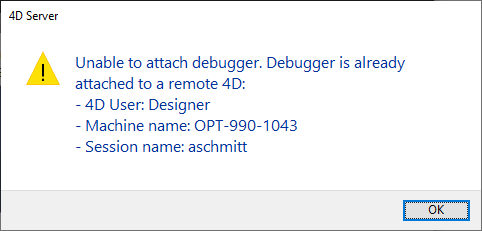
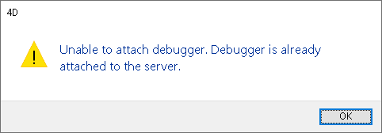

## Vue d’ensemble

Lorsqu'une base de données 4D est exécutée sur 4D Server en mode interprété, vous pouvez déboguer le code 4D exécuté sur le serveur à partir d'un client 4D distant connecté au projet. Il suffit d'associer le débogueur à une machine distante spécifique, et l'exécution du code peut être surveillée dans le débogueur directement sur la machine distante.

Sur une machine distante, la [fenêtre du débogueur](debugger.md) affiche une icône de serveur spécifique et une couleur de fond bleue pour indiquer que vous déboguez du code serveur :

Cette fonctionnalité est particulièrement utile lorsque 4D Server fonctionne en mode headless (voir [Interface en ligne de commande](../Admin/cli.md)), ou lorsque l'accès à la machine serveur n'est pas facile.

## Débogueur associé

Un seul débogueur peut déboguer une application 4D Server à un moment donné. Il s'agit du **débogueur associé**. Le débogueur associé peut être :

- le débogueur local de 4D Server (par défaut) - si le serveur ne tourne pas en mode headless.
- le débogueur d'un client 4D distant - si la session distante a accès au mode Développement.
- the [Qodly debugger](../WebServer/qodly-studio.md#using-qodly-debugger-on-4d-server) on 4D Server - if the server allows access to Qodly Studio.
- the VS Code debugger, provided you installed the [4D-Debugger](https://github.com/4d/4D-Debugger-VSCode) extension.

:::

Le débogueur associé est appelé chaque fois que 4D Server rencontre :

- un point d'arrêt
- une commande `TRACE`
- un point d'arrêt sur commande
- une erreur

A noter que les messages d'erreur sont envoyés à la machine du débogueur associé. Cela signifie que dans le cas d'un débogueur distant, les messages d'erreur du serveur sont affichés sur le client 4D distant.

A noter que :

- Le code exécuté dans la méthode base `On Server Startup Database` ne peut pas être débogué à distance. Il ne peut être débogué que du côté serveur
- Si aucun débogueur n'est associé, le code en cours d'exécution n'est pas arrêté par les commandes de débogage

## Associer le débogueur

Par défaut, lorsque vous démarrez une application interprétée:

- si 4D Server ne fonctionne pas en mode "headless", le débogueur est associé au serveur,
- si 4D Server fonctionne en mode "headless", aucun débogueur n'est associé.

Vous pouvez associer le débogueur à tout client 4D distant autorisé à se connecter à l'application 4D Server.

> La session utilisateur du client 4D distant doit avoir accès à l'environnement de développement de la base de données.

Pour associer le débogueur à un client 4D distant :

1. Dans la barre de menus de 4D Server, sélectionnez **Edition** > **Détacher le débogueur** afin que le débogueur devienne disponible pour les machines distantes (cette étape est inutile si le 4D Server tourne en mode headless).
2. Dans un client 4D distant connecté au serveur, sélectionnez **Exécuter** > **Attacher le débogueur distant**

Si le rattachement est accepté (voir [Demandes d'association rejetées](#demandes-dassociation-rejetees)), la commande de menu devient **Détacher le débogueur distant**.

Le débogueur est alors attaché au client 4D distant :

- jusqu'à la fin de la session utilisateur
- jusqu'à ce que vous sélectionniez `Détacher le débogueur distant`

Pour rattacher le débogueur au serveur :

1. Sur le client 4D distant qui est associé au débogueur, sélectionnez **Exécution** > **Détacher le débogueur distant**.
2. Dans la barre de menus de 4D Server, sélectionnez **Édition** > **Attacher le débogueur**.

> Lorsque le débogueur est attaché au serveur (par défaut), tous les process du serveur sont automatiquement exécutés en mode coopératif pour permettre le débogage. Cela peut avoir un impact significatif sur les performances. Lorsque vous n'avez pas besoin de déboguer sur la machine du serveur, il est recommandé de détacher le débogueur et de l'attacher à une machine distante si nécessaire.

## Attacher le débogueur au démarrage

4D vous permet d'associer le débogueur à un client 4D distant ou au serveur automatiquement au démarrage :

- Sur le serveur (s'il n'est pas headless), cette option s'appelle **Attacher le débogueur au démarrage**. Lorsque le serveur est démarré, il associe automatiquement le débogueur (par défaut).

> **Avertissement** : Si cette option est sélectionnée pour un serveur qui est ensuite lancé en mode headless, le débogueur ne sera pas disponible pour ce serveur.

- Sur un client 4D distant, cette option s'appelle **Attacher le débogueur distant au démarrage**. Lorsqu'elle est sélectionnée, le client 4D distant tente automatiquement d'attacher le débogueur distant à chaque connexion ultérieure à la même base de données 4D Server. Si l'association est acceptée (voir [Demandes d'association rejetées](#demandes-dassociation-rejetees)), le débogueur distant est automatiquement attaché au client 4D distant et l'option **Détacher le débogueur distant** s'affiche.

> Ce paramètre est appliqué par projet et est stocké localement dans le fichier [`.4DPreferences`](Project/architecture.md#userpreferencesusername).

## Demandes d'association rejetées

Si le débogueur est déjà attaché à un client 4D distant ou à 4D Server, aucune autre machine ne peut s'associer au débogueur.

Si une machine tente d'attacher le débogueur alors qu'il est déjà attaché, l'attachement est rejeté et une boîte de dialogue apparaît :

L'attachement du débogueur dans ce cas nécessite que :

- le débogueur attaché soit détaché du serveur ou du client distant 4D en utilisant respectivement la commande de menu **Détacher le débogueur** ou **Détacher le débogueur distant**
- la session du client distant 4D associée soit fermée.
