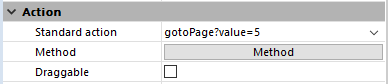

## Description

### Affecter ou exécuter des actions standard

Les actions standard peuvent être utilisées de plusieurs manières :

- en tant qu'actions de [boutons](../FormObjects/button_overview.md) et de divers objets de formulaire tels que les [cases à cocher](../FormObjects/checkbox_overview.md) ou les [pop-up menus/listes déroulantes](../FormObjects/dropdownList_Overview.md). Les actions peuvent être assignées aux objets de formulaires soit via la Liste des propriétés de l'éditeur de formulaires, soit à l'aide de la commande [OBJECT SET ACTION](../commands/object-set-action).
- en tant qu'actions de commandes de menu. Elles peuvent être assignées aux commandes de menus soit dans l'éditeur de menus (voir [Définir l'action d'un menu](../Menus/properties.md)), soit à l'aide de la commande [SET MENU ITEM PROPERTY](../commands/set-menu-item-property).
- en tant qu'actions d'éléments de liste (utilisées lorsque la liste est associée à un pop-up menu/liste déroulante ou à un pop-up menu hiérarchique). Elles peuvent être assignées aux éléments de listes soit dans l'éditeur d'énumérations (voir [Créer et modifier des énumérations](https://doc.4d.com/4Dv21/4D/21/Creating-and-modifying-lists.300-7676826.en.html)), soit à l'aide de la commande [SET LIST ITEM PARAMETER](../commands/set-list-item-parameter).
- en tant que paramètres des commandes [INVOKE ACTION](../commands/invoke-action) et [Action info](../commands/ction-info).

Les objets de formulaires et les commandes de menus peuvent se voir affecter à la fois une action standard et une méthode. Dans ce cas, l'action standard est toujours exécutée après la méthode (à l'exception de l'action `deleteRecord`, voir ci-dessous).

### Paramètres

Certaines actions standard acceptent un paramètre permettant de définir leur exécution. La syntaxe à utiliser est similaire à la syntaxe URL :

```4d 
standardActionName{?nameParameter=valueParameter}
```
où :

- `standardActionName` est le nom de l'action standard (chaîne).
- `nameParameter` (optionnel) est le nom du paramètre à passer (chaîne)
- `valueParameter` (optionnel) est la valeur à utiliser (chaîne, nombre...)

Par exemple, pour définir l'action "aller à la page 5", vous pouvez écrire :

```4d 
gotoPage?value=5
```
Cette syntaxe est utilisable partout où une action standard peut être définie, c'est-à-dire dans la Liste des propriétés, l'éditeur de menus ou encore dans les commandes du langage. Par exemple, dans la Liste des propriétés :




## Notes à propos des objets et des actions

- Les actions d'édition telles que `cut`, `paste`... peuvent être utilisées avec :
    * les zones éditables standard,
    * les zones de texte [multi-styles](../FormObjects/properties_Text.md#multi-style)
    * les zones [4D Write Pro](../FormObjects/writeProArea_overview.md).
- Les actions sur les polices, les expressions et le correcteur orthographique telles que `backgroundColor`, `computeExpressions`, `spell/autoCorrectionEnabled`... peuvent être utilisées avec : 
    * les zones de texte [multi-styles](../FormObjects/properties_Text.md#multi-style)
    * les zones [4D Write Pro](../FormObjects/writeProArea_overview.md).
- Les actions de correction orthographique sont disponibles uniquement si l'option [Correction orthographique automatique](../FormObjects/properties_Entry.md#auto-spellcheck) est sélectionnée pour la zone. 
- Lorsqu'un attribut de style comme `fontSize` ou `color` est modifié via une action standard, 4D génère l'événement formulaire `On After Edit`.
- *Boutons* désigne tous les boutons et inclut également les cases à cocher qui peuvent représenter des actions avec statut vrai/faux, par exemple `fontBold`.
- Les objets [Pop-Up/Listes déroulantes](../FormObjects/dropdownList_Overview.md) et [Choix hiérarchiques](../FormObjects/dropdownList_Overview.md#using-a-hierarchical-choice-list) ne peuvent être associés directement qu'aux actions standard qui génèrent un sous-menu (liste), telles que `backgroundColor` ou `fontSize`. Dans ce cas, ils affichent une liste automatique de valeurs, à moins que des actions standard personnalisées aient été définies pour les éléments de la liste (voir ci-dessous).
- *Eléments de liste* : Si vous ne souhaitez pas utiliser les valeurs automatiques, vous pouvez associer des actions standard personnalisées aux éléments d'une liste (à l'aide de l'éditeur d'énumérations ou de la commande [SET LIST ITEM PARAMETER](../commands/set-list-item-parameter)) et définir la liste comme "Enumération" pour l'objet Pop-Up/Liste déroulante ou Pop-up menu hiérarchique. Les valeurs automatiques seront alors remplacées par les actions personnalisées à l'exécution. Dans ce contexte, seules les actions standard avec paramètres de valeurs en relation avec l'action principale du sous-menu (liste) peuvent être utilisées. Par exemple, vous pouvez définir une liste d'éléments associés à des valeurs d'actions backgroundColor (`backgroundColor?value="red"`, `backgroundColor?value="blue"`...) et l'affecter comme Enumération à un pop-up menu hiérarchique.


## Actions disponibles

### Actions 4D Write Pro

Consultez la page [Actions standard 4D Write Pro](../WritePro/user-legacy/standard-actions.md) pour la description des actions supplémentaires dédiées, disponibles pour les **zones 4D Write Pro uniquement**. 


### "" (chaîne vide)

| Constante (si définie) | Conditions d'activation | Disponible avec |
|---|---|---|
| `ak none` | N/A | Boutons, commandes de menus |

Aucune action standard n'est exécutée. Utilisez cette valeur lorsque l'action du bouton devra être définie par une méthode. Par exemple, un bouton qui affiche une boîte de dialogue de recherche personnalisée dans une application avec menus se verrait affecter Pas d'action, car il est nécessaire de définir l'action à l'aide d'une méthode qui ouvre et gère la boîte de dialogue de recherche.

### accept

| Constante (si définie) | Conditions d'activation | Disponible avec |
|---|---|---|
| `ak accept` | Aucune (peut être gérée par la commande [OBJECT SET ENABLED](../commands/object-set-enabled)) | Boutons, commandes de menus |

Sauvegarde un enregistrement nouveau ou modifié et donc déclenche le trigger `On Saving New Record Event` ou `On Saving Existing Record Event`. L'action valide également un formulaire affiché par la commande [DIALOG](../commands/dialog). Dans tous les cas, l'événement formulaire `On Validate` est généré.

:::note

Lors de l'utilisation de la commande [Dynamic pop up menu](../commands/dynamic-pop-up-menu), un élément associé à cette action ne sera pas automatiquement masqué en fonction du contexte.

:::

### addSubrecord

| Constante (si définie) | Conditions d'activation | Disponible avec |
|---|---|---|
| `ak add subrecord` | • *List box :* il y a au moins un list box de type "sélection" dans le formulaire et il a le focus<br>• *Sous-formulaire :* a le focus<br>• *Formulaire liste :* aucune | Boutons, commandes de menus |

• *List box :* un nouvel enregistrement vide apparaît dans le formulaire détaillé défini pour le list box. L'utilisateur peut saisir des valeurs, puis valider l'enregistrement et un nouvel enregistrement vide apparaît automatiquement. Cela continue jusqu'à ce que l'utilisateur clique sur un bouton d'annulation.<br>• *Sous-formulaire :* 4D crée un nouvel enregistrement dans la table ou la table liée, soit directement dans la liste, soit dans le formulaire détaillé associé (selon les propriétés du sous-formulaire).<br>• *Formulaire liste :* un nouvel enregistrement vide est créé. Avec les listes affichées à l'aide des commandes [MODIFY SELECTION](../commands/modify-selection) / [DISPLAY SELECTION](../commands/display-selection), l'enregistrement est ajouté dans la liste ou dans la page de détail selon la valeur du paramètre `enterList`. Dans la fenêtre d'affichage des enregistrements, l'enregistrement est ajouté à la liste.

### automaticSplitter

| Constante (si définie) | Conditions d'activation | Disponible avec |
|---|---|---|
| `ak automatic splitter` | Aucune (peut être gérée par la commande [OBJECT SET ENABLED](../commands/object-set-enabled)) | Boutons invisibles |

Cette action standard permet de créer des séparateurs personnalisés dans vos formulaires. Elle ne peut être assignée qu'à un bouton invisible (voir [Boutons](../FormObjects/button_overview.md)). Lorsqu'un bouton invisible reçoit cette action automatique, il se comporte exactement comme un séparateur. En collant par exemple une image dans le bouton invisible, vous pouvez créer tout type d'interface personnalisée pour vos séparateurs. Pour plus d'informations sur les séparateurs, reportez-vous à la section [Séparateurs](../FormObjects/splitters.md).

### backgroundColor

| Constante (si définie) | Conditions d'activation | Disponible avec |
|---|---|---|
| `ak background color` | Aucune | Commandes de menus, Pop-up/Listes déroulantes, Pop-up menus hiérarchiques |

Affiche le sous-menu standard de couleur de fond.

### backgroundColor/showDialog

| Constante (si définie) | Conditions d'activation | Disponible avec |
|---|---|---|
| `ak background color dialog` | Aucune | Boutons, commandes de menus |

Affiche la boîte de dialogue de couleur de fond de police.

### backgroundColor?value=\<color\>

| Constante (si définie) | Conditions d'activation | Disponible avec |
|---|---|---|
| `ak background color` | Aucune | Boutons, commandes de menus, éléments de listes |

Définit `<color>` comme couleur de fond. Passez une valeur ou un nom de couleur CSS. Ex : `backgroundColor?value=#FF0000`, `backgroundColor?value=red`, `backgroundColor?value=transparent`

### cancel

| Constante (si définie) | Conditions d'activation | Disponible avec |
|---|---|---|
| `ak cancel` | Aucune (peut être gérée par la commande [OBJECT SET ENABLED](../commands/object-set-enabled)) | Boutons, commandes de menus |

Quitte l'enregistrement courant sans sauvegarder les modifications éventuellement effectuées. L'action peut également refermer un formulaire affiché par la commande [DIALOG](../commands/dialog), ou sortir d'un formulaire affichant une sélection d'enregistrements à l'aide de [DISPLAY SELECTION](../commands/display-selection) ou [MODIFY SELECTION](../commands/modify-selection).

:::note

Lors de l'utilisation de la commande [Dynamic pop up menu](../commands/dynamic-pop-up-menu), un élément associé à cette action ne sera pas automatiquement masqué en fonction du contexte.

:::


### clear

| Constante (si définie) | Conditions d'activation | Disponible avec |
|---|---|---|
| `ak clear` | La zone éditable a le focus. L'objet ayant le focus a une zone éditable | Boutons, commandes de menus |

Supprime la sélection. Si rien n'est sélectionné, efface la totalité de la zone contenant le curseur (zones saisissables uniquement).

### color

| Constante (si définie) | Conditions d'activation | Disponible avec |
|---|---|---|
| `ak font color` | Aucune | Commandes de menus, Pop-up/Listes déroulantes, Pop-up menus hiérarchiques |

Affiche le sous-menu standard de couleur de police.

### color/showDialog

| Constante (si définie) | Conditions d'activation | Disponible avec |
|---|---|---|
| `ak font color dialog` | Aucune | Boutons, commandes de menus |

Affiche la boîte de dialogue système de couleur de police.

### color?value=\<color\>

| Constante (si définie) | Conditions d'activation | Disponible avec |
|---|---|---|
| `ak font color` | Aucune | Boutons, commandes de menus, éléments de listes |

Définit `<color>` comme couleur de police. Passez une valeur ou un nom de couleur CSS. Ex : `color?value=#FF0000`, `color?value=red`

### computeExpressions

| Constante (si définie) | Conditions d'activation | Disponible avec |
|---|---|---|
| `ak compute expressions` | Aucune | Boutons, commandes de menus |

Met à jour toutes les expressions dynamiques dans la zone.

### copy

| Constante (si définie) | Conditions d'activation | Disponible avec |
|---|---|---|
| `ak copy` | La zone éditable a le focus. Du contenu est sélectionné | Boutons, commandes de menus |

Place une copie de la sélection dans le Presse-papiers.

### cut

| Constante (si définie) | Conditions d'activation | Disponible avec |
|---|---|---|
| `ak cut` | La zone éditable a le focus. Du contenu est sélectionné | Boutons, commandes de menus |

Supprime la sélection et la place dans le Presse-papiers.

### databaseSettings

| Constante (si définie) | Conditions d'activation | Disponible avec |
|---|---|---|
| `ak database settings` | Aucune (peut être gérée par la commande [OBJECT SET ENABLED](../commands/object-set-enabled)) | Boutons, commandes de menus |

Affiche la boîte de dialogue standard des Propriétés de la base.

:::note

Sous macOS, la commande de menu associée à l'action `databaseSettings` est automatiquement placée dans le menu de l'application, lorsque la base est exécutée dans cet environnement.

:::

:::note

Lors de l'utilisation de la commande [Dynamic pop up menu](../commands/dynamic-pop-up-menu), un élément associé à cette action ne sera pas automatiquement masqué en fonction du contexte.

:::


### deleteRecord

| Constante (si définie) | Conditions d'activation | Disponible avec |
|---|---|---|
| `ak delete record` | Un enregistrement est sélectionné et il ne s'agit pas d'un nouvel enregistrement en cours d'ajout | Boutons, commandes de menus |

Affiche une boîte de dialogue d'alerte demandant à l'utilisateur de confirmer la suppression. S'il clique sur le bouton OK, l'enregistrement courant est supprimé. Une fois que l'utilisateur a confirmé l'opération, 4D affiche automatiquement le formulaire Sortie. Cas particulier : si une méthode est également assignée au bouton/menu, l'action standard est appelée en premier et la méthode est exécutée uniquement si l'utilisateur clique sur OK dans la boîte de dialogue d'alerte.

### deleteSubrecord

| Constante (si définie) | Conditions d'activation | Disponible avec |
|---|---|---|
| `ak delete subrecord` | • *List box :* au moins une ligne d'un list box de type "sélection" est sélectionnée<br>• *Sous-formulaire :* a le focus et un enregistrement est sélectionné.<br>• *Formulaire liste :* un enregistrement est sélectionné dans la liste. | Boutons, commandes de menus |

• *List box :* une boîte de dialogue de confirmation apparaît afin que l'utilisateur puisse confirmer ou annuler la suppression.<br>• *Sous-formulaire :* une boîte de dialogue apparaît pour confirmer ou annuler la suppression du ou des sous-enregistrements sélectionnés.<br>• *Formulaire liste :* une boîte de dialogue apparaît pour confirmer ou annuler la suppression du ou des enregistrements sélectionnés.

### designMode

| Constante (si définie) | Conditions d'activation | Disponible avec |
|---|---|---|
| `ak return to design mode` | Mode application (peut être gérée par la commande [OBJECT SET ENABLED](../commands/object-set-enabled))| Boutons, commandes de menus |

Fait passer au premier plan les fenêtres et la barre de menus du mode Développement de 4D. Lorsque la base est exécutée en mode interprété, cette action provoque l'affichage de la fenêtre courante du mode Développement. Lorsque la base est exécutée en mode compilé, cette action provoque l'affichage de la fenêtre des enregistrements de la table courante (en mode compilé, seul l'accès aux enregistrements est possible).

:::note

Lors de l'utilisation de la commande [Dynamic pop up menu](../commands/dynamic-pop-up-menu), un élément associé à cette action ne sera pas automatiquement masqué en fonction du contexte.

:::

### displaySubrecord

| Constante (si définie) | Conditions d'activation | Disponible avec |
|---|---|---|
| `ak display subrecord` | • *List box :* au moins une ligne d'un list box de type "sélection" est sélectionnée<br>• *Sous-formulaire :* a le focus et un enregistrement est sélectionné.<br>• *Formulaire liste :* un enregistrement est sélectionné dans la liste. | Boutons, commandes de menus |

• *List box :* l'enregistrement correspondant à la ligne du list box apparaît dans le formulaire détaillé défini pour le list box, en mode lecture seule. L'utilisateur peut seulement annuler le formulaire pour revenir au list box.<br>• *Sous-formulaire :* le sous-enregistrement sélectionné est affiché dans le formulaire détaillé associé en mode lecture seule (si défini dans les propriétés du sous-formulaire).<br>• *Formulaire liste :* avec les listes affichées via les commandes [MODIFY SELECTION](../commands/modify-selection) / [DISPLAY SELECTION](../commands/display-selection), l'enregistrement sélectionné est affiché en mode lecture seule dans la page de détail selon la valeur du paramètre `enterList`. Dans la fenêtre d'affichage des enregistrements, l'enregistrement sélectionné est affiché en mode lecture seule dans la page de détail.

### editSubrecord

| Constante (si définie) | Conditions d'activation | Disponible avec |
|---|---|---|
| `ak edit subrecord` | • *List box :* au moins une ligne d'un list box de type "sélection" est sélectionnée<br>• *Sous-formulaire :* a le focus et un enregistrement est sélectionné.<br>• *Formulaire liste :* un enregistrement est sélectionné dans la liste. | Boutons, commandes de menus |

• *List box :* l'enregistrement correspondant à la ligne du list box apparaît dans le formulaire détaillé défini pour le list box. L'utilisateur peut modifier les valeurs, puis valider ou annuler le formulaire pour revenir au list box.<br>• *Sous-formulaire :* le sous-enregistrement sélectionné passe en mode édition, soit directement dans la liste, soit dans le formulaire détaillé associé (selon les propriétés du sous-formulaire).<br>• *Formulaire liste :* l'enregistrement sélectionné passe en mode édition. Avec les listes affichées via les commandes [MODIFY SELECTION](../commands/modify-selection) / [DISPLAY SELECTION](../commands/display-selection), la modification est effectuée dans la liste ou sur la page de détail selon la valeur du paramètre `enterList`. Dans la fenêtre d'affichage des enregistrements, la modification est effectuée sur la page de détail (l'action est équivalente à un double-clic).

### firstPage

| Constante (si définie) | Conditions d'activation | Disponible avec |
|---|---|---|
| `ak next page` | Formulaire multipage et on n'est pas sur la première page | Boutons, commandes de menus |

Affiche la première page.

### firstRecord

| Constante (si définie) | Conditions d'activation | Disponible avec |
|---|---|---|
| `ak first record` | Un enregistrement est sélectionné et il ne s'agit pas du premier de la sélection | Boutons, commandes de menus |

Valide l'enregistrement courant et fait du premier enregistrement de la sélection le nouvel enregistrement courant.

### font/showDialog

| Constante (si définie) | Conditions d'activation | Disponible avec |
|---|---|---|
| `ak font show dialog` | Aucune | Boutons, commandes de menus |

Affiche la boîte de dialogue système de sélection de police.

### fontBold

| Constante (si définie) | Conditions d'activation | Disponible avec |
|---|---|---|
| `ak font bold` | Aucune | Boutons, commandes de menus |

Sélectionne/désélectionne l'attribut de police gras.

### fontItalic

| Constante (si définie) | Conditions d'activation | Disponible avec |
|---|---|---|
| `ak font italic` | Aucune | Boutons, commandes de menus |

Sélectionne/désélectionne l'attribut de police italique.

### fontLineThrough

| Constante (si définie) | Conditions d'activation | Disponible avec |
|---|---|---|
| `ak font linethrough` | Aucune | Boutons, commandes de menus |

Sélectionne/désélectionne l'attribut de police barré.

### fontSize

| Constante (si définie) | Conditions d'activation | Disponible avec |
|---|---|---|
| `ak font size` | Aucune | Commandes de menus, Pop-up/Listes déroulantes, Pop-up menus hiérarchiques |

Affiche le sous-menu standard de taille de police.

### fontSize?value=\<size\>

| Constante (si définie) | Conditions d'activation | Disponible avec |
|---|---|---|
| `ak font size` | Aucune | Boutons, commandes de menus, éléments de listes |

Définit `<size>` comme taille de police. Passez une taille CSS en pt. Ex : `fontSize?value=12pt`

### fontStyle

| Constante (si définie) | Conditions d'activation | Disponible avec |
|---|---|---|
| `ak font style` | Aucune | Commandes de menus, Pop-up/Listes déroulantes, Pop-up menus hiérarchiques |

Affiche le sous-menu standard de style de police.

### fontUnderline

| Constante (si définie) | Conditions d'activation | Disponible avec |
|---|---|---|
| `ak font underline` | Aucune | Boutons, commandes de menus |

Sélectionne/désélectionne l'attribut de police souligné.

### freezeExpressions

| Constante (si définie) | Conditions d'activation | Disponible avec |
|---|---|---|
| `ak freeze expressions` | Aucune | Boutons, commandes de menus |

Fige toutes les expressions dynamiques dans la zone.

### gotoPage

| Constante (si définie) | Conditions d'activation | Disponible avec |
|---|---|---|
| `ak goto page` | Formulaire multipage | Onglets, list box, grilles de boutons, pop-up menus/listes déroulantes |

Affiche automatiquement la page du formulaire correspondant au numéro de l'élément sélectionné (onglet, ligne de list box, bouton de la grille, élément de pop up menu) si elle existe. Voir aussi [Action Aller à page](../FormObjects/tabControl.md#goto-page-action).

### gotoPage?value=\<page\>

| Constante (si définie) | Conditions d'activation | Disponible avec |
|---|---|---|
| `ak goto page` | Formulaire multipage | Boutons, commandes de menus |

Affiche la page du formulaire correspondant au numéro `<page>`.

### lastPage

| Constante (si définie) | Conditions d'activation | Disponible avec |
|---|---|---|
| `ak last page` | Formulaire multipage et on n'est pas sur la dernière page | Boutons, commandes de menus |

Affiche la dernière page.

### lastRecord

| Constante (si définie) | Conditions d'activation | Disponible avec |
|---|---|---|
| `ak last record` | Un enregistrement est sélectionné et il ne s'agit pas du dernier de la sélection | Boutons, commandes de menus |

Valide l'enregistrement courant et fait du dernier enregistrement de la sélection le nouvel enregistrement courant.

### msc

| Constante (si définie) | Conditions d'activation | Disponible avec |
|---|---|---|
| `ak msc` | Aucune (peut être gérée par la commande [OBJECT SET ENABLED](../commands/object-set-enabled)) | Boutons, commandes de menus |

Affiche la fenêtre du [Centre de Sécurité et de Maintenance](../MSC/overview.md).

:::note

Lors de l'utilisation de la commande [Dynamic pop up menu](../commands/dynamic-pop-up-menu), un élément associé à cette action ne sera pas automatiquement masqué en fonction du contexte.

:::

### nextPage

| Constante (si définie) | Conditions d'activation | Disponible avec |
|---|---|---|
| `ak next page` | Formulaire multipage et on n'est pas sur la dernière page | Boutons, commandes de menus |

Affiche la page suivante.

### nextRecord

| Constante (si définie) | Conditions d'activation | Disponible avec |
|---|---|---|
| `ak next record` | Un enregistrement est sélectionné et il ne s'agit pas du dernier de la sélection | Boutons, commandes de menus |

Valide l'enregistrement courant et fait de l'enregistrement suivant le nouvel enregistrement courant.

### openBackURL

| Constante (si définie) | Conditions d'activation | Disponible avec |
|---|---|---|
| `ak open back url` | [Zones Web uniquement](../FormObjects/webArea_overview.md). Un URL a été précédemment chargé | Boutons, commandes de menus |

Provoque l'ouverture de l'URL précédent parmi la séquence de navigation effectuée par l'utilisateur dans la zone Web. Désactivée s'il n'y a pas d'URL précédent, c'est-à-dire si l'utilisateur n'a affiché qu'une seule page dans la zone Web.

### openForwardURL

| Constante (si définie) | Conditions d'activation | Disponible avec |
|---|---|---|
| `ak open forward url` | [Zones Web uniquement](../FormObjects/webArea_overview.md). `openBackURL` précédemment exécuté | Boutons, commandes de menus |

Provoque l'ouverture de l'URL suivant parmi la séquence de navigation effectuée par l'utilisateur dans la zone Web. Désactivée s'il n'y a pas d'URL suivant, c'est-à-dire si l'utilisateur n'a jamais effectué de retour en arrière dans la séquence.

### paste

| Constante (si définie) | Conditions d'activation | Disponible avec |
|---|---|---|
| `ak paste` | La zone éditable a le focus. Le presse-papiers n'est pas vide | Boutons, commandes de menus |

Insère le contenu du Presse-papiers à l'emplacement du curseur.

### previousPage

| Constante (si définie) | Conditions d'activation | Disponible avec |
|---|---|---|
| `ak previous page` | Formulaire multipage et on n'est pas sur la première page | Boutons, commandes de menus |

Affiche la page précédente.

### previousRecord

| Constante (si définie) | Conditions d'activation | Disponible avec |
|---|---|---|
| `ak previous record` | Un enregistrement est sélectionné et il ne s'agit pas du premier de la sélection | Boutons, commandes de menus |

Valide l'enregistrement courant et fait de l'enregistrement précédent le nouvel enregistrement courant.

### quit

| Constante (si définie) | Conditions d'activation | Disponible avec |
|---|---|---|
| `ak quit` | Aucune (peut être gérée par la commande [OBJECT SET ENABLED](../commands/object-set-enabled)) | Boutons, commandes de menus |

Affiche une boîte de dialogue de confirmation "Etes-vous certain ?" puis quitte l'application 4D en cas de validation. Dans le cas contraire, l'opération est annulée. Lorsque cette action est assignée à un bouton auquel une méthode objet est également associée, la séquence suivante est exécutée : la boîte de dialogue de confirmation apparaît. Si elle est validée, 4D exécute la méthode objet. A l'issue de son exécution, l'application quitte.

:::note

Sous macOS, la commande de menu associée à l'action `quit` est automatiquement placée dans le menu de l'application, lorsque la base est exécutée dans cet environnement. Ce mécanisme simplifie la gestion de la commande Quitter sous macOS.

:::

:::note

Lors de l'utilisation de la commande [Dynamic pop up menu](../commands/dynamic-pop-up-menu), un élément associé à cette action ne sera pas automatiquement masqué en fonction du contexte.

:::

### redo

| Constante (si définie) | Conditions d'activation | Disponible avec |
|---|---|---|
| `ak redo` | La zone éditable a le focus. Une action annuler a été effectuée | Boutons, commandes de menus |

Répète la dernière action annulée (= commande Répéter du menu Edition).

### refreshCurrentURL

| Constante (si définie) | Conditions d'activation | Disponible avec |
|---|---|---|
| `ak refresh current url` | [Zones Web uniquement](../FormObjects/webArea_overview.md). `openBackURL` précédemment exécuté (peut être gérée par la commande [OBJECT SET ENABLED](../commands/object-set-enabled)) | Boutons, commandes de menus |

Recharge le contenu courant de la zone Web.

### selectAll

| Constante (si définie) | Conditions d'activation | Disponible avec |
|---|---|---|
| `ak select all` | La zone éditable a le focus. L'objet ayant le focus a une zone éditable | Boutons, commandes de menus |

Sélectionne l'ensemble des éléments sélectionnables dans le contexte.

### showClipboard

| Constante (si définie) | Conditions d'activation | Disponible avec |
|---|---|---|
| `ak show clipboard` | Toujours disponible | Boutons, commandes de menus |

Ouvre une nouvelle fenêtre affichant le contenu courant du Presse-papiers.

### spell

| Constante (si définie) | Conditions d'activation | Disponible avec |
|---|---|---|
| - | Aucune | Commandes de menus |

Affiche le menu complet du correcteur orthographique.

### spell/autoCorrectionEnabled

| Constante (si définie) | Conditions d'activation | Disponible avec |
|---|---|---|
| - | Correction orthographique activée | Boutons, commandes de menus |

Active/désactive le mode correction auto.

### spell/autoDashSubstitutionsEnabled

| Constante (si définie) | Conditions d'activation | Disponible avec |
|---|---|---|
| - | Correction orthographique activée | Boutons, commandes de menus |

Active/désactive le remplacement des double tirets (`--`) par le tiret cadratin (`—`) en cours de saisie (macOS uniquement).

### spell/autoLanguageEnabled

| Constante (si définie) | Conditions d'activation | Disponible avec |
|---|---|---|
| - | Correction orthographique activée | Boutons, commandes de menus |

Active/désactive l'identification automatique de la langue du dictionnaire à utiliser en fonction du contenu du texte (macOS uniquement).

### spell/autoQuoteSubstitutionsEnabled

| Constante (si définie) | Conditions d'activation | Disponible avec |
|---|---|---|
| - | Correction orthographique activée | Boutons, commandes de menus |

Active/désactive le remplacement des guillemets droits par des guillemets typographiques adaptés à la langue courante (macOS uniquement).

### spell/autoSubstitutionsEnabled

| Constante (si définie) | Conditions d'activation | Disponible avec |
|---|---|---|
| - | Correction orthographique activée | Boutons, commandes de menus |

Active/désactive la substitution de texte.

### spell/enabled

| Constante (si définie) | Conditions d'activation | Disponible avec |
|---|---|---|
| - | Aucune | Boutons, commandes de menus |

Active/désactive la correction orthographique dans la zone (l'option Correction orthographique doit être cochée pour la zone).

### spell/forgetIgnore

| Constante (si définie) | Conditions d'activation | Disponible avec |
|---|---|---|
| - | Correction orthographique activée | Boutons, commandes de menus |

Efface la liste des mots ayant été déclarés ignorés dans le document.

### spell/grammarEnabled

| Constante (si définie) | Conditions d'activation | Disponible avec |
|---|---|---|
| - | Correction orthographique activée | Boutons, commandes de menus |

Active/désactive la correction grammaticale du texte (macOS uniquement).

### spell/ignore

| Constante (si définie) | Conditions d'activation | Disponible avec |
|---|---|---|
| - | Correction orthographique activée/Un mot inconnu est sélectionné ou contient le curseur | Boutons, commandes de menus |

Le mot inconnu est conservé tel quel et n'est plus souligné, mais il sera de nouveau signalé s'il est détecté ultérieurement.

### spell/learn

| Constante (si définie) | Conditions d'activation | Disponible avec |
|---|---|---|
| - | Correction orthographique activée/Un mot inconnu est sélectionné ou contient le curseur | Boutons, commandes de menus |

Le mot inconnu est ajouté au dictionnaire ; il ne sera plus signalé par le correcteur.

### spell/removeSubstitution

| Constante (si définie) | Conditions d'activation | Disponible avec |
|---|---|---|
| - | Correction orthographique activée/Un mot ayant été substitué est sélectionné ou contient le curseur | Boutons, commandes de menus |

Supprime la substitution sélectionnée.

### spell/showDialog

| Constante (si définie) | Conditions d'activation | Disponible avec |
|---|---|---|
| - | Correction orthographique activée | Boutons, commandes de menus |

Affiche une boîte de dialogue de correction orthographique.

### spell/suggestion?index=\<1-number\<=10\>

| Constante (si définie) | Conditions d'activation | Disponible avec |
|---|---|---|
| - | Correction orthographique activée/mot incorrect sélectionné | Boutons, commandes de menus |

nombre est la nième suggestion d'orthographe pour le premier mot incorrect dans la sélection. Ex : `spell/suggestion?index=1` remplace le mot incorrect dans la sélection par la première suggestion.

### spell/unLearn

| Constante (si définie) | Conditions d'activation | Disponible avec |
|---|---|---|
| - | Correction orthographique activée/Un mot appris est sélectionné ou contient le curseur | Boutons, commandes de menus |

Supprime le mot appris sélectionné de la liste des mots appris.

### spell/visibleSubstitutions

| Constante (si définie) | Conditions d'activation | Disponible avec |
|---|---|---|
| - | Correction orthographique activée | Boutons, commandes de menus |

Active/désactive le soulignement en bleu des substitutions possibles dans le texte.

### stopLoadingURL

| Constante (si définie) | Conditions d'activation | Disponible avec |
|---|---|---|
| `ak stop loading url` | [Zones Web uniquement](../FormObjects/webArea_overview.md). URL en cours de chargement | Boutons, commandes de menus |

Stoppe le chargement de la page et/ou des objets présents à l'URL courant dans la zone Web.

### undo

| Constante (si définie) | Conditions d'activation | Disponible avec |
|---|---|---|
| `ak undo` | La zone éditable a le focus. Une action d'édition a été effectuée | Boutons, commandes de menus |

Annule la dernière action effectuée (= commande Annuler du menu Edition). Il ne faut pas confondre cette action avec Ne pas valider (= annulation des modifications éventuellement apportées à l'enregistrement visualisé et retour au formulaire Sortie).

### visibleReferences

| Constante (si définie) | Conditions d'activation | Disponible avec |
|---|---|---|
| `ak show reference` | Aucune | Boutons, commandes de menus |

Affiche toutes les expressions dynamiques en tant que références.

### writingTools 

| Constante (si définie) | Conditions d'activation | Disponible avec |
|---|---|---|
|-| *macOS uniquement* | Boutons, commandes de menus |

Pour les [documents 4D Write Pro](../category/4d-write-pro) et les [objets de formulaire de saisie](../FormObjects/input_overview.md). Affiche les [Outils d'écriture](../FormObjects/properties_Entry.md#writing-tools) pour la zone, en utilisant le conteneur où se trouve le curseur et la sélection courante comme contexte. Le texte sélectionné (ou tout le conteneur s'il n'y a pas de sélection) est remplacé par la modification retournée. L'action est désactivée si la zone n'est pas saisissable ou pas activée, sous Windows, ou quand Apple Intelligence est désactivé. 


## Voir aussi

- [Actions standard 4D Write Pro](../WritePro/user-legacy/standard-actions.md)
- [Télécharger la base HDI](http://download.4d.com//Demos/4D_v16_R3/HDI_NewStandardActions.zip)