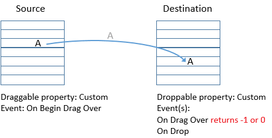
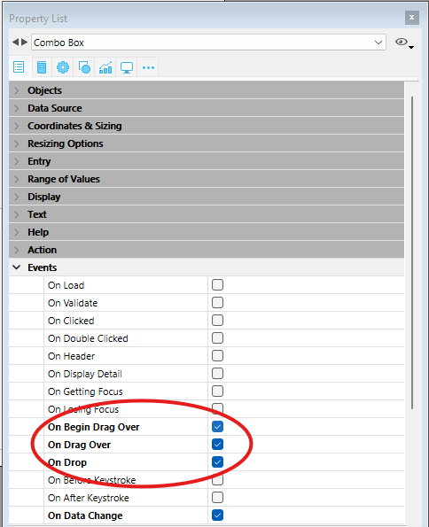
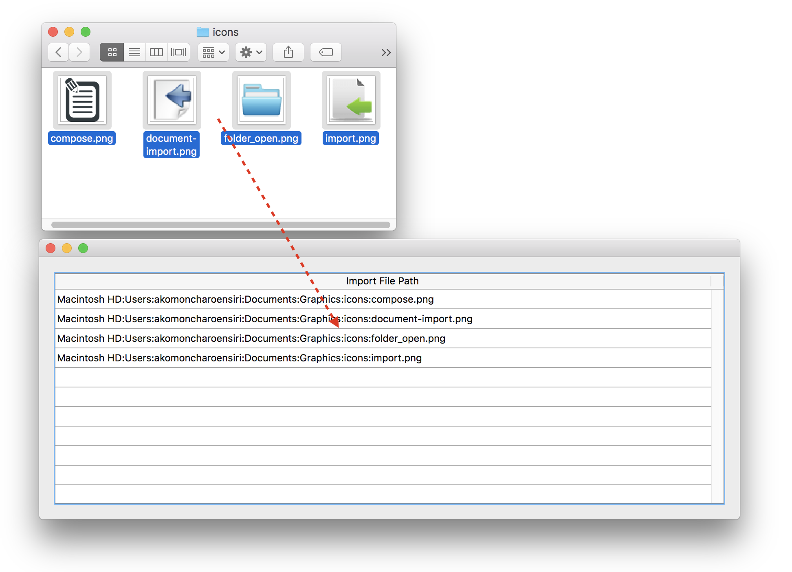

## Vue d’ensemble

4D intègre une fonctionnalité de glisser-déposer entre objets de vos formulaires et applications. Vous pouvez faire glisser un objet et le déposer sur un autre, dans la même fenêtre ou dans une autre fenêtre. En d'autres termes, le glisser-déposer peut s'effectuer au sein d'un même process ou d'un process à un autre.

Vous pouvez également effectuer des glisser-déposer d'objets entre les formulaires 4D et d'autres applications, et inversement. Par exemple, il est possible de glisser-déposer un fichier image au format .png dans un champ image 4D. Il est également possible de sélectionner du texte dans un logiciel de traitement de texte et de le déposer dans une variable de texte 4D ou une list box.

Enfin, il est possible de déposer des objets directement dans l'application sans qu'un formulaire soit nécessairement affiché au premier plan. La [méthode base `On Drop`](../commands-legacy/on-drop-database-method.md) peut être utilisée pour gérer l'action de glisser-déposer dans ce cas. Cela signifie, par exemple, que vous pouvez ouvrir un document 4D Write Pro en le glissant-déposant sur l'icône de l'application 4D.

4D fournit deux modes de glisser-déposer :

- un **mode personnalisé**, dans lequel l'ensemble de l'opération de glisser-déposer est gérée par le développeur. Ce mode vous permet de mettre en place des interfaces basées sur le glisser-déposer, y compris des interfaces qui ne déplacent pas nécessairement des données mais qui peuvent effectuer tout type d'action, telle que l'ouverture de fichiers ou le lancement d'un calcul.
- un **mode automatique**, dans lequel une opération de glisser-déposer permet de copier ou de déplacer automatiquement des données d'un objet vers un autre. Ce mode est disponible pour les objets textuels et (en partie) pour les images, et peut être activé simplement en sélectionnant une propriété.

## Objets glissables et déposables

Plusieurs objets de formulaire peuvent être glissés et/ou déposés, en mode personnalisé et/ou automatique (voir ci-dessous). Les objets de formulaire nouvellement créés ne peuvent être ni glissés ni déposés (valeur "none"). C'est à vous de définir ces propriétés.

Pour glisser-déposer un objet sur un autre, vous devez définir sa [**propriété Glissable**](../FormObjects/properties_Action.md#draggable) sur "Automatique" ou "Personnalisé". Lors d'une opération de glisser-déposer, l'objet que vous faites glisser est l'objet source.

Pour qu'un objet puisse servir de destination à une opération de glisser-déposer, vous devez définir sa [**propriété Déposable**](../FormObjects/properties_Action.md#droppable) sur "Automatique" ou "Personnalisé". Lors d'une opération de glisser-déposer, l'objet qui reçoit les données est l'objet de destination.

Le tableau suivant répertorie les propriétés disponibles pour les objets glissables et/ou déposables :

| Objet de formulaire                            | Glissable "Personnalisé" | Déposable "Personnalisé" | Glissable "Auto" | Déposable "Auto" |
| ---------------------------------------------- | ------------------------ | ------------------------ | ---------------- | ---------------- |
| [Zones 4D Write Pro](writeProArea_overview.md) | x                        | x                        | x                | x                |
| [Combo Box](comboBox_overview.md)              |                          | x                        | x                | x                |
| [Zone de saisie](input_overview.md)            | x                        | x                        | x                | x                |
| [Hierarchical List](list_overview.md)          | x                        | x                        |                  |                  |
| [List Box](listbox_overview.md)                | x                        | x                        |                  |                  |
| [Zone de plugin](pluginArea_overview.md)       |                          |                          | x                | x                |
| [Bouton](button_overview.md)                   |                          | x                        |                  |                  |
| [Bouton Image](pictureButton_overview.md)      |                          | x                        |                  |                  |

Les éléments d'une liste hiérarchique ou les lignes d'une list box peuvent être déplacés par glisser-déposer. À l'inverse, vous pouvez glisser-déposer un objet sur un élément d'une liste hiérarchique ou sur une ligne d'une list box. Cependant, vous ne pouvez pas glisser-déposer des objets depuis la zone de détail d'un formulaire de sortie. Vous pouvez également gérer les opérations de glisser-déposer dans l'application, en dehors de tout formulaire, à l'aide de la [méthode base `On Drop`](../commands-legacy/on-drop-database-method.md).

:::note Notes

- Par défaut, dans le cas des champs d'image et des variables, l'image et sa référence sont toutes deux déplacées. Si vous souhaitez uniquement faire glisser la référence, maintenez enfoncée la touche **Alt** (Windows) ou **Option** (macOS) avant de commencer.
- Lorsque les propriétés Glissable "Personnalisé" et ["Lignes déplaçables"](../FormObjects/properties_Action.md#movable-rows) sont toutes deux définies pour un objet "list box tableau", la propriété "Lignes déplaçables" prévaut lors du déplacement d'une ligne. Dans ce cas, il n'est pas possible de faire glisser l'élément.
- Un objet pouvant être à la fois glissé et déposé peut également être déposé sur lui-même, à moins que vous ne rejetiez cette opération.

:::

## Glisser-déposer personnalisé

La mise en œuvre d'une interface de glisser-déposer personnalisée implique de combiner des propriétés, des événements et les commandes du [*thème Conteneur de données*](../commands/theme/Pasteboard.md). Le schéma suivant illustre les points clés d'une séquence de glisser-déposer personnalisé :



Votre implémentation sera basée sur le scénario suivant :

1. Dans l'événement [`On Begin Drag Over`](../Events/onBeginDragOver.md) de l'objet source (avec la propriété [**Glissable** "Personnalisé"](../FormObjects/properties_Action.md#draggable)), placez les données appropriées dans le presse-papiers à l’aide de [`APPEND DATA TO PASTEBOARD`](../commands/append-data-to-pasteboard), [`SET FILE TO PASTEBOARD`](../commands/set-file-to-pasteboard) ou d’autres commandes du [thème Conteneur de données](../commands/theme/Pasteboard.md). Vous pouvez également définir une icône de curseur spécifique à l'aide de la commande [`SET DRAG ICON`](../commands/set-drag-icon).
2. Dans l'événement [`On Drag Over`](../Events/onDragOver.md) de l'objet de destination (avec la propriété [**Déposable** "Personnalisé"(../FormObjects/properties_Action.md#droppable)), récupérez les types de données ou les signatures de données présents dans le presse-papiers à l’aide de [`GET PASTEBOARD DATA TYPE`](../commands/get-pasteboard-data-type) ou [`GET PASTEBOARD DATA`](../commands/get-pasteboard-data) et vérifiez s’ils sont compatibles avec l’objet de destination.
   La commande [`Drop position`](../commands/drop-position) retourne le numéro de l'élément ou la position de l'élément cible ou de liste, si l'objet destination est une liste hiérarchique, un texte ou une liste déroulante, ainsi que le numéro de colonne si l'objet est une list box.
3. La [méthode objet](../Concepts/methods.md#method-types) de l'objet ou de l'élément de destination doit renvoyer 0 ou -1 pour accepter ou refuser l'action :
   - Si c'est compatible, retournez **0** pour accepter le déposer et exécuter l'événement [`On Drop`](../Events/onDrop.md) lorsque le bouton de la souris est relâché.
   - Sinon, retournez **-1** pour rejeter le déposer.  
     4D gère automatiquement l'aspect graphique de cette interaction en affichant un curseur selon que le glisser-déposer est accepté ou rejeté.
4. Dans l'événement [`On Drop`](../Events/onDrop.md) de l'objet de destination (avec la propriété [**Déposable** "Personnalisé"](../FormObjects/properties_Action.md#droppable)), exécutez n'importe quelle action en réponse au déposer. Si l'opération de glisser-déposer vise à copier les données déplacées, il suffit d'affecter ces données à l'objet de destination. Si le glisser-déposer n'a pas pour but de déplacer des données, mais constitue plutôt une métaphore de l'interface utilisateur pour une opération particulière, vous pouvez effectuer l'action de votre choix, par exemple récupérer les chemins d'accès aux fichiers à l'aide de la commande [`Get file from pasteboard`](../commands/get-file-from-pasteboard).

Notez que l'événement [`On Begin Drag Over`](../Events/onBeginDragOver.md) est généré **dans le contexte de l'objet source du glisser**, tandis que les événements [`On Drag Over`](../Events/onDragOver.md) et [`On Drop`](../Events/onDrop.md) ne sont envoyés qu'à l'objet de destination.

Pour que l'application puisse traiter ces événements, ceux-ci doivent être sélectionnés de manière appropriée dans la liste des propriétés, tant pour l'objet source que pour l'objet de destination :



## Glisser-déposer automatique

Le glisser-déposer automatique est le déplacement ou la copie d'une sélection de texte ou d'une image d'une zone à l'autre par un simple clic. Il peut être utilisé au sein d'une même zone 4D, entre deux zones 4D, ou entre 4D et une autre application.

:::note

Dans le cas d'un glisser-déposer automatique entre deux zones 4D, les données sont déplacées ; en d'autres termes, elles sont supprimées de la zone source. Si vous souhaitez copier les données, maintenez la touche **Ctrl** (Windows) ou **Option** (macOS) enfoncée pendant l'opération (sous macOS, vous devez appuyer sur la touche **Option** *après* avoir commencé à faire glisser le ou les élément(s)).

:::

Les propriétés [Glisser automatique](../FormObjects/properties_Action.md#draggable) et [Déposer automatique](../FormObjects/properties_Action.md#droppable) peuvent être configurées séparément pour chaque objet de formulaire.

- **Glissable : Automatique** : Lorsque cette option est sélectionnée, le glisser automatique est activé pour l'objet. Dans ce mode, l'événement formulaire [`On Begin Drag`](../Events/onBeginDragOver.md) n'est PAS généré.
  Si vous souhaitez "forcer" l'utilisation du glisser-déposer personnalisé alors que le glisser-déposer automatique est activé, maintenez enfoncée la touche **Alt** (Windows) ou **Option** (macOS) pendant l'action (sous macOS, vous devez appuyer sur la touche **Option** *avant* de commencer le glisser). Cette option n'est pas disponible pour les images.
- **Déposable : Automatique** : Dans ce mode, 4D gère automatiquement — dans la mesure du possible — l'insertion des données glissées de type texte ou image qui sont déposées sur l'objet (les données sont collées dans l'objet). Les événements formulaire [`On Drag Over`](../Events/onDragOver.md) et [`On Drop`](../Events/onDrop.md) ne sont pas générés dans ce cas. Par contre, les événements [`On After Edit`](../Events/onAfterEdit.md) (pendant un déposer) et [`On Data Change`](../Events/onDataChange.md) (quand l'objet perd le focus) sont générés.

Dans le cas de données autres que du texte ou des images (un autre objet 4D, un fichier, etc.) ou de données complexes déposées, l'application se réfère à la valeur de l'option "Déposable" : si elle n'est pas sur "Aucun", les événements formulaire [`On Drag Over`](../Events/onDragOver.md) et [`On Drop`](../Events/onDrop.md) sont générés ; sinon, le déposer est refusée.

## Exemples

### List box tableau vers zone de saisie de texte

Dans cet exemple simple, nous souhaitons remplir une zone de texte de saisie avec des données glissées depuis une list box de type tableau :


La méthode objet de la list box :

```4d
  //Object Method: ListBox
 If(Form event code=On Begin Drag Over)
    SET TEXT TO PASTEBOARD(arrFirstname{arrFirstname}+" "+arrLastname{arrFirstname})
 End if
```

La méthode de l'objet zone de texte contient :

```4d

  // Object Method: label1
If(Form event code=On Drop) //Nécessite que l'action Déposable soit activée dans la Liste des propriétés
    ARRAY TEXT($signatures_at;0)
    ARRAY TEXT($nativeTypes_at;0)
    ARRAY TEXT($formatNames_at;0)
    GET PASTEBOARD DATA TYPE($signatures_at;$nativeTypes_at;$formatNames_at)
    If(Find in array($signatures_at;"com.4d.private.text.native")#-1) // Il y a du texte 4D dans le conteneur de données
       OBJECT Get pointer(Object current)->:=Get text from pasteboard
    End if
 End if
```

### List box de type sélection vers zone de saisie de texte

La combinaison de fonctionnalités de glisser-déposer personnalisées et automatiques permet de créer des interfaces à la fois simples et performantes. Dans cet exemple, nous souhaitons remplir un champ de saisie avec des données glissées depuis une list box :


- List box : propriété Glissable "Personnalisé" et événement "On Begin Drag Over"
- Zone de saisie : propriété Déposable "Automatique".

```4d
  //méthode objet list box
 Case of
    :(Form event code=On Begin Drag Over)
       LOAD RECORD([Clients])
       $label:=[Clients]Name+Char(CR ASCII code)+[Clients]Contact+Char(CR ASCII code)+\
       [Clients]Address1+Char(CR ASCII code)+[Clients]City+", "+[Clients]State+" "+[Clients]ZipCode)
       SET TEXT TO PASTEBOARD($label)
 End case
```

Le déplacement et la mise en forme des données s'effectuent par glisser-déposer :


### Chemin d'accès de fichier vers zone de texte

Vous souhaitez que l'utilisateur glisse un fichier depuis le disque sur une variable saisissable (de type objet) afin qu'une description json du fichier s'affiche.


Dans la méthode objet de la variable, vous écrivez simplement :

```4d
 #DECLARE -> $result : Integer
 Case of
 
    :(Form event code=On Drag Over)
  // Accepter l'évenement On Drop uniquement si le conteneur de données contient des fichiers, sinon le rejeter.
       If(Get file from pasteboard(1)="") //pas de fichier dans le conteneur
          $result:=-1 //rejeter le déposer
       End if
 
    :(Form event code=On Drop) //Nécessite que la propriété Déposable soit sélectionnée dans la liste des propriétés
       var $path_t : Text
       var path_o : Object
       $path_t:=Get file from pasteboard(1)
       If($path_t#"")
          path_o:=Path to object($path_t)
       End if
 
 End case
```

### Chemin d'accès vers list box

Vous souhaitez que l'utilisateur sélectionne des fichiers sur le disque, puis qu'il fasse un glisser-déposer dans une list box afin que celle-ci affiche les chemins d'accès à ces fichiers.



Dans la méthode objet de la list box, vous pouvez écrire :

```4d
 #DECLARE -> $result : Integer
 Case of
 
    :(Form event code=On Drag Over)
  // Accepter l'événement On Drop seulement si le conteneur de données contient des fichiers, le rejeter sinon.
       If(Get file from pasteboard(1)#"") //au moins un fichier est déposé
          $result:=0 //accepter le déposer
       Else //aucun fichier dans le déposer
          $result:=-1 //rejeter le déposer
       End if
 
    :(Form event code=On Drop) //Nécessite que la propriété Déposable soit sélectionnée dans la liste des propriétés
       ARRAY TEXT(importedPath_at;0)
       var $path_t :Text
       var $index_l:=1
       Repeat
          $path_t:=Get file from pasteboard($index_l)
          If($path_t#"")
             APPEND TO ARRAY(importedPath_at;$path_t)
          End if
          $index_l:=$index_l+1
       Until($path_t="")
 End case
```

## Pasteboard commands

The [commands of the "Pasteboard" theme](../commands/theme/Pasteboard.md) can be used both for managing copy/paste actions (**Clipboard management**), as well as inter-application drag and drop actions.

4D uses two data pasteboards: one for copied (or cut) data, which is the clipboard, and the other for data being dragged and dropped.
These two pasteboards are managed using the same commands. You access one or the other depending on the context:

- The drag and drop pasteboard can only be accessed within the [`On Begin Drag Over`](../Events/onBeginDragOver.md), [`On Drag over`](../Events/onDragOver.md) or [`On Drop`](../Events/onDrop.md) form events and in the [**On Drop** database method](../commands-legacy/on-drop-database-method.md). Outside of these contexts, the drag and drop pasteboard is not available.
- The copy/paste pasteboard can be accessed in all other cases. Unlike the drag and drop pasteboard, it keeps the data that are placed in it during the entire session, so long as they are not cleared or reused.

### Types of Data

During drag and drop actions, different types of data can be placed on and read from the pasteboard. You can access a data type in several ways:

- Via its 4D signature: The 4D signature is a character string indicating a data type referenced by the 4D application. The use of 4D signatures facilitates the development of multi-platform applications since these signatures are identical under Mac OS and Windows. You will find the list of 4D signatures below.
- Via a UTI (Uniform Type Identifier, macos only): The UTI standard, specified by Apple, associates a character string with each type of native object. For example, GIF pictures have the UTI type "com.apple.gif". UTI types are published in Apple documentations as well as by the editors concerned.
- Via its number or its format name (Windows only): Under Windows, each native data type is referenced by its number ("3", "12", and so on) and a name ("Rich Text Edit"). By default, Microsoft specifies several native types called standard data formats. In addition, third-party editors can "save" format names in the system, which then attributes them a number in return. For more information about this and about native types, please refer to the Microsoft developer documentation (more particularly at http://msdn2.microsoft.com/en-us/library/ms649013.aspx).

:::note

In 4D commands, the Windows format numbers are handled as text.

:::

All the [commands of the "Pasteboard" theme](../commands/theme/Pasteboard.md) can work with each one of these data types. You can find out which data types are present in the pasteboard in each of these formats using the [`GET PASTEBOARD DATA TYPE`](../commands/get-pasteboard-data-type) command.

:::note

4-character types (TEXT, PICT or custom types) are supported for compatibility with prior versions of 4D.

:::

### 4D Signatures

Here is the list of standard 4D signatures as well as their description:

| Signature                                                                                       | Description                   |
| ----------------------------------------------------------------------------------------------- | ----------------------------- |
| "com.4d.private.text.native"    | Text in native character set  |
| "com.4d.private.text.utf16"     | Text in Unicode character set |
| "com.4d.private.text.rtf"       | Enriched text                 |
| "com.4d.private.picture.pict"   | PICT picture format           |
| "com.4d.private.picture.png"    | PNG picture format            |
| "com.4d.private.picture.gif"    | GIF picture format            |
| "com.4d.private.picture.jfif"   | JPEG picture format           |
| "com.4d.private.picture.emf"    | EMF picture format            |
| "com.4d.private.picture.bitmap" | BITMAP picture format         |
| "com.4d.private.picture.tiff"   | TIFF picture format           |
| "com.4d.private.picture.pdf"    | PDF document                  |
| "com.4d.private.file.url"       | File pathname                 |