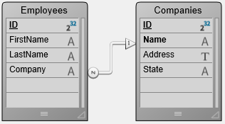

Les enregistrements et les sélections sont des outils fondamentaux qui permettent aux développeurs 4D d'accéder aux données de la base 4D et de les manipuler. Il s'agit de **concepts historiques**. Pour les nouveaux développements, nous recommandons l'utilisation de l'[architecture ORDA](../ORDA/overview.md), proposant des concepts plus modernes. Cependant, ils restent pleinement fonctionnels et sont largement utilisés dans les développements 4D existants.

## Travailler avec les enregistrements

:::note

La [technologie ORDA](../ORDA/overview.md) crée, modifie ou supprime les enregistrements sous-jacents au niveau de la base de données lorsque cela est nécessaire. Par exemple, un enregistrement est créé lorsque vous [créez une nouvelle entité](../ORDA/entities.md#creating-an-entity).

:::


### Ajouter de nouveaux enregistrements

Dans les applications 4D, vous ajoutez des enregistrements à l'aide de :

- Commandes : [`CREATE RECORD`](../commands/create-record) pour créer un enregistrement en mémoire (vous devez utiliser [`SAVE RECORD`](../commands/save-record) pour effectivement enregistrer le nouvel enregistrement dans les données) ; [`ADD RECORD`](../commands/add-record) pour ouvrir un formulaire entrée à l'utilisateur, prêt pour la saisie de données ; [`ARRAY TO SELECTION`](../commands/array-to-selection) pour créer des enregistrements à partir des données correspondantes d'un tableau.
- La fonctionnalité d'importation de données à l'aide des commandes du [thème Importation et exportation](../commands/theme/Import-and-Export) ou de la boîte de dialogue d'import.
- Action standard : [`Add Subrecord`](../Desktop-legacy/standard-actions#addsubrecord) qui ajoute un enregistrement à une liste.
- Commandes d'interface et de menu dans l'IDE 4D : **Nouvel enregistrement** et **Nouvel enregistrement en liste** du menu **Enregistrements**.

Dans la plupart des cas, l'enregistrement n'est créé qu'en mémoire et vous devez le sauvegarder explicitement via l'interface ou à l'aide d'une commande telle que [`SAVE RECORD`](../commands/save-record) ou l'[action standard `accept`](../Desktop/standard-actions#accept) pour effectivement enregistrer le nouvel enregistrement dans les données.


### Modifier des enregistrements

Vous modifiez des enregistrements lorsque vous devez mettre à jour des informations ou lorsque vous constatez que les informations saisies à l'origine sont incorrectes. Avant de modifier un groupe d'enregistrements, sélectionnez les enregistrements à modifier en tant que [sélection courante](./current-selection.md). Vous pouvez effectuer une recherche pour sélectionner les enregistrements à modifier ou sélectionner les enregistrements après les avoir mis en surbrillance dans un [formulaire de sortie](../FormEditor/properties_FormProperties.md#form-type).

Si un enregistrement est en cours de modification dans un autre process ou par un autre utilisateur (mode distant), l'enregistrement est dit [verrouillé](#enregistrements-verrouillés). Les enregistrements verrouillés peuvent être consultés, mais ne peuvent pas être modifiés. Si vous ouvrez un enregistrement verrouillé, vous pourrez consulter les valeurs saisies dans les champs, mais vous ne pourrez modifier aucune donnée.

Dans les applications 4D, vous modifiez des enregistrements à l'aide de :

- Commandes : [`MODIFY RECORD`](../commands/add-record) pour ouvrir un formulaire entrée à l'utilisateur, prêt pour la modification de données ; [`ARRAY TO SELECTION`](../commands/array-to-selection) pour modifier les données des enregistrements sélectionnés à partir d'un tableau.
- La fonctionnalité d'importation de données à l'aide des commandes du [thème Importation et exportation](../commands/theme/Import-and-Export) ou de la boîte de dialogue d'import.
- Action standard : [`Edit Subrecord`](../Desktop/standard-actions#editsubrecord) qui modifie un enregistrement dans une liste.
- Commandes d'interface et de menu dans l'IDE 4D : **Modifier enregistrement** du menu **Enregistrements** ou double-clic dans un formulaire liste.

Dans la plupart des cas, l'enregistrement n'est modifié qu'en mémoire et vous devez le sauvegarder explicitement via l'interface ou à l'aide d'une commande telle que [`SAVE RECORD`](../commands/save-record) ou l'[action standard `accept`](../Desktop/standard-actions#accept) pour effectivement enregistrer l'enregistrement modifié dans les données.


### Mises à jour globales

Vous effectuez une mise à jour globale lorsque vous souhaitez apporter une modification spécifique à un groupe d'enregistrements. Vous effectuez une mise à jour globale pour automatiser des modifications d'un groupe d'enregistrements qui seraient autrement fastidieuses et chronophages. Par exemple, vous effectueriez une mise à jour globale si vous vouliez modifier tous les prix d'une table [Inventaire] selon un certain pourcentage ou formater un champ numérique ou alpha.

La mise à jour globale s'effectue en « appliquant » une formule à la sélection courante d'enregistrements. Autrement dit, la formule est utilisée pour apporter la modification à chaque enregistrement de la sélection courante. Voici quelques exemples de formules :

- La formule suivante multiplie le champ Salaire par 1,05. Elle pourrait être utilisée, par exemple, lors de l'entrée en vigueur d'une augmentation de salaire :

```4d
[Emp]Salary:=[Emp]Salary*1.05
```

- La suivante utilise une fonction intégrée pour mettre le contenu du champ État en majuscules. Elle garantit l'uniformité de la présentation de l'État dans les étiquettes et les états :

```4d
[Customer]State:=Uppercase([Customer]State)
```

- Cette formule inclut une fonction écrite par l'utilisateur qui met la première lettre du champ Nom en majuscule et toutes les lettres restantes en minuscules.

```4d
[Emp]Last Name:=Capitalize([Emp]Last_Name)
```

La possibilité d'inclure des fonctions écrites par l'utilisateur lors de la réalisation de mises à jour globales est une fonctionnalité puissante de 4D. Les formules peuvent contenir des fonctions du langage 4D ainsi que des méthodes projet. Pour des raisons de sécurité, l'accès aux méthodes projet dans les formules est restreint par un [paramètre de sécurité](../settings/security.md#options) et/ou la [commande `SET ALLOWED METHODS`](../commands/set-allowed-methods).

Vous ne pouvez pas écrire de formules plus longues qu'une seule ligne logique ; autrement dit, vous ne pouvez pas appuyer sur Retour chariot et saisir une deuxième ligne. Cependant, les méthodes déclarées utilisables dans l'éditeur de formules peuvent, bien entendu, comporter plusieurs lignes.

Pour réaliser une mise à jour globale, vous pouvez exécuter une formule de mise à jour directement via la commande [`EXECUTE FORMULA`](../commands/execute-formula) ou afficher l'éditeur de formules via la commande [`EDIT FORMULA`](../commands/edit-formula).

Dans l'IDE 4D, vous pouvez également utiliser l'**éditeur de formules** pour écrire la formule qui sera ensuite appliquée à chaque enregistrement de la sélection courante. Pour cela, vous choisissez la commande **Appliquer formule...** du menu **Enregistrements** puis vous écrivez votre formule. Vous pouvez également charger une formule précédemment sauvegardée sur disque sous forme de fichier (extension .4fr).


### Supprimer des enregistrements

Vous pouvez souhaiter supprimer un enregistrement obsolète ou devenu inutile. Si l'enregistrement est nécessaire mais que les valeurs qui y sont stockées sont incorrectes, il vaut mieux modifier l'enregistrement plutôt que de le supprimer.

Vous pouvez supprimer des enregistrements de deux manières :

- Supprimer un enregistrement individuellement.
- Supprimer un ensemble d'enregistrements.

La suppression d'enregistrements s'effectue via les actions standard [`Delete Record`](../Desktop/standard-actions#deleterecord) ou [`Delete Subrecord`](../Desktop/standard-actions#deletesubrecord) (suppression en liste), ou via les commandes [`DELETE RECORD`](../commands/delete-record) ou [`DELETE SELECTION`](../commands/delete-selection).

Dans l'IDE 4D, vous pouvez également utiliser la commande **Effacer** du menu **Édition** ainsi que les touches de suppression.

:::warning

La suppression d'enregistrements est définitive et ne peut être annulée qu'en restaurant une sauvegarde de la base de données. Lorsque vous supprimez des enregistrements, 4D affiche une boîte de dialogue vous demandant de confirmer la suppression.

:::

Avant de supprimer des enregistrements, vous créez une sélection des enregistrements que vous souhaitez supprimer. Si votre sélection comprend des [enregistrements verrouillés](#record-locking), la suppression se poursuivra mais les enregistrements verrouillés ne seront pas supprimés et resteront dans la sélection courante après la suppression. Vous devez attendre que ces enregistrements soient déverrouillés (c'est-à-dire qu'ils ne soient plus utilisés) pour les supprimer. Les [commandes du thème « Verrouillage d'enregistrement »](../commands/theme/Record-Locking) peuvent être utilisées pour gérer ce type de scénario.

#### Enregistrements supprimés dans un autre process

La sélection courante peut être modifiée par des enregistrements supprimés dans un autre process. Par exemple, pendant que vous travaillez dans votre base de données, vous pourriez lancer un autre process qui supprime certains enregistrements d'une table. Les enregistrements supprimés dans ce process sont définitivement retirés de la table. Cependant, les enregistrements que vous voyez pendant que vous travaillez avec la base de données peuvent ne pas refléter ces modifications de la table tant qu'une nouvelle sélection d'enregistrements n'a pas été créée.

Pour illustrer ce point, supposons qu'une table contienne cinquante enregistrements et que tous les enregistrements soient dans la sélection courante. À ce stade, la barre de titre du formulaire de sortie indique que « 50 sur 50 » enregistrements sont sélectionnés. Si l'un des enregistrements est supprimé dans un autre process, la barre de titre change pour indiquer que « 50 sur 49 » enregistrements sont sélectionnés. Il semble maintenant y avoir plus d'enregistrements dans la sélection courante que dans la table ! La barre de titre sera mise à jour lorsque vous modifierez votre sélection courante.

Si vous tentez de modifier ou de supprimer l'enregistrement supprimé, une boîte de dialogue apparaîtra indiquant que l'enregistrement a été supprimé.

:::note 4D Server

Les enregistrements supprimés par un autre utilisateur ont le même effet sur la sélection courante. Les enregistrements sont supprimés de la table, mais pas de la sélection courante. Ainsi, la sélection courante peut sembler contenir plus d'enregistrements qu'il n'en existe réellement dans la table.

:::

### Numéros d'enregistrement

Trois numéros sont associés à un enregistrement :

- **Numéro d'enregistrement** : le numéro d'enregistrement est le numéro absolu/physique d'un enregistrement. Ce numéro est retourné par la commande [`Record number`](../commands/record-number).
Un numéro d'enregistrement est automatiquement attribué à chaque nouvel enregistrement et reste constant pour l'enregistrement jusqu'à ce que ce dernier soit supprimé. Les numéros d'enregistrement commencent à zéro. Ils ne sont pas uniques car les numéros d'enregistrement des enregistrements supprimés sont réutilisés pour de nouveaux enregistrements. Ils changent également lorsque la base de données est [compactée](../MSC/compact.md) ou [réparée](../MSC/repair.md).
- **Numéro d'enregistrement sélectionné** : le numéro d'enregistrement sélectionné est la position de l'enregistrement dans la sélection courante, et dépend donc de la sélection courante. Si la sélection est modifiée ou triée, le numéro d'enregistrement sélectionné changera probablement. La numérotation du numéro d'enregistrement sélectionné commence à un (1). Ce numéro est retourné par la commande [`Selected record number`](../commands/selected-record-number).
- **Numéro de séquence** : le numéro de séquence est un numéro unique non répétitif qui peut être attribué à un champ d'un enregistrement (via la propriété **Incrémentation automatique**, l'attribut SQL AUTO_INCREMENT ou la commande [`Sequence number`](../commands/sequence-number)). Il n'est pas automatiquement stocké avec chaque enregistrement. Il commence par défaut à 1 et est incrémenté pour chaque nouvel enregistrement créé. Contrairement aux numéros d'enregistrement, un numéro de séquence n'est pas réutilisé lorsqu'un enregistrement est supprimé ou lorsqu'une base de données est compactée ou réparée. Les numéros de séquence offrent un moyen de disposer de numéros d'identification uniques pour les enregistrements. Si un numéro de séquence est incrémenté au cours d'une transaction, le numéro n'est pas décrémenté si la transaction est annulée.

:::note Notes

- 4D n'effectue aucun contrôle lorsque vous modifiez le compteur interne de numérotation automatique d'une table à l'aide de la commande [`SET DATABASE PARAMETER`](../commands/set-database-parameter). Si vous décrémentez ce compteur, les nouveaux enregistrements créés peuvent avoir des numéros déjà attribués.
- Les numéros de séquence ne sont pas recommandés pour remplir des champs de clé primaire d'identifiant unique pour les enregistrements. Pour créer des ID d'enregistrement uniques, il est fortement recommandé d'utiliser des UUID.

:::


### Pile d'enregistrements

Les commandes [`PUSH RECORD`](../commands/push-record) et [`POP RECORD`](../commands/pop-record) vous permettent de placer (« push ») des enregistrements sur la pile d'enregistrements et de les en retirer (« pop »).

Chaque process possède sa propre pile d'enregistrements pour chaque table. 4D gère les piles d'enregistrements pour vous. Chaque pile d'enregistrements est une pile de type dernier entré, premier sorti (LIFO). La capacité de la pile est limitée par la mémoire.

[`PUSH RECORD`](../commands/push-record) et [`POP RECORD`](../commands/pop-record) doivent être utilisées avec discernement. Chaque enregistrement placé sur la pile utilise une partie de la mémoire libre. Placer trop d'enregistrements sur la pile peut provoquer une condition de mémoire insuffisante ou de pile pleine.

4D vide la pile de tous les enregistrements non retirés lorsque vous revenez au menu à la fin de l'exécution de votre méthode.

[`PUSH RECORD`](../commands/push-record) et [`POP RECORD`](../commands/pop-record) sont utiles lorsque vous souhaitez examiner des enregistrements du même fichier pendant la saisie de données. Pour cela, vous placez l'enregistrement sur la pile, recherchez et examinez des enregistrements du fichier (en copiant des champs dans des variables, par exemple), puis retirez enfin l'enregistrement de la pile pour le restaurer.

Lors de la saisie d'un enregistrement, si vous devez vérifier une valeur unique sur plusieurs champs, utilisez la commande [`SET QUERY DESTINATION`](../commands/set-quer-destination). Cela vous évitera les appels à [`PUSH RECORD`](../commands/push-record) et [`POP RECORD`](../commands/pop-record) que vous faisiez auparavant avant et après l'appel à QUERY afin de préserver les données saisies dans l'enregistrement courant. [`SET QUERY DESTINATION`](../commands/set-quer-destination) vous permet d'effectuer une recherche qui ne modifie ni la sélection ni l'enregistrement courant.

## Verrouillage d'enregistrement

4D et 4D Server gèrent automatiquement les bases de données en empêchant les conflits multi-utilisateurs ou multi-process. Deux utilisateurs ou deux process ne peuvent pas modifier le même enregistrement ou objet en même temps. Cependant, le second utilisateur ou process peut avoir un accès en lecture seule à l'enregistrement ou à l'objet au même moment.

Il existe plusieurs raisons d'utiliser les commandes multi-utilisateurs :

- Modifier des enregistrements à l'aide du langage.
- Utiliser une interface utilisateur personnalisée pour les opérations multi-utilisateurs.
- Sauvegarder des modifications liées au sein d'une transaction.

Trois concepts importants sont à connaître lors de l'utilisation des commandes dans une base de données multi-process :

1. Dans un process, chaque table est soit dans un état lecture seule, soit dans un état lecture/écriture.
2. Les enregistrements sont verrouillés lorsqu'ils sont chargés et déverrouillés lorsqu'ils sont déchargés.
3. Un enregistrement verrouillé ne peut pas être modifié.

Par convention dans les sections suivantes, la personne effectuant une opération sur la base de données multi-utilisateurs est désignée comme l'**utilisateur local**. Les autres personnes utilisant la base de données sont désignées comme les **autres utilisateurs**. La discussion se place du point de vue de l'utilisateur local. De même, d'un point de vue multi-process, le process exécutant une opération sur la base de données est le **process courant**. Tout autre process en cours d'exécution est désigné comme les **autres process**. La discussion se place du point de vue du process courant.

### Enregistrements verrouillés

Un enregistrement verrouillé ne peut pas être modifié par l'utilisateur local ou le process courant. Un enregistrement verrouillé peut être chargé, mais ne peut pas être modifié. Un enregistrement est verrouillé lorsque l'un des autres utilisateurs ou process a chargé avec succès l'enregistrement pour modification, ou lorsque l'enregistrement est empilé. Seul l'utilisateur qui modifie l'enregistrement voit cet enregistrement comme déverrouillé. Tous les autres utilisateurs et process voient l'enregistrement comme verrouillé, et donc indisponible à la modification. Une table doit être dans un état lecture/écriture pour qu'un enregistrement soit chargé déverrouillé.

### États lecture seule et lecture/écriture

Chaque table d'une base de données est dans un état lecture/écriture ou lecture seule pour chaque utilisateur et process de la base. **Lecture seule** signifie que les enregistrements de la table peuvent être chargés mais pas modifiés. **Lecture/écriture** signifie que les enregistrements de la table peuvent être chargés et modifiés si aucun autre utilisateur n'a verrouillé l'enregistrement au préalable.

Notez que si vous modifiez le statut d'une table, la modification prend effet pour le prochain enregistrement chargé. S'il y a un enregistrement actuellement chargé lorsque vous modifiez le statut de la table, cet enregistrement n'est pas affecté par le changement de statut.

#### État lecture seule

Lorsqu'une table est en lecture seule et qu'un enregistrement est chargé, cet enregistrement est toujours verrouillé. Autrement dit, les enregistrements verrouillés peuvent être affichés, imprimés et utilisés d'autres manières, mais ne peuvent pas être modifiés.

Notez que l'état lecture seule ne s'applique qu'à la modification d'enregistrements existants. Un état lecture seule n'affecte pas la création de nouveaux enregistrements. Vous pouvez toujours ajouter des enregistrements à une table en lecture seule à l'aide de [`CREATE RECORD`](../commands/create-record) et [`ADD RECORD`](../commands/add-record), ou des commandes de menu de l'environnement de développement (dans ce cas, les enregistrements en cours de création sont verrouillés pour tous les autres utilisateurs/process). Notez que la commande [`ARRAY TO SELECTION`](../commands/array-to-selection) n'est pas affectée par l'état lecture seule car elle peut à la fois créer et modifier des enregistrements.

4D met automatiquement une table en lecture seule pour les commandes qui ne nécessitent pas d'accès en écriture aux enregistrements. Ces commandes sont : [`DISPLAY SELECTION`](../commands/display-selection), [`DISTINCT VALUES`](../commands/distinct-values), [`EXPORT DIF`](../commands/export-dif), [`EXPORT SYLK`](../commands/export-sylk), [`EXPORT TEXT`](../commands/export-text), [`PRINT SELECTION`](../commands/print-selection), [`PRINT LABEL`](../commands/print-label), [`QR REPORT`](../commands/qr-report), [`SELECTION TO ARRAY`](../commands/selection-to-array), [`SELECTION RANGE TO ARRAY`](../commands/selection-range-to-array).

Vous pouvez connaître l'état d'une table à tout moment à l'aide de la fonction [`Read only state`](../commands/read-only-state).

Avant d'exécuter l'une de ces commandes, 4D sauvegarde l'état courant de la table (lecture seule ou lecture/écriture) pour le process courant. Une fois la commande exécutée, cet état est restauré.

#### État lecture/écriture

Lorsqu'une table est en lecture/écriture et qu'un enregistrement est chargé, l'enregistrement devient déverrouillé si aucun autre utilisateur n'a verrouillé l'enregistrement au préalable. Si l'enregistrement est verrouillé par un autre utilisateur, l'enregistrement est chargé comme un enregistrement verrouillé qui ne peut pas être modifié par l'utilisateur local.

Une table doit être en lecture/écriture et l'enregistrement chargé pour qu'il devienne déverrouillé et donc modifiable.

Si un utilisateur charge un enregistrement d'une table en mode lecture/écriture, aucun autre utilisateur ne peut charger cet enregistrement pour modification. Cependant, d'autres utilisateurs peuvent ajouter des enregistrements à la table, soit via les commandes [`CREATE RECORD`](../commands/create-record) et [`ADD RECORD`](../commands/add-record), soit manuellement dans l'environnement de développement.

Lecture/écriture est l'état par défaut de toutes les tables lorsqu'une base de données est ouverte et qu'un nouveau process est démarré.

#### Modifier le statut d'une table

Vous pouvez utiliser les commandes [`READ ONLY`](../commands/read-only) et [`READ WRITE`](../commands/read-write) pour modifier l'état d'une table. Si vous souhaitez modifier l'état d'une table afin de rendre un enregistrement lecture seule ou lecture/écriture, vous devez exécuter la commande avant que cet enregistrement ne soit chargé. Tout enregistrement déjà chargé n'est pas affecté par les commandes [`READ ONLY`](../commands/read-only) et [`READ WRITE`](../commands/read-write).

Chaque process possède son propre état (lecture seule ou lecture/écriture) pour chaque table de la base de données.

Par défaut, si vous n'utilisez pas la commande READ ONLY, toutes les tables sont en mode lecture/écriture.

### Charger, modifier et décharger des enregistrements

Avant que l'utilisateur local puisse modifier un enregistrement, la table doit être dans l'état lecture/écriture et l'enregistrement doit être chargé et déverrouillé.

Toute commande qui charge un enregistrement courant (s'il y en a un) — telle que [`NEXT RECORD`](../commands/next-record), [`QUERY`](../commands/query), [`ORDER BY`](../commands/order-by), [`RELATE ONE`](../commands/relate-one), etc. — définit l'état de l'enregistrement comme verrouillé ou déverrouillé. L'enregistrement est chargé selon l'état courant de sa table (lecture seule ou lecture/écriture) et sa disponibilité. Un enregistrement peut également être chargé pour une table liée par l'une des commandes qui provoquent l'établissement d'une relation automatique.

Si une table est dans l'état lecture seule pour un process ou un utilisateur, alors les enregistrements de cette table sont chargés en mode lecture seule, ce qui signifie qu'ils ne peuvent pas être modifiés ou supprimés par ce process ou cet utilisateur. Ceci est recommandé pour l'affichage ou la récupération de données car cela n'empêche pas les autres utilisateurs ou process d'accéder aux enregistrements de cette table en mode lecture/écriture si nécessaire.

Si une table est dans l'état lecture/écriture pour un process ou un utilisateur, alors tout enregistrement de cette table est également chargé en mode lecture/écriture, mais uniquement si aucun autre utilisateur ou process n'a déjà verrouillé cet enregistrement. Si un enregistrement est chargé avec succès en mode lecture/écriture, il est déverrouillé pour le process ou l'utilisateur courant (il peut être modifié et sauvegardé) et est verrouillé pour tous les autres utilisateurs ou process. Une table doit être placée dans l'état lecture/écriture avant de charger un enregistrement pour modification puis de le sauvegarder.

Si l'enregistrement doit être modifié, vous utilisez la fonction Locked pour tester si un enregistrement est verrouillé ou non par un autre utilisateur. Si un enregistrement est verrouillé (Locked retourne Vrai), chargez l'enregistrement avec la commande [`LOAD RECORD`](../commands/load-record) et testez à nouveau si l'enregistrement est verrouillé ou non. Cette séquence doit être poursuivie jusqu'à ce que l'enregistrement devienne déverrouillé (Locked retourne Faux).

Lorsque les modifications à apporter à un enregistrement sont terminées, l'enregistrement doit être libéré (et donc déverrouillé pour les autres utilisateurs) avec [`UNLOAD RECORD`](../commands/unload-record). Si un enregistrement n'est pas déchargé, il restera verrouillé pour tous les autres utilisateurs jusqu'à ce qu'un autre enregistrement courant soit sélectionné. Le changement d'enregistrement courant d'une table déverrouille automatiquement l'enregistrement courant précédent. Vous devez appeler explicitement [`UNLOAD RECORD`](../commands/unload-record) si vous ne changez pas d'enregistrement courant. Cette discussion s'applique aux enregistrements existants. Lorsqu'un nouvel enregistrement est créé, il peut être sauvegardé quel que soit l'état de la table à laquelle il appartient.

:::note

Lorsqu'elle est utilisée dans une transaction, la commande [`UNLOAD RECORD`](../commands/unload-record) décharge l'enregistrement courant uniquement pour le process qui gère la transaction. Pour les autres process, l'enregistrement reste verrouillé tant que la transaction n'a pas été validée (ou annulée).

:::

Utilisez la commande [`LOCKED BY`](../commands/locked-by) pour voir quel utilisateur et/ou process a verrouillé un enregistrement.

Une bonne pratique consiste à placer toutes les tables en mode lecture seule au démarrage de chaque process (à l'aide de la syntaxe [`READ ONLY(*)`](../commands/read-only)) puis à ne mettre chaque table en mode lecture/écriture que lorsque cela est nécessaire. L'accès aux tables en mode lecture seule est plus rapide et plus économe en mémoire. De plus, le changement d'état d'une table est optimisé en mode client/serveur car il ne génère aucun trafic réseau supplémentaire : les informations ne sont envoyées au serveur que lors de l'exécution d'une commande nécessitant un accès adéquat à la table.

### Boucles pour charger des enregistrements déverrouillés

L'exemple suivant montre la boucle la plus simple permettant de charger un enregistrement déverrouillé :

```4d
 READ WRITE([Customers])//Définit l'état de la table sur lecture/écriture
 Repeat//Boucle jusqu'à ce que l'enregistrement soit déverrouillé
    LOAD RECORD([Customers])//Charge l'enregistrement et définit le statut verrouillé
 Until(Not(Locked([Customers])))
 //Faire quelque chose avec l'enregistrement ici
 READ ONLY([Customers])//Définit l'état de la table sur lecture seule
```

La boucle continue jusqu'à ce que l'enregistrement soit déverrouillé.

Une boucle de ce type n'est utilisée que si l'enregistrement a peu de chances d'être verrouillé par quelqu'un d'autre, car l'utilisateur devrait attendre la fin de la boucle. Ainsi, il est peu probable que la boucle soit utilisée telle quelle, à moins que l'enregistrement ne puisse être modifié qu'au moyen d'une méthode.

L'exemple suivant utilise la boucle précédente pour charger un enregistrement déverrouillé et modifier l'enregistrement :

```4d
 READ WRITE([Inventory])
 Repeat //Boucle jusqu'à ce que l'enregistrement soit déverrouillé
    LOAD RECORD([Inventory]) //Charge l'enregistrement et le définit sur verrouillé
 Until(Not(Locked([Inventory])))
 [Inventory]Part Qty:=[Inventory]Part Qty 1 //Modifie l'enregistrement
 SAVE RECORD([Inventory]) //Sauvegarde l'enregistrement
 UNLOAD RECORD([Inventory]) //Permet aux autres utilisateurs de le modifier
 READ ONLY([Inventory])
```


La commande [`MODIFY RECORD`](../commands/modify-record) avertit automatiquement l'utilisateur si un enregistrement est verrouillé et empêche l'enregistrement d'être modifié. L'exemple suivant évite cette notification automatique en testant d'abord l'enregistrement avec la fonction Locked. Si l'enregistrement est verrouillé, l'utilisateur peut annuler.

Cet exemple vérifie efficacement si l'enregistrement courant est verrouillé pour la table [Commandes]. S'il est verrouillé, le process est retardé par la procédure pendant une seconde. Cette technique peut être utilisée aussi bien dans une situation multi-utilisateurs que multi-process :

```4d
 Repeat
    READ ONLY([Commands])//Vous n'avez pas besoin de lecture/écriture pour l'instant
    QUERY([Commands])
 //Si la recherche s'est terminée et que des enregistrements ont été retournés
    If((OK=1) & (Records in selection([Commands])>0))
       READ WRITE([Commands])//Met la table dans l'état lecture/écriture
       LOAD RECORD([Commands])
       While(Locked([Commands]) & (OK=1)) `Si l'enregistrement est verrouillé,
 //boucle jusqu'à ce que l'enregistrement soit déverrouillé
 //Par qui l'enregistrement est-il verrouillé ?
          LOCKED BY([Commands];$Process;$User;$SessionUser;$Name)
          If($Process=-1)//L'enregistrement a-t-il été supprimé ?
             ALERT("L'enregistrement a été supprimé entre-temps.")
             OK:=0
          Else
             If($User="")//Êtes-vous en mode monoposte
                $User:="vous"
             End if
             CONFIRM("L'enregistrement est déjà utilisé par "+$User+" dans le process "+$Name+".")
             If(OK=1)//Si vous voulez attendre quelques secondes
                DELAY PROCESS(Current process;120)//Attendre quelques secondes
                LOAD RECORD([Commands])//Essayer de charger l'enregistrement
             End if
          End if
       End while
       If(OK=1)//L'enregistrement est déverrouillé
          MODIFY RECORD([Commands])//Vous pouvez modifier l'enregistrement
          UNLOAD RECORD([Commands])
       End if
       READ ONLY([Commands])//Repasser en lecture seule
       OK:=1
    End if
 Until(OK=0)
```


### Utiliser les commandes dans un environnement multi-utilisateurs ou multi-process

Un certain nombre de commandes du langage effectuent des actions spécifiques lorsqu'elles rencontrent un enregistrement verrouillé. Elles se comportent normalement si elles ne rencontrent pas d'enregistrement verrouillé.

Voici la liste de ces commandes et de leurs actions lorsqu'un enregistrement verrouillé est rencontré.

- [`MODIFY RECORD`](../commands/modify-record) : Affiche une boîte de dialogue indiquant que l'enregistrement est en cours d'utilisation. L'enregistrement n'est pas affiché, l'utilisateur ne peut donc pas le modifier. Dans l'environnement de développement, l'enregistrement est présenté en état lecture seule.
- [`MODIFY SELECTION`](../commands/modify-selection) : Se comporte normalement sauf lorsque l'utilisateur double-clique sur un enregistrement pour le modifier. [`MODIFY SELECTION`](../commands/modify-selection) affiche une boîte de dialogue indiquant que l'enregistrement est en cours d'utilisation puis autorise un accès en lecture seule à l'enregistrement.
- [`APPLY TO SELECTION`](../commands/apply-to-selection) : Charge un enregistrement verrouillé, mais ne le modifie pas. [`APPLY TO SELECTION`](../commands/apply-to-selection) peut être utilisée pour lire des informations de la table sans précaution particulière. Si la commande rencontre un enregistrement verrouillé, l'enregistrement est placé dans l'[ensemble système `LockedSet`](./sets.md#the-lockedset-system-set).
- [`DELETE SELECTION`](../commands/delete-selection) : Ne supprime aucun enregistrement verrouillé ; elle les ignore. Si la commande rencontre un enregistrement verrouillé, l'enregistrement est placé dans l'[ensemble système `LockedSet`](./sets.md#the-lockedset-system-set).
- [`DELETE RECORD`](../commands/delete-record) : Cette commande est ignorée si l'enregistrement est verrouillé. Aucune erreur n'est retournée. Vous devez tester que l'enregistrement est déverrouillé avant d'exécuter cette commande.
- [`SAVE RECORD`](../commands/save-record) : Cette commande est ignorée si l'enregistrement est verrouillé. Aucune erreur n'est retournée. Vous devez tester que l'enregistrement est déverrouillé avant d'exécuter cette commande.
- [`ARRAY TO SELECTION`](../commands/array-to-selection) : Ne sauvegarde aucun enregistrement verrouillé. Si la commande rencontre un enregistrement verrouillé, l'enregistrement est placé dans l'[ensemble système `LockedSet`](./sets.md#the-lockedset-system-set).
- [`GOTO RECORD`](../commands/goto-record) : Les enregistrements d'une base de données multi-utilisateurs/multi-process peuvent être supprimés et ajoutés par d'autres utilisateurs, les numéros d'enregistrement peuvent donc changer. Soyez prudent lorsque vous référencez directement un enregistrement par son numéro dans une base de données multi-utilisateurs.
- [**Ensembles**](./sets.md) : Faites particulièrement attention avec les ensembles, car les informations sur lesquelles l'ensemble était basé peuvent avoir été modifiées par un autre utilisateur ou process.


## Enregistrements et relations

Les commandes du [thème Relations](../commands/theme/Relations.md), en particulier [`RELATE ONE`](../commands/relate-one) et [`RELATE MANY`](../commands/relate-many), établissent et gèrent les relations automatiques et non automatiques entre les tables. Avant d'utiliser l'une des commandes de ce thème, reportez-vous au manuel de référence Mode Développement 4D pour obtenir des informations sur la création de relations entre les tables.

### Utiliser les relations automatiques entre tables avec les commandes

Deux tables peuvent être liées par des relations automatiques. En général, lorsqu'une relation automatique entre tables est établie, elle charge ou sélectionne les enregistrements liés d'une table liée. De nombreuses opérations provoquent l'établissement de la relation.

Ces opérations comprennent :

- La saisie de données
- L'affichage d'enregistrements à l'écran dans des formulaires de sortie
- La création d'états
- Les opérations sur une sélection d'enregistrements, telles que les recherches, les tris et l'application d'une formule

Pour optimiser les performances, lorsque 4D établit des relations automatiques, un seul enregistrement devient l'enregistrement courant d'une table. Pour chacune des opérations listées ci-dessus, l'enregistrement lié est chargé selon les principes suivants :

- Si une relation sélectionne un seul enregistrement d'une table liée, cet enregistrement est chargé depuis le disque.
- Si une relation sélectionne plusieurs enregistrements d'une table liée, une nouvelle sélection d'enregistrements est créée pour cette table, et le premier enregistrement de cette sélection est chargé depuis le disque.

Par exemple, avec la structure de base de données affichée ici, si un enregistrement de la table [Employés] est chargé et affiché pour la saisie de données, l'enregistrement lié de la table [Sociétés] est sélectionné et chargé. De même, si un enregistrement de la table [Sociétés] est chargé et affiché pour la saisie de données, les enregistrements liés de la table [Employés] sont sélectionnés.




Dans cette structure de base de données, la table [Employés] est appelée **table N** (Many), et la table [Sociétés] est appelée **table 1** (One). Pour retenir ce concept, pensez à « il y a plusieurs employés liés à une société » et « chaque société a plusieurs employés ».

De même, le champ Société de la table [Employés] est appelé **champ N**, et le champ Nom de la table [Sociétés] est appelé champ **1**. Il n'est pas toujours possible que le champ lié soit unique. Par exemple, le champ [Sociétés]Nom peut comporter plusieurs enregistrements de société contenant la même valeur. Cette situation non unique peut être facilement gérée en créant une relation, qui sera toujours unique, sur un autre champ de la table liée. Ce champ pourrait être un champ d'ID de société.

Le tableau suivant liste les commandes qui utilisent des relations automatiques pour charger des enregistrements liés lors de leur exécution. Toutes les commandes utiliseront les relations automatiques N vers 1 existantes. Seules les commandes ayant Oui dans la colonne 1 vers N établie ci-dessous utiliseront les relations automatiques 1 vers N.

|Commande|1 vers N établie|
|--|--|
|[`ADD RECORD`](../commands/add-record)	|Oui|
|[`APPLY TO SELECTION`](../commands/apply-to-selection)|	Non|
|[`DISPLAY SELECTION`](../commands/display-selection)|	Non|
|[`EXPORT DIF`](../commands/export-dif)|	Non|
|[`EXPORT SYLK`](../commands/export-sylk)|	Non|
|[`EXPORT TEXT`](../commands/export-text)|	Non|
|[`EXPORT DATA`](../commands/export-data)|	Non|
|[`MODIFY RECORD`](../commands/modify-record)|	Oui|
|[`MODIFY SELECTION`](../commands/modify-selection)|	Oui (en saisie de données)|
|[`ORDER BY`](../commands/order-by)|	Non|
|[`ORDER BY FORMULA`](../commands/order-by-formula)|	Non|
|[`QUERY BY FORMULA`](../commands/query-by-formula)|	Oui|
|[`QUERY SELECTION`](../commands/query-selection)|	Oui|
|[`QUERY`](../commands/query)|	Oui|
|[`PRINT LABEL`](../commands/print-label)|	Non|
|[`PRINT SELECTION`](../commands/print-selection)|	Oui|
|[`QR REPORT`](../commands/qr-report)|	Non|
|[`SELECTION TO ARRAY`](../commands/selection-to-array)|	Non|
|[`SELECTION RANGE TO ARRAY`](../commands/selection-range-to-array)|	Non|


### Utiliser les commandes pour établir des relations entre tables

Les relations automatiques ne signifient pas que le ou les enregistrements liés d'une table seront sélectionnés simplement parce qu'une commande charge un enregistrement. Dans certains cas, après avoir utilisé une commande qui charge un enregistrement, vous devez sélectionner explicitement les enregistrements liés à l'aide de [`RELATE ONE`](../commands/relate-one) ou [`RELATE MANY`](../commands/relate-many) si vous avez besoin d'accéder aux données liées.

Certaines des commandes listées dans le tableau précédent (telles que les commandes de recherche) chargent un enregistrement courant une fois la tâche terminée. Dans ce cas, l'enregistrement chargé ne sélectionne pas automatiquement les enregistrements qui lui sont liés. Là encore, si vous avez besoin d'accéder aux données liées, vous devez sélectionner explicitement les enregistrements liés à l'aide de [`RELATE ONE`](../commands/relate-one) ou [`RELATE MANY`](../commands/relate-many).
